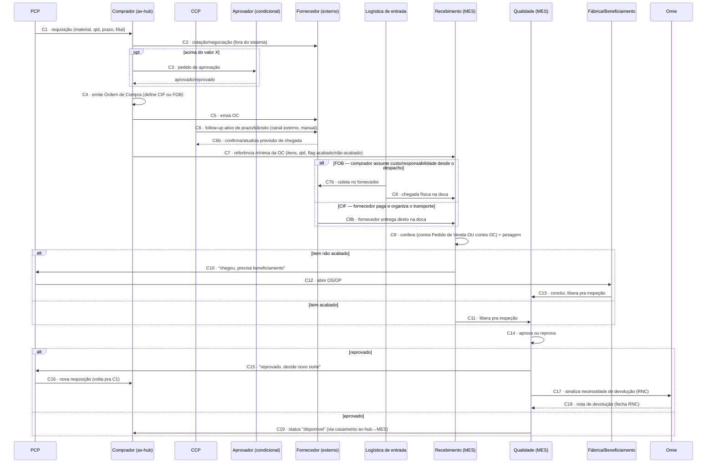

# Fluxo de Compras — do 0 ao 100%, conversa por conversa

> Detalha a etapa "não tem em estoque → gera requisição de compra" da célula correspondente em [[Modelo-Destinacao-Item]], seguindo a divisão já decidida em [[MES-Arquitetura-Decisoes]] (decisão 5): **PCP (MES) decide que precisa comprar, Compras (av-hub) decide como comprar, MES executa o recebimento**.
>
> Cada "conversa" abaixo é uma interação entre atores/sistemas — quem fala, o que trafega, e o gatilho que a dispara. Numeradas em ordem de acontecimento no caminho feliz, com os desvios (divergência, reprovação) marcados como ramificações, nunca becos sem saída — ver [[Estoque-Riscos]].

## Atores e sistemas

| Ator | Onde vive |
|---|---|
| **PCP** | MES |
| **Comprador** | av-hub |
| **CCP** | av-hub (junto de Compras) — follow-up ativo de prazo/trânsito, distinto do Comprador que já fechou a compra |
| **Aprovador** (segunda aprovação, condicional) | av-hub |
| **Fornecedor** | externo, sem acesso ao sistema |
| **Logística de entrada** | MES ou terceirizada — entra em ação só no frete FOB (coleta no fornecedor); no frete CIF é o próprio fornecedor quem entrega |
| **Recebimento** | MES |
| **Qualidade** | MES |
| **Fábrica/Beneficiamento** (execução da OS/OP) | MES |
| **Vendedor** | av-hub (só observa status) |
| **Omie** | externo, sistema fiscal |

## Diagrama — caminho feliz + principais desvios

## Conversa por conversa

**C1 — PCP → Compras: "preciso comprar X"**
Gatilho: PCP avalia o item pelo [[Modelo-Destinacao-Item]] (eixo 1 × eixo 2) e conclui "sem estoque". Payload: material (projeção `core.produtos`), quantidade, prazo (SLA do pedido de origem), unidade/filial (`codigo_empresa`, quando o vínculo existir — ver [[MES-Arquitetura-Decisoes]]), restrição de acabado/não-acabado se houver. **Mecanismo de transporte MES→av-hub ainda em aberto** — parte do "casamento av-hub↔MES" (ver [[Decisoes-Chave-ERP]]).

**C2 — Comprador → Fornecedor: cotação/negociação**
Comprador escolhe fornecedor (projeção `core.parceiros`, sem cadastro próprio no Estoque). Negociação de preço/condição acontece **fora do sistema** hoje — canal externo, sem integração.

**C3 — Comprador → Aprovador (condicional)**
Só dispara se o valor da compra estiver acima do limiar que ainda precisa ser definido (ver pendência de negócio em [[Estoque-Perguntas-Abertas]]). Segunda camada além da segregação comprador≠aprovador já prevista.

**C4 — Emissão da Ordem de Compra**
`pedido_compra` criado no av-hub (decidido em [[MES-Arquitetura-Decisoes]]). Campos: fornecedor, itens, preço, condição, moeda (cobre MP importada), flag **acabado/não-acabado** por item — essa flag é o dado mais importante que nasce aqui, decide o resto do fluxo.

**C5 — Comprador → Fornecedor: envio da OC**
Hoje manual (e-mail/PDF). Intenção futura: dado estruturado, sem depender de PDF (ver [[Fluxo-Detalhado-Pedido-Item]]).

**C6/C6b — CCP ↔ Fornecedor: follow-up ativo de prazo/trânsito**
É o **CCP** quem faz esse acompanhamento ativo (cobrar prazo, atualizar previsão), enquanto o comprador já seguiu pra outras compras. Canal externo (telefone/e-mail/WhatsApp), registrado manualmente. **Não existe estado "em trânsito" verificável** — o pedido permanece "Aprovado" até a chegada física (também documentado em [[Rota-Revenda]]).

**C7 — av-hub → MES: referência mínima da OC**
Dispara só quando o material chega na doca — não antes. Payload: itens, quantidade esperada, flag acabado/não-acabado. **Não trafega preço, fornecedor ou condição comercial** — mesma filosofia de "colunas protegidas" do pipeline ELT (ver [[Omie-ELT-Pipeline]]).

**C7b/C8 (FOB) ou C8b (CIF) — Logística de entrada**
O par que define quem paga e quem é responsável pelo transporte é **CIF × FOB**, dois incoterms:
- **CIF** (*Cost, Insurance and Freight*) — o **fornecedor** paga e cuida do transporte até a entrega. Ele mesmo despacha e entrega direto na doca (C8b) — a Logística de entrada da empresa não participa.
- **FOB** (*Free On Board*) — o **comprador** assume custo e responsabilidade assim que a mercadoria é despachada. É aí que a **Logística de entrada** da empresa entra em ação: coleta no fornecedor (C7b) e leva até a doca (C8).

Também referenciado em [[Rota-Revenda]].

**C9 — Recebimento confere**
- **Item acabado** → confere contra o **Pedido de Venda** ("cara-crachá": o que chegou é o que o vendedor vendeu).
- **Item não acabado** → confere contra a **referência da OC** recebida em C7 (o que chegou é o que o comprador comprou, pode ser bem diferente do item final vendido).
- Pesagem: peso teórico × quantidade, dentro da tolerância por categoria (provisório 5%, ver [[Estoque-Perguntas-Abertas]]).
- Cria o **lote**, nascendo em quarentena (`status_qualidade = PENDENTE`, padrão já documentado em [[Estoque-Modelo-Dados]]).

**C10 — Recebimento → PCP (condicional, item não acabado)**
"Chegou, precisa de beneficiamento." PCP abre **OS** ou **OP** — mesmo mecanismo `ItemParcial`/roteiro já decidido (ver [[App-PCP-Backend-Producao]]).

**C11 — Recebimento → Qualidade (condicional, item acabado)**
Libera direto pra inspeção, sem passar pelo PCP de novo.

**C12 — PCP → Fábrica/Beneficiamento: abre a OS/OP**
Segue o roteiro normal do `ItemParcial` (setor a setor).

**C13 — Fábrica/Beneficiamento → Qualidade**
Quando a OS/OP conclui, o item segue pra inspeção — mesmo destino de C11, caminho diferente.

**C14 — Qualidade decide**
Aprova ou reprova. Reprovação exige motivo + evidência (ex.: foto de avaria — ver [[Fluxo-Detalhado-Pedido-Item]]).

**C15 — Qualidade → PCP (condicional, reprovado)**
"Reprovado, decide o novo norte." Cisão de lote (`lote_pai_id`) — o que sobrou aprovado segue, o reprovado congela aguardando devolução (padrão já em [[Estoque-Modelo-Dados]]).

**C16 — PCP → Compras (condicional, reprovado)**
Nova requisição — **volta pra C1**, fechando o ciclo sem beco sem saída (princípio de [[Estoque-Riscos]]).

**C17/C18 — Sinalização de devolução via Omie (condicional, reprovado)**
RNC marca `nota_devolucao_pendente = true`; o sistema nunca cria a nota, só sinaliza. Omie emite a nota de devolução; a sincronização de volta fecha a RNC (ver [[Estoque-Regras-Negocio]]). Limitação de dado: `devolucao_parcial` no av-hub é só um boolean, sem nenhum campo de valor associado (ver [[AV-Hub-Vendas-Reconciliacao]]).

**C19 — MES → av-hub: status "disponível" (condicional, aprovado)**
Item aprovado sai da quarentena. Se já tinha destinação pra um pedido específico (`destinacao_item_pedido`), a reserva de estoque se confirma aqui. Visível pro vendedor como próxima etapa do rastreamento por item — mesma dependência do "casamento av-hub↔MES" de C1. A partir daqui o item segue pro fluxo de Expedição/Faturamento, detalhado à parte em [[Fluxo-Expedicao-Faturamento-Completo]] (Expedição embala/consolida, só a Expedição fala com o Omie, e a baixa chega ao Vendedor — não ao Comprador).

## Nenhum estado é beco sem saída — verificação

| Estado problemático | Saída garantida |
|---|---|
| Reprovação de qualidade | C15→C16, volta pro PCP, novo ciclo de compra ou beneficiamento |
| Divergência de quantidade na conferência (C9) | Mesmo padrão — volta pro PCP/Compras, não fica travado (a modelar em detalhe se divergir do fluxo de reprovação de qualidade) |
| Fornecedor nunca entrega | Status `CANCELADO` explícito já previsto em [[Estoque-Riscos]], com destinação/reserva reavaliada |

## O que este modelo deixa explícito

- **C1 e C19 são os dois pontos que dependem do sentido MES→av-hub do "casamento av-hub↔MES"**, ainda não desenhado. C7 (av-hub→MES, referência mínima disparada só na chegada física) e C16 (reaproveita o mesmo mecanismo de C1, "volta pra C1") também cruzam a fronteira, mas não introduzem um ponto de integração novo — reduz a superfície do problema à direção MES→av-hub especificamente, em vez de "o sistema inteiro precisa de tempo real".
- **C9 (conferência) tem uma ramificação própria**: divergência de quantidade/descrição na conferência é um caminho diferente de reprovação de qualidade (C14) — os dois merecem tratamento parecido (volta pro PCP), mas são gatilhos diferentes e precisam de telas diferentes.
- **A flag acabado/não-acabado (nasce em C4) é o dado que mais decide o formato do resto do fluxo** — quem confere contra o quê (C9), se passa pelo PCP de novo (C10 vs. C11) — reforça que ela precisa estar bem visível e não pode ser opcional.
- **CCP e Logística de entrada são atores do fluxo** — detalhados em C6/C6b e C7b/C8. Lista completa de setores em [[Setores-Envolvidos-no-Fluxo]].

## Ver também
- [[Setores-Envolvidos-no-Fluxo]]
- [[Fluxo-Detalhado-Pedido-Item]]
- [[Modelo-Destinacao-Item]]
- [[MES-Arquitetura-Decisoes]]
- [[Rota-Revenda]]
- [[Estoque-Modelo-Dados]]
- [[Estoque-Regras-Negocio]]
- [[Estoque-Riscos]]
- [[App-PCP-Backend-Producao]]
- [[Fluxo-Expedicao-Faturamento-Completo]]
