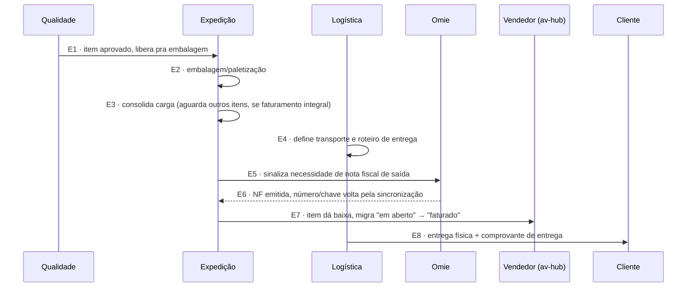

# Fluxo de Expedição e Faturamento — conversa por conversa

> Ponto de convergência final: qualquer item aprovado — vindo de Compras+Recebimento ([[Fluxo-Recebimento-Completo]]), de Produção ([[Fluxo-Producao-OS-OP-Completo]]), ou já pronto em estoque ([[Modelo-Destinacao-Item]]) — passa pelo mesmo caminho depois de aprovado pela Qualidade ([[Fluxo-Qualidade-Completo]]).

## Atores e sistemas

| Ator | Onde vive |
|---|---|
| **Expedição** | MES |
| **Logística** | MES |
| **Omie** | externo — sistema fiscal |
| **Vendedor** | av-hub — observa o status final |
| **Cliente** | externo — recebe a entrega |

## Diagrama

## Conversa por conversa

**E1 — Qualidade → Expedição: item aprovado**
Ponto de entrada único, independente de qual dos três caminhos o item percorreu antes (compra, produção, ou já pronto em estoque) — reforça que [[Modelo-Destinacao-Item]] descreve bem: os eixos convergem aqui.

**E2 — Embalagem/paletização**
`PedidoEmbalagem` (identificação + total de unidades) e `PedidoEmbalagemPallet` (identificação + peso) — entidades já existentes no backend do app-pcp (ver [[App-PCP-Backend-Producao]]), sem campo de código de barras dedicado hoje.

**E3 — Consolidação de carga**
Aqui mora a decisão **parcial × integral**: se o pedido exige faturamento integral, a Expedição espera os outros itens do mesmo pedido concluírem antes de seguir — mesma lógica de consolidação bottom-up do waterfall de dedução de Venda Líquida (ver [[AV-Hub-Vendas-Reconciliacao]]) e já descrita em [[Faturamento-Expedicao]].

**E4 — Logística define transporte**
Frota própria ou terceirizada, roteiro de entrega — fora do escopo detalhado deste vault até agora.

**E5/E6 — Faturamento via Omie**
Fronteira fiscal inegociável: o sistema **nunca emite nota fiscal**, só sinaliza a necessidade; a NF nasce no Omie e volta pela sincronização (pipeline ELT, polling — ver [[Omie-ELT-Pipeline]]). Mesma limitação já documentada: dados de manifestação/nota vindos por scraping, não API, em outras partes do fluxo comercial (ver [[Omie-ELT-Pipeline]]).

**E7 — Baixa e status pro vendedor**
Item migra de "em aberto" pra "faturado" na carteira — depende do mesmo "casamento av-hub↔MES" (ou, neste caso específico, do pipeline Omie já existente, que é mais lento mas já funciona) discutido em [[Decisoes-Chave-ERP]].

**E8 — Entrega física**
`PedidoAnexo` tipo `COMPROVANTE_ENTREGA`, já existente no schema do app-pcp — anexo de nível pedido ou de entrega específica.

## Nenhum estado é beco sem saída

| Estado problemático | Saída garantida |
|---|---|
| Faturamento integral esperando item que nunca chega | Depende do status `CANCELADO` explícito já previsto em [[Estoque-Riscos]] pra reavaliar a consolidação — vale confirmar se isso dispara automaticamente a mudança de integral pra parcial, ou exige decisão manual |

## O que este modelo deixa explícito

- **Este é o único ponto do fluxo inteiro onde todos os caminhos possíveis (Compras, Produção, Estoque-pronto) se encontram de novo** — antes disso, cada item corre isolado dentro do MES; aqui, a decisão parcial×integral exige olhar o pedido como um todo de novo, não item a item.
- **E5/E6 já reaproveita o pipeline ELT existente** (que já sincroniza NF do Omie pro av-hub) — diferente de C1/C19 em [[Fluxo-Compras-Completo]], que dependem de um mecanismo ainda não desenhado entre av-hub e MES. Ou seja, a parte fiscal do fluxo já tem "casamento" resolvido; a parte operacional de status por item, não.
- **Faturamento integral travado por 1 item nunca resolvido** é um risco real que ainda não tem gatilho de decisão explícito (diferente de compra/produção, que já têm `CANCELADO` como saída) — vale desenhar antes de construir.

## Ver também
- [[Fluxo-Qualidade-Completo]]
- [[Faturamento-Expedicao]]
- [[AV-Hub-Vendas-Reconciliacao]]
- [[Omie-ELT-Pipeline]]
- [[Modelo-Destinacao-Item]]
