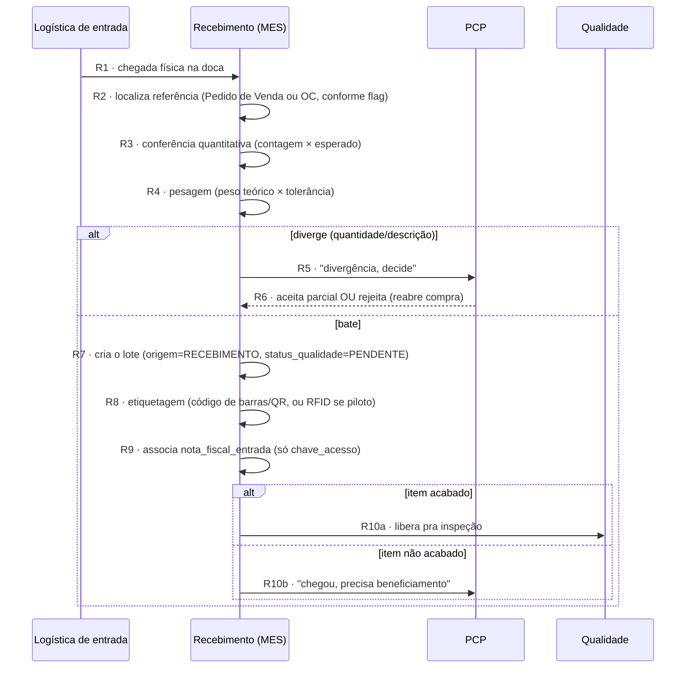

# Fluxo de Recebimento — conversa por conversa

> Detalha o que acontece dentro do Recebimento a partir do momento em que a referência da compra chega do av-hub (conversa C7 de [[Fluxo-Compras-Completo]]) até o item ser roteado pra Qualidade ou de volta pro PCP.
>
> **Confirmado com o usuário (17/09/2026): nada deste fluxo existe em sistema hoje** — é escopo obrigatório do sistema a construir, não documentação de processo existente.

## Atores e sistemas

| Ator | Onde vive |
|---|---|
| **Recebimento** | MES |
| **PCP** | MES |
| **Qualidade** | MES |
| **Logística de entrada** | MES ou terceirizada — só entra em ação no frete FOB (coleta no fornecedor); no CIF o próprio fornecedor entrega (ver [[Fluxo-Compras-Completo]]) |
| **Compras** | av-hub — só manda a referência (C7), não participa daqui em diante |

## Diagrama

## Conversa por conversa

**R1 — chegada física**
Evento físico que abre a conferência. Não existe aviso prévio de sistema (sem estado "em trânsito" verificável, ver [[Fluxo-Compras-Completo]]) — a doca só sabe que o material chegou quando ele chega. Quem entrega depende do incoterm definido na OC: **FOB** → Logística de entrada (a empresa foi buscar); **CIF** → o próprio fornecedor, direto.

**R2 — Recebimento localiza a referência**
Busca a referência que já tinha chegado do av-hub em C7 (itens, quantidade esperada, flag acabado/não-acabado). Se o item for de um pedido "pronto em estoque" (célula da matriz em [[Modelo-Destinacao-Item]] que nunca passou por compra), este passo não se aplica — esse caso não entra no fluxo de Recebimento.

**R3 — Conferência quantitativa**
Contagem física × quantidade esperada. Aqui mora a divisão já modelada: **item acabado confere contra o Pedido de Venda; item não acabado confere contra a Ordem de Compra**.

**R4 — Pesagem**
Peso teórico × quantidade, dentro da tolerância por categoria (5% provisório, ver [[Estoque-Perguntas-Abertas]]). Depende de saber se a balança tem saída digital ou é lida manualmente — pergunta ainda em aguardo.

**R5/R6 — Divergência de quantidade/descrição (condicional)**
Esta é uma ramificação **diferente** da reprovação de qualidade (que só acontece depois, na inspeção) — aqui o problema é "chegou errado", não "chegou ruim". Volta pro PCP decidir: aceita o que chegou como recebimento parcial (ajusta o lote pra quantidade real) ou rejeita e reabre o ciclo de compra (volta pra C1 de [[Fluxo-Compras-Completo]]).

**R7 — Criação do lote**
`lote` nasce com `origem = RECEBIMENTO` e `status_qualidade = PENDENTE` — quarentena por padrão, mesmo se o item for "acabado" e passar batido pela conferência (ver [[Estoque-Modelo-Dados]]).

**R8 — Etiquetagem**
Código de barras/QR por padrão; RFID só no piloto de Flange (maior valor unitário — ver [[Fabricacao-Flanges]] e [[Estoque-Riscos]] pra a ressalva técnica de tag on-metal).

**R9 — Nota fiscal de entrada**
Só referência (`chave_acesso`) — nunca captura CFOP/ICMS-ST de entrada, que fica 100% com o Omie (Nota de Entrada não é sincronizada hoje, ver [[Estoque-Regras-Negocio]]). **Correção**: isso vale só pro CFOP da nota de entrada (compra) — o CFOP do lado da venda já é capturado por item (`produto_vendas.cfop`); ICMS-ST continua não capturado em nenhum dos dois lados.

**R10a/R10b — Roteamento final**
Mesma bifurcação já coberta em [[Fluxo-Compras-Completo]] (C10/C11) — reafirmada aqui como o ponto de saída do Recebimento.

## Nenhum estado é beco sem saída

| Estado problemático | Saída garantida |
|---|---|
| Divergência de quantidade/descrição (R5) | Volta pro PCP — aceita parcial ou reabre compra (R6) |
| Peso fora da tolerância | Mesma lógica de divergência — precisa entrar explicitamente no mesmo caminho R5/R6, ainda não confirmado se é tratado igual ou como caso à parte |

## O que este modelo deixa explícito

- **Recebimento nunca fala direto com Compras** — sempre por intermédio do PCP, mesmo em divergência. Reforça a fronteira "av-hub decide, MES executa": Compras não é chamada de volta pra decidir operação, só pra decidir compra nova.
- **Divergência de quantidade (R5) e reprovação de qualidade (mais adiante, em [[Fluxo-Qualidade-Completo]]) são dois problemas diferentes que acontecem em momentos diferentes**, mas os dois voltam pro PCP — vale considerar se merecem a mesma tela/mecanismo de "decisão do PCP" ou telas distintas.
- **Peso fora da tolerância ainda não tem caminho de decisão definido** — hoje só "bate/não bate" está mapeado; fica em aberto se entra na mesma ramificação de divergência de quantidade.

## Ver também
- [[Setores-Envolvidos-no-Fluxo]]
- [[Fluxo-Compras-Completo]]
- [[Fluxo-Qualidade-Completo]]
- [[Modelo-Destinacao-Item]]
- [[Estoque-Modelo-Dados]]
- [[Estoque-Perguntas-Abertas]]
