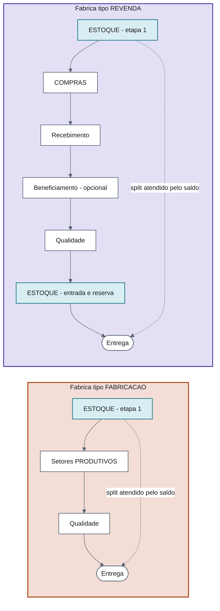

# Encaixe do Estoque e da Revenda no fluxo do PCP (MES)

> **Fonte única do encaixe.** Proposta do Robert ("MES — Encaixe do Estoque e da Revenda no fluxo do PCP", PDF de 24/09/2026 enviado ao Nathan), com uma regra complementar do Nathan no mesmo dia: **item comprado, depois de aprovado pela Qualidade, vai para o Estoque, não para a Expedição** (seção 3.4). As demais notas do vault apontam para cá em vez de repetir o detalhe.
>
> **Conferido contra o código** do `app-pcp` (branch `develop`, 24/09/2026): a Carteira de Pedidos e a Nova Ordem de Produção já existem com backend real; as telas de Estoque e Qualidade do Pablo (D5, D8, D10) rodam sobre mock. Achados na seção 4.

## 1. Em uma frase

O MES mantém o desenho **Fábrica → Setor → Roteiro → ItemParcial** e só ganha **tipo** na Fábrica e no Setor: a Revenda vira uma fábrica, Estoque e Compras viram setores com tela própria, e o **Estoque passa a ser a primeira etapa de todo roteiro** (e também a última, quando o item foi comprado).

## 2. Antes × agora

| | Sistema antigo / PCP até 23/09 | Agora |
|---|---|---|
| **Entrada do pedido** | Nova ordem preenchida à mão, sem Omie | **Carteira de Pedidos** (lê o av-hub/Omie): o PCP escolhe itens, quantidades, fábrica e roteiro |
| **Emissão de Ordens** | Setor fixo, 1º do roteiro | Vira a **tela Ordem de Produção** e sai do roteiro |
| **Estoque** | Setor comum (2º), só contava tempo | Setor tipo `ESTOQUE`, **etapa 1 obrigatória** de todo roteiro, com tela própria (saldo, reserva, atendimento) |
| **Compras** | Não existia | Setor tipo `COMPRAS` no roteiro da Revenda: gera a requisição e espera o recebimento |
| **Revenda** | "Item sem fábrica", descartado ao salvar | Fábrica tipo `REVENDA`, com roteiro próprio |
| **Saída do item comprado** | Qualidade → Expedição | Qualidade → **Estoque** (entrada + reserva) → entrega |

**Sequencial do Omie (não muda).** Um pedido do Omie é faturado em partes (pedido 100 → 100/1, 100/2...). Por isso o PCP envia por **rodadas**: escolhe quais itens e quantas unidades vão agora e para qual fábrica, e cada rodada gera **uma OP por fábrica**. A proposta só acrescenta "Revenda" como opção de fábrica.

## 3. Modelo

### 3.1 Tipos de Fábrica e Setor

| Campo | Valores | Efeito |
|---|---|---|
| `Fabrica.tipo` | `FABRICACAO` \| `REVENDA` | Define a natureza dos itens enviados àquela fábrica. Cadastra-se uma fábrica "Revenda". |
| `Setor.tipo` | `PRODUTIVO` (padrão) \| `ESTOQUE` \| `COMPRAS` | `PRODUTIVO` mantém as ações de hoje (receber, iniciar, mover). `ESTOQUE` e `COMPRAS` trocam essas ações pelas do subsistema; o tempo continua medido pelo `ItemParcial` e pelo histórico. |

- **Nome:** no banco continua `Fabrica`; na tela pode seguir "Fábrica" (com uma cadastrada como Revenda) ou virar "Linha" (em aberto).
- **Beneficiamento de revenda** (ex.: corte de chapa) vira um setor `PRODUTIVO` **opcional** no roteiro da Revenda. Resolve a "fábrica leve" que o vault deixava em aberto ([[Fabricacao-Chapas]], [[Fluxo-Producao-OS-OP-Completo]]).

### 3.2 Roteiros

| Fábrica | Roteiro |
|---|---|
| **Fabricação** (Flange hoje; outras linhas conforme cadastradas) | `ESTOQUE` → setores `PRODUTIVOS` da linha → Qualidade → entrega |
| **Revenda** | `ESTOQUE` → `COMPRAS` → Recebimento → [beneficiamento, opcional] → Qualidade → **`ESTOQUE`** → entrega |

O **backend insere o setor Estoque como etapa 1** de todo roteiro (substitui o papel que o setor Estoque tinha no sistema antigo). O setor "Emissão de Ordens" sai do roteiro.



### 3.3 Exemplos (a totalidade do item é preservada)

`ItensPedido` guarda o **total**; a parte atendida pelo estoque e a parte que segue são **splits de `ItemParcial`** que somam o total.

**Fabricação — 50 unidades, 30 em estoque**
```
ItensPedido: Flange 2"  quantidade = 50   (total preservado)
 └─ ItemParcial 50 chega no setor ESTOQUE (etapa 1)
     ├─ split 30 → "atendido pelo estoque": Reserva no lote + CONCLUIDO → entrega
     └─ split 20 → segue o roteiro da fábrica → setores PRODUTIVOS
```

**Revenda — 50 unidades, 30 em estoque**
```
Roteiro da fábrica Revenda: ESTOQUE → COMPRAS → Recebimento → Qualidade → ESTOQUE
ItensPedido: Chapa 3mm  quantidade = 50
 └─ ItemParcial 50 no setor ESTOQUE
     ├─ split 30 → atendido pelo estoque (Reserva + CONCLUIDO)
     └─ split 20 → setor COMPRAS: gera requisição (C1) vinculada ao parcial;
                   fica parado até o recebimento liberar → Qualidade
                   → aprovado: volta ao setor ESTOQUE → entrada do lote + Reserva + CONCLUIDO
```

**Consequências.** A soma dos parciais continua igual ao total do item, então os indicadores da Carteira (envio por quantidade; produção `CONCLUIDA` quando todos os parciais estão `CONCLUIDO`) seguem valendo sem mudança. Não há lógica de "pular etapas": a parte atendida pelo estoque termina no próprio setor Estoque. O tempo de cada processo (estoque, compra, produção) fica medido pelo histórico do `ItemParcial`.

### 3.4 Regra do item comprado: Qualidade → Estoque (Nathan, 24/09/2026)

Um item que **não tem em estoque e é comprado** passa por todo o processo já definido — setor Compras, requisição, Ordem de Compra no av-hub, Recebimento, beneficiamento se houver, Qualidade. **Aprovado na Qualidade, ele não vai para a Expedição: vai para o Estoque.** Lá o setor Estoque:

1. dá **entrada** do lote liberado no saldo, na localização de guarda (`MovimentoEstoque` tipo `ENTRADA`, referência ao recebimento);
2. cria a **Reserva `ATIVA`** desse lote para o split que esperava a compra;
3. **conclui** o split (`CONCLUIDO`). Daí em diante ele segue para a entrega como qualquer item atendido pelo estoque.

**Por que isso importa.**
- **Uma porta de saída só.** Todo item de revenda entregue sai do Estoque com uma Reserva, tenha ele estado em estoque desde o início ou tenha sido comprado para o pedido. Nada comprado atravessa o depósito sem registro de saldo.
- **A reserva só nasce sobre lote liberado**, sempre no setor Estoque. Some a reserva "prevista" sobre um lote que ainda não chegou (proposta da seção 2.4 de [[Revisao-dos-Estados-e-Status]]) e o conflito com a regra "lote em quarentena não fica disponível".
- **Genealogia coerente.** O lote comprado entra no saldo antes de sair, então a cadeia lote → item entregue (J4) fica igual para as duas origens.

**O que não muda.** Reprovação na Qualidade continua voltando ao PCP (novo norte), com cisão de lote e RNC. Na **Fabricação**, Qualidade aprovada segue para a entrega; se o produto fabricado também deve passar pelo Estoque fica em aberto (seção 6).

### 3.5 Natureza por item, não fixa por produto

A natureza do item é o **tipo da fábrica escolhida naquela rodada**. Em emergência pode-se comprar poucas unidades de um produto que normalmente fabricamos, para completar a entrega: basta enviar essas unidades para a fábrica Revenda e o restante para a fábrica de fabricação (OPs diferentes, mesmo produto). Não é preciso campo de natureza no item — ela vem de `Pedidos.idFabrica → Fabrica.tipo`.

Isso **substitui** o que [[Modelo-Destinacao-Item]] dizia (eixo 1 "praticamente fixo por tipo de material").

> **Atenção ao cadastro de material do Pablo (D5):** `Material.natureza` (`MATERIA_PRIMA` \| `REVENDA`) existe na tela `cadastros/estoque/materiais`. Pela proposta, ele não decide rota. Pode ficar como classificação do material no estoque (o que é matéria-prima e o que é produto de revenda), sem papel no roteiro. Ver seção 6.

### 3.6 Ligação item do pedido ↔ Material

- `(Pedidos.idUnidade, ItensPedido.idOmie)` = `(Material.codigoEmpresa, Material.codigoProdutoOmie)` — ambos UUID para a empresa.
- `Material` populado a partir dos endpoints de produtos do av-hub (D3, contrato de API 001 de filtro incremental).
- Saldo consultado **na filial do pedido** (DEC-1: a filial vem do pedido).

### 3.7 Reserva e movimentação (D9)

- **Nova tabela `Reserva`:** lote + `ItemParcial` (o split atendido) + quantidade + status (`ATIVA` \| `CONSUMIDA` \| `LIBERADA`). Substitui o `pedidoNumero` em texto do mock.
- **Sem expiração:** liberação explícita quando o pedido ou a OP é cancelado (nenhum estado sem saída). Resolve a M-06 de [[Perguntas-em-Aberto-Consolidadas]].
- **Saldo disponível** = saldo do lote (liberado pela Qualidade) − reservas `ATIVAS`.
- **`MovimentoEstoque` ganha tipo** (`ENTRADA` \| `SAIDA` \| `TRANSFERENCIA` \| `AJUSTE`), destino opcional e referência à origem (reserva, recebimento, OP). Hoje só suporta transferência.
- A reserva vira `CONSUMIDA` na saída física para a entrega, com um `MovimentoEstoque` `SAIDA` que referencia a reserva. *(Leitura deste vault a partir do tipo `SAIDA` com referência à reserva; confirmar com o Robert na D9.)*
- `Lote` precisa de depósito/localização atual (ou tabela de saldo lote × localização); `Deposito` ganha `codigoEmpresa` (L-09).
- **Fabricação × matéria-prima:** nesta fase só **produto acabado** é checado no estoque. Reserva e consumo de matéria-prima ficam para a J3 (genealogia), porque a conversão MP → produto ainda não está definida. Vale igual para a chapa inteira que seria cortada numa revenda com beneficiamento.
- **Antes do marco zero (13/11)** o saldo não é confiável e a reserva não liga ([[Cronograma-2-Meses]]). Nesse período o setor Estoque se comporta como **saldo zero** para todo parcial (ver a decisão em aberto sobre saldo zero, seção 6).

## 4. Mudanças no código (`api-pcp` / `app-pcp`)

| # | Mudança | Onde |
|---|---|---|
| 1 | Enums `Fabrica.tipo` e `Setor.tipo`; seed com a fábrica Revenda e os setores Estoque e Compras | Prisma + `seed-rbac-dev.sql` |
| 2 | Backend força o setor Estoque como etapa 1 de todo roteiro; remove Emissão de Ordens | `api-pcp` (criação de pedido/roteiro) |
| 3 | Nova Ordem: item de revenda enviado à fábrica Revenda (não é mais descartado) | `app-pcp` `ordens-producao/novo` |
| 4 | Ação "atender X do estoque": split + Reserva + conclusão do split; "enviar restante" = mover | `api-pcp` + tela do setor Estoque |
| 5 | Entrada no setor Compras dispara a requisição (C1 do fluxo, tarefa C7); a saída depende do recebimento (D6) | `api-pcp` + integração F1 |
| 6 | Tabela `Reserva`; `MovimentoEstoque` com tipo, destino opcional e referência; saldo disponível | Prisma estoque (D9) |
| 7 | Ligação item ↔ Material por `(codigoEmpresa, idOmie)`; carga de Material via av-hub | `api-pcp` (D3) |
| 8 | Telas Saldo/Reservas do Pablo viram consulta; trocar os mocks pelo backend real | `app-pcp` `estoque-operacao` |
| 9 | **(regra de 3.4)** Roteiro da Revenda termina no setor Estoque; a aprovação da Qualidade move o parcial para lá; ação "dar entrada e reservar" no setor Estoque | `api-pcp` + tela do setor Estoque + Qualidade (D8) |

**O que o código de `develop` mostra hoje (24/09):**
- `ordens-producao/novo/page.tsx` — item sem fábrica e nunca enviado é tratado como revenda e **fica fora do payload** ("não entra no controle de produção do PCP"). É o comportamento que a mudança 3 troca.
- `toggleEtapaRoteiro` (mesmo arquivo) não deixa o mesmo setor entrar duas vezes no roteiro, e `ordens-producao/pipeline.ts` indexa a ordem por `idSetor`. A regra de 3.4 coloca o setor Estoque **no início e no fim** do roteiro da Revenda — ver seção 6.
- `estoque-operacao/reservas/types.ts` — `Reserva` com `pedidoNumero` em texto, status `ATIVA | LIBERADA | EXPIRADA` e `dataExpiracao`. Troca pelo modelo de 3.7.
- `estoque-operacao/movimentacao/types.ts` — `TipoMovimento = 'TRANSFERENCIA' | 'AJUSTE'`. Ganha `ENTRADA` e `SAIDA`.
- `lib/mocks/estoqueOperacaoStore.ts` — o próprio comentário do mock diz que o modelo real de reserva "é decisão do Robert (D9)". Esta nota é essa decisão.
- `movimentacoes/types.ts` — o `ItemParcial` tem **9 estados** no front (`CRIADO`, `RECEBIDO`, `EM_ANDAMENTO`, `EM_TRANSITO`, `PAUSADO`, `REPROVADO`, `CONCLUIDO`, `RETRABALHO`, `CANCELADO`), não 8 como o vault ainda cita em alguns lugares.

## 5. Decisões

| Tema | Decisão | Status |
|---|---|---|
| Revenda no fluxo | Fábrica com tipo `REVENDA` e roteiro próprio | Fechada (Robert, 24/09) |
| Estoque/Compras | Setores com tipo, telas próprias, tempo via `ItemParcial` | Fechada (Robert, 24/09) |
| Estoque obrigatório | Etapa 1 de todo roteiro, inserida pelo backend | Fechada (Robert, 24/09) |
| Emissão de Ordens | Substituída pela tela Ordem de Produção | Fechada (Robert, 24/09) |
| Natureza do item | Por item/rodada (via fábrica escolhida), não fixa por produto | Fechada (Robert, 24/09) |
| Fabricação × MP | Só produto acabado agora; MP na J3 | Fechada (Robert, 24/09) |
| Reserva | Sem expiração; liberação explícita no cancelamento | Fechada (Robert, 24/09) |
| Item comprado | Aprovado na Qualidade, vai para o Estoque (entrada + reserva), não para a Expedição | **Fechada (Nathan, 24/09)** |
| `codigoEmpresa` | `idUnidade` do pedido é UUID, mesmo id do Material | Fechada (Robert) — **confirmar no banco** |
| Saldo zero | Parcial passa automático pelo Estoque (registrando tempo) ou exige clique? | Em aberto (sugestão: automático) |
| Nome na tela | Manter "Fábrica" ou renomear para "Linha" | Em aberto |

## 6. Em aberto

| # | Pergunta | Sugestão | Decide |
|---|---|---|---|
| 1 | **Saldo zero:** o parcial passa automático pelo setor Estoque (registrando o tempo) ou exige um clique? | Automático. Vale também para todo parcial antes do marco zero (13/11). | Robert, na C6 |
| 2 | **Nome na tela:** "Fábrica" ou "Linha"? | — | Robert + Nathan |
| 3 | **Setor Estoque duas vezes no roteiro da Revenda** (início e fim, regra de 3.4). Hoje o front impede setor repetido e indexa a etapa pelo setor. | (a) O `ItemParcial` passa a apontar a **etapa** do roteiro (ordem), não só o setor — mais correto; ou (b) dois setores tipo `ESTOQUE` ("Estoque · atendimento" e "Estoque · entrada"), sem mexer no motor. | Robert, na C6 |
| 4 | **Produto fabricado também termina no Estoque?** A regra de 3.4 vale para item comprado. | Manter Qualidade → entrega na Fabricação até alguém pedir o contrário. | Nathan |
| 5 | **`Material.natureza` do cadastro (D5)** conflita com "natureza por rodada"? | Manter como classificação do material, sem papel na rota. | Pablo + Robert |
| 6 | **Comprado "não acabado" sem setor de beneficiamento no roteiro.** A flag acabado/não-acabado continua decidindo contra o que o Recebimento confere; se o roteiro não previu o beneficiamento, quem ajusta? | Volta para a fila "Novo norte" do PCP, que ajusta o roteiro do parcial. | PCP + Robert |
| 7 | **`codigoEmpresa` = `idUnidade`**: confirmar no banco que o UUID do pedido bate com o do Material. | — | Gustavo |

## 7. Impacto no cronograma

- **C6 (08/10–16/10):** vira a implementação dos tipos de Fábrica/Setor, da fábrica Revenda, do Estoque obrigatório como etapa 1 e da ação de atendimento pelo estoque. Deixa de ser "classificação natureza × disponibilidade" numa tela própria.
- **C7 (19/10–23/10):** requisição disparada pela **entrada do parcial no setor Compras**, seguindo a spec F1 e os contratos 003/007/008.
- **C8:** encolhe. "Reservar" virou a ação do setor Estoque (C6), "abrir OS/OP" é a própria tela Ordem de Produção (já existe) e "gerar requisição" virou a C7. Sobra a fila "Novo norte".
- **D6:** o recebimento libera o parcial parado no setor Compras.
- **D8:** a aprovação da Qualidade move o parcial do item comprado para o setor Estoque (regra de 3.4), não para a Expedição.
- **D9:** backend de Saldo/Reserva com o modelo de 3.7, mais a entrada do item comprado. Destrava as telas D8/D10 do Pablo, hoje em mock.

## 8. Notas atualizadas com este encaixe (24/09/2026)

[[Modelo-Destinacao-Item]] · [[Fluxo-Detalhado-Pedido-Item]] · [[PCP-Carteira]] · [[Rota-Revenda]] · [[Rota-Fabricacao]] · [[Rota-Estoque]] · [[Fluxo-Operacional-Visao-Geral]] · [[Setores-Envolvidos-no-Fluxo]] · [[Fluxogramas-Completos]] · [[Fluxograma-Telas-por-Bloco]] · [[Fluxo-Sistema-no-Meio]] · [[Fabricacao-Chapas]] · [[Fluxo-Estoque-Completo]] · [[Estoque-Modelo-Dados]] · [[Estoque-Regras-Negocio]] · [[Fluxo-Producao-OS-OP-Completo]] · [[Fluxo-Compras-Completo]] · [[Fluxo-Recebimento-Completo]] · [[Fluxo-Qualidade-Completo]] · [[Fluxo-Expedicao-Faturamento-Completo]] · [[App-PCP-Modelo-Producao]] · [[App-PCP-Backend-Producao]] · [[Decisoes-Chave-ERP]] · [[Perguntas-em-Aberto-Consolidadas]] · [[Revisao-dos-Estados-e-Status]] · [[Campos-e-API-para-Rastreabilidade]] · [[Integracao-AvHub-MES-Especificacao-F1]] · [[Diagramas-UML]] · [[Cronograma-2-Meses]] · [[Onde-Estamos]] · [[Glossario]]

Artifacts atualizados: [UML Completo](https://claude.ai/artifact/Avx11cnLz1DgAxbdJmDiQy), [Torre de Fluxo](https://claude.ai/artifact/SS4C4srRk9cr66UHUS2rE3), [Mapa de Telas](https://claude.ai/artifact/XA1z28ts3J3ptGaqpjWBF2).
