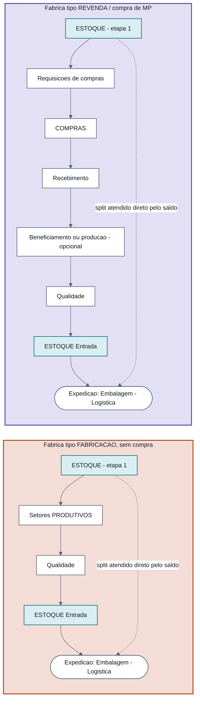

# Encaixe do Estoque e da Revenda no fluxo do PCP (MES)

> **Fonte única do encaixe.** Proposta do Robert ("MES — Encaixe do Estoque e da Revenda no fluxo do PCP", PDF de 24/09/2026 enviado ao Nathan), com uma regra complementar do Nathan no mesmo dia: **item comprado, depois de aprovado pela Qualidade, vai para o Estoque, não para a Expedição** (seção 3.4). As demais notas do vault apontam para cá em vez de repetir o detalhe.
>
> **Atualização de 25/09/2026:** as 7 perguntas da seção 6 (EN-01 a EN-07) foram todas respondidas — ver seção 5.
>
> **Atualização de 28/09/2026 (Robert, PDF "MES — Estoque no fluxo do PCP: o que foi implementado e as novas decisões de Compras", continuação do PDF de 24/09).** A C6 (encaixe Estoque/Revenda) e a D9 (saldo, reserva e movimentação) **foram implementadas e testadas**. Três coisas mudaram em relação ao desenho de 24/09, todas já valendo:
> 1. **Material deixa de ser projeção do catálogo do av-hub (D3 revisada).** Copiar os ~88 mil produtos do av-hub pro PCP sem necessidade foi descartado (25/09). Agora o `Material` só é criado/atualizado no PCP **na primeira entrada de estoque** daquele produto — o usuário busca o produto direto no av-hub (por código/descrição) na tela Saldo, e o PCP relê e copia código, descrição, unidade, NCM, família, peso líquido e o id do produto no av-hub. Campos próprios do Estoque (natureza, categoria, tolerância, mín/máx, ponto de pedido) nunca são sobrescritos. **Isso substitui a projeção completa que a seção 3.6 abaixo ainda descreve** e invalida a linha "Material = projeção de `core.produtos`" que aparecia em [[Decisoes-Chave-ERP]] e [[Estoque-Modelo-Dados]] como já resolvida.
> 2. **A parte atendida pelo estoque não termina no Estoque — vai para a Expedição (25/09).** Novo tipo de setor `EXPEDICAO` (Embalagem → Logística, os dois últimos setores de todo roteiro). A baixa do saldo só acontece quando a Embalagem recebe o item (a reserva vira `CONSUMIDA` e gera a `SAIDA`), não no próprio setor Estoque. Isso vale também para o item comprado que volta da Qualidade (seção 3.4 abaixo): ele passa pelo Estoque (entrada + reserva) e **segue** para a Expedição, não fica concluído ali.
> 3. **Tudo que é comprado volta ao Estoque — revenda e matéria-prima (28/09, ainda não implementado nesta versão — ver revisão da tarde abaixo).** Novo setor **Requisições de compras** (tipo a definir, ex. `REQUISICAO`), do PCP, antes de Compras no roteiro: é onde a requisição nasce e onde a matéria-prima fica amarrada ao item/parcial que a originou. Detalhe completo, incluindo os novos roteiros e o modelo de dados proposto (`RequisicaoCompra`/`RequisicaoCompraItem`), no arquivo-fonte: `MES-Estoque-Compras-Atualizacao.pdf` (28/09/2026).
>
> **Verificado direto no código em 28/09/2026** (repos `api-pcp` e `app-pcp`, branch `develop`, via clone): os itens 1 e 2 acima batem exatamente com o que está implementado. `prisma/models/fabricas.prisma` tem `enum TipoSetor { PRODUTIVO ESTOQUE COMPRAS EXPEDICAO }` e `enum TipoFabrica { FABRICACAO REVENDA }` com comentários citando C6/EN-02/EN-03 literalmente; `prisma/models/estoque.prisma` tem `Reserva` (status `ATIVA`/`CONSUMIDA`/`LIBERADA`, sem expiração, `MovimentoEstoque.idReserva` "preenchido na SAIDA que consome uma reserva (Embalagem recebe...)"), `Material` com comentário "D3 revisada (25/09/2026): Material NÃO é mais projeção do catálogo inteiro", e a migration mais recente é `20260925210000_setor_tipo_expedicao`. No `app-pcp` (`develop`), `movimentacoes/components/` já tem `AtenderEstoqueModal`, `ConfirmarEntregaModal` (recebimento na Embalagem) e `DevolverModal` (estorno) — bate com o fluxo descrito. **O item 3 (Requisições de compras) não tem nenhum vestígio no código ainda** — nenhum model `Requisicao*`, nenhum enum `REQUISICAO`, nenhuma pasta `estoque-operacao/requisicoes` — confirma que é proposta, não implementação.
>
> **⚠️ Conflito a resolver com o Nathan/Pablo/Robert:** a resposta de EN-05 registrada em 25/09 na seção 5 ("`Material.natureza` fica só como classificação, não decide rota") não chegou ao Robert — tanto o PDF de 28/09 de manhã quanto o de 28/09 à tarde (abaixo) listam **EN-05 como "sem resposta ainda"**. Não sobrescrevi a resposta de 25/09 nem a apaguei; sinalizando aqui para alinhar quem tem a versão vigente antes de tratar como fechada.
>
> **Atualização de 28/09/2026, à tarde (Robert, PDF "MES — Módulos Estoque, Compras, Logística e Qualidade: fluxo e plano", complementa o PDF da manhã, mesma data) — proposta, nada disso está implementado ainda.** Revisa o item 3 acima antes mesmo dele ser codificado, e **desfaz duas peças do item 2 que já estão em produção**: o setor "Estoque·Entrada" e o setor Compras dentro do roteiro da Revenda deixam de existir, e a baixa do saldo deixa de acontecer no recebimento da Embalagem — some para o **despacho do Estoque**. Resumo:
> - **Um único setor Estoque** (não mais "Estoque" + "Estoque·Entrada"). No Estoque a parcial tem três saídas: atender pelo saldo; solicitar compra (abre requisição, entra no circuito); enviar para a produção (consumindo matéria-prima).
> - **O circuito de compra sai do roteiro do PCP.** Requisição → Compras → Logística de Entrada → Qualidade → Estoque vira um **desvio fixo do sistema**, disparado pelo próprio Estoque quando falta saldo — o PCP não monta isso no roteiro, não consegue esquecer nem inverter. Dentro do circuito a próxima etapa é definida pelo **tipo do setor**, não pelo roteiro.
> - **Baixa do saldo no despacho do Estoque** (não mais no recebimento da Embalagem): produto pronto → baixa e vai pra Expedição; matéria-prima → baixa e a parcial vai pro próximo setor de fabricação (o Estoque informa quais lotes/quantidades de MP saem e quantas unidades do pedido aquele material cobre — a parcial é dividida por esse número; sem cadastro de consumo por produto por enquanto). Devolver ao Estoque estorna a baixa.
> - **Recebimento parcial na Logística de Entrada** (não mais em Compras): chegaram 6 de 10, as 6 seguem (split) para Qualidade → Estoque → fabricação; as 4 ficam aguardando na Logística de Entrada.
> - **Reserva, inspeção de entrada no fluxo normal e "Estoque·Entrada" ficam em aberto/descartados** — ver seção 6 (itens novos) e seção 3 (roteiros revisados) abaixo.
> - **Novos tipos de setor propostos**: `REQUISICAO` (Requisições de compras), `LOGISTICA_ENTRADA` (novo), `QUALIDADE` (novo — inspeção de entrada no circuito + inspeção de saída no roteiro, antes da Expedição). `EXPEDICAO` já existe (25/09).
> - **Novos menus**: Estoque (Saldo, Reservas, Movimentação, Lotes, Atendimento/Baixa), Compras (Requisições + Compras), Logística (Logística de Entrada, Embalagens, Logística de Saída), Qualidade (Inspeção de entrada/saída). **Movimentações passa a ser só para setores `PRODUTIVO`** — as filas de Estoque/Compras/Logística/Qualidade saem de lá.
> - **Plano em 3 fases**: (1) tipos e telas dos módulos; (2) circuito de compra reaproveitando as ações que já existem, Movimentações só com `PRODUTIVO`; (3) baixa no despacho + matéria-prima ("Solicitar compra" no Estoque, recebimento com split na Logística de Entrada, retorno ao mesmo Estoque, inspeção de saída no roteiro).
> - **Em aberto (do PDF, seção 10)**: manter Reserva para "separar sem despachar" ou retirar de vez; inspeção de saída obrigatória em todo roteiro de fabricação ou opcional por destino; reprovação na inspeção de entrada volta pra Compras automaticamente (recompra) ou fica aguardando decisão; EN-05 (de novo) e C8 (roteiro por item) seguem pendentes.
>
> **Conferido contra o código** do `app-pcp` (branch `develop`, 24/09/2026): a Carteira de Pedidos e a Nova Ordem de Produção já existem com backend real; as telas de Estoque e Qualidade do Pablo (D5, D8, D10) rodam sobre mock. Achados na seção 4.

## 1. Em uma frase

O MES mantém o desenho **Fábrica → Setor → Roteiro → ItemParcial** e só ganha **tipo** na Fábrica e no Setor: a Revenda vira uma fábrica, Estoque e Compras viram setores com tela própria, e o **Estoque passa a ser a primeira etapa de todo roteiro** (e também a última, quando o item foi comprado).

## 2. Antes × agora

| | Sistema antigo / PCP até 23/09 | Agora |
|---|---|---|
| **Entrada do pedido** | Nova ordem preenchida à mão, sem Omie | **Carteira de Pedidos** (lê o av-hub/Omie): o PCP escolhe itens, quantidades, fábrica e roteiro |
| **Emissão de Ordens** | Setor fixo, 1º do roteiro | Vira a **tela Ordem de Produção** e sai do roteiro |
| **Estoque** | Setor comum (2º), só contava tempo | Setor tipo `ESTOQUE`, **etapa 1 obrigatória** de todo roteiro, com tela própria (saldo, reserva, atendimento) |
| **Compras** | Não existia | Setor tipo `COMPRAS` no roteiro da Revenda: gera a requisição e espera o recebimento |
| **Revenda** | "Item sem fábrica", descartado ao salvar | Fábrica tipo `REVENDA`, com roteiro próprio |
| **Saída do item comprado** | Qualidade → Expedição | Qualidade → **Estoque** (entrada + reserva) → entrega |

**Sequencial do Omie (não muda).** Um pedido do Omie é faturado em partes (pedido 100 → 100/1, 100/2...). Por isso o PCP envia por **rodadas**: escolhe quais itens e quantas unidades vão agora e para qual fábrica, e cada rodada gera **uma OP por fábrica**. A proposta só acrescenta "Revenda" como opção de fábrica.

## 3. Modelo

### 3.1 Tipos de Fábrica e Setor

| Campo | Valores | Efeito |
|---|---|---|
| `Fabrica.tipo` | `FABRICACAO` \| `REVENDA` | Define a natureza dos itens enviados àquela fábrica. Cadastra-se uma fábrica "Revenda". |
| `Setor.tipo` | `PRODUTIVO` (padrão) \| `ESTOQUE` \| `COMPRAS` | `PRODUTIVO` mantém as ações de hoje (receber, iniciar, mover). `ESTOQUE` e `COMPRAS` trocam essas ações pelas do subsistema; o tempo continua medido pelo `ItemParcial` e pelo histórico. |

- **Nome:** no banco continua `Fabrica`; na tela pode seguir "Fábrica" (com uma cadastrada como Revenda) ou virar "Linha" (em aberto).
- **Beneficiamento de revenda** (ex.: corte de chapa) vira um setor `PRODUTIVO` **opcional** no roteiro da Revenda. Resolve a "fábrica leve" que o vault deixava em aberto ([[Fabricacao-Chapas]], [[Fluxo-Producao-OS-OP-Completo]]).

### 3.2 Roteiros

> **Atualização de 28/09/2026 de manhã (Robert) — substituiu a tabela original de 24/09.** A parte atendida pelo estoque não fica `CONCLUIDO` no próprio Estoque: segue em trânsito para a **Expedição** (novo tipo de setor, `EXPEDICAO` — Embalagem → Logística, sempre os dois últimos setores do roteiro; **confirmado no código**, migration `20260925210000_setor_tipo_expedicao`). E tudo que é comprado (revenda **e** matéria-prima) passa por um novo setor **Requisições de compras** (do PCP) antes de Compras — **este último ainda não chegou a ser implementado antes de ser revisado de novo, ver abaixo**.
>
> **⚠️ Revisado de novo em 28/09/2026 à tarde (Robert, PDF "Módulos Estoque/Compras/Logística/Qualidade") — proposta, ainda não implementada.** As linhas abaixo (com `ESTOQUE·Entrada` e `Requisições de compras`/`Compras` dentro do roteiro) descrevem a manhã de 28/09. A proposta da tarde do mesmo dia **substitui isso antes de ir a código**: um único setor `ESTOQUE`; o circuito de compra (Requisição → Compras → Logística de Entrada → Qualidade → volta ao mesmo Estoque) sai do roteiro e vira um desvio fixo do sistema; a baixa passa a ocorrer no **despacho do Estoque**, não no recebimento da Embalagem. Roteiros propostos: **fabricação sem compra** = Estoque → setores produtivos → Expedição; **fabricação com compra de MP** = Estoque → [circuito de compra] → Estoque → setores produtivos → Expedição; **revenda** = Estoque → [circuito de compra, se faltar saldo] → Estoque → Expedição (ou direto Estoque → Expedição se já tiver saldo). Ver o callout completo na introdução desta nota.

| Fábrica | Roteiro (manhã de 28/09 — ver revisão da tarde acima) |
|---|---|
| **Fabricação, sem compra** (produto já sai pronto da linha) | `ESTOQUE` (fixo) → setores `PRODUTIVOS` da linha → Qualidade → `ESTOQUE·Entrada` (manual, EN-04) → **Expedição** (Embalagem → Logística) |
| **Fabricação com compra de matéria-prima** | `ESTOQUE` (fixo) → **Requisições de compras** → Compras → Recebimento → Qualidade → `ESTOQUE·Entrada` → ação "Entregar matéria-prima para a produção" → setores `PRODUTIVOS` (ex.: Corte) → Expedição |
| **Revenda** | `ESTOQUE` (fixo) → **Requisições de compras** → Compras → Recebimento → [beneficiamento, opcional] → Qualidade → `ESTOQUE·Entrada` → Expedição |
| **Parte atendida direto pelo saldo** (qualquer fábrica) | `ESTOQUE` (fixo) → pula direto para **Expedição**, em trânsito, com a Reserva já `ATIVA` |

O **backend insere o setor Estoque como etapa 1** de todo roteiro (substitui o papel que o setor Estoque tinha no sistema antigo). O setor "Emissão de Ordens" sai do roteiro. **Atualização (25/09/2026, EN-03/EN-04):** o Estoque do início é sempre fixo (inserido pelo backend); os demais setores tipo `ESTOQUE` (`ESTOQUE·Entrada` e, agora, `EXPEDICAO`) são adicionados manualmente na montagem do roteiro, não são automáticos. **Setor "Requisições de compras" (28/09, ainda não implementado)**: tipo de setor novo (ex. `REQUISICAO`), fila própria do PCP com a ação "Requisitar compra" — é ali que a matéria-prima fica amarrada ao item/parcial que originou a compra (cada linha da requisição aponta pra parcial/item de origem).


```mermaid
%%{init: {'theme': 'base', 'themeVariables': {'primaryColor': '#ffffff', 'primaryTextColor': '#181c22', 'primaryBorderColor': '#33475a', 'lineColor': '#5c6570', 'fontFamily': 'Source Sans 3, sans-serif', 'fontSize': '14px', 'edgeLabelBackground': '#ffffff', 'textColor': '#181c22'}, 'flowchart': {'nodeSpacing': 35, 'rankSpacing': 45, 'padding': 12}}}%%
flowchart LR
    subgraph FAB[Fabrica tipo FABRICACAO, sem compra]
        A1[ESTOQUE - etapa 1] --> A2[Setores PRODUTIVOS] --> A3[Qualidade] --> A4b[ESTOQUE Entrada] --> A4([Expedicao: Embalagem - Logistica])
    end
    subgraph REV[Fabrica tipo REVENDA / compra de MP]
        B1[ESTOQUE - etapa 1] --> B1b[Requisicoes de compras] --> B2[COMPRAS] --> B3[Recebimento] --> B4[Beneficiamento ou producao - opcional] --> B5[Qualidade] --> B6[ESTOQUE Entrada] --> B7([Expedicao: Embalagem - Logistica])
    end
    A1 -. split atendido direto pelo saldo .-> A4
    B1 -. split atendido direto pelo saldo .-> B7

    style FAB fill:#f3ddd6,stroke:#a8420f,stroke-width:2px,color:#181c22
    style REV fill:#e3e0f5,stroke:#5b3fae,stroke-width:2px,color:#181c22
    style A1 fill:#d9eef2,stroke:#1f7a8c,stroke-width:1.5px,color:#181c22
    style B1 fill:#d9eef2,stroke:#1f7a8c,stroke-width:1.5px,color:#181c22
    style A4b fill:#d9eef2,stroke:#1f7a8c,stroke-width:1.5px,color:#181c22
    style B6 fill:#d9eef2,stroke:#1f7a8c,stroke-width:1.5px,color:#181c22
```

### 3.3 Exemplos (a totalidade do item é preservada)

`ItensPedido` guarda o **total**; a parte atendida pelo estoque e a parte que segue são **splits de `ItemParcial`** que somam o total.

**Fabricação sem compra — 50 unidades, 30 em estoque**
```
ItensPedido: Flange 2"  quantidade = 50   (total preservado)
 └─ ItemParcial 50 chega no setor ESTOQUE (etapa 1)
     ├─ split 30 → "atendido pelo estoque": Reserva ATIVA no lote → em trânsito para Expedição
     └─ split 20 → segue o roteiro da fábrica → setores PRODUTIVOS → Qualidade → ESTOQUE·Entrada (manual) → Expedição
```

**Revenda — 50 unidades, 30 em estoque (atualizado 28/09/2026)**
```
Roteiro: ESTOQUE → Requisições de compras → Compras → Recebimento → Qualidade → ESTOQUE·Entrada → Expedição
ItensPedido: Chapa 3mm  quantidade = 50
 └─ ItemParcial 50 no setor ESTOQUE
     ├─ split 30 → atendido pelo estoque (Reserva ATIVA) → em trânsito para Expedição
     └─ split 20 → setor Requisições de compras: PCP requisita 5 (exemplo simplificado)
                   → Compras registra pedido/recebimento → lote em quarentena → Qualidade aprova (LIBERADO)
                   → ESTOQUE·Entrada: dá baixa/ação "Atender pelo estoque" com o lote da compra (Reserva)
                   → Expedição
```

**Consequências.** A soma dos parciais continua igual ao total do item, então os indicadores da Carteira (envio por quantidade; produção `CONCLUIDA` quando todos os parciais estão `CONCLUIDO`) seguem valendo sem mudança. **Atualização de 25/09/2026: a parte atendida pelo estoque não termina mais no próprio setor Estoque** — vai em trânsito pra Expedição, e só lá (quando a Embalagem recebe o item) a reserva vira `CONSUMIDA` e o saldo dá baixa de verdade. O tempo de cada processo (estoque, compra, produção) fica medido pelo histórico do `ItemParcial`.

### 3.4 Regra do item comprado: Qualidade → Estoque → Expedição (Nathan 24/09, revisado Robert 25/09 e 28/09)

Um item que **não tem em estoque e é comprado** passa por todo o processo já definido — hoje (28/09) o setor **Requisições de compras**, Compras, Ordem de Compra no av-hub, Recebimento, beneficiamento se houver, Qualidade. **Aprovado na Qualidade, ele não vai direto para a Expedição: passa primeiro pelo Estoque** (setor `ESTOQUE·Entrada`), que:

1. dá **entrada** do lote liberado no saldo, na localização de guarda (`MovimentoEstoque` tipo `ENTRADA`, referência ao recebimento);
2. cria a **Reserva `ATIVA`** desse lote para o split que esperava a compra (ação "Atender pelo estoque" — o almoxarife escolhe de quais lotes sai, respeitando o menor entre disponível do lote e o que falta da parcial);
3. **atualização de 25/09/2026: o split não conclui aqui.** Ele segue em trânsito para a primeira etapa de Expedição do roteiro, ainda com a Reserva `ATIVA` — a baixa de saldo (Reserva → `CONSUMIDA`, `MovimentoEstoque` `SAIDA`) só acontece quando a **Embalagem recebe** o item. Sem Expedição cadastrada no roteiro, o sistema recusa o atendimento.

**Fabricação com compra de matéria-prima (28/09):** no `ESTOQUE·Entrada`, em vez de "Atender pelo estoque", a ação é **"Entregar matéria-prima para a produção"** — dá baixa nos lotes de matéria-prima requisitados e a parcial do **produto** (não da matéria-prima) segue inteira para a próxima etapa produtiva. É isso que dá o consumo de matéria-prima por pedido.

**Por que isso importa.**
- **Uma porta de saída só, agora na Expedição.** Todo item entregue passa pela Embalagem, tenha ele estado em estoque desde o início ou tenha sido comprado/produzido para o pedido — é lá, não no Estoque, que a baixa vira definitiva.
- **A reserva só nasce sobre lote liberado**, sempre no setor Estoque. Some a reserva "prevista" sobre um lote que ainda não chegou (proposta da seção 2.4 de [[Revisao-dos-Estados-e-Status]]) e o conflito com a regra "lote em quarentena não fica disponível".
- **Genealogia coerente.** O lote comprado entra no saldo antes de sair, então a cadeia lote → item entregue (J4) fica igual para as duas origens.
- **Desfazer é reversível (28/09):** desfazer o recebimento na Embalagem estorna a baixa (nova `ENTRADA` na mesma localização, reserva volta a `ATIVA`); devolver ao Estoque estorna e libera a reserva, e o Estoque decide de novo.

**O que não muda.** Reprovação na Qualidade continua voltando ao PCP (novo norte), com cisão de lote e RNC. **Atualização (25/09/2026, EN-04): na Fabricação a regra passa a ser a mesma do item comprado** — Qualidade aprovada também passa pelo Estoque (entrada + reserva) antes da Expedição, não direto pra entrega. Ver seção 5.

### 3.5 Natureza por item, não fixa por produto

A natureza do item é o **tipo da fábrica escolhida naquela rodada**. Em emergência pode-se comprar poucas unidades de um produto que normalmente fabricamos, para completar a entrega: basta enviar essas unidades para a fábrica Revenda e o restante para a fábrica de fabricação (OPs diferentes, mesmo produto). Não é preciso campo de natureza no item — ela vem de `Pedidos.idFabrica → Fabrica.tipo`.

Isso **substitui** o que [[Modelo-Destinacao-Item]] dizia (eixo 1 "praticamente fixo por tipo de material").

> **Atenção ao cadastro de material do Pablo (D5):** `Material.natureza` (`MATERIA_PRIMA` \| `REVENDA`) existe na tela `cadastros/estoque/materiais`. Pela proposta, ele não decide rota. Pode ficar como classificação do material no estoque (o que é matéria-prima e o que é produto de revenda), sem papel no roteiro. **RESOLVIDO em 25/09/2026 — ver seção 5 (EN-05).**

### 3.6 Ligação item do pedido ↔ Material

> **Atualização de 28/09/2026 (D3 revisada) — substitui a premissa original desta seção.** `Material` **deixa de ser projeção** do catálogo inteiro do av-hub (~88 mil produtos): copiar tudo sem necessidade foi descartado em 25/09. Agora o `Material` só nasce/atualiza no PCP **na primeira entrada de estoque** daquele produto:
> - Na tela Saldo, o usuário escolhe a filial e busca o produto **direto no av-hub** (por código ou descrição); depósito e localização são do PCP.
> - Ao salvar, o PCP relê o produto no av-hub e cria/atualiza o `Material` **só daquele produto**, copiando `codigo_produto_omie` (chave com a filial), código, descrição, unidade, NCM, família, peso líquido e o id do produto no av-hub (rastreabilidade).
> - Campos próprios do Estoque (natureza, categoria, tolerância, mín/máx, ponto de pedido) **nunca são sobrescritos** por essa releitura.
> - A tela Materiais lista **só os materiais que já têm lote** (estocados) — a sincronização em massa foi retirada.
> - Produto **sem** `codigo_produto_omie` não entra no estoque (não teria como casar com o item do pedido).

- `(Pedidos.idUnidade, ItensPedido.idOmie)` = `(Material.codigoEmpresa, Material.codigoProdutoOmie)` — ambos UUID para a empresa. **Confirmado no banco em 25/09/2026 (EN-07): é o mesmo id.**
- ~~`Material` populado a partir dos endpoints de produtos do av-hub (D3, contrato de API 001 de filtro incremental)~~ — substituído pela releitura pontual na primeira entrada de estoque, ver acima.
- Saldo consultado **na filial do pedido** (DEC-1: a filial vem do pedido).

### 3.7 Reserva e movimentação (D9) — implementada e testada em 28/09/2026

- **Tabela `Reserva`:** lote + `ItemParcial` (o split atendido) + quantidade + snapshot de pedido/OP/item + status (`ATIVA` \| `CONSUMIDA` \| `LIBERADA`). Substitui o `pedidoNumero` em texto do mock.
- **Sem expiração:** liberação explícita quando o pedido ou a OP é cancelado/excluído (nenhum estado sem saída). Resolve a M-06 de [[Perguntas-em-Aberto-Consolidadas]].
- **Saldo disponível do lote** = saldo (se o lote estiver `LIBERADO` pela Qualidade) − reservas `ATIVAS`. Lote travado (`SELECT ... FOR UPDATE`) em reserva, ajuste, consumo e estorno.
- **`SaldoEstoque`** é foto atual por lote × localização; toda mudança gera um `MovimentoEstoque` (`ENTRADA` \| `SAIDA` \| `TRANSFERENCIA` \| `AJUSTE`) na mesma transação.
- **Atualização de 25/09/2026 — a reserva não vira `CONSUMIDA` na saída do Estoque.** Ela continua `ATIVA` enquanto o item está em trânsito para a Expedição; só vira `CONSUMIDA` (com a `SAIDA` do lote) **quando a Embalagem recebe** o item — é aí que o material sai fisicamente da prateleira. Desfazer o recebimento na Embalagem estorna (nova `ENTRADA`, reserva volta a `ATIVA`).
- **Lote com código legível** `LT-AAAAMMDD-NNNN`, impresso na etiqueta. Carga inicial nasce `LIBERADA` (DEC-4; **dupla conferência ainda sem fluxo** — ver seção 6).
- **Ajuste não pode deixar o saldo abaixo do reservado.**
- Telas do Pablo agora **sem mock**: Saldo (com entrada de carga inicial), Movimentação, Reservas (consulta + liberar com motivo) e detalhe do lote.
- **No "Atender pelo estoque" o almoxarife escolhe de quais lotes sai** (mesmo produto e filial do pedido). Trava: cada lote aceita no máximo o menor entre o disponível do lote e o que falta da parcial.
- `Lote` precisa de depósito/localização atual (ou tabela de saldo lote × localização); `Deposito` ganha `codigoEmpresa` (L-09).
- **Fabricação × matéria-prima:** nesta fase só **produto acabado** é checado no estoque. Reserva e consumo de matéria-prima ficam para a J3 (genealogia) — a ação "Entregar matéria-prima para a produção" (28/09, seção 3.4) já dá a baixa por pedido, mas o desenho completo de conversão MP → produto segue na J3. Vale igual para a chapa inteira que seria cortada numa revenda com beneficiamento.
- **Antes do marco zero (13/11)** o saldo não é confiável e a reserva não liga ([[Cronograma-2-Meses]]). Nesse período o setor Estoque se comporta como **saldo zero** para todo parcial (decisão EN-01, seção 5: exige clique, não é automático).

## 4. Mudanças no código (`api-pcp` / `app-pcp`)

**Itens 1–8: implementados e testados (C6, 25/09; D9, 28/09).**

| # | Mudança | Onde | Status |
|---|---|---|---|
| 1 | Enums `Fabrica.tipo` e `Setor.tipo`; seed com a fábrica Revenda e os setores Estoque e Compras | Prisma + `seed-rbac-dev.sql` | ✅ Implementado |
| 2 | Backend força o setor Estoque como etapa 1 de todo roteiro; remove Emissão de Ordens | `api-pcp` (criação de pedido/roteiro) | ✅ Implementado |
| 3 | Nova Ordem: item de revenda enviado à fábrica Revenda (não é mais descartado) | `app-pcp` `ordens-producao/novo` | ✅ Implementado |
| 4 | Ação "Atender pelo estoque": split + Reserva `ATIVA` + trânsito para Expedição (**não conclui mais no Estoque**, atualização 25/09) | `api-pcp` + tela do setor Estoque | ✅ Implementado |
| 5 | Entrada no setor Compras dispara a requisição (C1 do fluxo, tarefa C7); a saída depende do recebimento (D6) | `api-pcp` + integração F1 | ✅ Implementado (será reorganizado pela C7/D6 de 28/09 — ver seção 6.2/6.3 do PDF-fonte) |
| 6 | Tabela `Reserva`; `MovimentoEstoque` com tipo, destino opcional e referência; saldo disponível | Prisma estoque (D9) | ✅ Implementado e testado (28/09) |
| 7 | Ligação item ↔ Material por `(codigoEmpresa, idOmie)` — **revisado 28/09: não é mais carga em massa via av-hub, é releitura pontual na primeira entrada de estoque (D3 revisada, seção 3.6)** | `api-pcp` (D3) | ✅ Implementado (modelo revisado) |
| 8 | Telas Saldo/Reservas do Pablo viram consulta; trocar os mocks pelo backend real | `app-pcp` `estoque-operacao` | ✅ Implementado e testado (28/09) |
| 9 | **(regra de 3.4, revisada 25/09)** Roteiro termina em Expedição, não no setor Estoque; a aprovação da Qualidade move o parcial pro Estoque·Entrada, que dá entrada+reserva e segue pra Expedição; baixa real acontece no recebimento da Embalagem | `api-pcp` + tela do setor Estoque + Qualidade (D8) | ✅ Implementado e testado (25/09) |
| 10 | **(28/09, ainda não implementado)** Novo setor "Requisições de compras" (tipo `REQUISICAO`); `RequisicaoCompra`/`RequisicaoCompraItem`; setor Compras ganha ação "Registrar pedido de compra / recebimento"; ação "Entregar matéria-prima para a produção" no Estoque·Entrada | Prisma + `api-pcp` — reorganiza C7 e D6 | ⏳ Em aberto |

**O que o código de `develop` mostrava em 24/09 (contexto histórico, resolvido pelos itens acima):**
- `ordens-producao/novo/page.tsx` — item sem fábrica e nunca enviado é tratado como revenda e **fica fora do payload** ("não entra no controle de produção do PCP"). É o comportamento que a mudança 3 troca.
- `toggleEtapaRoteiro` (mesmo arquivo) não deixa o mesmo setor entrar duas vezes no roteiro, e `ordens-producao/pipeline.ts` indexa a ordem por `idSetor`. A regra de 3.4 coloca o setor Estoque **no início e no fim** do roteiro da Revenda — **RESOLVIDO em 25/09/2026 (EN-03): o 1º é fixo (inserido pelo backend), o 2º é adicionado manualmente na montagem do roteiro. Ver seção 5.**
- `estoque-operacao/reservas/types.ts` — `Reserva` com `pedidoNumero` em texto, status `ATIVA | LIBERADA | EXPIRADA` e `dataExpiracao`. Troca pelo modelo de 3.7.
- `estoque-operacao/movimentacao/types.ts` — `TipoMovimento = 'TRANSFERENCIA' | 'AJUSTE'`. Ganha `ENTRADA` e `SAIDA`.
- `lib/mocks/estoqueOperacaoStore.ts` — o próprio comentário do mock diz que o modelo real de reserva "é decisão do Robert (D9)". Esta nota é essa decisão.
- `movimentacoes/types.ts` — o `ItemParcial` tem **9 estados** no front (`CRIADO`, `RECEBIDO`, `EM_ANDAMENTO`, `EM_TRANSITO`, `PAUSADO`, `REPROVADO`, `CONCLUIDO`, `RETRABALHO`, `CANCELADO`), não 8 como o vault ainda cita em alguns lugares.

## 5. Decisões

| Tema | Decisão | Status |
|---|---|---|
| Revenda no fluxo | Fábrica com tipo `REVENDA` e roteiro próprio | Fechada (Robert, 24/09) |
| Estoque/Compras | Setores com tipo, telas próprias, tempo via `ItemParcial` | Fechada (Robert, 24/09) |
| Estoque obrigatório | Etapa 1 de todo roteiro, inserida pelo backend | Fechada (Robert, 24/09) |
| Emissão de Ordens | Substituída pela tela Ordem de Produção | Fechada (Robert, 24/09) |
| Natureza do item | Por item/rodada (via fábrica escolhida), não fixa por produto | Fechada (Robert, 24/09) |
| Fabricação × MP | Só produto acabado agora; MP na J3 | Fechada (Robert, 24/09) |
| Reserva | Sem expiração; liberação explícita no cancelamento | Fechada (Robert, 24/09) |
| Item comprado | Aprovado na Qualidade, passa pelo Estoque (entrada + reserva) — **revisado 25/09: depois segue para a Expedição, não fica concluído no Estoque** | **Fechada (Nathan 24/09, revisada Robert 25/09)** |
| Material não é mais projeção (D3 revisada) | Nasce/atualiza no PCP só na primeira entrada de estoque, buscando o produto direto no av-hub; campos próprios do Estoque nunca são sobrescritos; tela Materiais lista só quem já tem lote | **Fechada (25/09)** |
| Parte atendida pelo estoque → Expedição | Novo tipo de setor `EXPEDICAO` (Embalagem → Logística); a parte atendida vai em trânsito com a Reserva `ATIVA`; a baixa (Reserva `CONSUMIDA` + `SAIDA`) só acontece quando a Embalagem recebe | **Fechada (25/09)** |
| Tudo que é comprado volta ao Estoque (revenda **e** matéria-prima) | Novo setor "Requisições de compras" (PCP) antes de Compras; é ali que a matéria-prima fica amarrada ao item/parcial de origem; ação "Entregar matéria-prima para a produção" no Estoque·Entrada | **Fechada em princípio (28/09) — modelo de dados e implementação ainda pendentes, ver seção 6** |
| Recebimento parcial de compra | Permitido, com split da parcial — o que chegou avança para a Qualidade, o restante continua aguardando em Compras | **Fechada (28/09)** |
| Sobra de compra (lote mínimo do fornecedor) | Fica livre no estoque para outros pedidos; o lote registra de qual requisição veio | **Fechada (28/09)** |
| `codigoEmpresa` | `idUnidade` do pedido é UUID, mesmo id do Material | **Fechada (Gustavo, 25/09) — confirmado no banco, é o mesmo id (EN-07)** |
| Saldo zero | **Exige clique** — há casos de compra de matéria-prima cuja descrição não bate com a do produto vendido, então não dá pra resolver automático sem risco de erro | **Fechada (25/09, EN-01)** |
| Nome na tela | Renomeado para **"Destino"** (nem "Fábrica", nem "Linha") | **Fechada (Robert + Nathan, 25/09, EN-02)** |
| Estoque duas vezes no roteiro da Revenda | O **1º Estoque é etapa fixa** do roteiro (inserida pelo backend); o **2º Estoque (fim) é adicionado manualmente** na montagem do roteiro — não é automático nem fixo como o primeiro | **Fechada (25/09, EN-03)** |
| Produto fabricado termina no Estoque? | **Sim** — a regra de 3.4 (Qualidade → Estoque, não Expedição) passa a valer também para o produto fabricado, não só o comprado | **Fechada (Nathan, 25/09, EN-04)** |
| `Material.natureza` × natureza por rodada | Fica **só como classificação** do material no estoque — serve pra filtro, relatório e distinguir matéria-prima de produto de revenda no saldo, mas **não decide a rota nem trava a escolha da fábrica**. No máximo, a tela Ordem de Produção pode usá-lo pra **sugerir** a fábrica padrão, e o PCP troca quando precisar | **Fechada (Pablo + Robert, 25/09, EN-05)** |
| Comprado "não acabado" sem setor de beneficiamento no roteiro | Usa o **roteiro individual do item** — foge do roteiro padrão definido, ajustado item a item | **Fechada (PCP + Robert, 25/09, EN-06)** |

## 6. Em aberto

| # | Pergunta | Origem |
|---|---|---|
| 1 | **EN-05 — conflito de registro, não pergunta nova.** A resposta de 25/09 ("`Material.natureza` fica só como classificação") não chegou ao Robert; o PDF de 28/09 lista EN-05 como "sem resposta ainda". Alinhar quem tem a versão vigente. | PDF 28/09 |
| 2 | **Qualidade: inspeção por lote (entidade) e/ou pela parcial?** Definir o que o setor Qualidade faz na fila quando há lote comprado. | PDF 28/09 |
| 3 | **Baixa de matéria-prima consumida além do requisitado** (sobras, perdas de corte) — fora do escopo por ora. | PDF 28/09 |
| 4 | **C8**: mover e a busca da etapa de Expedição precisam passar a respeitar o `RoteiroItem` quando o item tiver roteiro próprio (comprado não acabado, EN-06). | PDF 28/09 |
| 5 | **DEC-4**: dupla conferência da carga inicial ainda sem fluxo implementado. | PDF 28/09 |
| 6 | Modelo de dados de `RequisicaoCompra`/`RequisicaoCompraItem` e o novo tipo de setor "Requisições de compras" — **superseded pela proposta da tarde de 28/09** (circuito de compra fixo, fora do roteiro), ver item 7 abaixo. | PDF 28/09 manhã |
| 7 | **Reserva: manter para "separar sem despachar" ou retirar de vez?** A proposta da tarde de 28/09 tira a baixa/conclusão do Estoque (agora é no despacho) — não está claro se a Reserva ainda tem função nesse desenho. | PDF 28/09 tarde |
| 8 | **Inspeção de saída obrigatória em todo roteiro de fabricação, ou opcional por destino?** | PDF 28/09 tarde |
| 9 | **Reprovação na inspeção de entrada**: a parcial volta pra Compras automaticamente (recompra) ou fica aguardando decisão humana? | PDF 28/09 tarde |
| 10 | Validar o desenho completo da proposta da tarde (setor Estoque único, circuito de compra fixo disparado pelo Estoque, baixa no despacho, tipos `REQUISICAO`/`LOGISTICA_ENTRADA`/`QUALIDADE`, menus por módulo) antes de começar a codificar — nada disso está no código ainda. | PDF 28/09 tarde |

## 7. Impacto no cronograma

- **C6: ✅ concluída (implementada e testada em 25/09/2026).** Tipos de Fábrica/Setor, fábrica Revenda, Estoque obrigatório como etapa 1, ação de atendimento pelo estoque (com trânsito para Expedição, não mais conclusão no Estoque).
- **D9: ✅ concluída (implementada e testada em 28/09/2026).** Saldo, Reserva e Movimentação com o modelo de 3.7, mais a entrada/atendimento do item comprado. Destrava as telas D8/D10 do Pablo, agora sem mock.
- **C7 e D6 — reorganizadas em 28/09/2026** (deixam de ser só "requisição pela entrada no setor Compras" + "recebimento libera o parcial"): passam a cobrir também o novo setor **Requisições de compras** (fila do PCP, `RequisicaoCompra`/`RequisicaoCompraItem`) e o recebimento com **split** (parcial permitido). Sequência de implementação sugerida pelo Robert: Requisições de compras → Compras/Recebimento.
- **C8: em seguida** — passa a incluir também o **`RoteiroItem`** (item 4 da seção 6): mover e a busca da etapa de Expedição respeitando o roteiro individual do item, além da fila "Novo norte" já prevista.
- **D8:** a aprovação da Qualidade move o parcial do item comprado para o setor Estoque·Entrada (regra de 3.4), que agora segue para a Expedição — não fica concluído no Estoque nem vai direto pra Expedição sem passar pelo Estoque.
- **Novo desenvolvimento a planejar:** setor "Requisições de compras" (tipo `REQUISICAO`) e setor `EXPEDICAO` (Embalagem + Logística) — nenhum dos dois tinha linha própria no cronograma original; avaliar se entram dentro de C6/C7/D6 já orçadas ou pedem tarefa nova.

## 8. Notas atualizadas com este encaixe (24, 25 e 28/09/2026)

[[Modelo-Destinacao-Item]] · [[Fluxo-Detalhado-Pedido-Item]] · [[PCP-Carteira]] · [[Rota-Revenda]] · [[Rota-Fabricacao]] · [[Rota-Estoque]] · [[Fluxo-Operacional-Visao-Geral]] · [[Setores-Envolvidos-no-Fluxo]] · [[Fluxogramas-Completos]] · [[Fluxograma-Telas-por-Bloco]] · [[Fluxo-Sistema-no-Meio]] · [[Fabricacao-Chapas]] · [[Fluxo-Estoque-Completo]] · [[Estoque-Modelo-Dados]] · [[Estoque-Regras-Negocio]] · [[Fluxo-Producao-OS-OP-Completo]] · [[Fluxo-Compras-Completo]] · [[Fluxo-Recebimento-Completo]] · [[Fluxo-Qualidade-Completo]] · [[Fluxo-Expedicao-Faturamento-Completo]] · [[App-PCP-Modelo-Producao]] · [[App-PCP-Backend-Producao]] · [[Decisoes-Chave-ERP]] · [[Perguntas-em-Aberto-Consolidadas]] · [[Revisao-dos-Estados-e-Status]] · [[Campos-e-API-para-Rastreabilidade]] · [[Integracao-AvHub-MES-Especificacao-F1]] · [[Diagramas-UML]] · [[Cronograma-2-Meses]] · [[Onde-Estamos]] · [[Glossario]]

Artifacts atualizados: [UML Completo](https://claude.ai/artifact/Avx11cnLz1DgAxbdJmDiQy), [Torre de Fluxo](https://claude.ai/artifact/SS4C4srRk9cr66UHUS2rE3), [Mapa de Telas](https://claude.ai/artifact/XA1z28ts3J3ptGaqpjWBF2).
