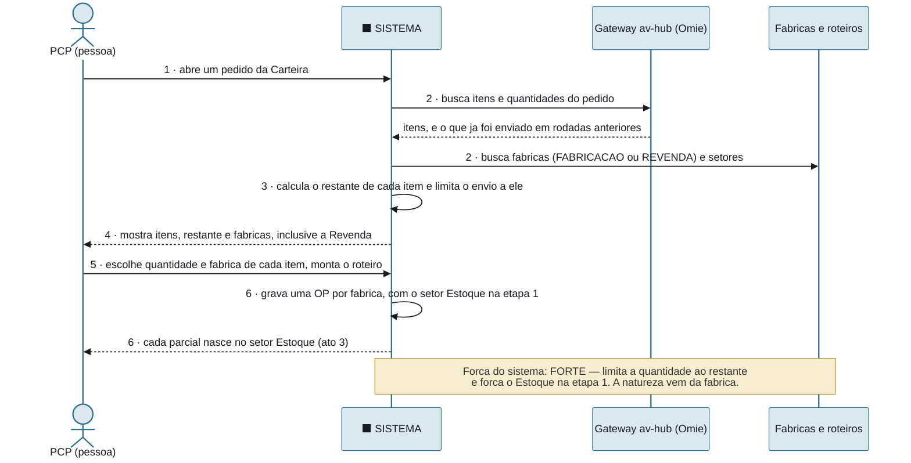
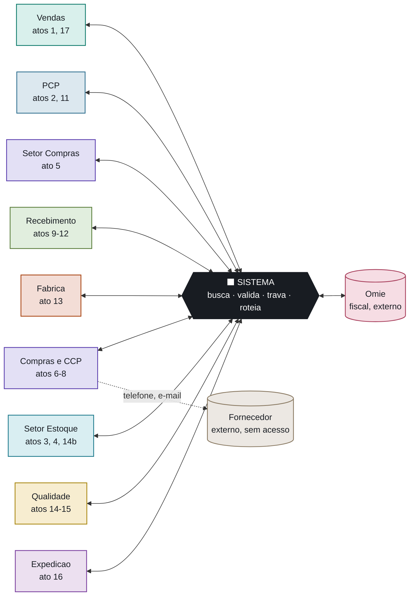

# O Sistema no Meio — os 19 atos do fluxo

> **O que muda em relação ao fluxograma mestre.** Em [[Fluxogramas-Completos]] os setores conversam entre si: uma seta sai do PCP e chega em Compras. Isso descreve o **processo**, mas esconde a coisa mais importante do sistema a construir — **nenhum setor vai falar com outro setor; todos vão falar com o sistema.** O PCP não manda uma requisição pro comprador; o PCP grava uma requisição, e o sistema a entrega ao comprador.
>
> Esta nota redesenha o mesmo fluxo com o sistema no centro de cada passagem. Cada interação vira um **ato**, e todo ato tem exatamente a mesma forma — os **6 tempos**. São 19 atos, cobrindo do pedido ao faturamento.
>
> **Por que isso não é só reescrever bonito.** A gramática dos 6 tempos tem um efeito de diagnóstico: quando um ato não tem o que preencher no tempo 2 (buscar) ou no tempo 3 (fazer), o sistema não está mediando nada ali — está só guardando o que a pessoa digitou. Esses são os **pontos cegos**, e eles ficam visíveis sozinhos. Achamos 3 — ver a seção final.
>
> **Atualizado em 24/09/2026 com o encaixe do Estoque e da Revenda no MES** ([[Encaixe-Estoque-Revenda-no-PCP]]). Mudaram os atos 2 a 5 (o PCP monta a rodada e escolhe a fábrica; o **setor Estoque é a etapa 1 de todo roteiro** e reserva; a requisição nasce sozinha no **setor Compras**), os atos 12, 13, 14 e 16, e entrou o **ato 14b**: o item comprado aprovado pela Qualidade **volta ao Estoque** (entrada + reserva) antes de sair — não vai direto para a Expedição.

## Os 6 tempos

Todo ato do sistema tem esta forma, sem exceção:

| Tempo | Quem | O que é |
|---|---|---|
| **1 · Chega** | Ator | Quem procura o sistema, e com que intenção |
| **2 · Busca** | Sistema | De onde ele lê o dado — tabela, projeção, API do outro lado |
| **3 · Faz** | Sistema | A regra: valida, calcula, trava, compara |
| **4 · Mostra** | Sistema | O que aparece na tela, já processado |
| **5 · Decide** | Pessoa | Confirma, corrige ou escolhe outro caminho |
| **6 · Roteia** | Sistema | O que grava e pra quem entrega em seguida |

Os tempos 2, 3, 4 e 6 são do sistema. O ator só aparece nas pontas — no 1 e no 5. **É isso que "o sistema no meio" quer dizer:** entre a intenção de uma pessoa e a decisão dela, o sistema fez quatro coisas.

### Anatomia de um ato

O ato 2 (PCP monta a rodada), desenhado inteiro:

**Compare com o fluxograma mestre:** lá isso é um nó só (`P1 — Carteira`) seguido de outro (`P2 — Ordem de Produção`). Aqui aparecem as duas buscas, o cálculo do restante e a inserção do setor Estoque — que é o trabalho que o sistema precisa fazer para que aqueles nós existam. *(Até 24/09/2026 este ato também cruzava a matriz natureza × disponibilidade; a disponibilidade passou para o ato 3.)*

## O sistema como centro de tudo

O mesmo fluxo, visto de cima: 11 setores, nenhuma seta entre eles.

**A única seta que não passa pelo sistema é a do fornecedor** — telefone, e-mail, WhatsApp. É o ato 8, e é o maior ponto cego do fluxo.

## O fluxograma mestre com o sistema interposto

> O mesmo diagrama de atividades de [[Fluxogramas-Completos]], nó por nó, com duas camadas somadas: cada raia carrega **quantas telas ela custa** (de [[Fluxograma-Telas-por-Bloco]]) e entre uma raia e outra aparece **o que o sistema faz na passagem**. São **15 passagens mediadas e 1 fora** — a do fornecedor.
>
> **Como ler:** caixa branca = passo de um setor · paralelogramo escuro = o sistema · caixa vermelha = fora do sistema. Cada ação do sistema mora **dentro da raia onde o resultado dela aterrissa** — por isso o PCP tem três: é pra lá que as exceções voltam.
>
> **Repare no Estoque:** desde 24/09/2026 é por ele que **todo** item entra no roteiro (etapa 1) — e é por ele que o item comprado sai, depois da Qualidade. A busca de saldo e a reserva viraram um nó escuro: é trabalho que sai da pessoa e passa a ser do sistema, que busca o saldo e trava a reserva **na mesma operação**, pra dois pedidos não disputarem o mesmo lote. O mesmo movimento acontece no Recebimento e na Qualidade.

```mermaid
%%{init: {'theme': 'base', 'themeVariables': {'primaryColor': '#ffffff', 'primaryTextColor': '#181c22', 'primaryBorderColor': '#33475a', 'lineColor': '#5c6570', 'fontFamily': 'Source Sans 3, sans-serif', 'fontSize': '14px', 'edgeLabelBackground': '#ffffff', 'textColor': '#181c22'}, 'flowchart': {'nodeSpacing': 45, 'rankSpacing': 62, 'padding': 14}}}%%
flowchart TD
    subgraph SEC_VENDAS[1. Vendas - av-hub · 2 telas]
        SA["polling do Omie para o av-hub. O pedido aparece SO para o vendedor"]
        SM["projeta a etapa de cada item - FRONTEIRA, polling 1-2 min"]
        V1[Vendedor emite o pedido no Omie]
        V2{Precisa de acompanhamento da Qualidade?}
        V3[Vendedor confirma e envia ao PCP]
        V4[Vendedor acompanha a etapa de cada item]
        V1 --> SA
        SA --> V2
        V2 -->|sim| V3
        V2 -->|nao| V3
    end

    subgraph SEC_PCP[2. PCP - MES · 5 telas]
        SN["o av-hub libera o pedido e o MES le por polling - FRONTEIRA"]
        SE["abre divergencia na fila Novo norte - nunca beco sem saida"]
        SK["cinde o lote e abre a RNC - nunca emite a nota"]
        P1[Carteira: escolhe itens, quantidades e fabrica da rodada]
        P2[Ordem de Producao: uma OP por fabrica, Estoque como etapa 1]
        K1[Setor Compras: gera a requisicao ao receber o parcial]
        P6[Decide o novo norte]
        P1 --> P2
    end

    subgraph SEC_COMPRAS[3. Compras e CCP - av-hub · 6 telas]
        SC["projeta a requisicao no av-hub - FRONTEIRA, polling 5 min"]
        C1[Cotacao e negociacao]
        C2{Acima de R$ 30.000?}
        C3[Aprovacao da diretoria]
        C4[Emite Ordem de Compra, define CIF ou FOB]
        C5[CCP: follow-up de prazo]
        C1 --> C2
        C2 -->|sim| C3 --> C4
        C2 -->|nao| C4
        C4 --> C5
    end

    subgraph SEC_FORN[4. Fornecedor - externo · 0 telas]
        SGAP[["FORA DO SISTEMA - telefone, e-mail, WhatsApp"]]
        FN1[Recebe a OC]
    end

    subgraph SEC_LOG[5. Logistica de entrada · 1 tela futura]
        L1{CIF ou FOB?}
        L2[FOB: coleta no fornecedor]
        L3[CIF: fornecedor entrega direto]
        L4[Chegada fisica na doca]
        L1 -->|FOB| L2 --> L4
        L1 -->|CIF| L3 --> L4
    end

    subgraph SEC_RECEB[6. Recebimento - MES · 5 telas]
        SD["casa a chegada com a referencia da OC - FRONTEIRA"]
        R1[Confere Pedido de Venda ou Ordem de Compra]
        R2[Pesagem]
        R3{Bate com o esperado?}
        R4[Cria lote em quarentena]
        R5{Roteiro tem beneficiamento?}
        R1 --> R2 --> R3
        R3 -->|nao| R6[Divergencia]
        R3 -->|sim| R4 --> R5
    end

    subgraph SEC_PROD[7. Fabrica e Beneficiamento - MES · 4 telas fora do ciclo]
        SH["move o parcial para o proximo setor produtivo do roteiro"]
        F1[Percorre os setores produtivos do roteiro]
        F2[Conclui a etapa produtiva]
        F1 --> F2
    end

    subgraph SEC_ESTOQUE[8. Estoque - MES · 12 telas, 8 no ciclo]
        SB["busca saldo na filial do pedido e TRAVA a reserva na mesma operacao"]
        SR["move o restante pelo roteiro"]
        SQ["tira da quarentena e devolve o item comprado ao Estoque"]
        E1{Saldo cobre o item?}
        E2[Almoxarife atende e separa]
        E5[Entrada do lote na localizacao de guarda]
        SB --> E1
        E1 -->|sim, tudo ou parte| E2
        E1 -->|nao, ou o restante| SR
        SQ --> E5
        E5 --> SB
    end

    subgraph SEC_QUAL[9. Qualidade - MES · 5 telas, 4 no ciclo]
        SF["libera o lote em quarentena para inspecao"]
        SI["libera a conclusao para inspecao final"]
        Q1[Inspecao]
        Q2{Aprova?}
        Q3[Abre RNC com evidencia]
        Q4[Cisao de lote]
        Q5{Origem do item}
        Q1 --> Q2
        Q2 -->|nao| Q3 --> Q4
        Q2 -->|sim| Q5
    end

    subgraph SEC_EXP[10. Expedicao e Logistica de saida - MES · 4 telas fora do ciclo]
        SJ["recebe o concluido: do Estoque, reservado, ou da Qualidade, fabricado"]
        X1[Embalagem e paletizacao]
        X2{Parcial ou integral?}
        X3[Consolida a carga]
        X4[Define transporte]
        X1 --> X2
        X2 -->|integral| X3 --> X4
        X2 -->|parcial| X4
    end

    subgraph SEC_FISCAL[11. Fiscal - Omie · 1 tela fora do ciclo]
        SL["sinaliza a NF ao Omie PELO GATEWAY do av-hub - o MES nunca fala com o Omie"]
        O1[Emite nota fiscal]
        O2[Baixa o item no pedido]
        O1 --> O2
    end


    V3 --> SN
    SN --> P1
    P2 --> SB
    SR -->|Fabricacao| SH
    SR -->|Revenda| K1
    K1 --> SC
    SC --> C1
    C5 -.-> SGAP
    SGAP -.-> FN1
    FN1 --> L1
    L4 --> SD
    SD --> R1
    R6 --> SE
    SE --> P6
    P6 -->|reabre compra| K1
    R5 -->|nao| SF
    SF --> Q1
    R5 -->|sim| SH
    SH --> F1
    F2 --> SI
    SI --> Q1
    Q5 -->|comprado| SQ
    Q5 -->|fabricado| SJ
    E2 --> SJ
    SJ --> X1
    Q4 --> SK
    SK --> P6
    P6 -->|retrabalho| SH
    X4 --> SL
    SL --> O1
    SD -.-> SM
    SJ -.-> SM
    SM -.->|status por item| V4

    style SEC_VENDAS fill:#d9f0ec,stroke:#0f7a6b,stroke-width:2px,color:#181c22
    style SEC_PCP fill:#dce8ef,stroke:#2f6f8f,stroke-width:2px,color:#181c22
    style SEC_COMPRAS fill:#e3e0f5,stroke:#5b3fae,stroke-width:2px,color:#181c22
    style SEC_FORN fill:#ece8e3,stroke:#8a7a63,stroke-width:2px,color:#181c22
    style SEC_LOG fill:#fbe8d9,stroke:#c9541a,stroke-width:2px,color:#181c22
    style SEC_RECEB fill:#e1eede,stroke:#5a7d3a,stroke-width:2px,color:#181c22
    style SEC_PROD fill:#f3ddd6,stroke:#a8420f,stroke-width:2px,color:#181c22
    style SEC_ESTOQUE fill:#d9eef2,stroke:#1f7a8c,stroke-width:2px,color:#181c22
    style SEC_QUAL fill:#f7edd0,stroke:#a8860f,stroke-width:2px,color:#181c22
    style SEC_EXP fill:#ece0f0,stroke:#7a3f9e,stroke-width:2px,color:#181c22
    style SEC_FISCAL fill:#f6dde4,stroke:#a83f5c,stroke-width:2px,color:#181c22

    style SA fill:#252c34,stroke:#8d95a1,stroke-width:1.5px,color:#eef1f4
    style SN fill:#252c34,stroke:#8d95a1,stroke-width:1.5px,color:#eef1f4
    style SB fill:#252c34,stroke:#8d95a1,stroke-width:1.5px,color:#eef1f4
    style SR fill:#252c34,stroke:#8d95a1,stroke-width:1.5px,color:#eef1f4
    style SQ fill:#252c34,stroke:#8d95a1,stroke-width:1.5px,color:#eef1f4
    style SC fill:#252c34,stroke:#8d95a1,stroke-width:1.5px,color:#eef1f4
    style SD fill:#252c34,stroke:#8d95a1,stroke-width:1.5px,color:#eef1f4
    style SE fill:#252c34,stroke:#8d95a1,stroke-width:1.5px,color:#eef1f4
    style SF fill:#252c34,stroke:#8d95a1,stroke-width:1.5px,color:#eef1f4
    style SH fill:#252c34,stroke:#8d95a1,stroke-width:1.5px,color:#eef1f4
    style SI fill:#252c34,stroke:#8d95a1,stroke-width:1.5px,color:#eef1f4
    style SJ fill:#252c34,stroke:#8d95a1,stroke-width:1.5px,color:#eef1f4
    style SK fill:#252c34,stroke:#8d95a1,stroke-width:1.5px,color:#eef1f4
    style SL fill:#252c34,stroke:#8d95a1,stroke-width:1.5px,color:#eef1f4
    style SM fill:#252c34,stroke:#8d95a1,stroke-width:1.5px,color:#eef1f4
    style SGAP fill:#4a2620,stroke:#e8877a,stroke-width:2px,color:#ffc9bf

    style V1 fill:#ffffff,stroke:#0f7a6b,stroke-width:1.5px,color:#181c22
    style V2 fill:#ffffff,stroke:#0f7a6b,stroke-width:1.5px,color:#181c22
    style V3 fill:#ffffff,stroke:#0f7a6b,stroke-width:1.5px,color:#181c22
    style V4 fill:#ffffff,stroke:#0f7a6b,stroke-width:1.5px,color:#181c22
    style P1 fill:#ffffff,stroke:#2f6f8f,stroke-width:1.5px,color:#181c22
    style P2 fill:#ffffff,stroke:#2f6f8f,stroke-width:1.5px,color:#181c22
    style K1 fill:#ffffff,stroke:#5b3fae,stroke-width:1.5px,color:#181c22
    style P6 fill:#ffffff,stroke:#2f6f8f,stroke-width:1.5px,color:#181c22
    style C1 fill:#ffffff,stroke:#5b3fae,stroke-width:1.5px,color:#181c22
    style C2 fill:#ffffff,stroke:#5b3fae,stroke-width:1.5px,color:#181c22
    style C3 fill:#ffffff,stroke:#5b3fae,stroke-width:1.5px,color:#181c22
    style C4 fill:#ffffff,stroke:#5b3fae,stroke-width:1.5px,color:#181c22
    style C5 fill:#ffffff,stroke:#5b3fae,stroke-width:1.5px,color:#181c22
    style FN1 fill:#ffffff,stroke:#8a7a63,stroke-width:1.5px,color:#181c22
    style L1 fill:#ffffff,stroke:#c9541a,stroke-width:1.5px,color:#181c22
    style L2 fill:#ffffff,stroke:#c9541a,stroke-width:1.5px,color:#181c22
    style L3 fill:#ffffff,stroke:#c9541a,stroke-width:1.5px,color:#181c22
    style L4 fill:#ffffff,stroke:#c9541a,stroke-width:1.5px,color:#181c22
    style R1 fill:#ffffff,stroke:#5a7d3a,stroke-width:1.5px,color:#181c22
    style R2 fill:#ffffff,stroke:#5a7d3a,stroke-width:1.5px,color:#181c22
    style R3 fill:#ffffff,stroke:#5a7d3a,stroke-width:1.5px,color:#181c22
    style R4 fill:#ffffff,stroke:#5a7d3a,stroke-width:1.5px,color:#181c22
    style R5 fill:#ffffff,stroke:#5a7d3a,stroke-width:1.5px,color:#181c22
    style R6 fill:#ffffff,stroke:#5a7d3a,stroke-width:1.5px,color:#181c22
    style F1 fill:#ffffff,stroke:#a8420f,stroke-width:1.5px,color:#181c22
    style F2 fill:#ffffff,stroke:#a8420f,stroke-width:1.5px,color:#181c22
    style E1 fill:#ffffff,stroke:#1f7a8c,stroke-width:1.5px,color:#181c22
    style E2 fill:#ffffff,stroke:#1f7a8c,stroke-width:1.5px,color:#181c22
    style E5 fill:#ffffff,stroke:#1f7a8c,stroke-width:1.5px,color:#181c22
    style Q1 fill:#ffffff,stroke:#a8860f,stroke-width:1.5px,color:#181c22
    style Q2 fill:#ffffff,stroke:#a8860f,stroke-width:1.5px,color:#181c22
    style Q3 fill:#ffffff,stroke:#a8860f,stroke-width:1.5px,color:#181c22
    style Q4 fill:#ffffff,stroke:#a8860f,stroke-width:1.5px,color:#181c22
    style Q5 fill:#ffffff,stroke:#a8860f,stroke-width:1.5px,color:#181c22
    style X1 fill:#ffffff,stroke:#7a3f9e,stroke-width:1.5px,color:#181c22
    style X2 fill:#ffffff,stroke:#7a3f9e,stroke-width:1.5px,color:#181c22
    style X3 fill:#ffffff,stroke:#7a3f9e,stroke-width:1.5px,color:#181c22
    style X4 fill:#ffffff,stroke:#7a3f9e,stroke-width:1.5px,color:#181c22
    style O1 fill:#ffffff,stroke:#a83f5c,stroke-width:1.5px,color:#181c22
    style O2 fill:#ffffff,stroke:#a83f5c,stroke-width:1.5px,color:#181c22
```

## Força do sistema — a régua

Cada ato recebe uma nota pelo quanto o sistema realmente contribui antes de a pessoa decidir:

| Nota | Critério |
|---|---|
| **Forte** | O sistema busca, calcula ou valida **e trava** algo. A pessoa confirma um resultado, não preenche um formulário em branco. |
| **Média** | O sistema busca e mostra, mas a regra fica com a pessoa. |
| **Fraca** | O sistema só registra o que a pessoa digitou. Não tem fonte pra buscar nem regra pra aplicar. **É um ponto cego.** |

---

# Movimento 1 — Entrada

## Ato 1 · O pedido chega ao av-hub

**Força:** média · **Telas:** 1.1

- **1 · Chega** — Vendedor emite o pedido no Omie, fora do sistema.
- **2 · Busca** — o pipeline ELT varre a API do Omie por `alterado_desde`. Polling em camadas, de 3 min a diário — **não existe webhook**.
- **3 · Faz** — upsert em `pedidos_vendas` e itens, pela chave natural; nunca escreve as colunas que pertencem a outro sistema.
- **4 · Mostra** — o pedido aparece **só para o vendedor**, na caixa de entrada dele. O PCP ainda não enxerga nada.
- **5 · Decide** — ninguém ainda; até aqui é automático.
- **6 · Roteia** — caixa de entrada do vendedor (ato 1b).

> **O Omie só fala com o av-hub.** O MES nunca lê do Omie: quando precisa, vai pelo gateway do av-hub — exatamente como o `api-pcp` já funciona hoje (`GET /pedido_venda_itens/{numero}` contra `api.acosvital.com.br`). Vale também na saída: a sinalização da NF no ato 16 passa pelo mesmo gateway.

## Ato 1b · O vendedor libera o pedido

**Força:** média · **Telas:** 1.1

- **1 · Chega** — vendedor abre a caixa de entrada e vê os pedidos ainda não liberados.
- **2 · Busca** — os itens do pedido, prazo e filial, já projetados do Omie.
- **3 · Faz** — guarda a marcação de **acompanhamento da Qualidade (sim/não)** e marca o pedido como liberado.
- **4 · Mostra** — o pedido montado, com a marcação pendente de decisão.
- **5 · Decide** — **o vendedor confirma e envia ao PCP.** Este é o portão do fluxo inteiro.
- **6 · Roteia** — **atravessa a fronteira**: o av-hub expõe os pedidos liberados e o MES lê por polling, alimentando a Carteira (ato 2).

> **Consequência de arquitetura:** esta é uma **quarta travessia av-hub↔MES**, e a spec [[Integracao-AvHub-MES-Especificacao-F1]] só tem três. Pelo princípio 2 daquele documento — quem tem o dado expõe, quem precisa faz o polling — o formato natural é o av-hub expor `GET /pedidos/liberados?alterado_desde=&codigo_empresa=` e o MES consumir, mesmo padrão dos outros três. **Precisa virar o Fluxo 4 da F1.**
>
> **Risco de beco sem saída:** pedido que o vendedor nunca confirma fica parado e invisível pro PCP — ver a pergunta em aberto no fim desta nota.

> **O que limita:** a latência é do polling, não do sistema. Um pedido emitido agora pode levar minutos pra aparecer. Não é bug, é a única opção real — o Omie não oferece evento.

---

# Movimento 2 — Despacho (PCP)

## Ato 2 · PCP monta a rodada (Carteira → Ordem de Produção)

**Força:** forte · **Telas:** 2.1, 2.2

- **1 · Chega** — PCP abre um pedido na Carteira.
- **2 · Busca** — os itens e quantidades do pedido no Omie (pelo gateway do av-hub) e o que já foi enviado em rodadas anteriores; as fábricas cadastradas (tipo `FABRICACAO` ou `REVENDA`) e seus setores.
- **3 · Faz** — calcula o restante de cada item e **não deixa enviar mais que o restante**; para cada fábrica usada, **insere o setor Estoque como etapa 1** do roteiro; `codigo_empresa` vem do pedido (DEC-1).
- **4 · Mostra** — itens com total, já enviado e restante; as fábricas, inclusive a Revenda.
- **5 · Decide** — PCP escolhe quantidade e **fábrica** de cada item (a natureza do item é o tipo da fábrica) e monta o roteiro.
- **6 · Roteia** — grava **uma OP por fábrica**; cada parcial nasce no **setor Estoque** (ato 3).

> **Mudou em 24/09/2026.** Antes, este ato cruzava a matriz natureza × disponibilidade e roteava para três rotas. A disponibilidade saiu daqui: é resolvida no setor Estoque, para todo item. Ver [[Encaixe-Estoque-Revenda-no-PCP]].

## Ato 3 · Setor Estoque: atende do saldo e reserva

**Força:** forte · **Telas:** 8.12 (8.4 e 8.5 como consulta)

- **1 · Chega** — o parcial entra no setor Estoque, etapa 1 de todo roteiro.
- **2 · Busca** — lotes do material (por `codigo_empresa` + `id_omie`) **liberados pela Qualidade**, na filial do pedido, menos as reservas ativas.
- **3 · Faz** — **cria a reserva no mesmo passo em que lê o saldo**, por escrita condicional, e faz o **split** do parcial: a parte atendida vira um `ItemParcial` próprio, reservado e concluído. Não é ler-depois-escrever: é a trava contra dois pedidos disputarem o mesmo lote.
- **4 · Mostra** — saldo disponível, lote reservado, localização e quantidade.
- **5 · Decide** — almoxarife confirma o atendimento (e que o material está fisicamente lá) e envia o restante.
- **6 · Roteia** — o split atendido segue pra entrega (ato 16); o restante vai para os setores produtivos (ato 4) ou para o setor Compras (ato 5).

> **Liberação decidida em 24/09/2026:** a reserva não expira; é liberada explicitamente quando o pedido ou a OP é cancelado. **Saldo zero** — passa automático ou exige clique — segue em aberto (sugestão: automático). Antes do marco zero (13/11), todo parcial passa como saldo zero.

## Ato 4 · Rota fabricação: o restante segue o roteiro

**Força:** forte · **Telas:** 8.12, 7.1

- **1 · Chega** — restante de um item de fábrica tipo `FABRICACAO`, saindo do setor Estoque.
- **2 · Busca** — o próximo setor do roteiro daquele item.
- **3 · Faz** — move o parcial (`EM_TRANSITO`) para o primeiro setor produtivo; o tempo que ele passou no Estoque fica no histórico do `ItemParcial`.
- **4 · Mostra** — o parcial na fila do setor produtivo.
- **5 · Decide** — o setor recebe.
- **6 · Roteia** — ato 13.

## Ato 5 · Rota compra: a requisição nasce no setor Compras

**Força:** forte · **Telas:** 2.4

- **1 · Chega** — restante de um item da fábrica **Revenda** entra no setor Compras.
- **2 · Busca** — material, unidade, quantidade do parcial, prazo do pedido de origem e filial.
- **3 · Faz** — **gera a requisição sozinho**, em `ABERTA`, vinculada ao `ItemParcial`, e a expõe em `GET /requisicoes-compra`. O parcial fica parado no setor Compras.
- **4 · Mostra** — a requisição e o estado dela na fila do setor Compras.
- **5 · Decide** — ninguém: a decisão foi tomada no ato 2, ao escolher a fábrica Revenda.
- **6 · Roteia** — **atravessa a fronteira av-hub ↔ MES**: o job do av-hub faz polling a cada 5 min e projeta a requisição na caixa de entrada do comprador (ato 6). O parcial só sai do setor Compras quando o recebimento o libera (ato 12).

---

# Movimento 3 — Compra (av-hub)

## Ato 6 · O comprador fecha a compra

**Força:** forte · **Telas:** 3.1, 3.2

- **1 · Chega** — comprador abre a requisição na caixa de entrada.
- **2 · Busca** — fornecedores em `core.parceiros` (projeção, sem cadastro próprio) e o histórico de preço.
- **3 · Faz** — valida o total contra a régua de **R$ 30.000**, em BRL ou convertido por `cotacao_moeda`; monta as parcelas.
- **4 · Mostra** — a OC montada, com o total e o aviso de que vai precisar de aprovação.
- **5 · Decide** — comprador define fornecedor, preço, CIF × FOB e a **flag acabado/não-acabado por item**.
- **6 · Roteia** — ≥ 30k vai pra aprovação (ato 7); abaixo, emite direto.

> **A flag acabado/não-acabado nasce aqui e decide o ato 10** — quem confere contra o quê. É o campo mais consequente do fluxo inteiro.

## Ato 7 · O diretor aprova

**Força:** forte · **Telas:** 3.4

- **1 · Chega** — a OC caiu na fila de aprovações por cruzar a régua.
- **2 · Busca** — a OC, a requisição de origem e o histórico do fornecedor.
- **3 · Faz** — garante a segregação **comprador ≠ aprovador**.
- **4 · Mostra** — a OC completa, com o valor que disparou a régua em destaque.
- **5 · Decide** — diretor aprova ou reprova com motivo.
- **6 · Roteia** — aprovado emite a OC; reprovado volta pro comprador (ato 6).

## Ato 8 · O CCP cobra o prazo

**Força: fraca — PONTO CEGO** · **Telas:** 3.6

- **1 · Chega** — OC emitida; o CCP assume o acompanhamento enquanto o comprador segue pra outras compras.
- **2 · Busca** — **nada sobre o trânsito.** Só a lista das OCs abertas, ordenada pela última previsão registrada.
- **3 · Faz** — **nada.** Não há o que validar: o fornecedor não acessa o sistema e não existe estado "em trânsito" verificável.
- **4 · Mostra** — a lista por atraso, com o que o próprio CCP digitou da última vez.
- **5 · Decide** — CCP liga ou escreve pro fornecedor, por fora, e atualiza a previsão à mão.
- **6 · Roteia** — nada muda de estado. O pedido segue "aprovado" até o caminhão encostar.

> **É o único ato em que o sistema não media coisa nenhuma** — ele é um caderno. A única saída real é um portal do fornecedor, hoje fase futura sem data.

---

# Movimento 4 — Chegada e execução

## Ato 9 · O material chega na doca

**Força:** média · **Telas:** 6.1

- **1 · Chega** — o caminhão encosta. FOB: a empresa foi buscar. CIF: o fornecedor entregou.
- **2 · Busca** — a referência da OC que o MES já projetou por polling: itens, quantidade esperada e a flag. **Não trafega preço, fornecedor nem condição comercial.**
- **3 · Faz** — casa a chegada com a referência; se não achar nenhuma, abre recebimento avulso em vez de travar.
- **4 · Mostra** — a lista do que era esperado naquela OC.
- **5 · Decide** — almoxarife confirma que é aquela entrega.
- **6 · Roteia** — conferência (ato 10).

## Ato 10 · O almoxarife confere e pesa

**Força:** média (forte na conferência, **fraca na pesagem**) · **Telas:** 6.2, 6.3

- **1 · Chega** — almoxarife no posto, com leitor 2D.
- **2 · Busca** — **acabado confere contra o Pedido de Venda; não acabado, contra a Ordem de Compra.** A flag do ato 6 decide qual.
- **3 · Faz** — compara contagem × esperado; calcula peso teórico × quantidade e testa a tolerância da categoria (5% provisório).
- **4 · Mostra** — linha a linha, o que bate e o que não bate.
- **5 · Decide** — almoxarife **digita o peso real à mão** (DEC-5: a balança não tem saída digital) e confirma.
- **6 · Roteia** — bateu → o lote nasce (ato 12); não bateu → divergência (ato 11).

> **Meio ponto cego:** o sistema calcula a tolerância certinho, mas o número de entrada é digitado. Ele valida o cálculo, não a medição.

## Ato 11 · A divergência volta pro PCP

**Força:** forte · **Telas:** 6.4, 2.5

- **1 · Chega** — almoxarife registra tipo, descrição e foto da evidência.
- **2 · Busca** — a OC, a requisição de origem e o pedido de venda afetado.
- **3 · Faz** — abre a divergência e a coloca na fila "Novo norte". **Nunca deixa como estado terminal** — é a regra que impede beco sem saída.
- **4 · Mostra** — pro PCP, o que chegou contra o que era esperado, lado a lado.
- **5 · Decide** — PCP aceita o parcial, reabre a compra, ou rejeita.
- **6 · Roteia** — aceita → ato 12 com a quantidade real; reabre → volta pro ato 5.

## Ato 12 · O lote nasce

**Força:** forte · **Telas:** 6.5

- **1 · Chega** — conferência aprovada.
- **2 · Busca** — o material canônico e o depósito/localização de destino.
- **3 · Faz** — cria o lote com a **quantidade real, não a esperada**; `origem = RECEBIMENTO` e `status_qualidade = PENDENTE` — **quarentena por padrão, sempre**; gera o código da etiqueta.
- **4 · Mostra** — o lote criado e a etiqueta pronta pra impressão.
- **5 · Decide** — almoxarife imprime, cola e informa a chave de acesso da NF de entrada.
- **6 · Roteia** — libera o parcial que esperava no setor Compras e segue o roteiro: setor de beneficiamento, se houver (ato 13), ou Qualidade (ato 14). Veio não acabado e o roteiro não prevê beneficiamento → fila Novo norte (ato 11).

> **A quarentena não é opcional.** Nenhum lote nasce liberado neste caminho — só os da carga inicial, por decisão explícita (DEC-4).

## Ato 13 · A fábrica percorre o roteiro

**Força:** forte · **Telas:** 7.1, 7.2

- **1 · Chega** — operador do setor abre o board.
- **2 · Busca** — a fila do setor: os `ItemParcial` cujo setor atual é aquele.
- **3 · Faz** — cada transição é **escrita condicional** (`where status = o esperado`). Se outro operador já mexeu, dá conflito em vez de sobrescrever.
- **4 · Mostra** — **só as ações válidas naquele estado**, não o menu inteiro.
- **5 · Decide** — operador recebe, inicia, pausa, retoma, retrabalha, divide, devolve ou conclui.
- **6 · Roteia** — próximo setor do roteiro; no último setor produtivo, segue pra Qualidade (ato 14). O beneficiamento da Revenda (ex.: corte de chapa) é um setor deste mesmo board.

> **Devolver nunca edita a linha antiga** — cria uma nova, ligada por `idDevolvidoDe`. O histórico é imutável por construção, não por disciplina.

---

# Movimento 5 — Saída

## Ato 14 · A Qualidade inspeciona

**Força:** forte · **Telas:** 9.1, 9.2

- **1 · Chega** — item liberado por uma das **duas origens** que convergem aqui: recebimento (comprado) ou fábrica/beneficiamento. O item atendido pelo estoque não passa aqui — o saldo só conta lote já liberado.
- **2 · Busca** — o lote, a origem, o histórico e o laudo anexado.
- **3 · Faz** — **trava dura**: o status não sai de `PENDENTE` sem `laudo_url` preenchido. A trava vem antes de decidir, não depois.
- **4 · Mostra** — o formulário de inspeção, com a trava visível.
- **5 · Decide** — inspetor aprova ou reprova.
- **6 · Roteia** — aprovado sai da quarentena: **item comprado volta ao setor Estoque (ato 14b)**; item fabricado segue pra Expedição (ato 16). Reprovado vai pro ato 15.

## Ato 14b · O Estoque recebe o item comprado

**Força:** forte · **Telas:** 8.12

- **1 · Chega** — o parcial do item comprado, aprovado pela Qualidade, volta ao setor Estoque (última etapa do roteiro da Revenda).
- **2 · Busca** — o lote liberado, o recebimento de origem e a localização de guarda.
- **3 · Faz** — dá **entrada** do lote no saldo (`MovimentoEstoque` `ENTRADA`, referência ao recebimento) e cria a **reserva** para o split que esperava a compra, na mesma operação; conclui o split.
- **4 · Mostra** — lote guardado, reserva ativa e split concluído.
- **5 · Decide** — almoxarife confirma a guarda.
- **6 · Roteia** — entrega (ato 16), pela mesma porta do item que já estava em estoque.

> **Regra do Nathan (24/09/2026):** item comprado não vai da Qualidade direto para a Expedição. Assim toda saída de revenda passa pelo Estoque com reserva, e o lote comprado entra no saldo antes de sair.

## Ato 15 · Reprovação: cisão e RNC

**Força:** média (forte na cisão, **fraca no fechamento**) · **Telas:** 9.3, 9.4

- **1 · Chega** — inspetor reprovou.
- **2 · Busca** — a quantidade total do lote e quanto foi reprovado.
- **3 · Faz** — **cisão**: o lote original segue aprovado com o que sobrou; um lote filho nasce congelado com a quantidade reprovada (`lote_pai_id`). Marca a nota de devolução como pendente.
- **4 · Mostra** — os dois lotes resultantes e a RNC aberta.
- **5 · Decide** — inspetor anexa motivo e evidência fotográfica.
- **6 · Roteia** — fila "Novo norte" do PCP, e sinaliza ao Omie. **O sistema nunca emite a nota** — só avisa que ela precisa existir.

> **Meio ponto cego:** neste ciclo a RNC é **fechada à mão**. O sistema não reconhece sozinho a nota de devolução voltando pela sincronização.

## Ato 16 · A Expedição consolida e fatura

**Força:** forte · **Telas:** 10.1, 10.2, 11.1

- **1 · Chega** — itens concluídos chegam à Expedição por **duas portas**: o setor Estoque (atendido pelo saldo ou comprado, já reservados) e a Qualidade (fabricado).
- **2 · Busca** — todos os itens do mesmo pedido e o estado de cada um. **É o único ato que volta a olhar o pedido inteiro** — até aqui cada item correu sozinho.
- **3 · Faz** — aplica a regra parcial × integral: se for integral, **segura a carga** até o último item concluir. Na saída, a reserva do item de estoque vira consumida.
- **4 · Mostra** — o pedido inteiro, com o que ainda falta pra fechar.
- **5 · Decide** — expedição embala, paletiza e libera.
- **6 · Roteia** — sinaliza a NF ao Omie; a nota volta pela sincronização e o item migra de "em aberto" pra "faturado".

> **Risco sem saída desenhada:** faturamento integral travado por um item que nunca chega. Compra e produção têm cancelamento explícito; a consolidação não tem gatilho.

## Ato 17 · O vendedor acompanha

**Força:** média · **Telas:** 1.2

- **1 · Chega** — vendedor abre Meus Pedidos.
- **2 · Busca** — `itens_pedido_status`, a projeção local que o job alimenta a cada 1 a 2 min a partir de `GET /itens/status`.
- **3 · Faz** — deriva a etapa atual pelo maior `ocorrido_em` de cada item, **mas guarda todas as linhas** — um item pode passar duas vezes pela mesma etapa (reprovou, voltou).
- **4 · Mostra** — item a item, a etapa e a linha do tempo das transições.
- **5 · Decide** — nada. É leitura.
- **6 · Roteia** — nada. Este ato é o espelho de todos os outros.

> **É o ato que justifica os outros 18.** Toda a rastreabilidade existe pra que esta tela possa responder "onde está meu item" sem ninguém ligar pra fábrica.

---

# Os 3 pontos cegos

O que a gramática revelou. Em todos os outros 15 atos o sistema busca alguma coisa e aplica alguma regra antes de a pessoa decidir. Nestes três, não:

| # | Ato | O que falta | Saída possível |
|---|---|---|---|
| **1** | **Ato 8 — CCP cobra o prazo** | O sistema não tem **nenhuma** fonte sobre o trânsito. Não busca nada e não valida nada: é um caderno digital. O fornecedor não acessa o sistema. | Portal do fornecedor (fase futura, sem data). É a única saída real — qualquer outra coisa continua sendo o CCP digitando. |
| **2** | **Ato 10 — pesagem** | O sistema calcula a tolerância corretamente, mas o peso real é **digitado à mão** (DEC-5). Ele valida o cálculo, não a medição. | Integração com a balança. Ficou fora do v1 por decisão consciente, não por esquecimento. |
| **3** | **Ato 15 — fechamento da RNC** | O sistema abre a RNC e sinaliza ao Omie, mas **não reconhece a nota de devolução voltando** — a Qualidade fecha à mão. | Ler a nota de devolução na sincronização e fechar a RNC sozinho. Fora do ciclo. |

**Os três são conhecidos e aceitos** — nenhum é descoberta nova. O que esta nota acrescenta é mostrar que são **do mesmo tipo**: nos três, o sistema perde a capacidade de mediar porque o dado nasce fora dele. Não é falta de tela; é falta de fonte.

## Pergunta em aberto criada pelo portão do vendedor

**O vendedor confirma pedido a pedido? E se ele nunca confirmar?**

O portão dá controle e faz a marcação da Qualidade nascer no lugar certo, mas cria um estado novo: *pedido já no av-hub, nunca enviado ao PCP*. Isso contraria o princípio de [[Estoque-Riscos]] de que nenhum estado é beco sem saída. Precisa de uma das três saídas: SLA com alerta, liberação automática depois de um prazo, ou uma visão do PCP sobre o que está represado. **Decidir com o Comercial antes da E3.**

Segunda consequência: **a tela 1.1 não tem tarefa no [[Cronograma-2-Meses]]** — é escopo novo, precisa ser dimensionado e encaixado.

## O que este recorte deixa explícito

- **O sistema é ator em 18 atos, e em 15 deles ele decide alguma coisa antes da pessoa.** Não é um formulário que guarda o que digitaram — ele força o Estoque na etapa 1 de todo roteiro, gera a requisição sozinho, aplica a régua de R$ 30.000, trava a reserva contra corrida, testa a tolerância de peso, impede sair da quarentena sem laudo e segura a carga integral.
- **Só uma passagem do fluxo inteiro não passa pelo sistema:** Compras → Fornecedor, por telefone. Todas as outras 17 são mediadas.
- **A fronteira av-hub ↔ MES aparece em 3 atos** (5, 9 e 17) — e nos três ela é polling, nunca evento. O resto do fluxo acontece dentro de um banco só.
- **Poucos atos não têm decisão humana** (1, 5 e, parcialmente, 17): são pipeline puro. Todo o resto tem uma pessoa confirmando no tempo 5 — nenhum estado do sistema muda sozinho num caminho crítico.

## Ver também
- [[Encaixe-Estoque-Revenda-no-PCP]] — o encaixe que mudou os atos 2 a 5, 12 a 16 e criou o 14b (24/09/2026)
- [[Fluxograma-Telas-por-Bloco]] — as 51 telas em que estes atos acontecem
- [[Fluxogramas-Completos]] — o mesmo fluxo com os setores conversando entre si, sem o sistema no meio
- [[Diagramas-UML]] — o diagrama 0b (Atividades), origem deste recorte
- [[Integracao-AvHub-MES-Especificacao-F1]] — os 3 atos que atravessam a fronteira (5, 9, 17)
- [[Modelo-Destinacao-Item]] — a matriz que os atos 2 (fábrica) e 3 (saldo) resolvem
- [[Rastreabilidade-e-SLA-de-Eventos]] — o log que o ato 17 lê
- [[Decisoes-Chave-ERP]] — DEC-1, DEC-3, DEC-4, DEC-5
