# Fluxograma de Telas — quantas telas e quais funcionalidades por bloco

> **Para que serve esta nota.** [[Fluxogramas-Completos]] e o diagrama 0b de [[Diagramas-UML]] respondem *"quem decide o quê e pra onde o item vai"*. Esta aqui responde a pergunta seguinte, que é a de **colocar o projeto pra rodar**: *"pra cada raia daquele fluxograma, quantas telas precisam existir e o que cada uma faz?"*.
>
> É o **mesmo fluxograma mestre**, copiado nó por nó, só que cada raia agora carrega a contagem de telas no próprio rótulo. Abaixo do diagrama, um bloco por raia, com a lista nominal de telas, as funcionalidades de cada uma, o que já existe hoje e a tarefa correspondente do [[Cronograma-2-Meses]].
>
> **Não é escopo novo.** Toda tela listada aqui sai de um passo que já está em [[Fluxogramas-Completos]] ou nos 6 `Fluxo-*-Completo`. Onde este documento inventa alguma coisa, está marcado como **decisão em aberto** na seção final — são 9, e nenhuma delas trava o início.
>
> **Contagem total: 51 telas** (atualizada em 24/09/2026). 32 neste ciclo (até 18/11), 4 na S5 (rastreabilidade, 19/11–18/12) e 15 fora do ciclo (Fase D e backlog do Robert). Das 32 do ciclo, **15 já têm frontend construído sobre dados de exemplo** (Compras 5, Estoque 6 e Qualidade 4 — as do Pablo entraram no `app-pcp` `develop` em 23/09) e **4 são evolução de tela existente** (1.2 e as 3 do PCP que já rodam em `develop`) — restam **13 telas genuinamente novas**.
>
> **Encaixe do Estoque e da Revenda (24/09/2026)** — ver [[Encaixe-Estoque-Revenda-no-PCP]]. O fluxograma abaixo e os blocos 2, 8, 9 e 10 já refletem: o PCP escolhe a **fábrica** na Carteira (Revenda é uma fábrica) e gera a Ordem de Produção; o **setor Estoque é a etapa 1 de todo roteiro** e ganhou a tela **8.12**; a requisição nasce no **setor Compras** (tela 2.4); e o **item comprado aprovado na Qualidade volta ao Estoque** (entrada + reserva) antes da Expedição.

## Como ler

| Marca | Significado |
|---|---|
| 🆕 | Tela nova, a construir neste ciclo |
| 🔧 | Já existe código, precisa de trabalho (plugar backend, ou evoluir) |
| ✅ | Pronta e em produção |
| ⏭️ | Necessária ao fluxo, mas **fora deste ciclo** (Fase D, S5 ou backlog do Robert) |

## Resumo por bloco

| # | Bloco (raia) | Telas | Neste ciclo | Fora do ciclo |
|---|---|---|---|---|
| 1 | Vendas — av-hub | 2 | 2 (1 nova + 1 evolução) | — |
| 2 | PCP — MES | 5 | 5 (3 evolução + 2 novas) | — |
| 3 | Compras e CCP — av-hub | 6 | 6 (5 com frontend pronto) | — |
| 4 | Fornecedor — externo | 0 | — | — |
| 5 | Logística de entrada | 1 | — | 1 |
| 6 | Recebimento — MES | 5 | 5 | — |
| 7 | Fábrica e Beneficiamento — MES | 4 | — | 4 |
| 8 | Estoque — MES | 12 | 8 (6 com frontend pronto) | 4 |
| 9 | Qualidade — MES | 5 | 4 (frontend pronto) | 1 |
| 10 | Expedição e Log. de saída — MES | 4 | — | 4 |
| 11 | Fiscal — Omie | 1 | — | 1 |
| — | **Transversais** (não são raia) | 6 | 2 | 4 |
| | **Total** | **51** | **32** | **19** |

## Fluxograma mestre — com a contagem de telas por raia

> Versão só com a contagem. Para o mesmo fluxo **com o sistema interposto em cada passagem**, ver [[Fluxo-Sistema-no-Meio]].

```mermaid
%%{init: {'theme': 'base', 'themeVariables': {'primaryColor': '#ffffff', 'primaryTextColor': '#181c22', 'primaryBorderColor': '#33475a', 'lineColor': '#5c6570', 'fontFamily': 'Source Sans 3, sans-serif', 'fontSize': '14px', 'edgeLabelBackground': '#ffffff', 'textColor': '#181c22'}, 'flowchart': {'nodeSpacing': 45, 'rankSpacing': 60, 'padding': 14}}}%%
flowchart TD
    subgraph SEC_VENDAS[1. Vendas - av-hub · 2 telas]
        V1[Vendedor emite o pedido no Omie]
        V2{Precisa de acompanhamento da Qualidade?}
        V3[Vendedor confirma e envia ao PCP]
        V1 --> V2
        V2 -->|sim| V3
        V2 -->|nao| V3
    end

    subgraph SEC_PCP[2. PCP - MES · 5 telas]
        P1[Carteira: escolhe itens, quantidades e fabrica da rodada]
        P2[Ordem de Producao: uma OP por fabrica, Estoque como etapa 1]
        K1[Setor Compras: parcial aguarda, requisicao enviada ao av-hub]
        P6[Decide o novo norte]
        P1 --> P2
    end

    subgraph SEC_COMPRAS[3. Compras e CCP - av-hub · 6 telas]
        C1[Cotacao e negociacao]
        C2{Acima do valor limite?}
        C3[Aprovacao da diretoria]
        C4[Emite Ordem de Compra, define CIF ou FOB]
        C5[CCP: follow-up de prazo]
        C1 --> C2
        C2 -->|sim| C3 --> C4
        C2 -->|nao| C4
        C4 --> C5
    end

    subgraph SEC_FORN[4. Fornecedor - externo · 0 telas]
        FN1[Recebe a OC]
    end

    subgraph SEC_LOG[5. Logistica de entrada · 1 tela futura]
        L1{CIF ou FOB?}
        L2[FOB: coleta no fornecedor]
        L3[CIF: fornecedor entrega direto]
        L4[Chegada fisica na doca]
        L1 -->|FOB| L2 --> L4
        L1 -->|CIF| L3 --> L4
    end

    subgraph SEC_RECEB[6. Recebimento - MES · 5 telas]
        R1[Confere Pedido de Venda ou Ordem de Compra]
        R2[Pesagem]
        R3{Bate com o esperado?}
        R4[Cria lote em quarentena]
        R5{Roteiro tem beneficiamento?}
        R1 --> R2 --> R3
        R3 -->|nao| R6[Divergencia]
        R3 -->|sim| R4 --> R5
    end

    subgraph SEC_PROD[7. Fabrica e Beneficiamento - MES · 4 telas fora do ciclo]
        F1[Percorre os setores produtivos do roteiro]
        F2[Conclui a etapa produtiva]
        F1 --> F2
    end

    subgraph SEC_ESTOQUE[8. Estoque - MES · 12 telas, 8 no ciclo]
        E1[Saldo disponivel na filial do pedido]
        E2{Saldo cobre o item?}
        E3[Split atendido: reserva no lote e conclui]
        E4{Tipo da fabrica}
        E5[Entrada do item comprado no saldo]
        E1 --> E2
        E2 -->|sim, tudo ou parte| E3
        E2 -->|nao, ou o restante| E4
        E5 --> E3
    end

    subgraph SEC_QUAL[9. Qualidade - MES · 5 telas, 4 no ciclo]
        Q1[Inspecao]
        Q2{Aprova?}
        Q3[Abre RNC com evidencia]
        Q4[Cisao de lote]
        Q5{Origem do item}
        Q1 --> Q2
        Q2 -->|nao| Q3 --> Q4
        Q2 -->|sim| Q5
    end

    subgraph SEC_EXP[10. Expedicao e Logistica de saida - MES · 4 telas fora do ciclo]
        X1[Embalagem e paletizacao]
        X2{Parcial ou integral?}
        X3[Consolida a carga]
        X4[Define transporte]
        X1 --> X2
        X2 -->|integral| X3 --> X4
        X2 -->|parcial| X4
    end

    subgraph SEC_FISCAL[11. Fiscal - Omie · 1 tela fora do ciclo]
        O1[Emite nota fiscal]
        O2[Baixa o item no pedido]
        O1 --> O2
    end

    V3 --> P1
    P2 --> E1
    E4 -->|Fabricacao| F1
    E4 -->|Revenda| K1
    K1 --> C1
    C5 --> FN1
    FN1 --> L1
    L4 --> R1
    R6 --> P6
    P6 -->|reabre compra| K1
    R5 -->|sim| F1
    R5 -->|nao| Q1
    F2 --> Q1
    Q5 -->|comprado: volta ao Estoque| E5
    Q5 -->|fabricado| X1
    E3 --> X1
    Q4 --> P6
    P6 -->|retrabalho| F1
    X4 --> O1

    style SEC_VENDAS fill:#d9f0ec,stroke:#0f7a6b,stroke-width:2px,color:#181c22
    style SEC_PCP fill:#dce8ef,stroke:#2f6f8f,stroke-width:2px,color:#181c22
    style SEC_COMPRAS fill:#e3e0f5,stroke:#5b3fae,stroke-width:2px,color:#181c22
    style SEC_FORN fill:#ece8e3,stroke:#8a7a63,stroke-width:2px,color:#181c22
    style SEC_LOG fill:#fbe8d9,stroke:#c9541a,stroke-width:2px,color:#181c22
    style SEC_RECEB fill:#e1eede,stroke:#5a7d3a,stroke-width:2px,color:#181c22
    style SEC_PROD fill:#f3ddd6,stroke:#a8420f,stroke-width:2px,color:#181c22
    style SEC_ESTOQUE fill:#d9eef2,stroke:#1f7a8c,stroke-width:2px,color:#181c22
    style SEC_QUAL fill:#f7edd0,stroke:#a8860f,stroke-width:2px,color:#181c22
    style SEC_EXP fill:#ece0f0,stroke:#7a3f9e,stroke-width:2px,color:#181c22
    style SEC_FISCAL fill:#f6dde4,stroke:#a83f5c,stroke-width:2px,color:#181c22

    style V1 fill:#ffffff,stroke:#0f7a6b,stroke-width:1.5px,color:#181c22
    style V2 fill:#ffffff,stroke:#0f7a6b,stroke-width:1.5px,color:#181c22
    style V3 fill:#ffffff,stroke:#0f7a6b,stroke-width:1.5px,color:#181c22
    style P1 fill:#ffffff,stroke:#2f6f8f,stroke-width:1.5px,color:#181c22
    style P2 fill:#ffffff,stroke:#2f6f8f,stroke-width:1.5px,color:#181c22
    style K1 fill:#ffffff,stroke:#5b3fae,stroke-width:1.5px,color:#181c22
    style P6 fill:#ffffff,stroke:#2f6f8f,stroke-width:1.5px,color:#181c22
    style C1 fill:#ffffff,stroke:#5b3fae,stroke-width:1.5px,color:#181c22
    style C2 fill:#ffffff,stroke:#5b3fae,stroke-width:1.5px,color:#181c22
    style C3 fill:#ffffff,stroke:#5b3fae,stroke-width:1.5px,color:#181c22
    style C4 fill:#ffffff,stroke:#5b3fae,stroke-width:1.5px,color:#181c22
    style C5 fill:#ffffff,stroke:#5b3fae,stroke-width:1.5px,color:#181c22
    style FN1 fill:#ffffff,stroke:#8a7a63,stroke-width:1.5px,color:#181c22
    style L1 fill:#ffffff,stroke:#c9541a,stroke-width:1.5px,color:#181c22
    style L2 fill:#ffffff,stroke:#c9541a,stroke-width:1.5px,color:#181c22
    style L3 fill:#ffffff,stroke:#c9541a,stroke-width:1.5px,color:#181c22
    style L4 fill:#ffffff,stroke:#c9541a,stroke-width:1.5px,color:#181c22
    style R1 fill:#ffffff,stroke:#5a7d3a,stroke-width:1.5px,color:#181c22
    style R2 fill:#ffffff,stroke:#5a7d3a,stroke-width:1.5px,color:#181c22
    style R3 fill:#ffffff,stroke:#5a7d3a,stroke-width:1.5px,color:#181c22
    style R4 fill:#ffffff,stroke:#5a7d3a,stroke-width:1.5px,color:#181c22
    style R5 fill:#ffffff,stroke:#5a7d3a,stroke-width:1.5px,color:#181c22
    style R6 fill:#ffffff,stroke:#5a7d3a,stroke-width:1.5px,color:#181c22
    style F1 fill:#ffffff,stroke:#a8420f,stroke-width:1.5px,color:#181c22
    style F2 fill:#ffffff,stroke:#a8420f,stroke-width:1.5px,color:#181c22
    style E1 fill:#ffffff,stroke:#1f7a8c,stroke-width:1.5px,color:#181c22
    style E2 fill:#ffffff,stroke:#1f7a8c,stroke-width:1.5px,color:#181c22
    style E3 fill:#ffffff,stroke:#1f7a8c,stroke-width:1.5px,color:#181c22
    style E4 fill:#ffffff,stroke:#1f7a8c,stroke-width:1.5px,color:#181c22
    style E5 fill:#ffffff,stroke:#1f7a8c,stroke-width:1.5px,color:#181c22
    style Q1 fill:#ffffff,stroke:#a8860f,stroke-width:1.5px,color:#181c22
    style Q2 fill:#ffffff,stroke:#a8860f,stroke-width:1.5px,color:#181c22
    style Q3 fill:#ffffff,stroke:#a8860f,stroke-width:1.5px,color:#181c22
    style Q4 fill:#ffffff,stroke:#a8860f,stroke-width:1.5px,color:#181c22
    style Q5 fill:#ffffff,stroke:#a8860f,stroke-width:1.5px,color:#181c22
    style X1 fill:#ffffff,stroke:#7a3f9e,stroke-width:1.5px,color:#181c22
    style X2 fill:#ffffff,stroke:#7a3f9e,stroke-width:1.5px,color:#181c22
    style X3 fill:#ffffff,stroke:#7a3f9e,stroke-width:1.5px,color:#181c22
    style X4 fill:#ffffff,stroke:#7a3f9e,stroke-width:1.5px,color:#181c22
    style O1 fill:#ffffff,stroke:#a83f5c,stroke-width:1.5px,color:#181c22
    style O2 fill:#ffffff,stroke:#a83f5c,stroke-width:1.5px,color:#181c22
```

---

## 1. Vendas — av-hub · 2 telas

**Nós cobertos:** V1 (emite o pedido), V2 (acompanhamento da Qualidade).

O pedido nasce no **Omie** e o polling entrega ao **av-hub, e só ao av-hub** — **não há tela de emissão a construir**. O MES nunca lê do Omie; quando precisa, vai pelo gateway do av-hub, como o `api-pcp` já faz hoje.

**O pedido aparece primeiro só para o vendedor.** Ele marca se precisa de acompanhamento da Qualidade e confirma; só então o pedido atravessa para a Carteira do PCP. É o portão do fluxo inteiro.

| # | Tela | Funcionalidades | Estado | Tarefa |
|---|---|---|---|---|
| 1.1 | **Caixa de entrada do vendedor** | Pedidos recém-chegados do Omie, ainda não liberados; marcação de **acompanhamento da Qualidade (sim/não)**; confirma e envia ao PCP. Nada chega à Carteira sem passar aqui | 🆕 | **sem tarefa** ⚠️ |
| 1.2 | **Meus Pedidos — etapa por item** | Etapa atual de cada item (as 11 etapas de `/itens/status`); linha do tempo das transições; quantidade em cada etapa (item pode estar partido); SLA até a previsão de faturamento; filtro por etapa | 🔧 evolução | **E3** |

**Funcionalidade de dado, não de tela:** a etapa vem do **Fluxo 3** de [[Integracao-AvHub-MES-Especificacao-F1]] (`GET /itens/status`, polling 1–2 min), projetado em `itens_pedido_status` no av-hub para a tela não re-pollar o MES a cada carregamento.

**A marcação da Qualidade é capturada agora, consumida depois.** O campo nasce na tela 1.1 neste ciclo; a fila que ele alimenta (inspeção de processo, tela 9.5) segue fora da Fase B — ver bloco 9.

⚠️ **A tela 1.1 é escopo novo, sem tarefa no [[Cronograma-2-Meses]]**, e cria uma **quarta travessia av-hub↔MES** que a spec [[Integracao-AvHub-MES-Especificacao-F1]] não cobre — ela tem três fluxos. Ver [[Fluxo-Sistema-no-Meio]] para o detalhe e o risco de pedido represado.

---

## 2. PCP — MES · 5 telas

**Nós cobertos:** P1 (Carteira), P2 (Ordem de Produção), K1 (setor Compras), P6 (novo norte).

**Mudou em 23-24/09/2026.** A **Carteira de Pedidos** e a **tela Ordem de Produção** já existem no `app-pcp` (branch `develop`) com backend real: o PCP escolhe itens, quantidades e **fábrica** por rodada e gera uma OP por fábrica. O encaixe de 24/09 ([[Encaixe-Estoque-Revenda-no-PCP]]) tirou do PCP a checagem de saldo e a requisição de compra — viraram os **setores Estoque** (bloco 8, tela 8.12) e **Compras** (tela 2.4) do roteiro. O motor de execução da produção continua sendo o [[App-PCP-Backend-Producao]].

| # | Tela | Funcionalidades | Estado | Tarefa |
|---|---|---|---|---|
| 2.1 | **Carteira de Pedidos** | Pedidos de venda do av-hub/Omie com status de envio (não enviado, parcial, total) e de produção (aguardando, em produção, concluída); filtro por filial e período; abre a Ordem de Produção do pedido. Existe em `develop` (`/carteira`, `GET /pedidos/carteira`) | 🔧 | **C4** |
| 2.2 | **Ordem de Produção (nova rodada)** | Itens do pedido vindos do Omie, sem digitação manual; por item, **quantidade desta rodada** e **fábrica** (linha de fabricação ou **Revenda**); roteiro por fábrica, com o **setor Estoque inserido como etapa 1** pelo backend; uma OP por fábrica; `codigo_empresa` vem do Pedido (DEC-1). Existe em `develop` (`/ordens-producao/novo`); **falta a fábrica Revenda** — hoje item sem fábrica é descartado | 🔧 | **C6** |
| 2.3 | **Ordens de Produção — lista e detalhe** | Lista das OPs; detalhe com mini-roteiro por item, parciais por setor, histórico, anexos e embalagem. Existe em `develop` (`/ordens-producao`, `/ordens-producao/[id]`); precisa mostrar o split atendido pelo estoque e a reserva | 🔧 | **C6** |
| 2.4 | **Setor Compras — parciais aguardando compra** | Fila dos parciais no setor Compras (roteiro da Revenda); a **entrada do parcial gera a requisição** automaticamente (material, quantidade, prazo, filial, `id_item_parcial`), exposta ao av-hub pelo Fluxo 1 (polling 5 min); mostra o estado da requisição/OC; a saída é liberada pelo Recebimento (D6) | 🆕 | **C7** |
| 2.5 | **Fila "Novo norte"** | Fila única de decisões que voltaram pro PCP: divergência de recebimento (R5/R6), reprovação de qualidade (Q9) e item comprado não acabado num roteiro sem beneficiamento. Ações: aceitar parcial, reabrir compra, retrabalho, ajustar o roteiro | 🆕 | **C8** |

**Sobre a 2.5 — a fila que fecha os ciclos.** [[Fluxo-Recebimento-Completo]] deixa a pergunta explícita: divergência e reprovação merecem a mesma tela ou telas distintas? **Recomendação deste documento: uma tela só, com a origem como coluna.** São gatilhos diferentes, mas o conjunto de ações do PCP é o mesmo (aceita / reabre / redireciona), e duas filas separadas dobram a chance de uma delas ficar sem dono. Registrado como decisão em aberto **T-01**.

**A reserva não nasce mais no PCP (24/09/2026).** Nasce no setor Estoque (tela 8.12), no mesmo passo em que o saldo é lido — evita a corrida entre pedidos disputando o mesmo saldo. Liga só depois do **marco zero (13/11)**; até lá o setor Estoque trata todo parcial como saldo zero.

---

## 3. Compras e CCP — av-hub · 6 telas

**Nós cobertos:** C1 (cotação), C2 (limite de valor), C3 (aprovação), C4 (emite OC), C5 (follow-up do CCP).

**O bloco mais adiantado do fluxo inteiro.** Achado em 22/09/2026: o frontend já está construído no repositório av-hub, rodando 100% sobre dados de exemplo (`GAMBIARRA` marcada em cada ponto de integração). O backend foi implementado e testado em 22/09 na branch `feat/compras-requisicoes-e1`, ainda sem push/deploy. Ver [[AV-Hub-Modulos]] e [[AV-Hub-Views-Compras-Investigacao]].

| # | Tela | Funcionalidades | Estado | Tarefa |
|---|---|---|---|---|
| 3.1 | **Caixa de entrada de Requisições** | Lista + Kanban das requisições vindas do MES (Fluxo 1, polling 5 min); agrupamento por material/fornecedor para comprar em lote; triagem | 🔧 frontend pronto | **E1** |
| 3.2 | **Emissão da OC** (`/compras/nova`) | Fornecedor (projeção `core.parceiros`, sem cadastro próprio); preço, moeda e `cotacao_moeda` (cobre MP importada); **flag acabado/não-acabado por item**; CIF × FOB; condição de pagamento e parcelas | 🔧 frontend pronto | **E2** |
| 3.3 | **Ordens de Compra** | Lista + Kanban de fechamento; estados da OC; vínculo com a requisição de origem (`id_requisicao_origem`) | 🔧 frontend pronto | **E2** |
| 3.4 | **Fila de Aprovações** | Dispara **acima de R$ 30.000** (DEC-3), em BRL ou em moeda estrangeira convertida; segregação comprador ≠ aprovador; aprovar/reprovar com motivo (reprovado volta pra 3.2) | 🔧 frontend pronto | **E2** |
| 3.5 | **Dashboard de Compras** | Volume, valor, requisições em aberto, OCs por estado | 🔧 frontend pronto | **E2** |
| 3.6 | **Follow-up do CCP** | Lista de OCs abertas ordenada por previsão de chegada; registro manual do contato com o fornecedor; atualização da `previsao_chegada` | 🆕 | **E2** |

**A flag acabado/não-acabado (3.2) é o campo mais importante de todo o fluxo.** Ela decide quem confere contra o quê no Recebimento (Pedido de Venda × Ordem de Compra) e se o item passa pelo PCP de novo. Não pode ser opcional nem ficar escondida em aba secundária.

**Duas lacunas conscientes, herdadas do backend de 22/09:** sincronização com o Omie (`IncluirPedCompra`) não implementada — `status_sincronizacao_omie` sempre `pendente`; cálculo de parcelas é placeholder (split igual + 30 dias) por falta de catálogo real de condição de pagamento.

**Não entra:** cotação e comparação entre fornecedores segue fora do sistema; estado "em trânsito" verificável não existe (o fornecedor não acessa o sistema) — fica só a previsão de chegada da 3.6.

---

## 4. Fornecedor — externo · 0 telas

**Nó coberto:** FN1 (recebe a OC).

**Zero telas, por decisão.** O fornecedor não tem acesso ao sistema — o envio da OC é manual (e-mail/PDF) hoje. A intenção registrada em [[Decisoes-Chave-ERP]] é trocar o PDF por dado estruturado, mas isso é formato de saída da tela 3.2, não tela nova.

Um **portal do fornecedor** (confirmar recebimento da OC, informar despacho, dar visibilidade de trânsito) resolveria o buraco do "em trânsito", mas é fase futura sem data — e é a única forma real de fechar aquele buraco, já que hoje o CCP cobre isso por telefone.

---

## 5. Logística de entrada · 1 tela, fora do ciclo

**Nós cobertos:** L1 (CIF ou FOB), L2 (coleta FOB), L3 (entrega CIF), L4 (chegada na doca).

**Nenhuma tela neste ciclo.** L1 é decidido lá atrás, na tela 3.2 — é campo da OC, não decisão de runtime. L3 (CIF) é o fornecedor entregando direto, sem participação da empresa. L4 é registrado pela primeira tela do Recebimento (6.1), não por uma tela própria.

| # | Tela | Funcionalidades | Estado | Fase |
|---|---|---|---|---|
| 5.1 | **Coleta FOB** | Agendamento da coleta no fornecedor, veículo/motorista, confirmação de retirada | ⏭️ | futura |

Só o FOB (L2) tem trabalho operacional da empresa sem tela. Hoje isso se resolve fora do sistema, e o cronograma não aloca nada aqui.

---

## 6. Recebimento — MES · 5 telas

**Nós cobertos:** R1 (confere), R2 (pesagem), R3 (bate?), R4 (lote em quarentena), R5 (acabado?), R6 (divergência).

**O bloco com cobertura completa no ciclo** ([[Cronograma-2-Meses]], tabela de cobertura dos 6 fluxogramas). É também o bloco do piloto assistido (11/11 a 18/11, 1 posto).

| # | Tela | Funcionalidades | Estado | Tarefa |
|---|---|---|---|---|
| 6.1 | **Fila da doca** | Recebimentos esperados (referências de OC vindas do Fluxo 2); busca por nº de OC / pedido / fornecedor; abre conferência; permite recebimento avulso sem referência | 🆕 | **D6** |
| 6.2 | **Conferência quantitativa** | Localiza a referência conforme a flag — **item acabado confere contra o Pedido de Venda; não acabado contra a OC**; contagem item a item; leitor 2D de código de barras/QR; touch-friendly (posto de chão de fábrica) | 🆕 | **D6, D11** |
| 6.3 | **Pesagem** | Peso teórico × quantidade × peso real; tolerância por categoria (5% provisório); **digitação manual** (DEC-5, a balança não tem saída digital); fora da tolerância cai na 6.4 | 🆕 | **D6, D7** |
| 6.4 | **Registro de divergência** | Tipo (quantidade / descrição / peso / avaria), descrição, foto de evidência; envia pra fila 2.5 do PCP; **nunca é estado terminal** | 🆕 | **D6** |
| 6.5 | **Lote e etiquetagem** | Cria o lote com a **quantidade real** (`origem = RECEBIMENTO`, `status_qualidade = PENDENTE` — quarentena por padrão); imprime etiqueta código de barras/QR; associa a chave de acesso da NF de entrada (só `chave_acesso`, nunca CFOP/ICMS-ST); roteia pra Qualidade (acabado) ou PCP (não acabado) | 🆕 | **D6, D8, D11** |

**6.2 e 6.3 podem virar um wizard só** se o posto físico for o mesmo (mesa de conferência com balança ao lado). Mantive separadas porque são atividades com device diferente — o leitor 2D na conferência, a digitação do peso na pesagem. Decisão em aberto **T-02**, a resolver no levantamento físico (26–30/10), não agora.

**Recebimento nunca fala direto com Compras** — sempre via PCP, mesmo em divergência. É o que sustenta a fronteira "av-hub decide, MES executa": Compras só é chamada de volta pra decidir compra nova, nunca pra decidir operação.

---

## 7. Fábrica e Beneficiamento — MES · 4 telas, todas fora do ciclo

**Nós cobertos:** F1 (percorre os setores produtivos do roteiro), F2 (conclui a etapa produtiva). Desde 24/09/2026 inclui o beneficiamento da Revenda (ex.: corte), que é um setor `PRODUTIVO` do roteiro da fábrica Revenda.

**Situação invertida em relação ao resto do vault: aqui o backend está pronto e falta 100% de UI.** `GET /dashboard` e `GET /dashboard/tv` já existem e respondem; a máquina de 8 estados do `ItemParcial` está implementada e testada em produção (é o único subfluxo com motor real). O cronograma tira isso do escopo explicitamente — *"Frontend do board/dashboard de produção do MES — backlog do Robert fora deste plano"*.

| # | Tela | Funcionalidades | Estado | Fase |
|---|---|---|---|---|
| 7.1 | **Board do setor** | Fila do setor; as 9 ações da máquina de estados: receber, iniciar, mover, pausar, retomar, retrabalho, split, devolver, concluir (só no último setor); escrita condicional resolve concorrência | ⏭️ | backlog Robert |
| 7.2 | **Detalhe do ItemParcial** | `HistoricoItemParcial` (trilha imutável); anexos e observações (entidades separadas); máquina e operador; linhagem de split (`idParcialOrigem`) e devolução (`idDevolvidoDe`) | ⏭️ | backlog Robert |
| 7.3 | **Dashboard de produção** | Contagem por status, atrasados, urgentes, breakdown por setor, últimas movimentações — backend `GET /dashboard` pronto | ⏭️ | backlog Robert |
| 7.4 | **Painel TV do chão de fábrica** | Mesma informação em formato de painel, sem interação — backend `GET /dashboard/tv` pronto | ⏭️ | backlog Robert |

**O que entra neste ciclo deste bloco é só o despacho** — a tela 2.2 (Ordem de Produção), que vive no PCP e já roda em `develop`, e a passagem do setor Estoque para o primeiro setor produtivo (8.12).

**Adjacente, não contado:** a tela de **Divergências de produção** (`Divergencia`, com `tipo` e `status`) existe no modelo do `api-pcp` mas não aparece no fluxograma mestre. Tem o problema conhecido de estado terminal sem reabertura (`RESOLVIDA`/`CANCELADA` não voltam) — tratamento adiado por decisão.

---

## 8. Estoque — MES · 12 telas, 8 no ciclo

**Nós cobertos:** E1 (saldo na filial do pedido), E2 (saldo cobre?), E3 (split atendido e reserva), E4 (tipo da fábrica do restante), E5 (entrada do item comprado) — mais toda a **operação contínua do depósito** de [[Fluxo-Estoque-Completo]] caso B, que não tem nó próprio no fluxograma mestre mas é metade do trabalho.

**Mudou em 23-24/09/2026.** As telas 8.1, 8.2 e 8.4–8.7 foram construídas pelo Pablo em `develop` **sobre mock** (`lib/mocks/estoqueOperacaoStore.ts`). O encaixe de 24/09 acrescentou a **8.12, a tela operacional do setor Estoque** — etapa 1 de todo roteiro e porta de entrada do item comprado — e transformou Saldo (8.4) e Reservas (8.5) em **consulta**.

**É o maior bloco do projeto.** O [[Estoque-Roadmap]] estimava ~21 telas para o módulo inteiro; este recorte conta 11 porque exclui as telas de Gestão (dashboards, auditoria, relatórios — ~4 telas, fora do ciclo) e o que já foi cortado (alias de catálogo, cancelado em 21/09).

### Fase 0 — cadastro e marco zero

| # | Tela | Funcionalidades | Estado | Tarefa |
|---|---|---|---|---|
| 8.1 | **Cadastro de material** | Material é **projeção read-only de `core.produtos`** — só os campos extras do Estoque são editáveis: peso teórico, tolerância, mínimo/máximo, ponto de pedido. Liga ao item do pedido por `(codigo_empresa, id_omie)`; a `natureza` do material **não decide rota** (quem decide é a fábrica da rodada) | 🔧 frontend pronto | **D5** |
| 8.2 | **Depósitos e localizações** | Warehouse (depósito compartilhado, não vinculado a fábrica); `codigo_empresa` no depósito (L-09); localização (corredor, prateleira); hierarquia | 🔧 frontend pronto | **D5** |
| 8.3 | **Carga inicial** | Importação com **dry-run** antes de gravar; folhas de contagem por localização; dupla conferência; reconciliação com o saldo do Omie; lote nasce com `origem = CARGA_INICIAL` e **já liberado**, sem inspeção (default da DEC-4) | 🆕 | **G1, G3** |

### Fase C — operação

| # | Tela | Funcionalidades | Estado | Tarefa |
|---|---|---|---|---|
| 8.12 | **Setor Estoque — atendimento do parcial** | Fila dos parciais no setor Estoque; **saldo disponível na filial do pedido** (lote liberado − reservas ativas); **atender X do estoque** (split + reserva + conclusão) e **enviar restante** (mover); na volta do item comprado aprovado pela Qualidade: **entrada do lote** (`ENTRADA`) + reserva + conclusão. Saldo zero: passa automático ou exige clique (**T-08**) | 🆕 | **C6, D9** |
| 8.4 | **Consulta de saldo** | Saldo por material × warehouse × localização × lote; disponível vs. reservado; **consulta** — quem usa o saldo para atender é a 8.12 | 🔧 frontend pronto | **D9, D10** |
| 8.5 | **Reservas** | **Consulta** de reservas: lote + `ItemParcial` (split atendido) + quantidade; `ATIVA`/`CONSUMIDA`/`LIBERADA`, **sem expiração**; **liberar explicitamente** quando o pedido ou a OP é cancelado; criadas pela 8.12, não à mão; liga só depois do **marco zero (13/11)** | 🔧 frontend pronto | **D9, D10** |
| 8.6 | **Movimentação e ajuste** | Movimentos com tipo `ENTRADA`/`SAIDA`/`TRANSFERENCIA`/`AJUSTE`, destino opcional e referência à origem (reserva, recebimento, OP); ajuste de saldo com **motivo obrigatório** — nunca silencioso; histórico | 🔧 frontend pronto | **D9, D10** |
| 8.7 | **Detalhe do lote** | Genealogia pai/filho (cisão); movimentos; etiquetas; status de qualidade; localização atual; origem | 🔧 frontend pronto | **D9, D10** |

### Fase D — fora do ciclo

| # | Tela | Funcionalidades | Estado | Fase |
|---|---|---|---|---|
| 8.8 | **Separação** | `ordem_separacao` / `item_separacao`; picking por localização; retirada do warehouse (nó E3) | ⏭️ | D |
| 8.9 | **Contagem cíclica** | Físico × sistema; divergência gera ajuste com motivo obrigatório | ⏭️ | D |
| 8.10 | **Ponto de pedido** | Alerta de saldo cruzando o limiar; sugestão automática de compra — origem **preventiva** de requisição (EB5) | ⏭️ | D |
| 8.11 | **Devolução de cliente** | Ciclo completo nasce e é decidido **no Estoque** (DEC-10, exceção deliberada ao padrão "av-hub decide"); inclui capturar o valor da devolução parcial, que o Omie não expõe | ⏭️ | D |

**Duas origens de requisição de compra, um destino.** A reativa (2.4, nasce da entrada do parcial no setor Compras) e a preventiva (8.10, vem do ponto de pedido cruzado) convergem na mesma caixa de entrada 3.1, mas só a primeira tem `pedido_venda_origem`. Decisão em aberto **T-03**: mesmo formulário com campo opcional, ou dois formulários? Como a 8.10 é Fase D, dá pra decidir depois — mas o schema da 2.4 já deveria deixar o campo nulável.

**Nomenclatura:** "Devolução de Cliente" (8.11) e "RNC / Devolução a Fornecedor" (9.3) são fluxos, atores e telas completamente distintos. [[Fluxo-Qualidade-Completo]] pede explicitamente que sejam batizados diferente desde o início, pra não confundir operador.

---

## 9. Qualidade — MES · 5 telas, 4 no ciclo

**Nós cobertos:** Q1 (inspeção), Q2 (aprova?), Q3 (RNC com evidência), Q4 (cisão de lote), Q5 (origem do item: comprado volta ao Estoque, fabricado segue pra Expedição).

As telas 9.1–9.4 foram construídas pelo Pablo em `develop` **sobre mock** (`lib/mocks/qualidadeStore.ts`), 23/09/2026.

| # | Tela | Funcionalidades | Estado | Tarefa |
|---|---|---|---|---|
| 9.1 | **Fila de inspeção final** | Lotes em quarentena das **duas origens** que convergem aqui: recebimento (item acabado comprado) e conclusão de OS/OP (fabricado ou beneficiado). O item atendido pelo estoque não volta à inspeção — o saldo só conta lote já liberado; priorização por prazo do pedido | 🔧 frontend pronto | **D8** |
| 9.2 | **Execução da inspeção** | **`laudo_url` preenchido é trava dura antes de decidir** — não é preferência, o `status_qualidade` não sai de `PENDENTE` sem ele; aprovar ou reprovar. **Aprovado (24/09/2026): item comprado vai para o setor Estoque (8.12: entrada + reserva), não para a Expedição; item fabricado segue para a Expedição** | 🔧 frontend pronto | **D8** |
| 9.3 | **RNC / Devolução a Fornecedor** | Motivo + evidência fotográfica obrigatória; marca `nota_devolucao_pendente = true`; **o sistema nunca cria a nota** — só sinaliza, o Omie emite; fechamento **manual** neste ciclo | 🔧 frontend pronto | **D8** |
| 9.4 | **Cisão de lote** | Quantidade aprovada segue no lote original; lote filho nasce congelado com a quantidade reprovada (`lote_pai_id`), aguardando devolução; envia pra fila 2.5 do PCP | 🔧 frontend pronto | **D8** |
| 9.5 | **Fila de inspeção de processo** | Itens marcados pelo vendedor em V2; inspeção **documental**, não física; gatilho totalmente diferente da 9.1 — nasce na emissão do pedido, não na conclusão de uma etapa | ⏭️ | ciclo 2 |

**9.1 e 9.5 são telas distintas, não uma fila com filtro.** [[Fluxo-Qualidade-Completo]] é explícito: *"não são a mesma fila com prioridades diferentes, são entradas de dados distintas que precisam de telas distintas"*.

**Decisão em aberto T-04:** a trava do `laudo_url` vale igual para a inspeção de processo (documental)? A regra foi escrita pensando na inspeção física. Não trava nada agora — a 9.5 é ciclo 2.

---

## 10. Expedição e Logística de saída — MES · 4 telas, todas fora do ciclo

**Nós cobertos:** X1 (embalagem), X2 (parcial ou integral), X3 (consolida carga), X4 (define transporte).

**Bloco inteiro na Fase D.** É o ponto onde todos os caminhos se reencontram — desde 24/09/2026 por **duas portas**: o setor Estoque (item atendido pelo saldo e item comprado, já reservados) e a Qualidade (item fabricado) — e onde a decisão parcial × integral exige olhar o pedido como um todo de novo, não item a item.

| # | Tela | Funcionalidades | Estado | Fase |
|---|---|---|---|---|
| 10.1 | **Embalagem e paletização** | `PedidoEmbalagem` (identificação, total de unidades) e `PedidoEmbalagemPallet` (identificação, peso) — entidades já existem no backend do `api-pcp` | ⏭️ | D |
| 10.2 | **Consolidação de carga** | Decisão parcial × integral; se integral, espera os outros itens do mesmo pedido; visão de pedido, não de item | ⏭️ | D |
| 10.3 | **Transporte e roteiro** | Frota própria ou terceirizada; roteiro de entrega | ⏭️ | D |
| 10.4 | **Comprovante de entrega** | `PedidoAnexo` tipo `COMPROVANTE_ENTREGA`, nível pedido ou entrega específica — já existe no schema | ⏭️ | D |

**Risco sem saída desenhada:** faturamento integral travado por 1 item que nunca chega. Compra e produção têm `CANCELADO` como saída explícita; a consolidação não tem gatilho de decisão. Vale desenhar **antes** de construir a 10.2.

---

## 11. Fiscal — Omie · 1 tela, fora do ciclo

**Nós cobertos:** O1 (emite NF), O2 (baixa o item no pedido).

**Zero telas de emissão, por fronteira inegociável.** Nenhum módulo do ERP emite ou edita nota fiscal — isso é sempre do Omie. A NF nasce lá e volta pela sincronização do pipeline ELT.

| # | Tela | Funcionalidades | Estado | Fase |
|---|---|---|---|---|
| 11.1 | **Fila de sinalização de faturamento** | Lista de cargas prontas; sinaliza ao Omie a necessidade da NF de saída; acompanha o retorno (número/chave) pela sincronização | ⏭️ | D |

**O2 não precisa de tela.** A baixa ("em aberto" → "faturado") chega pelo pipeline ELT que já funciona hoje, e aparece na tela 1.1 do vendedor. Esta é a única parte do fluxo cujo "casamento" já está resolvido — é mais lento, mas existe.

---

## Transversais · 6 telas

Não são raia do fluxograma, mas sem elas nada roda.

| #   | Tela                                 | Funcionalidades                                                                                                                                                                                             | Estado | Tarefa         |
| --- | ------------------------------------ | ----------------------------------------------------------------------------------------------------------------------------------------------------------------------------------------------------------- | ------ | -------------- |
| T.1 | **Login duplo do MES**               | Usuário/senha (chão de fábrica, sem e-mail corporativo) **e** e-mail/Azure AD (perfis de escritório: almoxarife, Qualidade, gestor de estoque). Comprador e Aprovador nunca logam no MES                    | 🆕     | **C1**         |
| T.2 | **Perfis × Setor × Filial**          | RBAC por **instância** de setor — um líder de setor só enxerga o próprio setor. DEC-1 acrescentou a dimensão de filial: `PerfilSetor` precisa de `perfil × setor × codigo_empresa`, não só `perfil × setor` | 🆕     | **C3, C5**     |
| T.3 | **Torre de Fluxo — mapa por setor**  | Volume e gargalo por setor; itens atrasados, acima da meta de etapa, ou em fila sem dono. [Protótipo já existe](https://claude.ai/artifact/SS4C4srRk9cr66UHUS2rE3) (dados fictícios)                        | ⏭️     | **I1-I7** (S5) |
| T.4 | **Torre de Fluxo — trilha do item**  | Linha do tempo completa de um item: ator, autorizador, passagem, "com quem está"                                                                                                                            | ⏭️     | **I1-I7** (S5) |
| T.5 | **Torre de Fluxo — tempo por etapa** | SLA por etapa; ranking de gargalos                                                                                                                                                                          | ⏭️     | **I1-I7** (S5) |
| T.6 | **Auditoria**                        | Log imutável `fluxo.evento` cobrindo todas as rotas; retenção **5 anos, sem expurgo automático** (DEC-9)                                                                                                    | ⏭️     | **I1-I7** (S5) |

**As 4 telas de Torre de Fluxo (T.3–T.6) dependem da rastreabilidade completa da S5** (19/11–18/12). O que entra antes disso é só o `/itens/status` do Fluxo 3 — 11 etapas, sem ator nem autorizador. O formato já nasce compatível: o envelope completo entra por adição de coluna, sem quebrar o cursor.

---

## Decisões em aberto que este documento levanta

Nenhuma trava o início da execução. Estão aqui para não virarem descoberta tardia.

| ID | Pergunta | Onde decide | Quando |
|---|---|---|---|
| **T-01** | Fila "Novo norte" (2.5): uma tela com coluna de origem, ou telas separadas para divergência e reprovação? *Recomendação: uma só.* | PCP + Robert | Antes da C8 |
| **T-02** | Conferência (6.2) e Pesagem (6.3) são um wizard só ou duas telas? Depende do posto físico | Levantamento físico, 26–30/10 | Antes da D6 |
| **T-03** | Requisição reativa (2.4) e preventiva (8.10): mesmo formulário com campo opcional, ou dois? | PCP + Compras | Schema já em D1; tela só na Fase D |
| **T-04** | A trava do `laudo_url` (9.2) vale igual para inspeção documental de processo (9.5)? | Qualidade | Ciclo 2 |
| **T-05** | A tela 3.6 (follow-up do CCP) é tela própria ou aba dentro de Ordens (3.3)? O frontend existente não tem nenhuma das duas | Nathan + dev do av-hub | Antes da E2 |
| **T-06** | Faturamento integral travado por 1 item que nunca chega (10.2): muda pra parcial automaticamente ou exige decisão manual? | Comercial + Expedição | Antes da Fase D |
| **T-07** | O vendedor confirma pedido a pedido (1.1)? E se nunca confirmar — o pedido fica represado, invisível pro PCP. SLA, liberação automática ou fila de represados? | Nathan + Comercial | Antes da E3 |
| **T-08** | Setor Estoque com saldo zero (8.12): o parcial passa automático, só registrando o tempo, ou exige clique? *Sugestão: automático* (EN-01) | Robert | Antes da C6 |
| **T-09** | O setor Estoque aparece duas vezes no roteiro da Revenda (início e fim). A 2.2 e o mini-roteiro da 2.3 hoje não aceitam setor repetido: o parcial passa a apontar a etapa, ou cadastram-se dois setores tipo Estoque? (EN-03) | Robert | Antes da C6 |

## Onde o esforço se concentra

- **13 telas genuinamente novas** (recontado em 24/09/2026): Recebimento (5), PCP (2 — setor Compras e Novo norte), Estoque (2 — setor Estoque e carga inicial), acesso (2), o follow-up do CCP (1) e a caixa de entrada do vendedor (1).
- **Estoque e Qualidade viraram "plugar backend"** — 10 telas do Pablo já existem sobre mock; o trabalho é o backend (D6–D9) com o modelo de reserva decidido em 24/09, mais a tela nova do setor Estoque (8.12).
- **Compras é o bloco mais barato** — 5 das 6 telas já têm frontend; o trabalho é plugar backend real no lugar da `GAMBIARRA` e resolver as duas lacunas conscientes (sync Omie e parcelas).
- **Fábrica é o inverso** — 4 telas de puro frontend sobre backend pronto, e mesmo assim fora do plano. É a maior reserva de valor rápido caso abra folga.
- **PCP deixou de ser o bloco do zero.** Carteira e Ordem de Produção já rodam em `develop`; falta o encaixe (fábrica Revenda, setor Estoque como etapa 1, setor Compras) e a fila Novo norte. Continua sendo o bloco mais crítico: sem ele nenhum item entra no roteiro.

## Ver também
- [[Fluxogramas-Completos]] — os 6 fluxogramas de origem, sem a camada de telas
- [[Diagramas-UML]] — o diagrama 0b (Atividades) que esta nota copia, mais os 27 outros
- [[Cronograma-2-Meses]] — as tarefas (C4, D6, E1…) citadas em cada linha
- [[Onde-Estamos]] — estado real de cada tarefa hoje
- [[Integracao-AvHub-MES-Especificacao-F1]] — os 3 fluxos de polling que alimentam 1.1, 3.1 e 6.1
- [[Encaixe-Estoque-Revenda-no-PCP]] — o encaixe de 24/09/2026 que mudou os blocos 2, 8, 9 e 10
- [[Modelo-Destinacao-Item]] — a matriz que a 2.2 (fábrica) e a 8.12 (saldo) implementam
- [[Fluxo-Compras-Completo]], [[Fluxo-Recebimento-Completo]], [[Fluxo-Qualidade-Completo]], [[Fluxo-Producao-OS-OP-Completo]], [[Fluxo-Expedicao-Faturamento-Completo]], [[Fluxo-Estoque-Completo]]
- [[Estoque-Roadmap]] — a estimativa original de ~21 telas do módulo de Estoque
- [[Decisoes-Chave-ERP]] — DEC-1, DEC-3, DEC-4, DEC-5, DEC-9, DEC-10
