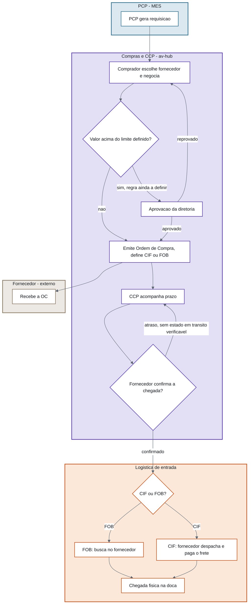
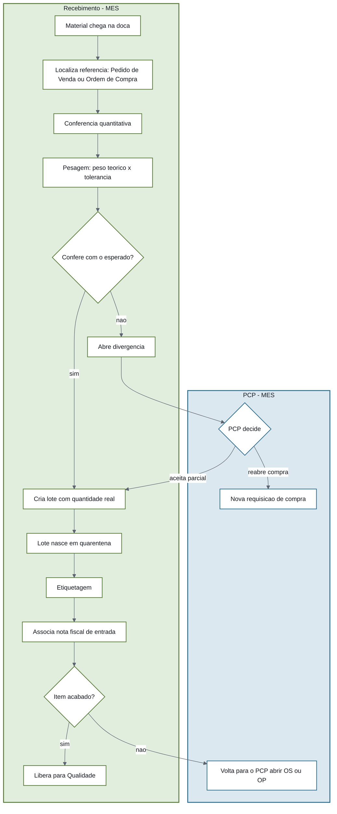
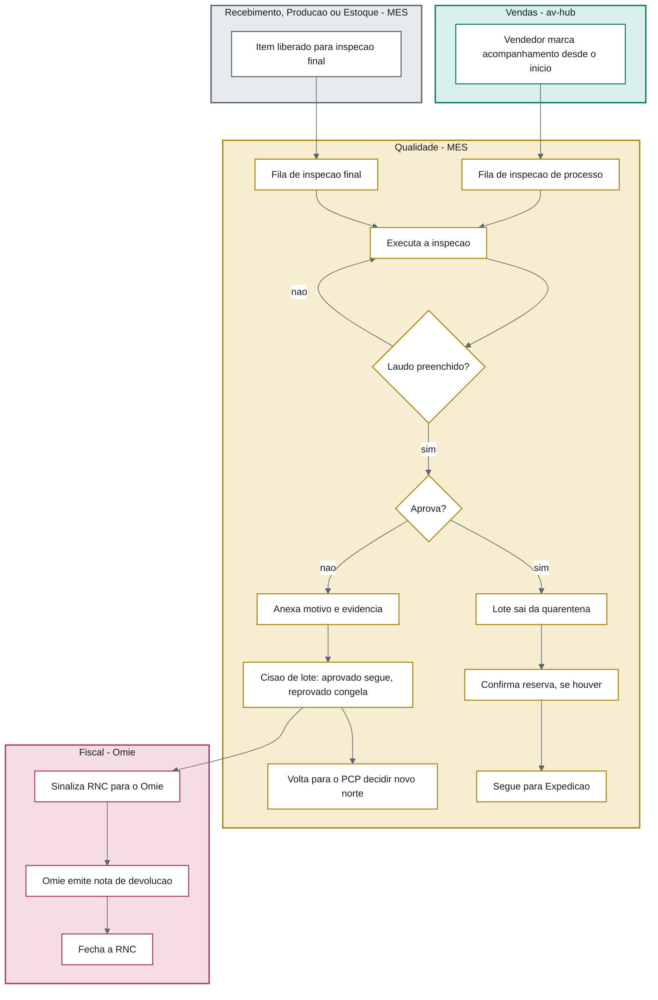
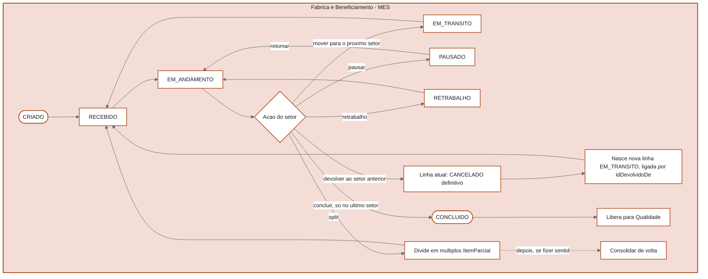
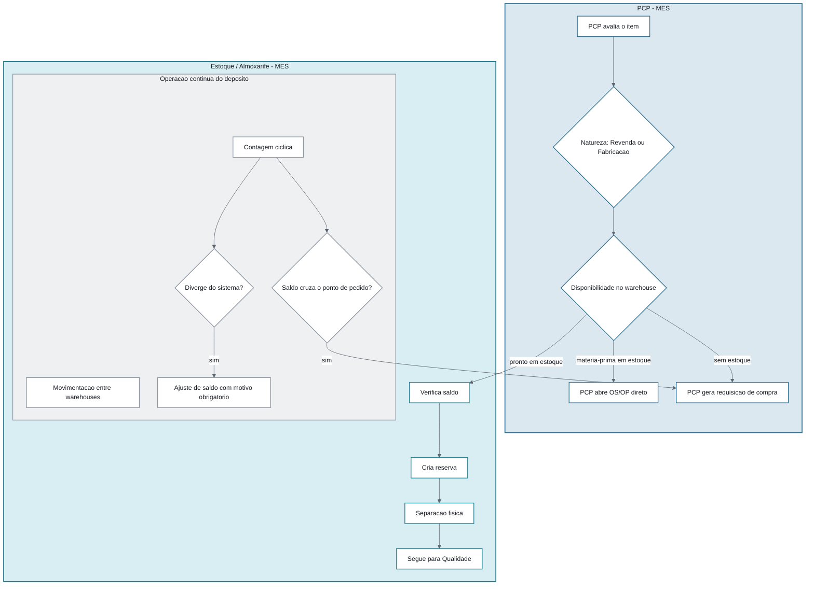

# Fluxogramas Completos — Todos os Setores, Todas as Possibilidades

> Visão em fluxograma (decisão/ramificação) de tudo que já foi modelado como sequência de conversas nos arquivos `Fluxo-*-Completo`. Aqui o foco é **quem decide o quê e pra onde o item vai** — os detalhes de payload/gatilho de cada interação continuam nos arquivos de conversa. Ver também a versão publicada como página única: [[Setores-Envolvidos-no-Fluxo]].
>
> 6 diagramas: 1 mestre (fim a fim, todos os setores) + 5 focados (Compras, Recebimento, Qualidade, Produção/OS-OP, Estoque). Cada raia (subgraph) tem uma cor própria por setor, consistente entre os 6 diagramas.
>
> ⚠️ **Correções (16/09):** o par correto de incoterm é **CIF × FOB**, não "coleta própria ou frete CIF" como estava antes (ver conversa C4 em [[Fluxo-Compras-Completo]]). E o ` ` usado nos rótulos dos nós não vira quebra de linha em todo renderizador mermaid — trocado por texto corrido, mais robusto entre Obsidian e Artifact.

## Legenda de cores por setor

| Setor | Cor |
|---|---|
| Vendas (av-hub) | 🟢 verde-azulado |
| PCP (MES) | 🔵 azul-aço |
| Compras + CCP (av-hub) | 🟣 índigo |
| Fornecedor (externo) | ⚪ cinza-quente |
| Logística de entrada | 🟠 âmbar |
| Recebimento (MES) | 🟢 verde-musgo |
| Fábrica/Beneficiamento (MES) | 🟤 terracota |
| Estoque/Almoxarife (MES) | 🔵 ciano |
| Qualidade (MES) | 🟡 ouro |
| Expedição + Logística de saída (MES) | 🟣 violeta |
| Fiscal (Omie, externo) | 🔴 rosa-queimado |

## 1. Fluxograma mestre — do pedido ao faturamento, todos os setores

```mermaid
%%{init: {'theme': 'base', 'themeVariables': {'primaryColor': '#ffffff', 'primaryTextColor': '#181c22', 'primaryBorderColor': '#33475a', 'lineColor': '#5c6570', 'fontFamily': 'Source Sans 3, sans-serif', 'fontSize': '14px', 'edgeLabelBackground': '#ffffff', 'textColor': '#181c22'}, 'flowchart': {'nodeSpacing': 45, 'rankSpacing': 60, 'padding': 14}}}%%
flowchart TD
    subgraph SEC_VENDAS[Vendas - av-hub]
        V1[Vendedor emite o pedido]
        V2{Qualidade acompanha desde o inicio?}
        V1 --> V2
    end

    subgraph SEC_PCP[PCP - MES]
        P1[PCP classifica o item]
        P2{Natureza do item}
        P3{Disponibilidade}
        P4[Gera requisicao de compra]
        P5[Abre OS ou OP]
        P6[Decide o novo norte]
        P1 --> P2
        P2 -->|Revenda| P3
        P2 -->|Fabricacao propria| P3
    end

    subgraph SEC_COMPRAS[Compras e CCP - av-hub]
        C1[Cotacao e negociacao]
        C2{Acima do valor limite?}
        C3[Aprovacao da diretoria]
        C4[Emite Ordem de Compra, define CIF ou FOB]
        C5[CCP: follow-up de prazo]
        C1 --> C2
        C2 -->|sim| C3 --> C4
        C2 -->|nao| C4
        C4 --> C5
    end

    subgraph SEC_FORN[Fornecedor - externo]
        FN1[Recebe a OC]
    end

    subgraph SEC_LOG[Logistica de entrada]
        L1{CIF ou FOB?}
        L2[FOB: coleta no fornecedor]
        L3[CIF: fornecedor entrega direto]
        L4[Chegada fisica na doca]
        L1 -->|FOB| L2 --> L4
        L1 -->|CIF| L3 --> L4
    end

    subgraph SEC_RECEB[Recebimento - MES]
        R1[Confere Pedido de Venda ou Ordem de Compra]
        R2[Pesagem]
        R3{Bate com o esperado?}
        R4[Cria lote em quarentena]
        R5{Item acabado?}
        R1 --> R2 --> R3
        R3 -->|nao| R6[Divergencia]
        R3 -->|sim| R4 --> R5
    end

    subgraph SEC_PROD[Fabrica e Beneficiamento - MES]
        F1[Abre ItemParcial]
        F2[Percorre o roteiro setor a setor]
        F3[Conclui no ultimo setor]
        F1 --> F2 --> F3
    end

    subgraph SEC_ESTOQUE[Estoque - MES]
        E1[Verifica saldo no warehouse]
        E2[Cria reserva]
        E3[Separacao fisica]
        E1 --> E2 --> E3
    end

    subgraph SEC_QUAL[Qualidade - MES]
        Q1[Inspecao]
        Q2{Aprova?}
        Q3[Abre RNC com evidencia]
        Q4[Cisao de lote]
        Q1 --> Q2
        Q2 -->|nao| Q3 --> Q4
    end

    subgraph SEC_EXP[Expedicao e Logistica de saida - MES]
        X1[Embalagem e paletizacao]
        X2{Parcial ou integral?}
        X3[Consolida a carga]
        X4[Define transporte]
        X1 --> X2
        X2 -->|integral| X3 --> X4
        X2 -->|parcial| X4
    end

    subgraph SEC_FISCAL[Fiscal - Omie]
        O1[Emite nota fiscal]
        O2[Baixa o item no pedido]
        O1 --> O2
    end

    V2 -->|sim| Q1
    V2 -->|nao| P1
    P3 -->|pronto em estoque| E1
    P3 -->|materia-prima em estoque| P5
    P3 -->|sem estoque| P4
    P4 --> C1
    C5 --> FN1
    FN1 --> L1
    L4 --> R1
    R6 --> P6
    P6 -->|reabre compra| P4
    R5 -->|sim| Q1
    R5 -->|nao| P5
    P5 --> F1
    F3 --> Q1
    E3 --> Q1
    Q2 -->|sim| X1
    Q3 --> Q4
    Q4 --> P6
    P6 -->|retrabalho ou nova OS/OP| F1
    X4 --> O1

    style SEC_VENDAS fill:#d9f0ec,stroke:#0f7a6b,stroke-width:2px,color:#181c22
    style SEC_PCP fill:#dce8ef,stroke:#2f6f8f,stroke-width:2px,color:#181c22
    style SEC_COMPRAS fill:#e3e0f5,stroke:#5b3fae,stroke-width:2px,color:#181c22
    style SEC_FORN fill:#ece8e3,stroke:#8a7a63,stroke-width:2px,color:#181c22
    style SEC_LOG fill:#fbe8d9,stroke:#c9541a,stroke-width:2px,color:#181c22
    style SEC_RECEB fill:#e1eede,stroke:#5a7d3a,stroke-width:2px,color:#181c22
    style SEC_PROD fill:#f3ddd6,stroke:#a8420f,stroke-width:2px,color:#181c22
    style SEC_ESTOQUE fill:#d9eef2,stroke:#1f7a8c,stroke-width:2px,color:#181c22
    style SEC_QUAL fill:#f7edd0,stroke:#a8860f,stroke-width:2px,color:#181c22
    style SEC_EXP fill:#ece0f0,stroke:#7a3f9e,stroke-width:2px,color:#181c22
    style SEC_FISCAL fill:#f6dde4,stroke:#a83f5c,stroke-width:2px,color:#181c22

    style V1 fill:#ffffff,stroke:#0f7a6b,stroke-width:1.5px,color:#181c22
    style V2 fill:#ffffff,stroke:#0f7a6b,stroke-width:1.5px,color:#181c22
    style P1 fill:#ffffff,stroke:#2f6f8f,stroke-width:1.5px,color:#181c22
    style P2 fill:#ffffff,stroke:#2f6f8f,stroke-width:1.5px,color:#181c22
    style P3 fill:#ffffff,stroke:#2f6f8f,stroke-width:1.5px,color:#181c22
    style P4 fill:#ffffff,stroke:#2f6f8f,stroke-width:1.5px,color:#181c22
    style P5 fill:#ffffff,stroke:#2f6f8f,stroke-width:1.5px,color:#181c22
    style P6 fill:#ffffff,stroke:#2f6f8f,stroke-width:1.5px,color:#181c22
    style C1 fill:#ffffff,stroke:#5b3fae,stroke-width:1.5px,color:#181c22
    style C2 fill:#ffffff,stroke:#5b3fae,stroke-width:1.5px,color:#181c22
    style C3 fill:#ffffff,stroke:#5b3fae,stroke-width:1.5px,color:#181c22
    style C4 fill:#ffffff,stroke:#5b3fae,stroke-width:1.5px,color:#181c22
    style C5 fill:#ffffff,stroke:#5b3fae,stroke-width:1.5px,color:#181c22
    style FN1 fill:#ffffff,stroke:#8a7a63,stroke-width:1.5px,color:#181c22
    style L1 fill:#ffffff,stroke:#c9541a,stroke-width:1.5px,color:#181c22
    style L2 fill:#ffffff,stroke:#c9541a,stroke-width:1.5px,color:#181c22
    style L3 fill:#ffffff,stroke:#c9541a,stroke-width:1.5px,color:#181c22
    style L4 fill:#ffffff,stroke:#c9541a,stroke-width:1.5px,color:#181c22
    style R1 fill:#ffffff,stroke:#5a7d3a,stroke-width:1.5px,color:#181c22
    style R2 fill:#ffffff,stroke:#5a7d3a,stroke-width:1.5px,color:#181c22
    style R3 fill:#ffffff,stroke:#5a7d3a,stroke-width:1.5px,color:#181c22
    style R4 fill:#ffffff,stroke:#5a7d3a,stroke-width:1.5px,color:#181c22
    style R5 fill:#ffffff,stroke:#5a7d3a,stroke-width:1.5px,color:#181c22
    style R6 fill:#ffffff,stroke:#5a7d3a,stroke-width:1.5px,color:#181c22
    style F1 fill:#ffffff,stroke:#a8420f,stroke-width:1.5px,color:#181c22
    style F2 fill:#ffffff,stroke:#a8420f,stroke-width:1.5px,color:#181c22
    style F3 fill:#ffffff,stroke:#a8420f,stroke-width:1.5px,color:#181c22
    style E1 fill:#ffffff,stroke:#1f7a8c,stroke-width:1.5px,color:#181c22
    style E2 fill:#ffffff,stroke:#1f7a8c,stroke-width:1.5px,color:#181c22
    style E3 fill:#ffffff,stroke:#1f7a8c,stroke-width:1.5px,color:#181c22
    style Q1 fill:#ffffff,stroke:#a8860f,stroke-width:1.5px,color:#181c22
    style Q2 fill:#ffffff,stroke:#a8860f,stroke-width:1.5px,color:#181c22
    style Q3 fill:#ffffff,stroke:#a8860f,stroke-width:1.5px,color:#181c22
    style Q4 fill:#ffffff,stroke:#a8860f,stroke-width:1.5px,color:#181c22
    style X1 fill:#ffffff,stroke:#7a3f9e,stroke-width:1.5px,color:#181c22
    style X2 fill:#ffffff,stroke:#7a3f9e,stroke-width:1.5px,color:#181c22
    style X3 fill:#ffffff,stroke:#7a3f9e,stroke-width:1.5px,color:#181c22
    style X4 fill:#ffffff,stroke:#7a3f9e,stroke-width:1.5px,color:#181c22
    style O1 fill:#ffffff,stroke:#a83f5c,stroke-width:1.5px,color:#181c22
    style O2 fill:#ffffff,stroke:#a83f5c,stroke-width:1.5px,color:#181c22
```

## 2. Compras — cotação até a doca

**Setores:** PCP (MES) · Compras e CCP (av-hub) · Fornecedor (externo) · Logística de entrada

## 3. Recebimento — conferência e roteamento

**Setores:** Recebimento (MES) · PCP (MES)

## 4. Qualidade — das duas filas até aprovação/reprovação

**Setores:** Vendas (av-hub) · origem interna (MES) · Qualidade (MES) · Fiscal (Omie)

## 5. Produção — OS/OP como máquina de estados (`ItemParcial`)

**Setor:** Fábrica e Beneficiamento (MES) — único subfluxo já implementado em produção, não apenas desenhado.

## 6. Estoque — matriz de destinação + operação contínua

**Setores:** PCP (MES) · Estoque/Almoxarife (MES)

## Ver também
- [[Setores-Envolvidos-no-Fluxo]]
- [[Modelo-Destinacao-Item]]
- [[Fluxo-Detalhado-Pedido-Item]]
- [[Fluxo-Compras-Completo]], [[Fluxo-Recebimento-Completo]], [[Fluxo-Qualidade-Completo]], [[Fluxo-Producao-OS-OP-Completo]], [[Fluxo-Expedicao-Faturamento-Completo]], [[Fluxo-Estoque-Completo]] — a versão conversa-por-conversa de cada um destes fluxogramas.
