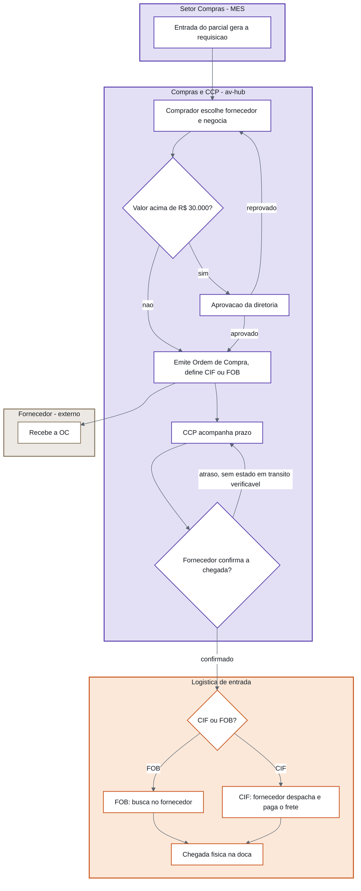
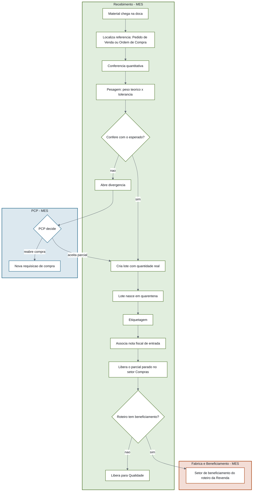
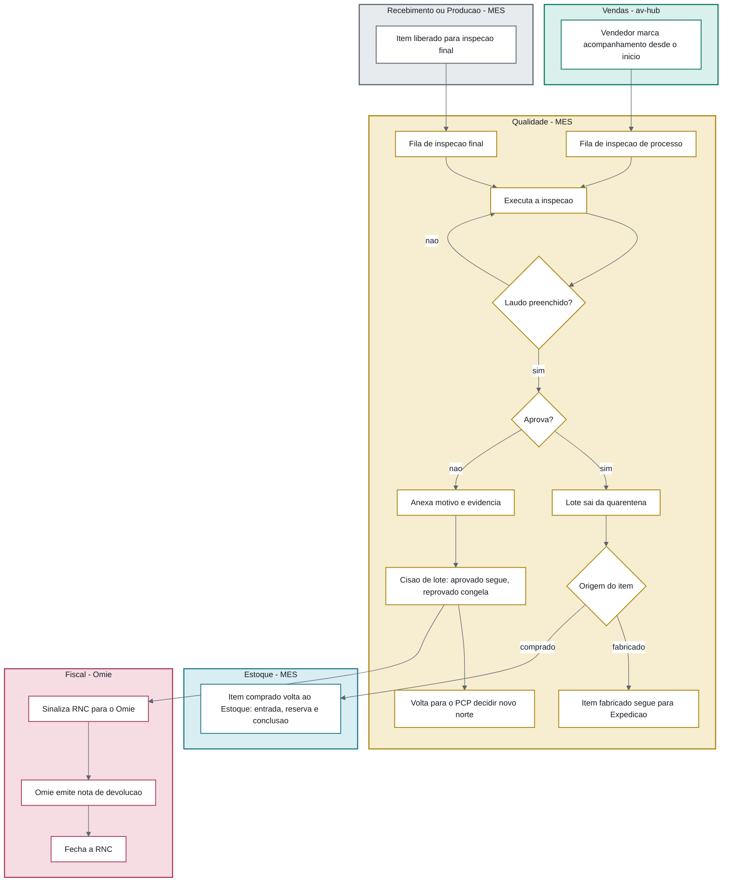
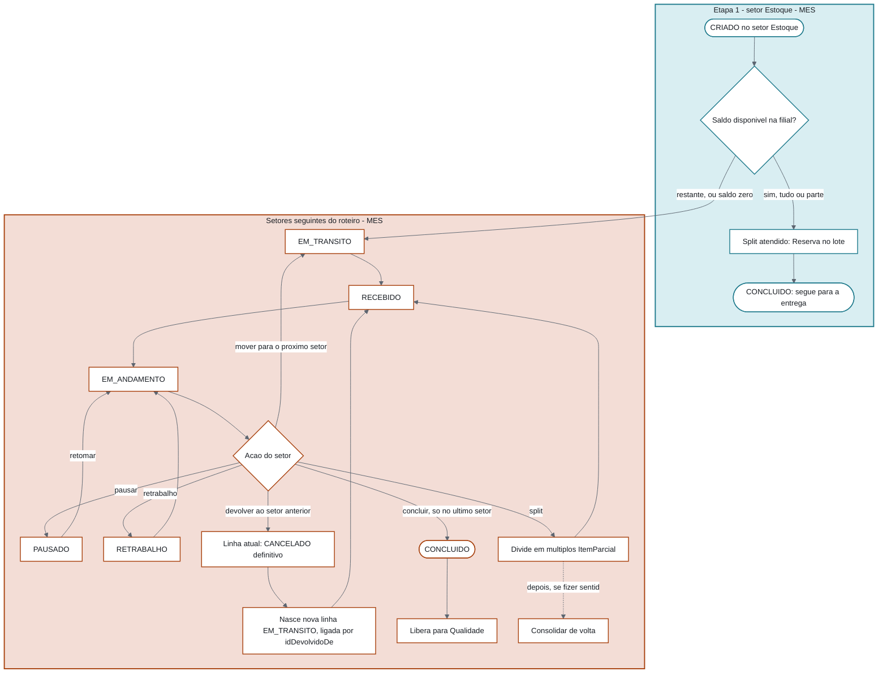
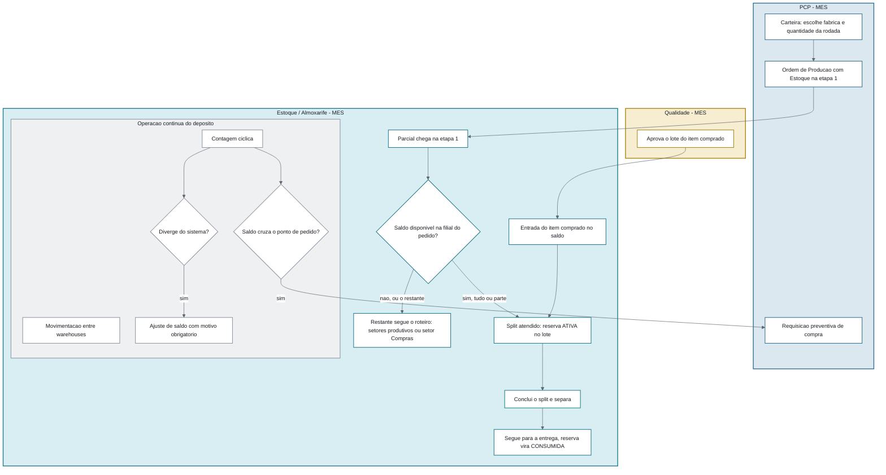

# Fluxogramas Completos — Todos os Setores, Todas as Possibilidades

> Visão em fluxograma (decisão/ramificação) de tudo que já foi modelado como sequência de conversas nos arquivos `Fluxo-*-Completo`. Aqui o foco é **quem decide o quê e pra onde o item vai** — os detalhes de payload/gatilho de cada interação continuam nos arquivos de conversa. Ver também a versão publicada como página única: [[Setores-Envolvidos-no-Fluxo]].
>
> 6 diagramas: 1 mestre (fim a fim, todos os setores) + 5 focados (Compras, Recebimento, Qualidade, Produção/OS-OP, Estoque). Cada raia (subgraph) tem uma cor própria por setor, consistente entre os 6 diagramas.
>
> O par correto de incoterm é **CIF × FOB** (ver [[Fluxo-Compras-Completo]]). Os rótulos dos nós usam texto corrido em vez de ` `, mais robusto entre Obsidian e Artifact.
>
> **Escopo obrigatório do sistema (confirmado com o usuário, 17/09/2026): o sistema a construir deve implementar TODOS os passos de TODOS os 6 fluxogramas abaixo, sem exceção** — não é um subconjunto ilustrativo nem um "nice to have" além do essencial. Só a primeira caixa do fluxograma mestre (`V1 — Vendedor emite o pedido`, no Omie, sincronizado pro av-hub) é real hoje; cada nó/decisão a partir daí, em qualquer um dos 6 diagramas, é trabalho a fazer. As legendas "MES" nas cores por setor abaixo indicam **onde a funcionalidade vai morar quando construída**, não um sistema já em produção — ver ressalva igual em [[Setores-Envolvidos-no-Fluxo]].
>
> **Redesenhado em 24/09/2026 com o encaixe do Estoque e da Revenda no MES** ([[Encaixe-Estoque-Revenda-no-PCP]]). O que mudou nos diagramas 1, 3, 4, 5 e 6: o PCP escolhe a **fábrica** na Carteira (a Revenda é uma fábrica) e gera a Ordem de Produção; o **Estoque é a etapa 1 de todo roteiro** (atende do saldo com split + reserva, envia o restante); a requisição nasce no **setor Compras** do roteiro da Revenda; o beneficiamento é um setor do próprio roteiro; e o **item comprado aprovado na Qualidade volta ao Estoque** (entrada + reserva) em vez de ir direto para a Expedição. O diagrama 2 (Compras) não mudou, só a origem da requisição.

## Legenda de cores por setor

| Setor | Cor |
|---|---|
| Vendas (av-hub) | 🟢 verde-azulado |
| PCP (MES) | 🔵 azul-aço |
| Setor Compras (MES) e Compras + CCP (av-hub) | 🟣 índigo |
| Fornecedor (externo) | ⚪ cinza-quente |
| Logística de entrada | 🟠 âmbar |
| Recebimento (MES) | 🟢 verde-musgo |
| Fábrica/Beneficiamento (MES) | 🟤 terracota |
| Estoque/Almoxarife (MES) | 🔵 ciano |
| Qualidade (MES) | 🟡 ouro |
| Expedição + Logística de saída (MES) | 🟣 violeta |
| Fiscal (Omie, externo) | 🔴 rosa-queimado |

## 1. Fluxograma mestre — do pedido ao faturamento, todos os setores

```mermaid
%%{init: {'theme': 'base', 'themeVariables': {'primaryColor': '#ffffff', 'primaryTextColor': '#181c22', 'primaryBorderColor': '#33475a', 'lineColor': '#5c6570', 'fontFamily': 'Source Sans 3, sans-serif', 'fontSize': '14px', 'edgeLabelBackground': '#ffffff', 'textColor': '#181c22'}, 'flowchart': {'nodeSpacing': 45, 'rankSpacing': 60, 'padding': 14}}}%%
flowchart TD
    subgraph SEC_VENDAS[Vendas - av-hub]
        V1[Vendedor emite o pedido]
        V2{Qualidade acompanha desde o inicio?}
        V1 --> V2
    end

    subgraph SEC_PCP[PCP - MES]
        P1[Carteira: escolhe itens, quantidades e fabrica da rodada]
        P2[Ordem de Producao: uma OP por fabrica, Estoque como etapa 1]
        P6[Decide o novo norte]
        P1 --> P2
    end

    subgraph SEC_ESTOQUE[Estoque - MES]
        E1[Saldo disponivel na filial do pedido]
        E2{Saldo cobre o item?}
        E3[Split atendido: reserva no lote e conclui]
        E4{Tipo da fabrica}
        E5[Entrada do item comprado no saldo]
        E1 --> E2
        E2 -->|sim, tudo ou parte| E3
        E2 -->|nao, ou o restante| E4
        E5 --> E3
    end

    subgraph SEC_SCOMP[Setor Compras - MES]
        K1[Parcial aguarda: requisicao enviada ao av-hub]
    end

    subgraph SEC_COMPRAS[Compras e CCP - av-hub]
        C1[Cotacao e negociacao]
        C2{Acima do valor limite?}
        C3[Aprovacao da diretoria]
        C4[Emite Ordem de Compra, define CIF ou FOB]
        C5[CCP: follow-up de prazo]
        C1 --> C2
        C2 -->|sim| C3 --> C4
        C2 -->|nao| C4
        C4 --> C5
    end

    subgraph SEC_FORN[Fornecedor - externo]
        FN1[Recebe a OC]
    end

    subgraph SEC_LOG[Logistica de entrada]
        L1{CIF ou FOB?}
        L2[FOB: coleta no fornecedor]
        L3[CIF: fornecedor entrega direto]
        L4[Chegada fisica na doca]
        L1 -->|FOB| L2 --> L4
        L1 -->|CIF| L3 --> L4
    end

    subgraph SEC_RECEB[Recebimento - MES]
        R1[Confere Pedido de Venda ou Ordem de Compra]
        R2[Pesagem]
        R3{Bate com o esperado?}
        R4[Cria lote em quarentena]
        R5{Roteiro tem beneficiamento?}
        R1 --> R2 --> R3
        R3 -->|nao| R6[Divergencia]
        R3 -->|sim| R4 --> R5
    end

    subgraph SEC_PROD[Fabrica e Beneficiamento - MES]
        F1[Percorre os setores produtivos do roteiro]
        F2[Conclui a etapa produtiva]
        F1 --> F2
    end

    subgraph SEC_QUAL[Qualidade - MES]
        Q1[Inspecao]
        Q2{Aprova?}
        Q3[Abre RNC com evidencia]
        Q4[Cisao de lote]
        Q5{Origem do item}
        Q1 --> Q2
        Q2 -->|nao| Q3 --> Q4
        Q2 -->|sim| Q5
    end

    subgraph SEC_EXP[Expedicao e Logistica de saida - MES]
        X1[Embalagem e paletizacao]
        X2{Parcial ou integral?}
        X3[Consolida a carga]
        X4[Define transporte]
        X1 --> X2
        X2 -->|integral| X3 --> X4
        X2 -->|parcial| X4
    end

    subgraph SEC_FISCAL[Fiscal - Omie]
        O1[Emite nota fiscal]
        O2[Baixa o item no pedido]
        O1 --> O2
    end

    V2 -->|sim, com acompanhamento da qualidade| P1
    V2 -->|nao| P1
    P2 --> E1
    E4 -->|Fabricacao| F1
    E4 -->|Revenda| K1
    K1 --> C1
    C5 --> FN1
    FN1 --> L1
    L4 --> R1
    R6 --> P6
    P6 -->|reabre compra| K1
    R5 -->|sim| F1
    R5 -->|nao| Q1
    F2 --> Q1
    Q5 -->|comprado: volta ao Estoque| E5
    Q5 -->|fabricado| X1
    E3 --> X1
    Q4 --> P6
    P6 -->|retrabalho| F1
    X4 --> O1

    style SEC_VENDAS fill:#d9f0ec,stroke:#0f7a6b,stroke-width:2px,color:#181c22
    style SEC_PCP fill:#dce8ef,stroke:#2f6f8f,stroke-width:2px,color:#181c22
    style SEC_SCOMP fill:#e3e0f5,stroke:#5b3fae,stroke-width:2px,color:#181c22
    style SEC_COMPRAS fill:#e3e0f5,stroke:#5b3fae,stroke-width:2px,color:#181c22
    style SEC_FORN fill:#ece8e3,stroke:#8a7a63,stroke-width:2px,color:#181c22
    style SEC_LOG fill:#fbe8d9,stroke:#c9541a,stroke-width:2px,color:#181c22
    style SEC_RECEB fill:#e1eede,stroke:#5a7d3a,stroke-width:2px,color:#181c22
    style SEC_PROD fill:#f3ddd6,stroke:#a8420f,stroke-width:2px,color:#181c22
    style SEC_ESTOQUE fill:#d9eef2,stroke:#1f7a8c,stroke-width:2px,color:#181c22
    style SEC_QUAL fill:#f7edd0,stroke:#a8860f,stroke-width:2px,color:#181c22
    style SEC_EXP fill:#ece0f0,stroke:#7a3f9e,stroke-width:2px,color:#181c22
    style SEC_FISCAL fill:#f6dde4,stroke:#a83f5c,stroke-width:2px,color:#181c22

    style V1 fill:#ffffff,stroke:#0f7a6b,stroke-width:1.5px,color:#181c22
    style V2 fill:#ffffff,stroke:#0f7a6b,stroke-width:1.5px,color:#181c22
    style P1 fill:#ffffff,stroke:#2f6f8f,stroke-width:1.5px,color:#181c22
    style P2 fill:#ffffff,stroke:#2f6f8f,stroke-width:1.5px,color:#181c22
    style P6 fill:#ffffff,stroke:#2f6f8f,stroke-width:1.5px,color:#181c22
    style E1 fill:#ffffff,stroke:#1f7a8c,stroke-width:1.5px,color:#181c22
    style E2 fill:#ffffff,stroke:#1f7a8c,stroke-width:1.5px,color:#181c22
    style E3 fill:#ffffff,stroke:#1f7a8c,stroke-width:1.5px,color:#181c22
    style E4 fill:#ffffff,stroke:#1f7a8c,stroke-width:1.5px,color:#181c22
    style E5 fill:#ffffff,stroke:#1f7a8c,stroke-width:1.5px,color:#181c22
    style K1 fill:#ffffff,stroke:#5b3fae,stroke-width:1.5px,color:#181c22
    style C1 fill:#ffffff,stroke:#5b3fae,stroke-width:1.5px,color:#181c22
    style C2 fill:#ffffff,stroke:#5b3fae,stroke-width:1.5px,color:#181c22
    style C3 fill:#ffffff,stroke:#5b3fae,stroke-width:1.5px,color:#181c22
    style C4 fill:#ffffff,stroke:#5b3fae,stroke-width:1.5px,color:#181c22
    style C5 fill:#ffffff,stroke:#5b3fae,stroke-width:1.5px,color:#181c22
    style FN1 fill:#ffffff,stroke:#8a7a63,stroke-width:1.5px,color:#181c22
    style L1 fill:#ffffff,stroke:#c9541a,stroke-width:1.5px,color:#181c22
    style L2 fill:#ffffff,stroke:#c9541a,stroke-width:1.5px,color:#181c22
    style L3 fill:#ffffff,stroke:#c9541a,stroke-width:1.5px,color:#181c22
    style L4 fill:#ffffff,stroke:#c9541a,stroke-width:1.5px,color:#181c22
    style R1 fill:#ffffff,stroke:#5a7d3a,stroke-width:1.5px,color:#181c22
    style R2 fill:#ffffff,stroke:#5a7d3a,stroke-width:1.5px,color:#181c22
    style R3 fill:#ffffff,stroke:#5a7d3a,stroke-width:1.5px,color:#181c22
    style R4 fill:#ffffff,stroke:#5a7d3a,stroke-width:1.5px,color:#181c22
    style R5 fill:#ffffff,stroke:#5a7d3a,stroke-width:1.5px,color:#181c22
    style R6 fill:#ffffff,stroke:#5a7d3a,stroke-width:1.5px,color:#181c22
    style F1 fill:#ffffff,stroke:#a8420f,stroke-width:1.5px,color:#181c22
    style F2 fill:#ffffff,stroke:#a8420f,stroke-width:1.5px,color:#181c22
    style Q1 fill:#ffffff,stroke:#a8860f,stroke-width:1.5px,color:#181c22
    style Q2 fill:#ffffff,stroke:#a8860f,stroke-width:1.5px,color:#181c22
    style Q3 fill:#ffffff,stroke:#a8860f,stroke-width:1.5px,color:#181c22
    style Q4 fill:#ffffff,stroke:#a8860f,stroke-width:1.5px,color:#181c22
    style Q5 fill:#ffffff,stroke:#a8860f,stroke-width:1.5px,color:#181c22
    style X1 fill:#ffffff,stroke:#7a3f9e,stroke-width:1.5px,color:#181c22
    style X2 fill:#ffffff,stroke:#7a3f9e,stroke-width:1.5px,color:#181c22
    style X3 fill:#ffffff,stroke:#7a3f9e,stroke-width:1.5px,color:#181c22
    style X4 fill:#ffffff,stroke:#7a3f9e,stroke-width:1.5px,color:#181c22
    style O1 fill:#ffffff,stroke:#a83f5c,stroke-width:1.5px,color:#181c22
    style O2 fill:#ffffff,stroke:#a83f5c,stroke-width:1.5px,color:#181c22
```

## 2. Compras — cotação até a doca

**Setores:** Setor Compras (MES) · Compras e CCP (av-hub) · Fornecedor (externo) · Logística de entrada

> Desde 24/09/2026 a requisição (nó A) nasce da **entrada do parcial no setor Compras** do roteiro da fábrica Revenda, não de uma ação manual do PCP. O parcial fica parado ali até o recebimento.

## 3. Recebimento — conferência e roteamento

**Setores:** Recebimento (MES) · Fábrica e Beneficiamento (MES) · PCP (MES)

## 4. Qualidade — das duas filas até aprovação/reprovação

**Setores:** Vendas (av-hub) · origem interna (MES) · Qualidade (MES) · Estoque (MES) · Fiscal (Omie)

## 5. Produção — OS/OP como máquina de estados (`ItemParcial`)

**Setores:** Estoque (etapa 1) e Fábrica e Beneficiamento (MES) — único subfluxo já implementado em produção, não apenas desenhado. A etapa 1 no setor Estoque é o que entra com o encaixe de 24/09/2026.

## 6. Estoque — setor da etapa 1, entrada do comprado e operação contínua

**Setores:** PCP (MES) · Qualidade (MES) · Estoque/Almoxarife (MES)

## Ver também
- [[Encaixe-Estoque-Revenda-no-PCP]] — o encaixe que redesenhou estes fluxogramas em 24/09/2026.
- [[Setores-Envolvidos-no-Fluxo]]
- [[Modelo-Destinacao-Item]]
- [[Fluxo-Detalhado-Pedido-Item]]
- [[Fluxo-Compras-Completo]], [[Fluxo-Recebimento-Completo]], [[Fluxo-Qualidade-Completo]], [[Fluxo-Producao-OS-OP-Completo]], [[Fluxo-Expedicao-Faturamento-Completo]], [[Fluxo-Estoque-Completo]] — a versão conversa-por-conversa de cada um destes fluxogramas.
