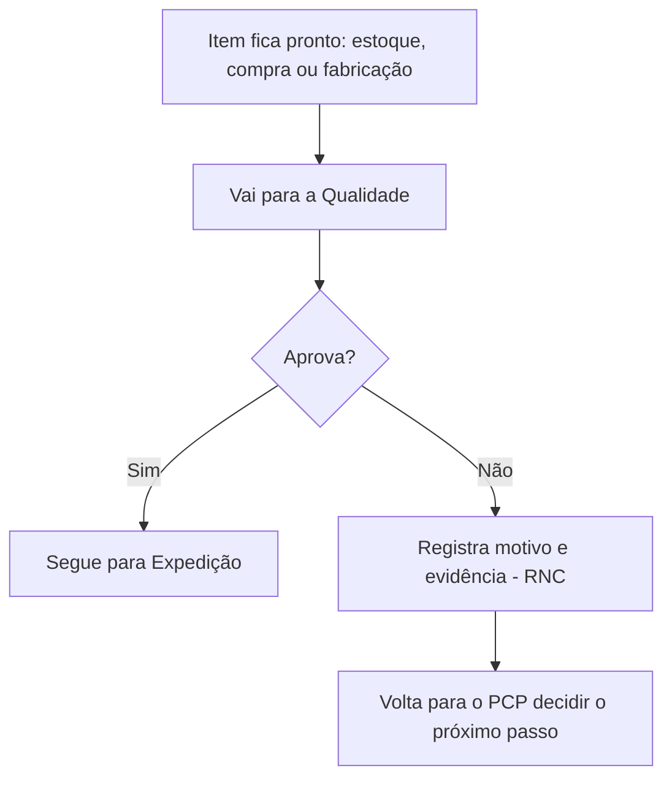

# Qualidade e Conferência

Nenhum item chega até o cliente sem passar antes por uma conferência da Qualidade. Esse é o ponto de checagem final (e, às vezes, também inicial) de todo o processo, seja o item vindo do estoque, de uma compra ou de uma fabricação própria.

## Duas situações em que a Qualidade entra

1. **Acompanhamento desde o início.** No momento em que emite o pedido, o vendedor pode marcar se quer que a Qualidade acompanhe aquele item desde o começo — por exemplo, para validar uma documentação ou conferir uma entrada de material logo na chegada. Se ele não marcar nada, a Qualidade só entra no fim, o que evita acionar o setor sem necessidade.
2. **Inspeção final.** Todo item, quando fica pronto — seja porque saiu do estoque, foi comprado e chegou, ou foi fabricado — passa por uma inspeção final antes de seguir para a Expedição.

## O que é a "quarentena"

Quando um material chega de um fornecedor, ele não vai direto para o estoque disponível. Ele fica guardado numa área separada, chamada de **quarentena**, até a Qualidade confirmar que está tudo certo. Só depois de aprovado é que o material sai da quarentena e entra oficialmente no estoque liberado para uso.

## O que acontece na inspeção

A Qualidade confere o item e decide: aprova ou reprova.

- **Se aprovado**, o item sai da quarentena (quando aplicável) e segue para a Expedição.
- **Se reprovado**, a Qualidade registra o motivo e anexa uma evidência (por exemplo, uma foto do problema encontrado). Isso vira o que a empresa chama de **RNC — Relatório de Não Conformidade**.

## O que acontece quando um item é reprovado

Um item reprovado nunca fica parado sem destino. Ele sempre volta para o PCP, que decide o próximo passo: pode ser comprar de novo, mandar o item para retrabalho, ou outra solução, dependendo do caso. Veja [[Organizacao-do-Pedido-PCP]].

## Fluxo simplificado

## Ver também
- [[Organizacao-do-Pedido-PCP]]
- [[Controlando-o-Estoque]]
- [[Comprando-o-que-Falta]]
- [[Fabricando-Produtos-Proprios]]
- [[Faturamento-e-Entrega]]
- [[Quem-Faz-o-Que]]
- [[Glossario]]
