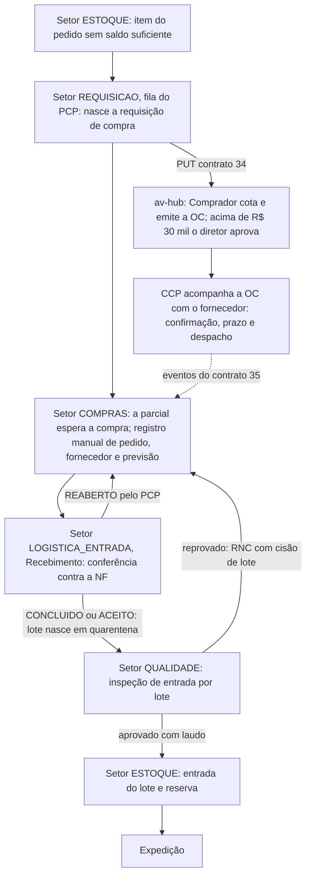

# Fluxo de Compras — do 0 ao 100%, conversa por conversa

> Status: decidido | no código (develop) | em produção (mes-test; produção real não)

> **Atualização de 07/10/2026 — o lado MES do circuito de compra já tem código em `develop`** (conferido no código, `api-pcp` `ca3346b`; **só em `develop`, a `main` parou em 28/08; produção não conferida**). O que existe: (1) **requisição de compra** (C1/C7 do cronograma): `RequisicaoCompra`/`RequisicaoCompraItem`, setor `REQUISICAO`, `ComprasService.requisitar` (`b8dc158`, 29/09), com cancelamento pelo MES (`POST /compras/requisicoes/:id/cancelar`) e envio ao av-hub (`e7ce2c9`, 02/10); (2) o **circuito fora do roteiro** (`circuito-compra.ts`; a migration `...140100` tirou `requisicoes-compra` e `compras` de `fabrica_setores`); (3) o **contrato 34** (PUT `/compras/requisicoes/origem/{id_origem}`) **implementado no MES** e o **contrato 35** (GET `/compras/requisicoes/eventos`) **implementado e ligado** (`41bf4a6`, 05/10) — o MES **só reage** a `requisicao_cancelada` e `requisicao_reaberta`; `oc_aprovada`, `oc_no_omie` e `despachada` só são gravados e mostrados na timeline de andamento (`EventosRequisicaoModal`) e nas métricas (`GET /relatorios/compras`), **sem** preencher pedido de compra/previsão nem avançar a parcial; (4) o **registro manual** da compra: `PATCH /compras/requisicoes/:id/compra` (nº do pedido, fornecedor, previsão) move a parcial para o Recebimento. **Não existe:** o contrato 004 (`/ordens-compra/referencia`) — nem no MES nem no hub — e, portanto, nenhum poll de OC. Se as chaves de integração estão definidas no ambiente real: **não verificado**. O recebimento está em [[Fluxo-Recebimento-Completo]] e [[App-PCP-Recebimento-Conferencia]]; os contratos em [[Indice-Contratos]]; o estado das tarefas em [[Onde-Estamos]] e [[Cronograma-2-Meses]].
>
> Detalha a etapa "não tem em estoque → gera requisição de compra" da célula correspondente em [[Modelo-Destinacao-Item]], seguindo a divisão já decidida em [[MES-Arquitetura-Decisoes]] (decisão 5): **PCP (MES) decide que precisa comprar, Compras (av-hub) decide como comprar, MES executa o recebimento**.
>
> Cada "conversa" abaixo é uma interação entre atores/sistemas — quem fala, o que trafega, e o gatilho que a dispara. Numeradas em ordem de acontecimento no caminho feliz, com os desvios (divergência, reprovação) marcados como ramificações, nunca becos sem saída — ver [[Estoque-Riscos]].
>
> ~~**Confirmado com o usuário (17/09/2026): nada deste fluxo existe em sistema hoje**~~ — **superado em parte em 07/10/2026**: o lado MES (requisição, cancelamento, envio ao av-hub, eventos, recebimento) tem código em `develop`, ver bloco acima. O lado av-hub (cotação, OC, aprovação, CCP) segue conforme as notas dele, não conferido aqui.
>
> **Atualizado em 24/09/2026 com o encaixe do MES** ([[Encaixe-Estoque-Revenda-no-PCP]]): ~~a requisição (C1) passa a nascer da **entrada do parcial no setor Compras** do roteiro da fábrica Revenda, vinculada ao `ItemParcial`~~ **(superado pela decisão de 28/09: a requisição NÃO nasce ao entrar em Compras; nasce no setor `REQUISICAO`, antes de Compras)**; o beneficiamento é um setor do próprio roteiro (C10 não volta mais ao PCP); e o item **aprovado na Qualidade volta ao setor Estoque** (C19).
>
> **Atualizado em 28/09/2026 (Robert) — a C19 abaixo ficou incompleta, e o C1 ganhou uma etapa nova.** Duas mudanças, detalhadas em [[Encaixe-Estoque-Revenda-no-PCP]] seções 3.4/5/6:
> 1. **C19 não termina no Estoque — o item segue para a Expedição** (novo setor tipo `EXPEDICAO`: Embalagem → Logística). O Estoque dá entrada + reserva `ATIVA`, mas a baixa real (reserva `CONSUMIDA`, saída do lote) só acontece quando a **Embalagem recebe** o item. Ver C19 revisada abaixo.
> 2. **A requisição (C1) passa por um novo setor "Requisições de compras" (PCP), antes de Compras** — ainda não implementado. É lá que a matéria-prima fica amarrada ao item/parcial que a originou. Vale tanto para revenda quanto para matéria-prima de fabricação.
> 3. **Recebimento parcial (C9) é permitido, com split**: o que chegou avança para a Qualidade, o restante continua aguardando em Compras. Sobra de compra (lote mínimo do fornecedor) fica livre no estoque, registrando de qual requisição veio.
>
> **⚠️ Atualizado de novo em 28/09/2026 à tarde, CONFIRMADO em 29/09/2026 (Nathan, EC-05/EC-08) — ver [[Encaixe-Estoque-Revenda-no-PCP]] callout da tarde de 28/09 e seção 5.** Robert propôs revisar este fluxo de novo, antes mesmo do item 2 acima virar código, e o Nathan confirmou a direção: o recebimento passa a acontecer na **Logística de Entrada** (não em Compras); a requisição/compra vira um **circuito fixo do sistema disparado pelo próprio Estoque**, fora do roteiro do PCP; e a baixa de saldo passa a ocorrer no **despacho do Estoque**, não mais no recebimento da Embalagem. As conversas C1-C19 abaixo ainda descrevem o desenho de 24-25/09 (~~que é o que está em produção~~ *atualizado em 07/10: não conferido em produção; o que o código de `develop` tem é a mistura abaixo*); não reescrevi C1-C19 porque a arquitetura confirmada de 28-29/09 ~~ainda não tem nenhum código~~ *(atualizado em 07/10: tem código parcial — circuito fora do roteiro, setores `REQUISICAO`, `LOGISTICA_ENTRADA` e `QUALIDADE`, "Solicitar compra" a partir do Estoque, inspeção de entrada por lote, reprovação total/parcial; **ainda sem** a baixa no despacho do Estoque, a ação de consumo de matéria-prima e o `RoteiroItem`, ver [[Encaixe-Estoque-Revenda-no-PCP]])*.

## Atores e sistemas

| Ator | Onde vive |
|---|---|
| **PCP** | MES — monta a OP da fábrica Revenda na tela Ordem de Produção; decide o novo norte |
| **Setor Requisição** (`REQUISICAO`) | MES — fila "Requisições de compras" do PCP; **é aqui que a requisição nasce** (decisão de 28/09) |
| **Setor Compras** (tipo `COMPRAS`) | MES — o parcial espera ali até o recebimento ~~(a entrada do parcial gera a requisição)~~ *(superado em 28/09; o circuito de compra ficou fora do roteiro)* |
| **Setor Estoque** (tipo `ESTOQUE`) | MES — recebe de volta o item aprovado (entrada + reserva) |
| **Comprador** | av-hub |
| **CCP** | av-hub (junto de Compras) — follow-up ativo de prazo/trânsito, distinto do Comprador que já fechou a compra |
| **Aprovador** (segunda aprovação, condicional) | av-hub |
| **Fornecedor** | externo, sem acesso ao sistema |
| **Logística de entrada** | MES ou terceirizada — entra em ação só no frete FOB (coleta no fornecedor); no frete CIF é o próprio fornecedor quem entrega |
| **Recebimento** | MES |
| **Qualidade** | MES |
| **Fábrica/Beneficiamento** (execução da OS/OP) | MES |
| **Vendedor** | av-hub (só observa status) |
| **Omie** | externo, sistema fiscal |

## Diagrama — arquitetura de 29/09/2026 (caminho feliz + principais desvios)

> Redesenhado em 07/10/2026 conforme a arquitetura confirmada em 28-29/09 ([[Encaixe-Estoque-Revenda-no-PCP]]) e o que o código de `develop` implementa. A **requisição NÃO nasce ao entrar em Compras**: nasce no setor `REQUISICAO` ("Requisições de compras", fila do PCP), **antes** de Compras (decisão de 28/09). O circuito de compra é fixo do sistema, fora do roteiro do PCP. Fonte das decisões de 07/10: [[Registro-de-Decisoes-2026-10-07]].

> [!note]- Histórico 24/09: desenho original (superado)
> O diagrama de sequência de 24/09 mostrava a **entrada do parcial no setor Compras gerando a requisição** (C0/C1), a cotação, a aprovação condicional, a OC, o acompanhamento do CCP (C5b a C6e), a referência mínima ao Recebimento (C7, contrato 004, que não existe), FOB/CIF, a conferência contra PV ou OC (C9) e, na Qualidade, aprovado voltando ao Estoque (C19) ou reprovado voltando ao PCP e a Compras (C15/C16). As conversas C0 a C19 abaixo seguem descrevendo esse desenho, com as correções de 07/10 marcadas no texto.

## Conversa por conversa

**C0 — OP da fábrica Revenda (24/09/2026)**
O PCP envia o item para a fábrica **Revenda** na tela **Destinação do Pedido** (nome de 08/10/2026; antes "Ordem de Produção"). O parcial nasce no setor Estoque (etapa 1); o que o saldo não cobre segue para o **circuito de compra**, que fica **fora do roteiro**: requisição (setor `REQUISICAO`) → Compras → Recebimento. O saldo zero exige clique (decidido em 08/10, [[Registro-de-Decisoes-2026-10-07]] #31b).

**C1 — Setor Compras → Compras: "preciso comprar X"**
~~Gatilho (**desde 24/09/2026**): a **entrada do parcial no setor Compras** gera a requisição automaticamente~~ **(superado em 28/09: a requisição nasce no setor `REQUISICAO`, antes de Compras, e não ao entrar em Compras; no código `ComprasService.requisitar`)**. Vinculada ao `ItemParcial` (`origem.id_item_parcial` no Fluxo 1 de [[Integracao-AvHub-MES-Especificacao-F1]]). O parcial fica parado nesse setor até o recebimento liberar (C9b). ~~Gatilho: PCP avalia o item pelo Modelo-Destinacao-Item e conclui "sem estoque".~~ Payload: material (projeção `core.produtos`), quantidade, prazo (SLA do pedido de origem), unidade/filial (`codigo_empresa`, quando o vínculo existir — ver [[MES-Arquitetura-Decisoes]]), restrição de acabado/não-acabado se houver. **Mecanismo de transporte MES→av-hub ainda em aberto** — parte do "casamento av-hub↔MES" (ver [[Decisoes-Chave-ERP]]). *(Atualizado em 07/10: o transporte existe no código — contrato 34, `EnvioAvhubService` (`e7ce2c9`, 02/10): a requisição vira uma linha em `integracao_avhub_envios` na mesma transação, um PUT por item (`id_origem` = id do `RequisicaoCompraItem`, sem `id_item_parcial`), disparo imediato + timer de 60 s, backoff 1/2/5/10/30/60 min; 200/201 → `ENVIADO`; 409 `REQUISICAO_COM_OC` → `RECUSADO` (não repete); 400 → `FALHOU`; 401/403/404/5xx reagenda; sem chave a fila espera com aviso no log. Usa `AVHUB_MES_INTEGRACAO_KEY`. Se a chave está definida no ambiente real: não verificado.)*

**C2 — Comprador → Fornecedor: cotação/negociação**
Comprador escolhe fornecedor (projeção `core.parceiros`, sem cadastro próprio no Estoque). Negociação de preço/condição acontece **fora do sistema** hoje — canal externo, sem integração.

**C3 — Comprador → Aprovador (condicional)**
Só dispara se o valor da compra estiver acima do limiar: **R$ 30.000** (DEC-3 de 21/09, aprovador diretor). **Em 08/10 o Nathan respondeu que o Gerente de Compras aprova**; falta confirmar se vale para todos os valores ou só abaixo do limiar ([[Registro-de-Decisoes-2026-10-07]] #50b). Segunda camada além da segregação comprador≠aprovador já prevista.

**C4 — Emissão da Ordem de Compra**
`pedido_compra` criado no av-hub (decidido em [[MES-Arquitetura-Decisoes]]). Campos: fornecedor, itens, preço, condição, moeda e cotação (cobre MP importada), desconto, flag **acabado/não-acabado** por item — essa flag é o dado mais importante que nasce aqui, decide o resto do fluxo. *(Atualizado em 09/10: o valor unitário, o desconto, a moeda e a cotação passam ao MES pelo [[007-Referencia-OC-Valores-no-MES]] e viram o custo do lote no Recebimento; ver [[Estoque-Custo-do-Lote]].)*

**C5 — Comprador → Fornecedor: envio da OC**
Hoje manual (e-mail/PDF). Intenção futura: dado estruturado, sem depender de PDF (ver [[Fluxo-Detalhado-Pedido-Item]]).

### Etapa CCP ↔ Fornecedor (C5b a C6e) — acompanhamento da OC até a chegada

> **Adicionada em 30/09/2026 (Nathan).** Detalha o que o **CCP** faz com o fornecedor entre o envio da OC (C5) e a chegada na doca (C8/C8b). Antes era uma linha só (C6/C6b). **Decisão: o CCP passa a ter registro no av-hub** (tela 3.6 de [[Fluxograma-Telas-por-Bloco]], Ato 8 de [[Fluxo-Sistema-no-Meio]]). O fornecedor continua **sem acesso ao sistema** — quem digita é sempre o CCP; portal do fornecedor segue sendo fase futura sem data.

**Quem é quem:** o **Comprador** fecha a compra e segue para as próximas. A partir da OC enviada, o **CCP** assume o acompanhamento. O CCP não muda preço, quantidade nem fornecedor da OC: se o fornecedor pede mudança, o CCP **leva ao Comprador** (C6d).

**C5b/C5c — CCP → Fornecedor: confirmação da OC**
Logo depois do envio (C5), o CCP pede ao fornecedor que **confirme** a OC: preço, quantidade e prazo. Canal externo (telefone/e-mail/WhatsApp). Resultado registrado na OC: *confirmada* ou *contraproposta* (o que o fornecedor quer mudar). Contraproposta cai em C6d. OC sem confirmação dentro de um prazo (a definir) aparece em destaque na fila do CCP.

**C6/C6b — CCP ↔ Fornecedor: follow-up ativo de prazo**
O CCP cobra o prazo e atualiza a **previsão de chegada** (`previsao_chegada`), enquanto o comprador já seguiu pra outras compras. Canal externo, **registrado manualmente**: a cada contato o CCP grava data, com quem falou, o que foi dito e a nova previsão. A fila do CCP é a lista de OCs abertas **ordenada por previsão de chegada / atraso**, mostrando o último contato registrado.

**C6c — Fornecedor → CCP: despacho / trânsito**
Quando o fornecedor despacha, o CCP registra: **data do despacho, nº da NF do fornecedor, transportadora e previsão de chegada** atualizada. Isso é o mais perto de "em trânsito" que o sistema tem, mas continua sendo **informação declarada pelo fornecedor, não verificada**: nenhuma fonte externa confirma o trânsito. O pedido permanece "Aprovado" até a chegada física (também documentado em [[Rota-Revenda]]); o despacho é um dado da OC, não um novo status do pedido. No **FOB** esse registro alimenta a Logística de entrada (C7b) com quem/onde/quando coletar.

**C6d/C6e — Renegociação: atraso, entrega parcial ou mudança de condição**
Gatilhos: fornecedor não confirma a OC; prazo estoura; fornecedor só entrega parte; fornecedor pede mudança de preço/quantidade/prazo.
1. O CCP registra a ocorrência na OC (tipo + descrição + proposta do fornecedor).
2. **Mudou só a data:** o CCP atualiza `previsao_chegada` e segue. Data que atrasa o item de um pedido de venda precisa de aviso ao PCP (a definir: quem avisa e como).
3. **Mudou preço, quantidade ou condição:** decisão é do **Comprador** (C6e), que acorda com o fornecedor e, se passar do limiar de C3, volta pra aprovação. A OC é corrigida no av-hub; o CCP registra o resultado.
4. **Entrega parcial:** o Recebimento já trata o parcial (C9, com split). A OC fica com saldo aberto e o CCP continua cobrando o restante.
5. **Fornecedor não entrega:** OC vai a `CANCELADO` (ver tabela de saídas abaixo) e a requisição volta à fila de Compras (volta pra C1).

**O que o sistema registra na OC por causa do CCP (proposta para a API/DBA):** status de confirmação do fornecedor; `previsao_chegada`; dados de despacho (data, NF, transportadora); histórico de contatos (data, usuário, resumo, nova previsão); ocorrências de renegociação (tipo, proposta, decisão do Comprador). Contrato ainda por escrever em `09-Contratos`.

**Contrato:** [[32-Compras-CCP-Acompanhamento-OC]] (tabelas, endpoints e perguntas para o DBA/API).

**Fica em aberto:** (1) prazo máximo sem confirmação da OC até destacar; (2) quem avisa o PCP/vendedor quando a previsão atrasa um pedido de venda; (3) se a tela do CCP é própria ou aba dentro de Ordens (T-05 em [[Fluxograma-Telas-por-Bloco]]); (4) permissão: só o perfil CCP edita esses registros, Comprador só lê ou também edita?

**C7 — av-hub → MES: referência mínima da OC**
Dispara só quando o material chega na doca — não antes. Payload: itens, quantidade esperada, flag acabado/não-acabado. **Não trafega preço, fornecedor ou condição comercial** — mesma filosofia de "colunas protegidas" do pipeline ELT (ver [[Omie-ELT-Pipeline]]). *(Atualizado em 07/10: o contrato 004 (`GET /ordens-compra/referencia`) **não existe** no MES nem no hub. Hoje essa referência entra por registro manual — `PATCH /compras/requisicoes/:id/compra` — e o evento `oc_aprovada` do contrato 35 não preenche o pedido de compra.)*

**C7b/C8 (FOB) ou C8b (CIF) — Logística de entrada**
O par que define quem paga e quem é responsável pelo transporte é **CIF × FOB**, dois incoterms:
- **CIF** (*Cost, Insurance and Freight*) — o **fornecedor** paga e cuida do transporte até a entrega. Ele mesmo despacha e entrega direto na doca (C8b) — a Logística de entrada da empresa não participa.
- **FOB** (*Free On Board*) — o **comprador** assume custo e responsabilidade assim que a mercadoria é despachada. É aí que a **Logística de entrada** da empresa entra em ação: coleta no fornecedor (C7b) e leva até a doca (C8).

Também referenciado em [[Rota-Revenda]].

**C9 — Recebimento confere**
> *(Atualizado em 07/10: o código confere **contra a NF**, com peso/tolerância de 5%, recontagem por outra pessoa e decisão do PCP — a divisão acabado × PV / não acabado × OC abaixo é o desenho original. Ver [[Fluxo-Recebimento-Completo]] e [[App-PCP-Recebimento-Conferencia]].)*

- *(Desenho original de 24/09; o código de hoje confere contra a NF, como na nota acima.)*
- **Item acabado** → confere contra o **Pedido de Venda** ("cara-crachá": o que chegou é o que o vendedor vendeu).
- **Item não acabado** → confere contra a **referência da OC** recebida em C7 (o que chegou é o que o comprador comprou, pode ser bem diferente do item final vendido).
- Pesagem: peso teórico × quantidade, dentro da tolerância por categoria (provisório 5%, ver [[Estoque-Perguntas-Abertas]]).
- Cria o **lote**, nascendo em quarentena (`status_qualidade = PENDENTE`, padrão já documentado em [[Estoque-Modelo-Dados]]), com o **custo da OC** quando a referência já chegou ao MES; sem ela, o lote nasce sem custo e nada trava ([[008-Custo-do-Lote-no-MES]]).

**C9b — Recebimento libera o parcial parado no setor Compras (24/09/2026)**
A conferência bem-sucedida move o parcial para o próximo setor do roteiro da Revenda (tarefa D6).

**C10 — Recebimento → Beneficiamento (condicional, roteiro com beneficiamento)**
~~"Chegou, precisa de beneficiamento." PCP abre OS ou OP.~~ **Desde 24/09/2026** o beneficiamento (ex.: corte de chapa) é um setor `PRODUTIVO` opcional do próprio roteiro da fábrica Revenda, escolhido pelo PCP ao montar a OP — o parcial segue pra ele sem voltar ao PCP. Só volta ao PCP (fila "Novo norte") se o item chegar não acabado e o roteiro não tiver previsto o beneficiamento.

**C11 — Recebimento → Qualidade (condicional, sem beneficiamento)**
Libera direto pra inspeção, sem passar pelo PCP de novo.

**C12 — (absorvida)**
Era "PCP abre a OS/OP" depois do recebimento. Com o beneficiamento dentro do roteiro, não existe mais esse passo.

**C13 — Fábrica/Beneficiamento → Qualidade**
Quando a OS/OP conclui, o item segue pra inspeção — mesmo destino de C11, caminho diferente.

**C14 — Qualidade decide**
Aprova ou reprova. Reprovação exige motivo + evidência (ex.: foto de avaria — ver [[Fluxo-Detalhado-Pedido-Item]]).

**C15 — Qualidade → PCP (condicional, reprovado)**
"Reprovado, decide o novo norte." Cisão de lote (`lote_pai_id`) — o que sobrou aprovado segue, o reprovado congela aguardando devolução (padrão já em [[Estoque-Modelo-Dados]]).

**C16 — PCP → Compras (condicional, reprovado)**
Nova requisição — **volta pra C1** (o parcial volta ao setor Compras), fechando o ciclo sem beco sem saída (princípio de [[Estoque-Riscos]]).

**C17/C18 — Sinalização de devolução via Omie (condicional, reprovado)**
RNC marca `nota_devolucao_pendente = true`; o sistema nunca cria a nota, só sinaliza. Omie emite a nota de devolução; a sincronização de volta fecha a RNC (ver [[Estoque-Regras-Negocio]]). Limitação de dado: `devolucao_parcial` no av-hub é só um boolean, sem nenhum campo de valor associado (ver [[AV-Hub-Vendas-Reconciliacao]]).

**C19 — Qualidade → setor Estoque·Entrada → Expedição (condicional, aprovado) — regra de 24/09/2026, revisada 25/09/2026**
Item aprovado sai da quarentena e vai primeiro para o setor **Estoque·Entrada**: dá entrada do lote no saldo (`MovimentoEstoque` `ENTRADA`, referência ao recebimento) e cria a **Reserva `ATIVA`** do lote para o split que esperava a compra. **Atualização de 25/09/2026: o split não conclui aqui** — segue em trânsito para a **Expedição** (novo setor tipo `EXPEDICAO`: Embalagem → Logística), ainda com a reserva `ATIVA`. A baixa real (reserva `CONSUMIDA`, `MovimentoEstoque` `SAIDA`) só acontece quando a **Embalagem recebe** o item — é aí que o item entra de fato no fluxo de Expedição/Faturamento, detalhado em [[Fluxo-Expedicao-Faturamento-Completo]] (Expedição embala/consolida, só a Expedição fala com o Omie, e a baixa chega ao Vendedor — não ao Comprador). Desfazer o recebimento na Embalagem estorna (nova entrada, reserva volta a `ATIVA`); devolver ao Estoque libera a reserva e o Estoque decide de novo. O status por item chega ao vendedor pelo Fluxo 3 da F1 (polling), como em qualquer etapa. Ver [[Fluxo-Estoque-Completo]] Caso C.

## Nenhum estado é beco sem saída — verificação

| Estado problemático | Saída garantida |
|---|---|
| Reprovação de qualidade | C15→C16, volta pro PCP, novo ciclo de compra ou beneficiamento |
| Divergência de quantidade na conferência (C9) | Mesmo padrão — volta pro PCP/Compras, não fica travado (a modelar em detalhe se divergir do fluxo de reprovação de qualidade) *(atualizado em 07/10: no código, recontagem por outra pessoa → `AGUARDANDO_DECISAO` → PCP aceita ou reabre; `REABERTO` devolve a parcial ao setor Compras)* |
| Fornecedor nunca entrega | Status `CANCELADO` explícito já previsto em [[Estoque-Riscos]], com destinação/reserva reavaliada. Quem chega a essa conclusão é o CCP (C6d/C6e) |
| Fornecedor não confirma a OC / entrega só parte | CCP registra a ocorrência; Comprador decide (C6d/C6e); saldo aberto continua na fila do CCP |

## O que este modelo deixa explícito

- **C1 e C19 são os dois pontos que dependem do sentido MES→av-hub do "casamento av-hub↔MES"** (desde 24/09/2026, C19 em si é interno ao MES — Qualidade → setor Estoque — e só o status resultante cruza a fronteira, pelo Fluxo 3 da F1). C7 (av-hub→MES, referência mínima disparada só na chegada física) e C16 (reaproveita o mesmo mecanismo de C1, "volta pra C1") também cruzam a fronteira, mas não introduzem um ponto de integração novo — reduz a superfície do problema à direção MES→av-hub especificamente, em vez de "o sistema inteiro precisa de tempo real".
- **C9 (conferência) tem uma ramificação própria**: divergência de quantidade/descrição na conferência é um caminho diferente de reprovação de qualidade (C14) — os dois merecem tratamento parecido (volta pro PCP), mas são gatilhos diferentes e precisam de telas diferentes.
- **A flag acabado/não-acabado (nasce em C4) decide contra o que o Recebimento confere (C9)** — reforça que ela precisa estar bem visível e não pode ser opcional. Desde 24/09/2026 ela não decide mais se o item passa pelo PCP de novo: o beneficiamento já está no roteiro. A flag vira só um alerta quando contradiz o roteiro (não acabado sem setor de beneficiamento → fila "Novo norte").
- **CCP e Logística de entrada são atores do fluxo** — detalhados na etapa CCP ↔ Fornecedor (C5b–C6e) e em C7b/C8. Lista completa de setores em [[Setores-Envolvidos-no-Fluxo]].

## Ver também
- [[App-PCP-Recebimento-Conferencia]] — o recebimento como está no código (07/10/2026).
- [[Indice-Contratos]] — contratos 34 e 35 (requisição e eventos) e o estado dos 003/004/005.
- [[Encaixe-Estoque-Revenda-no-PCP]] — setor Compras no roteiro da Revenda e a volta do item aprovado ao Estoque.
- [[Integracao-AvHub-MES-Especificacao-F1]] — spec técnica dos 3 fluxos por polling que cruzam a fronteira av-hub↔MES (C1, C7, C19 abaixo)
- [[Setores-Envolvidos-no-Fluxo]]
- [[Fluxo-Detalhado-Pedido-Item]]
- [[Modelo-Destinacao-Item]]
- [[MES-Arquitetura-Decisoes]]
- [[Rota-Revenda]]
- [[Estoque-Modelo-Dados]]
- [[Estoque-Regras-Negocio]]
- [[Estoque-Riscos]]
- [[App-PCP-Backend-Producao]]
- [[Fluxo-Expedicao-Faturamento-Completo]]
