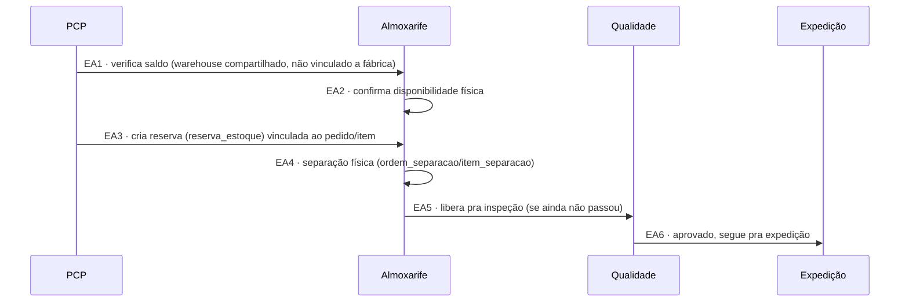
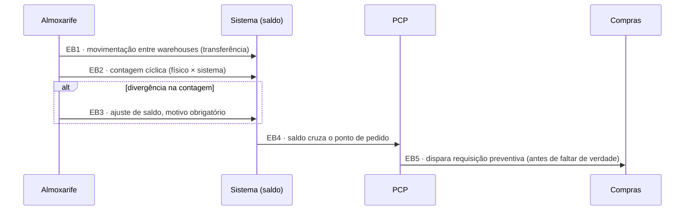

# Fluxo de Estoque — conversa por conversa

> Detalha o setor de **Estoque** em si — a operação contínua de guardar saldo, localizar, reservar e separar material — que até agora só existia como conceito ([[Rota-Estoque]], "pronta entrega") ou como célula da matriz em [[Modelo-Destinacao-Item]], mas nunca como sequência de conversas como os outros subfluxos.
>
> Cobre dois casos: **(A)** item já pronto em estoque, indo direto pra conferência/expedição sem passar por Compras; **(B)** operação contínua do depósito, independente de qualquer pedido específico (reserva, movimentação, contagem cíclica, ponto de pedido).

## Atores e sistemas

| Ator | Onde vive |
|---|---|
| **PCP** | MES |
| **Almoxarife** | MES — opera o depósito no dia a dia |
| **Gestor de Estoque** | MES — supervisão, não participa das conversas operacionais |
| **Qualidade** | MES |
| **Expedição** | MES |
| **Compras** | av-hub — só entra se o ponto de pedido disparar (volta pro fluxo de [[Fluxo-Compras-Completo]]) |

## Caso A — Item já pronto em estoque

**EA1/EA2 — PCP verifica saldo, Almoxarife confirma**
Corresponde ao eixo 2 de [[Modelo-Destinacao-Item]] respondendo "pronto em estoque". Saldo é checado por warehouse (depósito central compartilhado, não vinculado a fábrica — ver [[Perguntas-Pendentes-MES-Estoque]]).

**EA3 — Reserva**
A checagem de saldo **cria a reserva no mesmo passo**, não só lê — decisão já tomada em [[Fluxo-Detalhado-Pedido-Item]] pra evitar a condição de corrida entre pedidos concorrentes disputando o mesmo saldo.

**EA4 — Separação física**
`ordem_separacao`/`item_separacao`, já modelado no PRD (ver [[Estoque-Modelo-Dados]]) — o Almoxarife retira o material do warehouse.

**EA5/EA6 — Segue pro fluxo comum**
Ponto de entrada Q2 de [[Fluxo-Qualidade-Completo]] (se o lote nunca foi inspecionado) ou direto pra Expedição (se já estava aprovado de um recebimento anterior, ex.: sobra de outro pedido).

## Caso B — Operação contínua do depósito (independente de pedido)

**EB1 — Movimentação entre warehouses**
Transferência entre depósitos compartilhados (Warehouse 01 ↔ Warehouse 02 etc.) — operação real, confirmada no PRD original (múltiplos depósitos).

**EB2/EB3 — Contagem cíclica**
Mitigação já prevista em [[Estoque-Riscos]] pra "descolamento entre saldo do sistema e saldo físico" — rastreabilidade por lote + **motivo obrigatório** em qualquer ajuste manual.

**EB4/EB5 — Ponto de pedido**
Gatilho de reposição preventiva, **diferente** da requisição reativa do PCP em C1 de [[Fluxo-Compras-Completo]] (que nasce de um pedido de venda específico sem saldo). Esta aqui nasce do próprio saldo cruzando um limiar — sem pedido de origem. ⚠️ **Achado deste modelo:** essas são duas origens diferentes pra uma requisição de compra que convergem no mesmo C1 — vale confirmar se merecem o mesmo formulário/tela ou precisam de campos diferentes (uma tem `pedido_venda_origem`, a outra não).

## Nenhum estado é beco sem saída

| Estado problemático | Saída garantida |
|---|---|
| Reserva criada mas pedido cancelado depois | Precisa de liberação explícita da reserva — mecanismo ainda em aberto (mesmo ponto já registrado em [[Fluxo-Detalhado-Pedido-Item]]) |
| Divergência na contagem cíclica | Ajuste com motivo obrigatório (EB3), nunca silencioso |

## O que este modelo deixa explícito

- **Existem duas origens diferentes de requisição de compra** — reativa (Compras/C1, vem de um pedido de venda sem saldo) e preventiva (Estoque/EB5, vem do ponto de pedido cruzado) — que hoje convergiriam no mesmo C1 de [[Fluxo-Compras-Completo]] sem distinção. Vale decidir se precisam de campos/telas diferentes.
- **Almoxarife e Gestor de Estoque não são o mesmo papel** — Almoxarife opera (separa, confere, movimenta); Gestor de Estoque supervisiona, sem aparecer em nenhuma conversa operacional deste modelo.
- **A reserva de estoque (EA3) precisa de liberação explícita quando o pedido de origem é cancelado** — gap ainda não resolvido, mesmo trade-off já apontado em [[Fluxo-Detalhado-Pedido-Item]].

## Ver também
- [[Setores-Envolvidos-no-Fluxo]]
- [[Rota-Estoque]]
- [[Modelo-Destinacao-Item]]
- [[Fluxo-Compras-Completo]]
- [[Fluxo-Qualidade-Completo]]
- [[Estoque-Modelo-Dados]]
- [[Estoque-Riscos]]
