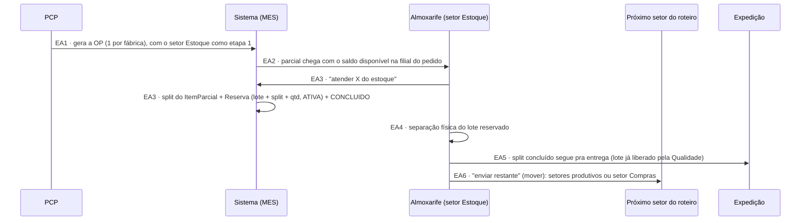
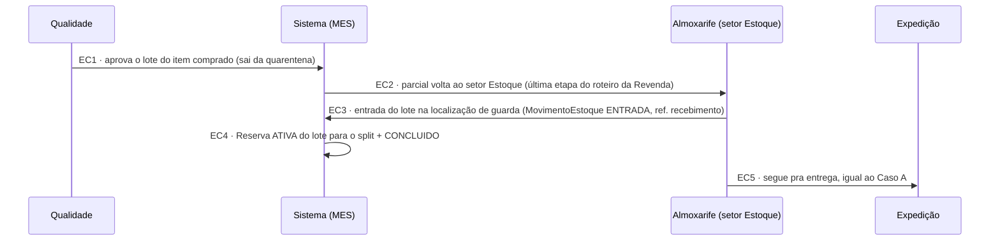
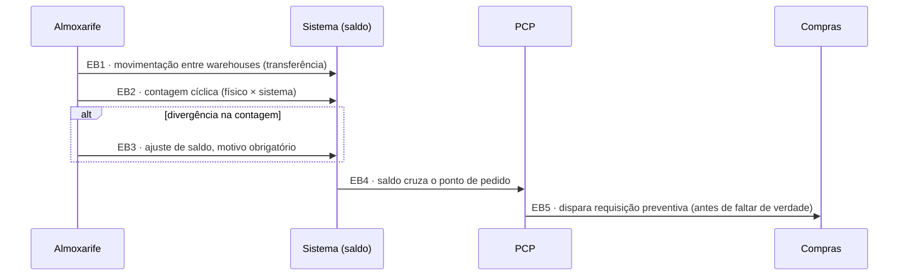

# Fluxo de Estoque — conversa por conversa

> Detalha o setor de **Estoque** em si — a operação contínua de guardar saldo, localizar, reservar e separar material — que até agora só existia como conceito ([[Rota-Estoque]], "pronta entrega") ou como célula da matriz em [[Modelo-Destinacao-Item]], mas nunca como sequência de conversas como os outros subfluxos.
>
> Cobre três casos: **(A)** parcial chegando no setor Estoque (etapa 1 de todo roteiro) e sendo atendido pelo saldo; **(B)** operação contínua do depósito, independente de qualquer pedido específico (movimentação, contagem cíclica, ponto de pedido); **(C)** item comprado voltando da Qualidade para o Estoque (entrada + reserva).
>
> **Confirmado com o usuário (17/09/2026): nada deste fluxo existe em sistema hoje** — é escopo obrigatório do sistema a construir, não documentação de processo existente. *(Em 23/09 as telas de saldo, reservas, movimentação e lote entraram no `app-pcp` `develop`, ainda sobre mock — backend real na D9.)*
>
> **Atualizado em 24/09/2026 com o encaixe do MES** ([[Encaixe-Estoque-Revenda-no-PCP]]): o Estoque virou **setor tipo `ESTOQUE`, etapa 1 obrigatória de todo roteiro**, e a reserva aponta para **lote + `ItemParcial`** (o split atendido), sem expiração. O Caso A foi reescrito e o Caso C é novo (regra do Nathan: item comprado aprovado vai para o Estoque, não para a Expedição).

## Atores e sistemas

| Ator | Onde vive |
|---|---|
| **PCP** | MES |
| **Almoxarife** | MES — opera o depósito no dia a dia |
| **Gestor de Estoque** | MES — supervisão, não participa das conversas operacionais |
| **Qualidade** | MES |
| **Expedição** | MES |
| **Compras** | av-hub — só entra se o ponto de pedido disparar (volta pro fluxo de [[Fluxo-Compras-Completo]]) |

## Caso A — Parcial no setor Estoque (etapa 1), atendido pelo saldo

**EA1 — PCP gera a OP**
Na tela Ordem de Produção (a partir da Carteira), o PCP escolhe itens, quantidades e fábrica da rodada. O backend insere o setor Estoque como etapa 1 do roteiro — ver [[Encaixe-Estoque-Revenda-no-PCP]].

**EA2 — O parcial chega no setor Estoque**
Corresponde ao eixo 2 de [[Modelo-Destinacao-Item]]. O sistema mostra o **saldo disponível na filial do pedido** (DEC-1) = saldo do lote liberado pela Qualidade − reservas `ATIVAS`. Nesta fase só **produto acabado** é checado; matéria-prima fica para a J3. Material ↔ item do pedido casam por `(codigoEmpresa, idOmie)`.

**EA3 — Atender do estoque: split + reserva + conclusão**
A leitura do saldo e a criação da reserva acontecem **no mesmo passo** — evita a corrida entre pedidos concorrentes disputando o mesmo saldo. A reserva aponta para o **lote e o split atendido** (não mais um `pedidoNumero` em texto) e nasce `ATIVA`, **sem expiração**.

**EA4 — Separação física**
`ordem_separacao`/`item_separacao`, já modelado no PRD (ver [[Estoque-Modelo-Dados]]) — o Almoxarife retira o material do warehouse. A tela de separação segue na Fase D.

**EA5 — Segue pra entrega**
O split atendido não volta à Qualidade: o saldo disponível só conta lote já liberado por ela. Na saída física a reserva vira `CONSUMIDA` (`MovimentoEstoque` `SAIDA` com referência à reserva).

**EA6 — Enviar o restante**
O que o saldo não cobre segue o roteiro: setores produtivos (fábrica de Fabricação) ou setor Compras (fábrica Revenda). **Saldo zero** — o parcial passa automático pelo Estoque, só registrando o tempo, ou exige clique? Em aberto, sugestão: automático. Antes do marco zero (13/11) todo parcial é tratado como saldo zero.

## Caso C — Item comprado volta da Qualidade para o Estoque (24/09/2026)

Regra do Nathan: o item que não tinha em estoque e foi comprado passa por todo o processo (setor Compras, OC, Recebimento, beneficiamento se houver, Qualidade) e, **aprovado, vai para o Estoque, não para a Expedição**. Assim toda entrega de item comprado sai do Estoque com reserva — a mesma porta do Caso A — e o lote comprado entra no saldo antes de sair (genealogia coerente). Reprovação não passa por aqui: volta ao PCP ([[Fluxo-Qualidade-Completo]]).

⚠️ O setor Estoque aparece **duas vezes** no roteiro da Revenda (início e fim). O front de hoje impede setor repetido no roteiro — ver pendência 3 de [[Encaixe-Estoque-Revenda-no-PCP]].

## Caso B — Operação contínua do depósito (independente de pedido)

**EB1 — Movimentação entre warehouses**
Transferência entre depósitos compartilhados (Warehouse 01 ↔ Warehouse 02 etc.) — operação real, confirmada no PRD original (múltiplos depósitos).

**EB2/EB3 — Contagem cíclica**
Mitigação já prevista em [[Estoque-Riscos]] pra "descolamento entre saldo do sistema e saldo físico" — rastreabilidade por lote + **motivo obrigatório** em qualquer ajuste manual.

**EB4/EB5 — Ponto de pedido**
Gatilho de reposição preventiva, **diferente** da requisição reativa do PCP em C1 de [[Fluxo-Compras-Completo]] (que nasce de um pedido de venda específico sem saldo). Esta aqui nasce do próprio saldo cruzando um limiar — sem pedido de origem. Essas são duas origens diferentes pra uma requisição de compra que convergem no mesmo C1 — vale confirmar se merecem o mesmo formulário/tela ou precisam de campos diferentes (uma tem `pedido_venda_origem`, a outra não).

## Nenhum estado é beco sem saída

| Estado problemático | Saída garantida |
|---|---|
| Reserva criada mas pedido cancelado depois | **Decidido em 24/09/2026:** reserva sem expiração, **liberação explícita** (`LIBERADA`) quando o pedido ou a OP é cancelado |
| Item comprado aprovado sem destino | Volta ao setor Estoque (Caso C), que dá entrada e reserva — nunca fica "aprovado e parado" |
| Divergência na contagem cíclica | Ajuste com motivo obrigatório (EB3), nunca silencioso |

## O que este modelo deixa explícito

- **Existem duas origens diferentes de requisição de compra** — reativa (Compras/C1, vem de um pedido de venda sem saldo) e preventiva (Estoque/EB5, vem do ponto de pedido cruzado) — que hoje convergiriam no mesmo C1 de [[Fluxo-Compras-Completo]] sem distinção. Vale decidir se precisam de campos/telas diferentes.
- **Almoxarife e Gestor de Estoque não são o mesmo papel** — Almoxarife opera (separa, confere, movimenta); Gestor de Estoque supervisiona, sem aparecer em nenhuma conversa operacional deste modelo.
- ~~A reserva de estoque (EA3) precisa de liberação explícita quando o pedido de origem é cancelado — gap ainda não resolvido.~~ **Resolvido em 24/09/2026:** sem expiração, liberação explícita no cancelamento do pedido/OP.
- **Toda reserva nasce no setor Estoque sobre lote já liberado** — no Caso A (saldo existente) ou no Caso C (item comprado que voltou). Não existe reserva sobre lote que ainda não chegou.

## Ver também
- [[Encaixe-Estoque-Revenda-no-PCP]]
- [[Setores-Envolvidos-no-Fluxo]]
- [[Rota-Estoque]]
- [[Modelo-Destinacao-Item]]
- [[Fluxo-Compras-Completo]]
- [[Fluxo-Qualidade-Completo]]
- [[Estoque-Modelo-Dados]]
- [[Estoque-Riscos]]
