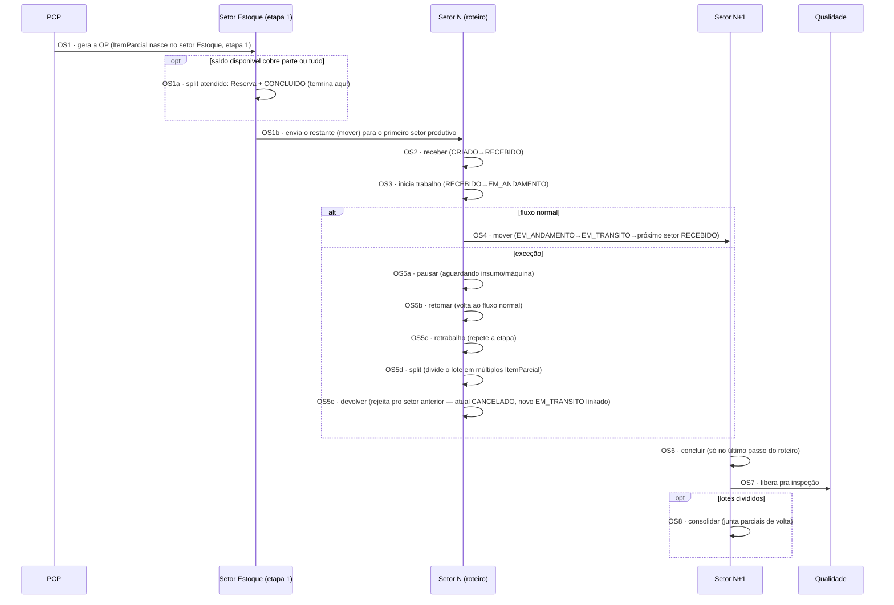

# Fluxo de Produção (OS/OP) — conversa por conversa

> Detalha a execução de uma Ordem de Serviço (beneficiamento de Revenda) ou Ordem de Produção (linha própria de Fabricação), a partir do mecanismo já decidido: OS/OP = `ItemParcial`/roteiro, já implementado no `api-pcp` (ver [[App-PCP-Backend-Producao]]).
>
> ⚠️ Diferente dos outros fluxos deste conjunto ([[Fluxo-Compras-Completo]], [[Fluxo-Recebimento-Completo]], [[Fluxo-Qualidade-Completo]]), **este é o único subfluxo que já tem mecanismo de estado implementado em produção** — os outros ainda são desenho, este é tradução de código real pra conversa por conversa. **Precisão (17/09/2026, confirmado com o usuário):** isso vale só pro motor de execução em si (`ItemParcial`/roteiro dentro do `api-pcp`) — o que dispara uma OS/OP a partir do PCP (aceite do pedido, classificação do item, decisão de abrir OS/OP) não existe; é o mesmo fluxo-alvo a construir descrito em [[Fluxo-Detalhado-Pedido-Item]].
>
> **Atualização (23-24/09/2026):** o disparo já existe em `develop` — Carteira de Pedidos → tela **Ordem de Produção** → `POST /pedidos/completo` (uma OP por fábrica em cada rodada). E o encaixe foi decidido ([[Encaixe-Estoque-Revenda-no-PCP]]): o backend insere o **setor Estoque como etapa 1** de todo roteiro (o antigo setor "Emissão de Ordens" sai), os setores ganham tipo (`PRODUTIVO`, `ESTOQUE`, `COMPRAS`), e a **OS de beneficiamento de Revenda é um setor `PRODUTIVO` opcional dentro do roteiro da fábrica Revenda** — resolve a "fábrica leve" que este documento deixava em aberto.

## Atores e sistemas

| Ator | Onde vive |
|---|---|
| **PCP** | MES — tela Ordem de Produção |
| **Setor Estoque** (etapa 1) | MES — atende do saldo ou envia o restante |
| **Setor** (cada etapa produtiva do roteiro) | MES, operado por Operador/Máquina |
| **Qualidade** | MES — destino final da etapa produtiva |

## Diagrama

## Conversa por conversa

**OS1 — PCP gera a OP**
Na tela Ordem de Produção, a partir da Carteira. Cria o `ItemParcial` em `CRIADO`, associado ao roteiro (sequência ordenada de setores) da fábrica correspondente, **com o setor Estoque como etapa 1**, inserido pelo backend. ~~Pra beneficiamento de Revenda, pressupõe uma fábrica/setor "leve" cadastrada só pra isso — item ainda em aberto.~~ **Resolvido em 24/09/2026:** o beneficiamento de Revenda (ex.: corte de chapa) é um setor `PRODUTIVO` opcional no roteiro da fábrica Revenda.

**OS1a/OS1b — Setor Estoque atende ou envia o restante**
A parte que o saldo disponível cobre vira um split atendido (reserva no lote + `CONCLUIDO`) e termina ali. O restante é movido para o primeiro setor produtivo — ou, na fábrica Revenda, para o setor Compras (ver [[Fluxo-Compras-Completo]]). Ver [[Fluxo-Estoque-Completo]] Caso A.

**OS2 — Setor recebe**
`receber`: `CRIADO → RECEBIDO`.

**OS3 — Setor inicia**
`RECEBIDO → EM_ANDAMENTO`.

**OS4 — Fluxo normal: move pro próximo setor**
`mover`: `EM_ANDAMENTO → EM_TRANSITO`, e o próximo setor do roteiro recebe (volta pra OS2). Repete até o último setor.

**OS5a/b — Pausa e retomada**
`pausar` (aguardando insumo, quebra de máquina etc.) e `retomar` — garante que pausa nunca é estado terminal.

**OS5c — Retrabalho**
Repete a etapa atual sem avançar no roteiro.

**OS5d — Split**
Divide o lote em múltiplos `ItemParcial` — cenário natural de corte (uma chapa vira várias peças).

**OS5e — Devolver**
Rejeita de volta pro setor anterior: a linha atual vira `CANCELADO` **permanentemente**, e nasce uma **nova** linha `EM_TRANSITO` ligada por `idDevolvidoDe`. Não edita o registro antigo — cria um novo linkado. ⚠️ Esse é o padrão que sustenta a hipótese sobre a Divergência sem reabertura (ver [[Decisoes-Chave-ERP]], item adiado) — se o mesmo princípio se aplicar lá, "reabrir" também deveria ser "criar novo linkado ao antigo", não editar o antigo.

**OS6 — Concluir**
Só permitido no último passo do roteiro — `concluir` fecha o `ItemParcial` como pronto.

**OS7 — Libera pra Qualidade**
Mesmo ponto de entrada Q2 de [[Fluxo-Qualidade-Completo]]. Depois da aprovação: item **fabricado** segue para a entrega; item de **Revenda** (comprado, com ou sem beneficiamento) volta ao **setor Estoque**, última etapa do roteiro da Revenda, para entrada no saldo e reserva (regra de 24/09/2026).

**OS8 — Consolidar (condicional)**
Se o lote foi dividido (OS5d), pode ser reagrupado de volta antes ou depois da inspeção.

## Nenhum estado é beco sem saída

| Estado problemático | Saída garantida |
|---|---|
| Pausado | `retomar` (OS5b) sempre disponível |
| Devolvido pro setor anterior | Nova linha `EM_TRANSITO` nasce automaticamente (OS5e) — o item nunca fica "devolvido e parado" |
| Dividido em múltiplos lotes | `consolidar` (OS8) disponível quando fizer sentido reagrupar |

Toda transição usa `updateMany({where:{id, status: ESPERADO}}) + count===0 → erro de conflito` — concorrência resolvida por escrita condicional, não leitura-depois-escrita (ver [[App-PCP-Backend-Producao]]).

## O que este modelo deixa explícito

- **Este é o único dos quatro subfluxos que não precisa de desenho novo** — ~~só precisa confirmar se o mecanismo de fábrica/setor "leve" pra beneficiamento de Revenda é viável~~ confirmado em 24/09/2026: o modelo existente serve, com **tipo** na Fábrica (`FABRICACAO`/`REVENDA`) e no Setor (`PRODUTIVO`/`ESTOQUE`/`COMPRAS`). O ajuste real no motor é outro: o setor Estoque aparece **duas vezes** no roteiro da Revenda (início e fim), e hoje o front indexa a etapa pelo setor — ver pendência 3 de [[Encaixe-Estoque-Revenda-no-PCP]].
- **`ItemParcial` tem 9 estados no front de `develop`** (`CRIADO`, `RECEBIDO`, `EM_ANDAMENTO`, `EM_TRANSITO`, `PAUSADO`, `REPROVADO`, `CONCLUIDO`, `RETRABALHO`, `CANCELADO`) — `REPROVADO` entrou depois da análise original.
- **`HistoricoItemParcial` já dá a trilha de auditoria completa de toda essa sequência** — é candidato natural a alimentar o "histórico muito mais robusto" que ficou pendente pro status por item no av-hub (ver [[AV-Hub-Bugs-Catalogo]]).
- **O padrão `devolver` (cria novo linkado, nunca edita o antigo) é uma pista de design pra resolver a Divergência sem reabertura** — mesma filosofia aplicada a uma entidade diferente do mesmo backend.

## Ver também
- [[Encaixe-Estoque-Revenda-no-PCP]]
- [[App-PCP-Backend-Producao]]
- [[Fluxo-Qualidade-Completo]]
- [[Fluxo-Recebimento-Completo]]
- [[Decisoes-Chave-ERP]]
