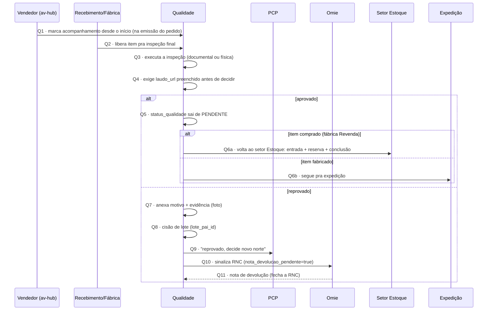

# Fluxo de Qualidade — conversa por conversa

> Detalha a inspeção de qualidade, a partir de qualquer um dos pontos de entrada possíveis (Recebimento, conclusão de OS/OP, ou item já pronto em estoque), até a aprovação/reprovação e seus desdobramentos.
>
> **Confirmado com o usuário (17/09/2026): nada deste fluxo existe em sistema hoje** — é escopo obrigatório do sistema a construir, não documentação de processo existente. *(Em 23/09 a fila de inspeção com aprovar/reprovar, laudo, RNC e cisão entrou no `app-pcp` `develop`, sobre mock — tarefa D8.)*
>
> **Regra de 24/09/2026 (Nathan):** item **comprado** aprovado **vai para o setor Estoque, não para a Expedição** — ver Q6 abaixo e [[Encaixe-Estoque-Revenda-no-PCP]] seção 3.4.

## Atores e sistemas

| Ator | Onde vive |
|---|---|
| **Qualidade** | MES |
| **PCP** | MES |
| **Recebimento** / **Fábrica-Beneficiamento** | MES — origem do item |
| **Vendedor** | av-hub — só define o tipo de acompanhamento na emissão do pedido |
| **Omie** | externo — devolução ao fornecedor |
| **Setor Estoque** | MES — destino do item **comprado** aprovado (entrada + reserva) |
| **Expedição** | MES — destino do item **fabricado** aprovado |

## Duas entradas na fila da Qualidade

1. **Inspeção de processo** — itens marcados pelo vendedor pra acompanhamento desde o início (documentação, validação de entrada). Entrada nasce na emissão do pedido, não depende de Recebimento/Fábrica.
2. **Inspeção final** — itens acabados liberados por [[Fluxo-Recebimento-Completo]] (R10a) ou por conclusão de OS/OP (ver [[Fluxo-Producao-OS-OP-Completo]]). ~~Ou item que já estava pronto em estoque.~~ Desde 24/09/2026 o item atendido pelo saldo não volta à Qualidade: o saldo disponível só conta lote já liberado por ela.

## Diagrama

## Conversa por conversa

**Q1 — Vendedor → Qualidade: acompanhamento desde o início**
Nasce na emissão do pedido (checkbox descrito em [[Fluxo-Detalhado-Pedido-Item]]), não na chegada do material. Se o vendedor não marcar, Qualidade só é acionada na inspeção final (Q2) — evita sobrecarregar o setor.

**Q2 — Origem → Qualidade: libera pra inspeção final**
Duas origens, mesmo destino: Recebimento (item acabado comprado) e conclusão de OS/OP (item beneficiado/fabricado). ~~Ou item que já estava pronto em estoque~~ — desde 24/09/2026 esse é atendido no setor Estoque sobre lote já liberado, sem nova inspeção. Ver [[Modelo-Destinacao-Item]].

**Q3 — Execução da inspeção**
Interna à Qualidade — varia conforme o tipo (documental pra inspeção de processo, física pra inspeção final).

**Q4 — Exigência de laudo**
Regra de negócio já fixada: `status_qualidade` **não pode sair de PENDENTE sem `laudo_url` preenchido** (ver [[Estoque-Regras-Negocio]]) — trava antes mesmo de decidir aprovar ou reprovar.

**Q5/Q6 — Aprovado**
Lote sai da quarentena. O destino depende da origem (regra de 24/09/2026):
- **Q6a — Item comprado** (fábrica Revenda, com ou sem beneficiamento): **vai para o setor Estoque, não para a Expedição.** O Estoque dá entrada do lote no saldo, cria a reserva para o split que esperava a compra e o conclui — ver [[Fluxo-Estoque-Completo]] Caso C e [[Fluxo-Compras-Completo]] C19. A reserva não "se confirma" na Qualidade: ela nasce no Estoque, sobre o lote já liberado.
- **Q6b — Item fabricado**: segue pra Expedição — ver [[Fluxo-Expedicao-Faturamento-Completo]].

**Q7 — Reprovado: motivo + evidência**
Campo pra anexar foto da avaria, além do motivo em texto (ver [[Fluxo-Detalhado-Pedido-Item]]).

**Q8 — Cisão de lote**
`lote_pai_id` — o lote original aprovado segue com o que sobrou; um lote filho nasce congelado com a quantidade reprovada, aguardando devolução (padrão já em [[Estoque-Modelo-Dados]]).

**Q9 — Volta pro PCP**
"Reprovado, decide o novo norte" — mesma conversa C15 de [[Fluxo-Compras-Completo]], reafirmada aqui como o ponto de saída da reprovação.

**Q10/Q11 — Devolução via Omie**
⚠️ **Distinção importante a não confundir:** esta é **devolução ao fornecedor** (RNC, motivada por reprovação de qualidade na entrada). É um conceito **diferente** de "devolução de cliente" (motivada por insatisfação/erro pós-venda, ainda em aberto — ver [[Perguntas-Pendentes-MES-Estoque]], pergunta 3). Os dois usam a palavra "devolução", mas são fluxos, atores e telas completamente distintos — vale nomear diferente no sistema pra não confundir operador (ex.: "RNC/Devolução a Fornecedor" vs. "Devolução de Cliente"). RNC sinaliza `nota_devolucao_pendente = true`; o sistema nunca cria a nota, só sinaliza; Omie emite; a sincronização de volta fecha a RNC.

## Nenhum estado é beco sem saída

| Estado problemático | Saída garantida |
|---|---|
| Reprovado sem decisão do PCP | Q9 força a volta pro PCP — não existe "reprovado" como estado final por si só |
| RNC sem nota de devolução do Omie | Fica aberta até a sincronização trazer a nota de volta (Q11) — não é travamento, é espera assíncrona documentada |

## O que este modelo deixa explícito

- **As duas filas de Qualidade (processo vs. final) têm gatilhos completamente diferentes** — uma nasce na emissão do pedido (Q1), a outra na conclusão de uma etapa operacional (Q2) — não são a mesma fila com prioridades diferentes, são entradas de dados distintas que precisam de telas distintas.
- **"Devolução" no sistema precisa de dois nomes, não um** — RNC/devolução a fornecedor (aqui) e devolução de cliente (ainda em aberto) são conceitos irmãos, fáceis de confundir na nomenclatura se não forem batizados diferente desde o início.
- **A exigência de `laudo_url` (Q4) é uma trava dura antes da decisão**, não uma preferência — vale confirmar se isso vale igual pra inspeção de processo (documental) ou só pra inspeção final (física).

## Ver também
- [[Encaixe-Estoque-Revenda-no-PCP]]
- [[Fluxo-Recebimento-Completo]]
- [[Fluxo-Producao-OS-OP-Completo]]
- [[Fluxo-Expedicao-Faturamento-Completo]]
- [[Modelo-Destinacao-Item]]
- [[Estoque-Regras-Negocio]]
- [[Perguntas-Pendentes-MES-Estoque]]
