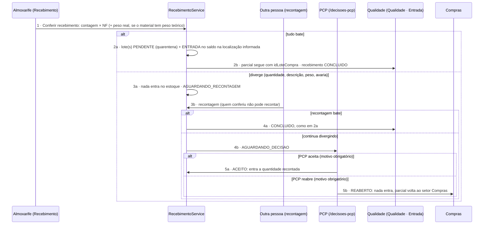
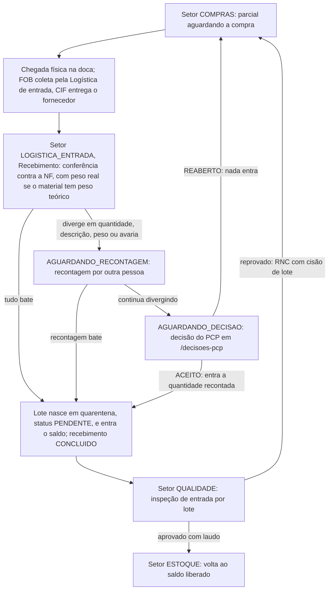

# Fluxo de Recebimento — conversa por conversa

> Status: decidido | no código (develop) | em produção (mes-test; produção real não)

> **Atualização de 07/10/2026 — o recebimento já tem código em `develop`, e é diferente do desenho abaixo.** Conferido no código (`develop`: `api-pcp` PR #50 `861c050`, migration `20261006140000_recebimento_conferencia`; `app-pcp` PR #34 `f2c01f1`, 07/10). **Só em `develop`: a `main` do MES parou em 28/08, e produção/banco não foram conferidos.** O que existe está descrito na seção **"Como é no código"** logo abaixo; o fluxo-alvo de 16–24/09 foi mantido mais adiante como **"Desenho original"**, com as divergências marcadas. Nota técnica da implementação: [[App-PCP-Recebimento-Conferencia]].
>
> ~~**Confirmado com o usuário (17/09/2026): nada deste fluxo existe em sistema hoje**~~ — **superado em 07/10** (D6 backend e D7 front em `develop`). Continuam sem existir: leitor de código de barras (só se digita a chave da NF), posto de recebimento com impressora/leitor, e o consumo automático dos marcos `oc_aprovada`/`oc_no_omie`/`despachada` do av-hub.
>
> Detalha o que acontece dentro do Recebimento a partir do momento em que a referência da compra chega do av-hub (conversa C7 de [[Fluxo-Compras-Completo]]) até o item ser roteado pra Qualidade ou de volta pro PCP.
>
> **Atualizado em 24/09/2026 com o encaixe do MES** ([[Encaixe-Estoque-Revenda-no-PCP]]): Recebimento é um setor do roteiro da fábrica Revenda (`ESTOQUE` → `COMPRAS` → **Recebimento** → [beneficiamento] → Qualidade → `ESTOQUE`). A conferência bem-sucedida **libera o parcial que estava parado no setor Compras** (tarefa D6), e o item não acabado segue para o setor de beneficiamento do roteiro em vez de voltar ao PCP.

## Como é no código (conferido em 07/10/2026, `develop`)

**Onde fica na tela.** Não há rota Next nova: `/logistica/logistica-entrada` é o `ModuloSetores` da fila do setor tipo `LOGISTICA_ENTRADA` (nome exibido "Recebimento"). O PR acrescentou a ação **"Conferir recebimento"** (`ConferirRecebimentoModal`, que substituiu o `RegistrarRecebimentoModal`), a ação **"Recontar"** (`RecontarRecebimentoModal`), a tela **`/decisoes-pcp`** (grupo Operações), um chip de status da conferência no card da parcial e o seletor de filial no cadastro de depósito.

**As regras, como o `RecebimentoService` as aplica:**
1. **A conferência é contra a NF, não contra o pendente.** Receber mais do que o pedido é permitido; a sobra fica livre no estoque. O `Recebimento` guarda `numeroNf` e `chaveAcessoNf` (44 dígitos, digitada — não há leitor de código de barras).
2. **Peso e tolerância.** Peso teórico = `Material.pesoTeoricoUnitario` × quantidade contada. Se o material tem peso teórico, o **peso real é obrigatório**. Desvio acima de `toleranciaPeso` (padrão **5%**) vira divergência do tipo `PESO` — entra no mesmo caminho das divergências de quantidade, descrição e avaria.
3. **Tudo bate →** `ComprasService.registrarRecebimento` cria o(s) lote(s) `PENDENTE` (quarentena) com `MovimentoEstoque` `ENTRADA` e `SaldoEstoque` na localização da conferência; a parcial segue para "Qualidade · Entrada" levando `idLoteCompra`; o recebimento fica `CONCLUIDO`.
4. **Diverge →** nada entra no estoque; estado `AGUARDANDO_RECONTAGEM`. **Outra pessoa reconta** — a que conferiu não pode.
5. **Recontagem bate →** `CONCLUIDO`. **Continua divergindo →** `AGUARDANDO_DECISAO`.
6. **O PCP decide em `/decisoes-pcp`:** `ACEITO` (entra a quantidade recontada) ou `REABERTO` (nada entra e a parcial **volta ao setor Compras**). O motivo é obrigatório nos dois.
7. **Rotas** (`compras/recebimentos`): `GET /` e `GET /:id` (`movimentacoes:visualizar`); `GET /decisoes` (`decisoes-pcp:visualizar`); `POST /` e `POST /:id/recontar` (`movimentacoes:editar`); `POST /:id/decidir` (`decisoes-pcp:editar`). O registro direto `POST /compras/requisicoes/:id/recebimentos` foi **removido**.

**Ligações com os vizinhos:**
- **Compras.** A requisição nasce em "Requisições" (`requisitar`) e a parcial vai a Compras; o `PATCH /compras/requisicoes/:id/compra` (manual: nº do pedido, fornecedor, previsão) move a parcial para o Recebimento; `registrarRecebimento` atualiza `quantidadeRecebida` da requisição. Dos eventos do av-hub (contrato 35) o MES só **reage** a `requisicao_cancelada` e `requisicao_reaberta`; `oc_aprovada`, `oc_no_omie` e `despachada` são gravados mas **não preenchem pedido de compra nem previsão, e não avançam a parcial**. Ver [[Fluxo-Compras-Completo]] e [[Indice-Contratos]].
- **Qualidade.** `src/qualidade`, `/qualidade/lotes`, permissão `inspecao-entrada`: aprovar exige `laudoUrl` e leva a parcial de volta ao Estoque; reprovar abre RNC total ou parcial; a parte reprovada volta a Compras e a aprovada fica em QUARENTENA (EC-07); na reprovação parcial as partes se unem depois (`devolverAoEstoqueParciaisProntas`). Ver [[Fluxo-Qualidade-Completo]].
- **Estoque.** O lote nasce na localização da conferência (`SaldoEstoque` + `MovimentoEstoque` `ENTRADA`).

**Não verificado / ressalvas.** Se a `develop` está em homologação ou produção; se os setores e telas do menu existem no banco real (as telas são criadas por SQL fora do repositório). O PR #50 também **apagou** rotas antigas (`POST /pedidos/completo`, restando `/pedidos/completo/lote`, e `POST/DELETE /perfis/:id/permissoes[...]`, restando o `bulk`) — pode quebrar consumidores antigos.

---

## Desenho original (16–24/09/2026) — o que divergiu do código

> O que segue é o fluxo-alvo escrito antes da implementação. Onde difere do código acima, está marcado "(atualizado em 07/10)". Diferenças principais: (a) o código confere **contra a NF**, não contra PV/OC conforme a flag; (b) **peso fora da tolerância já tem caminho** (divergência `PESO`); (c) **há recontagem por outra pessoa** antes de a decisão chegar ao PCP; (d) **a reabertura volta a Compras** pelo próprio sistema, e a lista de decisões do PCP é a tela `/decisoes-pcp`, não a fila "Novo norte" completa (C8) — que só trata divergência de recebimento; (e) **não há R8 de etiquetagem no posto** (a etiqueta é por lote, `GET /estoque/lotes/:id/etiqueta`, PDF Code128) nem leitor 2D.

## Atores e sistemas

| Ator | Onde vive |
|---|---|
| **Recebimento** | MES |
| **PCP** | MES |
| **Qualidade** | MES |
| **Logística de entrada** | MES ou terceirizada — só entra em ação no frete FOB (coleta no fornecedor); no CIF o próprio fornecedor entrega (ver [[Fluxo-Compras-Completo]]) |
| **Compras** | av-hub — só manda a referência (C7), não participa daqui em diante |

## Diagrama — arquitetura de 29/09/2026

> Redesenhado em 07/10/2026 conforme a arquitetura de 29/09 e o código de `develop`. O fluxo detalhado, com as regras do `RecebimentoService`, está na seção "Como é no código" acima. Esta versão mostra o encaixe nos setores. Fonte das decisões de 07/10: [[Registro-de-Decisoes-2026-10-07]]; tolerância de peso de 5% para todas as categorias.

> [!note]- Histórico 24/09: desenho original (superado)
> O diagrama de 24/09 (R1 a R10) conferia contra o **Pedido de Venda ou a OC, conforme a flag acabado/não-acabado**, tratava peso como etapa à parte, mandava a divergência direto ao PCP (R5/R6, sem recontagem), previa a etiquetagem no posto (R8) e o encaminhamento por roteiro (com ou sem beneficiamento, fila "Novo norte"). As conversas R1 a R10c abaixo seguem descrevendo esse desenho, com as correções de 07/10 marcadas.

## Conversa por conversa

**R1 — chegada física**
Evento físico que abre a conferência. Não existe aviso prévio de sistema (sem estado "em trânsito" verificável, ver [[Fluxo-Compras-Completo]]) — a doca só sabe que o material chegou quando ele chega. Quem entrega depende do incoterm definido na OC: **FOB** → Logística de entrada (a empresa foi buscar); **CIF** → o próprio fornecedor, direto.

**R2 — Recebimento localiza a referência**
Busca a referência que já tinha chegado do av-hub em C7 (itens, quantidade esperada, flag acabado/não-acabado). Se o item for de um pedido "pronto em estoque" (célula da matriz em [[Modelo-Destinacao-Item]] que nunca passou por compra), este passo não se aplica — esse caso não entra no fluxo de Recebimento.

**R3 — Conferência quantitativa**
Contagem física × quantidade esperada. Aqui mora a divisão já modelada: **item acabado confere contra o Pedido de Venda; item não acabado confere contra a Ordem de Compra**. *(Atualizado em 07/10: **no código a conferência é contra a NF**, não contra PV nem OC conforme a flag; receber mais que o pedido é permitido e a sobra fica livre no estoque. A divisão por flag do desenho original não foi implementada.)*

**R4 — Pesagem**
Peso teórico × quantidade, dentro da tolerância por categoria (5% provisório, ver [[Estoque-Perguntas-Abertas]]). Depende de saber se a balança tem saída digital ou é lida manualmente — pergunta ainda em aguardo. *(Atualizado em 07/10: no código o peso real é digitado, é obrigatório quando o material tem peso teórico, a tolerância padrão é 5% (`toleranciaPeso`) e o desvio vira divergência `PESO`.)*

**R5/R6 — Divergência de quantidade/descrição (condicional)**
Esta é uma ramificação **diferente** da reprovação de qualidade (que só acontece depois, na inspeção) — aqui o problema é "chegou errado", não "chegou ruim". Volta pro PCP decidir: aceita o que chegou como recebimento parcial (ajusta o lote pra quantidade real) ou rejeita e reabre o ciclo de compra (volta pra C1 de [[Fluxo-Compras-Completo]]). *(Atualizado em 07/10: no código o PCP **não** recebe a divergência direto — antes há uma **recontagem por outra pessoa**; só se a recontagem continua divergindo o recebimento vai a `AGUARDANDO_DECISAO` e aparece em `/decisoes-pcp`. "Aceita" = `ACEITO` (entra a quantidade recontada); "rejeita" = `REABERTO` (nada entra e a parcial volta ao setor Compras). Motivo obrigatório nos dois.)*

**R7 — Criação do lote**
`lote` nasce com `origem = RECEBIMENTO` e `status_qualidade = PENDENTE` — quarentena por padrão, mesmo se o item for "acabado" e passar batido pela conferência (ver [[Estoque-Modelo-Dados]]).

**R8 — Etiquetagem**
*(Atualizado em 07/10: parcial no código — `GET /estoque/lotes/:id/etiqueta` gera PDF Code128 (`2e2c18e`, 23/09); sem leitor 2D e sem posto de recebimento.)* Código de barras/QR por padrão; RFID só no piloto de Flange (maior valor unitário — ver [[Fabricacao-Flanges]] e [[Estoque-Riscos]] pra a ressalva técnica de tag on-metal).

**R9 — Nota fiscal de entrada**
*(No código, `chaveAcessoNf` de 44 dígitos é digitada na conferência — conferido em 07/10.)* Só referência (`chave_acesso`) — nunca captura CFOP/ICMS-ST de entrada, que fica 100% com o Omie (Nota de Entrada não é sincronizada hoje, ver [[Estoque-Regras-Negocio]]). **Correção**: isso vale só pro CFOP da nota de entrada (compra) — o CFOP do lado da venda já é capturado por item (`produto_vendas.cfop`); ICMS-ST continua não capturado em nenhum dos dois lados.

**R9b — Libera o parcial do setor Compras (24/09/2026)**
O parcial do item comprado esperava no setor Compras desde a requisição. A conferência aprovada o move para o próximo setor do roteiro da Revenda.

**R10a/R10b/R10c — Roteamento final**
Mesma bifurcação já coberta em [[Fluxo-Compras-Completo]] (C10/C11) — reafirmada aqui como o ponto de saída do Recebimento. Desde 24/09/2026 quem decide é o **roteiro** montado pelo PCP (tem ou não setor de beneficiamento), não a volta ao PCP. A flag acabado/não-acabado continua decidindo contra o que conferir (R2/R3); se ela disser "não acabado" e o roteiro não tiver beneficiamento, o parcial vai para a fila "Novo norte" do PCP (R10c). Depois da Qualidade, o item comprado aprovado **volta ao setor Estoque** — ver [[Fluxo-Qualidade-Completo]] Q6a.

## Nenhum estado é beco sem saída

| Estado problemático | Saída garantida |
|---|---|
| Divergência de quantidade/descrição (R5) | Volta pro PCP — aceita parcial ou reabre compra (R6) |
| Peso fora da tolerância | ~~Mesma lógica de divergência — precisa entrar explicitamente no mesmo caminho R5/R6, ainda não confirmado se é tratado igual ou como caso à parte~~ **(atualizado em 07/10: resolvido no código — vira divergência `PESO` e segue o mesmo caminho: recontagem → decisão do PCP)** |

## O que este modelo deixa explícito

- **Recebimento nunca fala direto com Compras** — sempre por intermédio do PCP, mesmo em divergência. Reforça a fronteira "av-hub decide, MES executa": Compras não é chamada de volta pra decidir operação, só pra decidir compra nova. *(Atualizado em 07/10: no código a divergência passa pelo PCP — o PCP decide — mas a ligação com Compras existe: o `REABERTO` devolve a parcial ao setor Compras, e o registro manual da compra (`PATCH /compras/requisicoes/:id/compra`) é o que move a parcial para o Recebimento.)*
- **Divergência de quantidade (R5) e reprovação de qualidade (mais adiante, em [[Fluxo-Qualidade-Completo]]) são dois problemas diferentes que acontecem em momentos diferentes**, mas os dois voltam pro PCP — vale considerar se merecem a mesma tela/mecanismo de "decisão do PCP" ou telas distintas.
- ~~**Peso fora da tolerância ainda não tem caminho de decisão definido** — hoje só "bate/não bate" está mapeado; fica em aberto se entra na mesma ramificação de divergência de quantidade.~~ **Resolvido no código (07/10):** o peso entra na mesma ramificação, como divergência `PESO`.

## Ver também
- [[App-PCP-Recebimento-Conferencia]] — a conferência com recontagem e decisão do PCP, como está no código.
- [[Encaixe-Estoque-Revenda-no-PCP]]
- [[Setores-Envolvidos-no-Fluxo]]
- [[Fluxo-Compras-Completo]]
- [[Fluxo-Qualidade-Completo]]
- [[Modelo-Destinacao-Item]]
- [[Estoque-Modelo-Dados]]
- [[Estoque-Perguntas-Abertas]]
