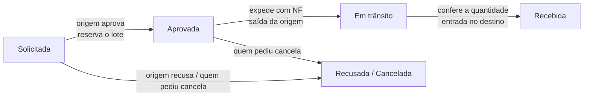

# Proposta — Transferência de estoque entre filiais

> Status: decidido | no código (develop; só a etapa 1) | em produção (mes-test; produção real não)

> **Atualização de 07/10/2026 — decisões 3 e 6 fechadas; etapas 2 a 4 vão ao Ciclo 2.** O status mudou de "decidida-parcial" para **decidida onde couber**: ✅ **decisão 3** — quem envia **aprova na origem e só então gera a NF**; ✅ **decisão 6** — o número da NF chega ao MES **via av-hub** (o gateway do Omie avisa o MES). **As etapas 2, 3 e 4 (solicitar, aprovar, expedir, receber, consulta e métricas) entram no Ciclo 2, que começa em 04/01/2027.** Fonte: [[Registro-de-Decisoes-2026-10-07]] (itens 24 e 27). Os textos de "pendente com o Fiscal" abaixo ficam por histórico e estão marcados como superados.

> **Atualização de 07/10/2026 — etapa 1 concluída em `develop`; etapas 2–4 não existem.** Conferido no código (`develop`, `api-pcp` `861c050`, 07/10, PR #50; `app-pcp` PR #34): `Deposito.codigoEmpresa` e `nomeUnidade`, `GET /estoque/depositos/unidades`, seletor de filial no cadastro de depósito, `disponiveisParaParcial` devolvendo `outrasFiliais` e o modal **"Atender pelo estoque"** mostrando o saldo das outras filiais (da decisão 7 existe só a parte de **mostrar** o saldo de outras filiais; o botão "Solicitar transferência" não existe). **Não existem:** solicitar, aprovar, expedir e receber a transferência, o movimento `TRANSFERENCIA` entre filiais, o lote filho no destino, a fila e a tela de consulta (etapas 2 e 3 do plano). **Só em `develop`** (a `main` do MES parou em 28/08); produção não conferida. ~~**As decisões 3 e 6 seguem com o Fiscal** (a 3 trava a etapa 2) — o código não as resolve.~~ *(superado em 07/10: decisões 3 e 6 tomadas, ver o bloco acima.)*
>
> Proposta de 05/10/2026 (documento "Proposta — Transferência de estoque entre filiais", registrado no vault em 06/10).
> **Status (06/10/2026): 5 das 7 decisões tomadas pelo Nathan** (1, 2, 4, 5 e 7, todas como propostas). **Faltam a 3 e a 6, com o Fiscal** — a 3 trava a etapa 2. A **etapa 1 (saldo por filial) já começou** no MES (Robert, 06/10), porque não depende de decisão que trave. **(Atualizado em 07/10: concluída em `develop`, `861c050`.)**
> Origem: PDF do Robert "Decisões pendentes — Transferência entre filiais e revisão do C2" (06/10/2026), respondido pelo Nathan no mesmo dia. Junto: **a tarefa C2 sai do cronograma** (ver [[Cronograma-2-Meses]]).
> Relacionadas: [[Lacunas-de-Logica-e-Clareza]] (L-09, depósito por filial), [[Fluxo-Estoque-Completo]] (atendimento pelo estoque, reserva, movimentação), [[Estoque-Modelo-Dados]] (`movimento_estoque`, lote), [[Fluxo-Compras-Completo]] (requisição de compra).

## Contexto

O MES precisa registrar a transferência de material entre os estoques das 3 filiais, por uma solicitação com aprovação. Hoje, quando um pedido de Mogi não tem saldo em Mogi, o único caminho é **requisitar uma compra**, mesmo com o material parado no estoque de outra filial.

**Objetivos**

- **Evitar compra desnecessária:** mostrar o saldo das outras filiais antes de requisitar compra.
- **Rastrear a movimentação:** cada transferência registra quem pediu, quem aprovou, a NF de transferência e os lotes.
- **Manter o pedido andando:** o parcial espera a transferência no Estoque, como hoje espera a compra.

## Como o MES está hoje

Boa parte da base já existe; falta o vínculo do depósito com a filial e o fluxo da solicitação.

| Ponto | Hoje | O que muda |
|---|---|---|
| Depósito | Sem filial (`codigo_empresa`). A L-09 (21/09) decidiu que pode ter, mas o campo não foi criado *(atualizado em 07/10: criado — `Deposito.codigoEmpresa`/`nomeUnidade`, `861c050`)* | Criar `deposito.codigo_empresa` e preencher os depósitos de cada filial |
| Material | Um cadastro por filial (`codigo_empresa` + código Omie), porque cada CNPJ tem seu catálogo no Omie | Regra para achar o mesmo produto na outra filial |
| Movimento | Já existe o tipo `TRANSFERENCIA`, com depósito e localização de origem e destino | Passa a ser usado também entre filiais |
| Lote | Já existe cisão (lote filho aponta para o lote pai) | O lote que chega no destino nasce como filho do lote de origem |
| Reserva | Reserva de saldo para um parcial, criada em "Atender pelo estoque" | Reserva na origem enquanto a transferência não sai |
| Atendimento | Só olha o saldo da filial do pedido *(atualizado em 07/10: já mostra o das outras filiais — `outrasFiliais`)* | Mostra o saldo das outras filiais |

## Fluxo proposto

Quatro etapas; o saldo só muda de filial em duas: **sai da origem na expedição** (com a NF) e **entra no destino na conferência**.

Até a expedição, a solicitação pode ser recusada pela origem ou cancelada por quem pediu; nos dois casos a reserva é liberada e o parcial volta a ter as opções de sempre.

## Telas (todas no Estoque)

1. **Atendimento (Estoque da filial do pedido).** Ao lado do saldo da filial, o saldo disponível nas outras (ex.: "Mogi: 0 · Filial B: 40 · Filial C: 12"). Novo botão **Solicitar transferência**, ao lado de "Atender pelo estoque" e "Requisitar compra": modal com filial de origem, lote (ou deixa a origem escolher), quantidade e observação. O parcial fica com a etiqueta "aguardando transferência" e o número da solicitação.
2. **Fila de Transferências (Estoque da filial de origem).** Pendentes com pedido, material, quantidade, quem pediu e há quanto tempo. Ações: **Aprovar** (escolhe lote e localização), **Recusar** (motivo obrigatório) e, depois de aprovada, **Expedir** (informa o número da NF de transferência).
3. **Recebimento da transferência (Estoque da filial de destino).** O que está em trânsito para a filial. Ação **Receber**: confere a quantidade e escolhe a localização; divergência fica registrada.

Uma tela de consulta com todas as transferências (filtro por filial, status e período) dá a visão geral ao PCP e à gestão.

## Regras e rastreabilidade

- **Nada se cria nem some:** o que sai da origem é exatamente o que entra no destino, ligado pelo lote.
- **Reserva na origem:** ao aprovar, o saldo do lote fica reservado para a transferência; ninguém atende outro pedido com ele.
- **Saída só com NF:** a expedição grava o movimento `TRANSFERENCIA` (saída da origem) com o número da NF de transferência. O MES não emite a nota; ela é emitida no Omie.
- **Em trânsito:** entre expedição e recebimento, o material não conta no saldo de nenhuma filial, mas aparece como "em trânsito" na consulta.
- **Lote filho no destino:** o recebimento cria um lote no material da filial de destino com `id_lote_pai` = lote de origem. Fornecedor, NF de compra e laudo continuam acessíveis pelo lote pai.
- **Qualidade:** o lote filho herda o status do pai (liberado continua liberado). No destino só há conferência de quantidade. Lote em quarentena ou reprovado não pode ser transferido.
- **Divergência:** se chegar menos do que saiu, a diferença fica registrada no recebimento e precisa de um ajuste com motivo na origem.
- **Vínculo com o pedido:** quando a solicitação nasce de um parcial, o lote recebido já é reservado para ele e o parcial segue como atendimento normal pelo estoque.
- **Sem pedido:** o mesmo fluxo serve para reposição entre filiais, sem parcial.
- **Cancelamento:** quem solicitou pode cancelar até a expedição; a reserva é liberada e o parcial volta a poder ser atendido ou ter compra requisitada.

## Decisões

As quatro primeiras travam a etapa 2; as demais podem ser decididas durante a implementação. Respondidas pelo Nathan em 06/10/2026, salvo as do Fiscal.

| # | Pergunta | Proposta | Quem decide | Status |
|---|---|---|---|---|
| 1 | Cada filial já tem depósitos próprios, ou ainda há depósito compartilhado? | Todo depósito passa a ter filial; um compartilhado vira um por filial | Nathan | ✅ **Decidido 06/10**: todo depósito tem filial (revê a regra condicional da L-09) |
| 2 | Como saber que o produto de Mogi é o mesmo da outra filial? | Mesmo `codigo_produto` nas duas filiais | Nathan | ✅ **Decidido 06/10**: mesmo `codigo_produto` (ex.: `015VRDP060`) |
| 3 | A NF de transferência é sempre obrigatória entre as filiais? | Sim; a saída no MES exige o número da NF | Fiscal | ✅ **Decidido 07/10**: quem envia **aprova na origem e só então gera a NF** ([[Registro-de-Decisoes-2026-10-07]], item 24). ~~⏳ pendente com o Fiscal~~ |
| 4 | Quem aprova? | O estoque da filial de origem | Nathan | ✅ **Decidido 06/10**: o estoque da filial de origem |
| 5 | O destino confere só a quantidade, ou a Qualidade inspeciona de novo? | Só quantidade; o lote herda o status | Nathan e Qualidade | ✅ **Decidido 06/10** (Nathan): só quantidade; o lote filho herda o status |
| 6 | Quem emite a NF no Omie e como o número chega ao MES? | O estoque da origem emite e digita no MES; integração depois | Fiscal | ✅ **Decidido 07/10**: o número da NF chega ao MES **via av-hub** (o gateway do Omie avisa o MES) — não é digitado ([[Registro-de-Decisoes-2026-10-07]], item 24). ~~⏳ pendente com o Fiscal~~ |
| 7 | O atendimento deve sugerir transferir antes de requisitar compra? | Sim, quando houver saldo em outra filial | Nathan | ✅ **Decidido 06/10**: sim, quando houver saldo disponível em outra filial |

> **Ligação com a L-09 (resolvida pela decisão 1 em 06/10).** A decisão de 21/09 deixou `deposito.codigo_empresa` **condicional** ("só quando a filial tiver seu próprio setor de compras"). A decisão 1 desta proposta torna a filial do depósito **universal**. Em 06/10 as três filiais já têm conta Omie própria com cadastro de compras (condições de pagamento, fornecedores, produtos e compradores da HRM aparecem em produção), o que favorece a proposta — mas quem fecha é o Nathan.
>
> **Ligação com a decisão 2.** O código legível do produto (`codigo_produto`, ex.: `015VRDP060`) é o mesmo que o MES já manda na requisição de compra (`material`) e que o av-hub usa para achar o produto no cadastro da unidade ao montar a OC (06/10). O `codigo_produto_omie` (`nCodProd`) é diferente em cada conta Omie e não serve para comparar entre filiais.

## Plano de implementação

> **(07/10/2026)** Etapa 1 concluída em `develop`. **Etapas 2, 3 e 4 vão ao Ciclo 2 (começa em 04/01/2027)** — [[Registro-de-Decisoes-2026-10-07]], item 27. O plano abaixo vale como desenho.

Três etapas, cada uma utilizável sozinha; a primeira já ajuda o estoquista antes de existir a transferência.

1. **Saldo por filial** ✅ *(concluída em `develop`, 07/10, `861c050`)* (depende das decisões 1 e 2): migration de `deposito.codigo_empresa` e preenchimento dos depósitos atuais; consulta do mesmo produto nas outras filiais; atendimento mostra "Mogi: 0 · Filial B: 40 · Filial C: 12".
2. **Solicitação, aprovação, expedição e recebimento** (depende das decisões 3 e 4): tabela de solicitações com status, NF, lotes e responsáveis; botão no atendimento, fila na origem e recebimento no destino; reserva na origem, movimento `TRANSFERENCIA`, lote filho e reserva automática para o parcial.
3. **Consulta e métricas:** tela de todas as transferências; em Relatórios, tempo médio de cada etapa (aprovação, expedição, trânsito) e quantas compras foram evitadas por transferência.
