# Diagramas UML — Modelo Completo

> Conjunto de diagramas UML (e aproximações fiéis via mermaid, onde a notação nativa não existe) cobrindo o máximo possível do que já foi analisado no vault. **Sequência e Atividades já existem** — ver os 6 arquivos `Fluxo-*-Completo` (sequência) e [[Fluxogramas-Completos]] (atividades, com raias por setor) — não duplicados aqui.
>
> **Parte 1 (diagramas 1-16):** cobertura completa dos tipos UML — 3 de Classes, 1 de Casos de Uso, 4 de Estados, 1 de Componentes, 1 de Implantação, 1 de Pacotes, 1 de Comunicação, 1 de Objetos, 1 de Estrutura Composta, 1 de Visão Geral de Interação, 1 de Tempo. Cobre 12 dos 14 tipos UML (só falta Perfil, que não se aplica).
>
> **Parte 2 (diagramas 17-22):** foco em desenvolvimento — modelo de dados com PK/FK explícitos de Estoque e MES (17/18, originalmente tentados como `erDiagram`, convertidos pra `classDiagram` por limitação de renderização — ver nota no 17), mais um Objetos, um Estados (proposta de Reserva de Estoque), um mapa geral de arquitetura de dados e um Fluxo de Dados. Deliberadamente fora: RH/Organograma, Mapas, Portal de Qualidade, Comissionamento.

## 1. Classes — Domínio Estoque

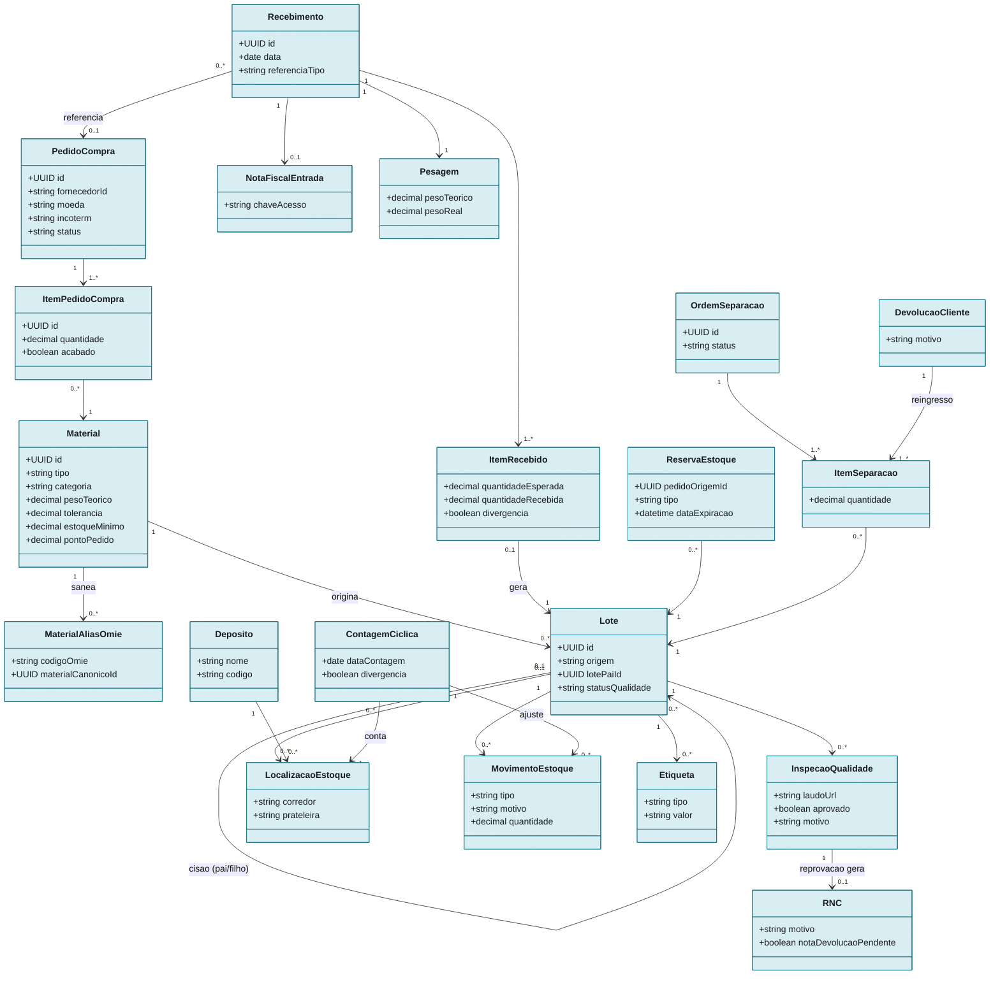
```mermaid
classDiagram
    class Material:::estoqueStyle {
        +UUID id
        +string tipo
        +string categoria
        +decimal pesoTeorico
        +decimal tolerancia
        +decimal estoqueMinimo
        +decimal pontoPedido
    }
    class MaterialAliasOmie:::estoqueStyle {
        +string codigoOmie
        +UUID materialCanonicoId
    }
    class PedidoCompra:::estoqueStyle {
        +UUID id
        +string fornecedorId
        +string moeda
        +string incoterm
        +string status
    }
    class ItemPedidoCompra:::estoqueStyle {
        +UUID id
        +decimal quantidade
        +boolean acabado
    }
    class NotaFiscalEntrada:::estoqueStyle {
        +string chaveAcesso
    }
    class Recebimento:::estoqueStyle {
        +UUID id
        +date data
        +string referenciaTipo
    }
    class Pesagem:::estoqueStyle {
        +decimal pesoTeorico
        +decimal pesoReal
    }
    class ItemRecebido:::estoqueStyle {
        +decimal quantidadeEsperada
        +decimal quantidadeRecebida
        +boolean divergencia
    }
    class Lote:::estoqueStyle {
        +UUID id
        +string origem
        +UUID lotePaiId
        +string statusQualidade
    }
    class InspecaoQualidade:::estoqueStyle {
        +string laudoUrl
        +boolean aprovado
        +string motivo
    }
    class RNC:::estoqueStyle {
        +string motivo
        +boolean notaDevolucaoPendente
    }
    class Deposito:::estoqueStyle {
        +string nome
        +string codigo
    }
    class LocalizacaoEstoque:::estoqueStyle {
        +string corredor
        +string prateleira
    }
    class MovimentoEstoque:::estoqueStyle {
        +string tipo
        +string motivo
        +decimal quantidade
    }
    class ReservaEstoque:::estoqueStyle {
        +UUID pedidoOrigemId
        +string tipo
        +datetime dataExpiracao
    }
    class Etiqueta:::estoqueStyle {
        +string tipo
        +string valor
    }
    class OrdemSeparacao:::estoqueStyle {
        +UUID id
        +string status
    }
    class ItemSeparacao:::estoqueStyle {
        +decimal quantidade
    }
    class DevolucaoCliente:::estoqueStyle {
        +string motivo
    }
    class ContagemCiclica:::estoqueStyle {
        +date dataContagem
        +boolean divergencia
    }

    Material "1" --> "0..*" MaterialAliasOmie : sanea
    Material "1" --> "0..*" Lote : origina
    PedidoCompra "1" --> "1..*" ItemPedidoCompra
    ItemPedidoCompra "0..*" --> "1" Material
    Recebimento "1" --> "1..*" ItemRecebido
    Recebimento "1" --> "0..1" NotaFiscalEntrada
    Recebimento "0..*" --> "0..1" PedidoCompra : referencia
    Recebimento "1" --> "1" Pesagem
    ItemRecebido "0..1" --> "1" Lote : gera
    Lote "0..1" --> "0..*" Lote : cisao (pai/filho)
    Lote "1" --> "0..*" InspecaoQualidade
    InspecaoQualidade "1" --> "0..1" RNC : reprovacao gera
    Lote "1" --> "0..*" MovimentoEstoque
    Lote "1" --> "0..*" Etiqueta
    Lote "0..1" --> "0..*" LocalizacaoEstoque
    Deposito "1" --> "0..*" LocalizacaoEstoque
    ReservaEstoque "0..*" --> "1" Lote
    OrdemSeparacao "1" --> "1..*" ItemSeparacao
    ItemSeparacao "0..*" --> "1" Lote
    DevolucaoCliente "1" --> "1..*" ItemSeparacao : reingresso
    ContagemCiclica "1" --> "0..*" MovimentoEstoque : ajuste
    ContagemCiclica "0..*" --> "1" LocalizacaoEstoque : conta

    classDef estoqueStyle fill:#d9eef2,stroke:#1f7a8c,color:#181c22
    cssClass "Material,MaterialAliasOmie,PedidoCompra,ItemPedidoCompra,NotaFiscalEntrada,Recebimento,Pesagem,ItemRecebido,Lote,InspecaoQualidade,RNC,Deposito,LocalizacaoEstoque,MovimentoEstoque,ReservaEstoque,Etiqueta,OrdemSeparacao,ItemSeparacao,DevolucaoCliente,ContagemCiclica" estoqueStyle
```

**Nota:** `Material`/`PedidoCompra` (fornecedor) são projeções de `core.produtos`/`core.parceiros` do av-hub — não cadastros paralelos. Ver [[Estoque-Modelo-Dados]].

> ⚠️ **Correção de cardinalidade (16/09):** 4 vínculos estavam com multiplicidade errada, implicando obrigatoriedade que contradiz regras já documentadas — corrigidos: **Recebimento→PedidoCompra** (era 0..1, uma OC pode ter várias entregas parciais); **ItemRecebido→Lote** (era obrigatório 1:1, mas carga inicial gera lote sem passar por recebimento — `Lote.origem = CARGA_INICIAL`); **ReservaEstoque→Lote** e **ItemSeparacao→Lote** (ambos eram obrigatórios 1:1, mas a maioria dos lotes fica em estoque geral, sem reserva nem separação). Também adicionado o vínculo que faltava entre `ContagemCiclica` e `LocalizacaoEstoque` (a contagem estava "solta", sem dizer onde aconteceu).

## 2. Classes — Domínio MES / Produção

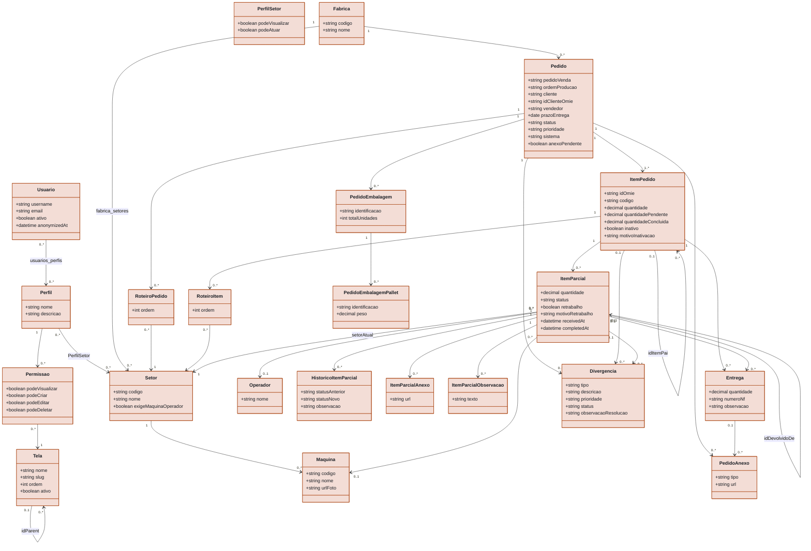
```mermaid
classDiagram
    class Usuario:::mesStyle {
        +string username
        +string email
        +boolean ativo
        +datetime anonymizedAt
    }
    class Perfil:::mesStyle {
        +string nome
        +string descricao
    }
    class Tela:::mesStyle {
        +string nome
        +string slug
        +int ordem
        +boolean ativo
    }
    class Permissao:::mesStyle {
        +boolean podeVisualizar
        +boolean podeCriar
        +boolean podeEditar
        +boolean podeDeletar
    }
    class PerfilSetor:::mesStyle {
        +boolean podeVisualizar
        +boolean podeAtuar
    }
    class Fabrica:::mesStyle {
        +string codigo
        +string nome
    }
    class Setor:::mesStyle {
        +string codigo
        +string nome
        +boolean exigeMaquinaOperador
    }
    class Maquina:::mesStyle {
        +string codigo
        +string nome
        +string urlFoto
    }
    class Operador:::mesStyle {
        +string nome
    }
    class Pedido:::mesStyle {
        +string pedidoVenda
        +string ordemProducao
        +string cliente
        +string idClienteOmie
        +string vendedor
        +date prazoEntrega
        +string status
        +string prioridade
        +string sistema
        +boolean anexoPendente
    }
    class ItemPedido:::mesStyle {
        +string idOmie
        +string codigo
        +decimal quantidade
        +decimal quantidadePendente
        +decimal quantidadeConcluida
        +boolean inativo
        +string motivoInativacao
    }
    class RoteiroPedido:::mesStyle {
        +int ordem
    }
    class RoteiroItem:::mesStyle {
        +int ordem
    }
    class ItemParcial:::mesStyle {
        +decimal quantidade
        +string status
        +boolean retrabalho
        +string motivoRetrabalho
        +datetime receivedAt
        +datetime completedAt
    }
    class HistoricoItemParcial:::mesStyle {
        +string statusAnterior
        +string statusNovo
        +string observacao
    }
    class ItemParcialAnexo:::mesStyle {
        +string url
    }
    class ItemParcialObservacao:::mesStyle {
        +string texto
    }
    class Entrega:::mesStyle {
        +decimal quantidade
        +string numeroNf
        +string observacao
    }
    class PedidoEmbalagem:::mesStyle {
        +string identificacao
        +int totalUnidades
    }
    class PedidoEmbalagemPallet:::mesStyle {
        +string identificacao
        +decimal peso
    }
    class PedidoAnexo:::mesStyle {
        +string tipo
        +string url
    }
    class Divergencia:::mesStyle {
        +string tipo
        +string descricao
        +string prioridade
        +string status
        +string observacaoResolucao
    }

    Usuario "0..*" --> "0..*" Perfil : usuarios_perfis
    Perfil "1" --> "0..*" Permissao
    Permissao "0..*" --> "1" Tela
    Tela "0..1" --> "0..*" Tela : idParent
    Perfil "0..*" --> "0..*" Setor : PerfilSetor
    Fabrica "1" --> "0..*" Setor : fabrica_setores
    Setor "1" --> "0..*" Maquina
    Fabrica "1" --> "0..*" Pedido
    Pedido "1" --> "1..*" ItemPedido
    ItemPedido "0..1" --> "0..*" ItemPedido : idItemPai
    Pedido "1" --> "0..*" RoteiroPedido
    RoteiroPedido "0..*" --> "1" Setor
    ItemPedido "1" --> "0..*" RoteiroItem
    RoteiroItem "0..*" --> "1" Setor
    ItemPedido "1" --> "0..*" ItemParcial
    ItemParcial "0..1" --> "0..*" ItemParcial : idParcialOrigem (split)
    ItemParcial "0..1" --> "0..1" ItemParcial : idDevolvidoDe
    ItemParcial "0..*" --> "1" Setor : setorAtual
    ItemParcial "1" --> "0..*" HistoricoItemParcial
    ItemParcial "1" --> "0..*" ItemParcialAnexo
    ItemParcial "1" --> "0..*" ItemParcialObservacao
    ItemParcial "0..*" --> "0..1" Maquina
    ItemParcial "0..*" --> "0..1" Operador
    ItemPedido "1" --> "0..*" Entrega
    ItemParcial "0..1" --> "0..*" Entrega
    Pedido "1" --> "0..*" PedidoEmbalagem
    PedidoEmbalagem "1" --> "0..*" PedidoEmbalagemPallet
    Pedido "1" --> "0..*" PedidoAnexo
    Entrega "0..1" --> "0..*" PedidoAnexo
    Pedido "1" --> "0..*" Divergencia
    ItemPedido "0..1" --> "0..*" Divergencia
    ItemParcial "0..1" --> "0..*" Divergencia

    classDef mesStyle fill:#f3ddd6,stroke:#a8420f,color:#181c22
    cssClass "Usuario,Perfil,Tela,Permissao,PerfilSetor,Fabrica,Setor,Maquina,Operador,Pedido,ItemPedido,RoteiroPedido,RoteiroItem,ItemParcial,HistoricoItemParcial,ItemParcialAnexo,ItemParcialObservacao,Entrega,PedidoEmbalagem,PedidoEmbalagemPallet,PedidoAnexo,Divergencia" mesStyle
```

**Nota:** modelo real já implementado no `api-pcp` (NestJS+Prisma) — ver [[App-PCP-Backend-Producao]]. `ItemParcial` é o motor de estado real, não `HistoricoItemParcial` (que é só trilha de auditoria).

> ⚠️ **Reescrito por completo (16/09) após leitura do dump real** (`pcp_prd_db`, schema `public` — confirma que o schema `estoque` ainda não existe). Achados que mudaram o diagrama:
> - **Roteiro existe em dois níveis**, não um só: `RoteiroPedido` (por pedido/fábrica) e `RoteiroItem` (por item específico) — cada item pode seguir um roteiro diferente dos outros do mesmo pedido.
> - **`ItemPedido` tem auto-referência** (`idItemPai`) — hierarquia entre itens, não documentada antes.
> - **`Divergencia` tem campo `tipo`** (QUALIDADE/QUANTIDADE/PRAZO/DANO/DOCUMENTACAO/OUTRO), além do `status` — e pode linkar em `ItemPedido` OU `ItemParcial` (granularidade dupla).
> - **`ItemParcialObservacao`** é uma entidade separada de `ItemParcialAnexo`, nunca documentada.
> - **`Usuario.anonymizedAt` existe de verdade aqui** (diferente do av-hub, onde não existe) — a nota antiga sobre isso estava certa.
> - Confirmado: `PerfilSetor` é tabela de junção com atributos próprios (`podeVisualizar`/`podeAtuar`), exatamente como já documentado.

## 3. Classes — av-hub Comercial + RBAC

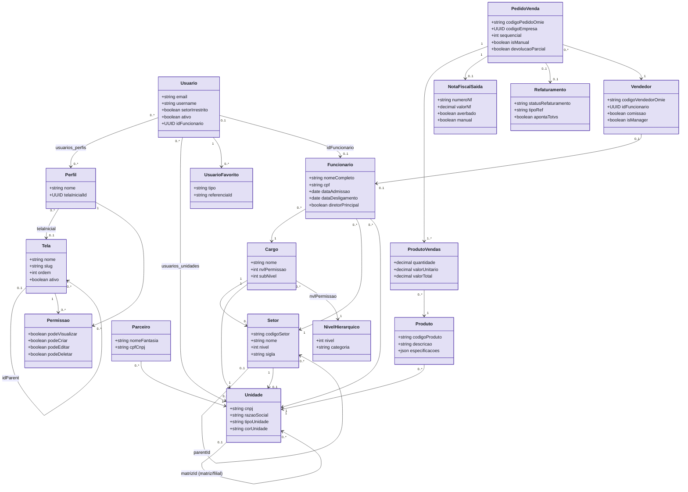
```mermaid
classDiagram
    class Usuario:::avhubStyle {
        +string email
        +string username
        +boolean setorIrrestrito
        +boolean ativo
        +UUID idFuncionario
    }
    class Perfil:::avhubStyle {
        +string nome
        +UUID telaInicialId
    }
    class Tela:::avhubStyle {
        +string nome
        +string slug
        +int ordem
        +boolean ativo
    }
    class Permissao:::avhubStyle {
        +boolean podeVisualizar
        +boolean podeCriar
        +boolean podeEditar
        +boolean podeDeletar
    }
    class UsuarioFavorito:::avhubStyle {
        +string tipo
        +string referenciaId
    }
    class Funcionario:::avhubStyle {
        +string nomeCompleto
        +string cpf
        +date dataAdmissao
        +date dataDesligamento
        +boolean diretorPrincipal
    }
    class Unidade:::avhubStyle {
        +string cnpj
        +string razaoSocial
        +string tipoUnidade
        +string corUnidade
    }
    class Setor:::avhubStyle {
        +string codigoSetor
        +string nome
        +int nivel
        +string sigla
    }
    class Cargo:::avhubStyle {
        +string nome
        +int nvlPermissao
        +int subNivel
    }
    class NivelHierarquico:::avhubStyle {
        +int nivel
        +string categoria
    }
    class Parceiro:::avhubStyle {
        +string nomeFantasia
        +string cpfCnpj
    }
    class Produto:::avhubStyle {
        +string codigoProduto
        +string descricao
        +json especificacoes
    }
    class Vendedor:::avhubStyle {
        +string codigoVendedorOmie
        +UUID idFuncionario
        +boolean comissao
        +boolean isManager
    }
    class PedidoVenda:::avhubStyle {
        +string codigoPedidoOmie
        +UUID codigoEmpresa
        +int sequencial
        +boolean isManual
        +boolean devolucaoParcial
    }
    class ProdutoVendas:::avhubStyle {
        +decimal quantidade
        +decimal valorUnitario
        +decimal valorTotal
    }
    class NotaFiscalSaida:::avhubStyle {
        +string numeroNf
        +decimal valorNf
        +boolean averbado
        +boolean manual
    }
    class Refaturamento:::avhubStyle {
        +string statusRefaturamento
        +string tipoRef
        +boolean apontaTotvs
    }

    Usuario "0..*" --> "0..*" Perfil : usuarios_perfis
    Perfil "0..*" --> "0..1" Tela : telaInicial
    Tela "0..1" --> "0..*" Tela : idParent
    Perfil "1" --> "0..*" Permissao
    Tela "1" --> "0..*" Permissao
    Usuario "0..*" --> "0..*" Unidade : usuarios_unidades
    Usuario "1" --> "0..*" UsuarioFavorito
    Usuario "0..1" --> "0..1" Funcionario : idFuncionario
    Unidade "0..1" --> "0..*" Unidade : matrizId (matriz/filial)
    Setor "0..1" --> "0..*" Setor : parentId
    Setor "1" --> "0..1" Unidade
    Cargo "1" --> "0..1" Setor
    Cargo "1" --> "1" Unidade
    Cargo "0..*" --> "1" NivelHierarquico : nvlPermissao
    Funcionario "0..*" --> "1" Cargo
    Funcionario "0..*" --> "1" Setor
    Funcionario "0..*" --> "1" Unidade
    Parceiro "0..*" --> "1" Unidade
    Produto "0..*" --> "1" Unidade
    Vendedor "0..1" --> "0..1" Funcionario
    PedidoVenda "1" --> "1..*" ProdutoVendas
    PedidoVenda "1" --> "0..1" NotaFiscalSaida
    PedidoVenda "0..1" --> "0..1" Refaturamento
    ProdutoVendas "0..*" --> "1" Produto
    PedidoVenda "0..*" --> "1" Vendedor

    classDef avhubStyle fill:#e3e0f5,stroke:#5b3fae,color:#181c22
    cssClass "Usuario,Perfil,Tela,Permissao,UsuarioFavorito,Funcionario,Unidade,Setor,Cargo,NivelHierarquico,Parceiro,Produto,Vendedor,PedidoVenda,ProdutoVendas,NotaFiscalSaida,Refaturamento" avhubStyle
```

**Nota:** `Vendedor.idFuncionario` é o vínculo em migração (backfill já rodou, ver [[RH-Escopo-Row-Level-Security]]). RBAC deste diagrama e o do diagrama 2 (MES) são **duas implementações independentes** — ver [[Achado-Duplicacao-RBAC]].

> ⚠️ **Reescrito por completo (16/09) após leitura de um dump mais completo do av-hub.** Mudanças:
> - **`reportaAId` removido de `Funcionario`** — a coluna não existe de verdade na tabela (confirma o que já estava certo em [[Organograma-Visao-Geral]]: o vínculo vive só em `core_organograma.node.parent_id`, nunca foi coluna própria de `funcionarios`).
> - **`Setor` tem hierarquia própria** (`parentId`/`nivel`, auto-referência) — achado novo, nunca documentado. É provavelmente a base real da "CTE recursiva pra subárvore" já citada em [[RH-Escopo-Row-Level-Security]] (`resolverEscopoSetorSubarvore`).
> - **`Unidade` tem hierarquia matriz/filial** (`matrizId`, auto-referência) — achado novo.
> - **FK real cruzando schema**: `Cargo.nvlPermissao` referencia `core_organograma.nivel_hierarquico(nivel)` de verdade (constraint `fk_cargos_nivel_hierarquico`) — antes era só "dicionário compartilhado", agora confirmado como FK de banco.
> - **`UsuarioFavorito` adicionado** (`auth.usuarios_favoritos`) — já citado em [[AV-Hub-Bugs-Catalogo]] como rota existente, agora com estrutura confirmada (`tipo`: cliente/pedido).
> - ⚠️ **Risco de engenharia encontrado**: `auth.usuarios.id_funcionario` é `ON DELETE CASCADE` — apagar um `Funcionario` apaga o `Usuario` vinculado junto, silenciosamente. Vale confirmar se é intencional (ex.: desligamento sempre remove acesso) ou um risco de perda de histórico de auditoria não avaliado.

## 4. Casos de Uso

> ⚠️ **Dividido em 5 diagramas menores (16/09)** — a versão única com 12 atores × 23 casos de uso virava uma faixa ilegível, não importa a direção escolhida. Cada grupo abaixo é pequeno o bastante pro mermaid organizar sozinho, ator ao lado dos seus casos de uso.

### 4a. Vendas

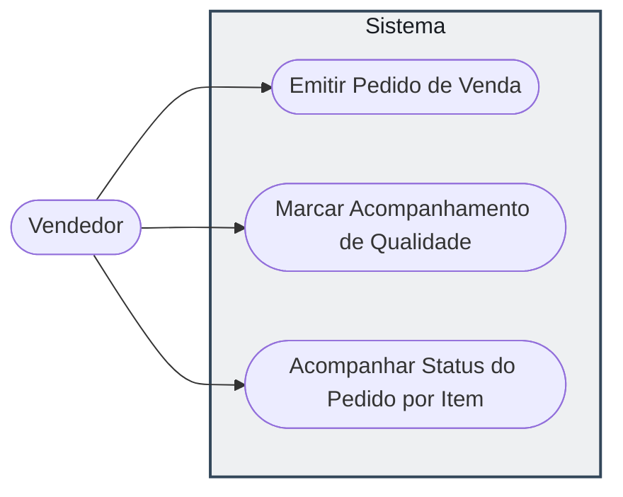
```mermaid
flowchart LR
    Vendedor(["Vendedor"])
    subgraph SISTEMA[Sistema]
        UC1([Emitir Pedido de Venda])
        UC2([Marcar Acompanhamento de Qualidade])
        UC3([Acompanhar Status do Pedido por Item])
    end
    Vendedor --> UC1
    Vendedor --> UC2
    Vendedor --> UC3

    style SISTEMA fill:#eef0f2,stroke:#33475a,stroke-width:2px,color:#181c22
```

### 4b. PCP

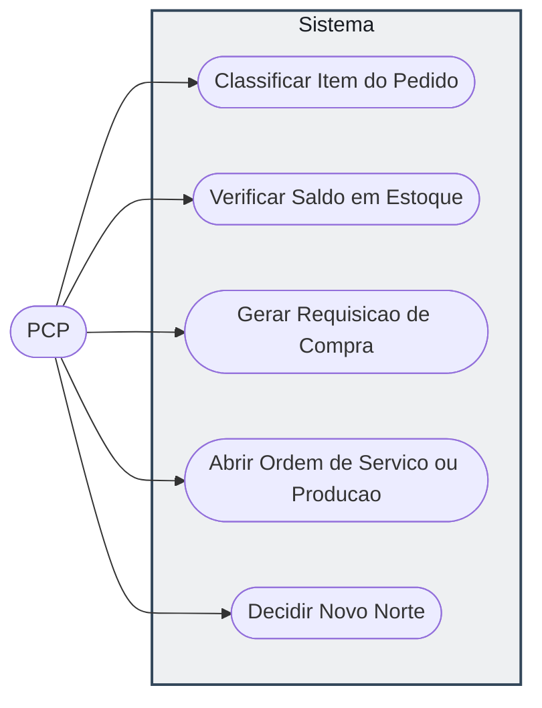
```mermaid
flowchart LR
    PCP(["PCP"])
    subgraph SISTEMA[Sistema]
        UC4([Classificar Item do Pedido])
        UC5([Verificar Saldo em Estoque])
        UC6([Gerar Requisicao de Compra])
        UC7([Abrir Ordem de Servico ou Producao])
        UC8([Decidir Novo Norte])
    end
    PCP --> UC4
    PCP --> UC5
    PCP --> UC6
    PCP --> UC7
    PCP --> UC8

    style SISTEMA fill:#eef0f2,stroke:#33475a,stroke-width:2px,color:#181c22
```

### 4c. Compras

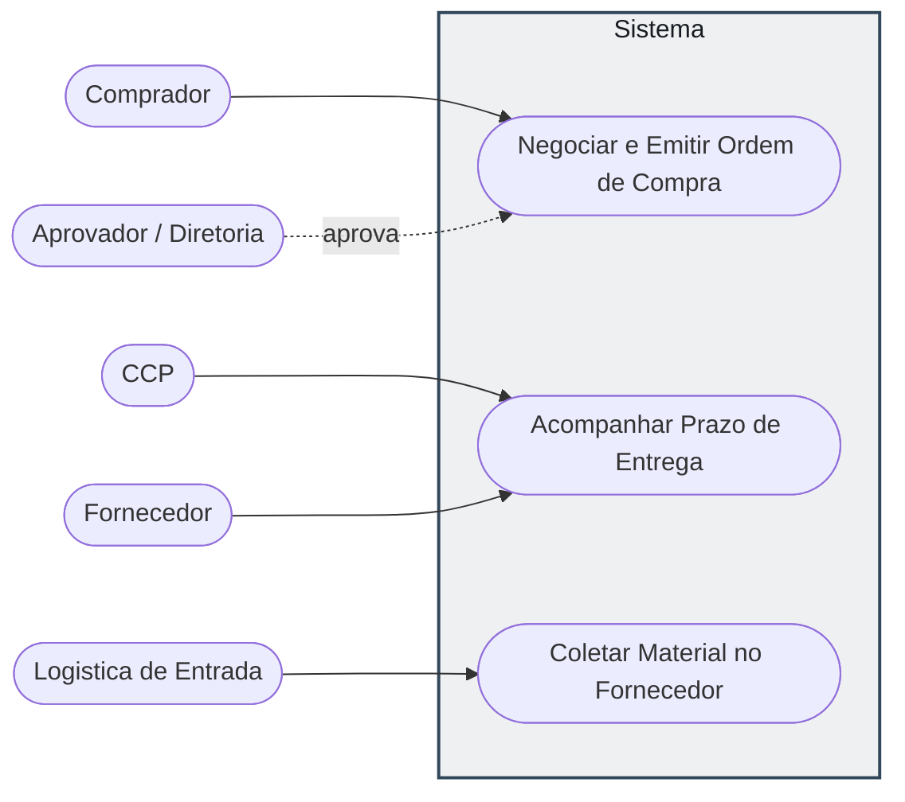
```mermaid
flowchart LR
    Comprador(["Comprador"])
    Diretoria(["Aprovador / Diretoria"])
    CCP(["CCP"])
    Fornecedor(["Fornecedor"])
    LogEnt(["Logistica de Entrada"])
    subgraph SISTEMA[Sistema]
        UC9([Negociar e Emitir Ordem de Compra])
        UC10([Acompanhar Prazo de Entrega])
        UC11([Coletar Material no Fornecedor])
    end
    Comprador --> UC9
    Diretoria -.aprova.-> UC9
    CCP --> UC10
    Fornecedor --> UC10
    LogEnt --> UC11

    style SISTEMA fill:#eef0f2,stroke:#33475a,stroke-width:2px,color:#181c22
```

### 4d. Recebimento & Qualidade

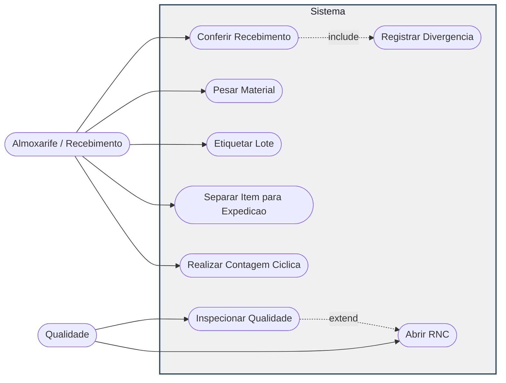
```mermaid
flowchart LR
    Almoxarife(["Almoxarife / Recebimento"])
    Qualidade(["Qualidade"])
    subgraph SISTEMA[Sistema]
        UC12([Conferir Recebimento])
        UC13([Registrar Divergencia])
        UC14([Pesar Material])
        UC15([Etiquetar Lote])
        UC16([Inspecionar Qualidade])
        UC17([Abrir RNC])
        UC19([Separar Item para Expedicao])
        UC20([Realizar Contagem Ciclica])
    end
    Almoxarife --> UC12
    Almoxarife --> UC14
    Almoxarife --> UC15
    Almoxarife --> UC19
    Almoxarife --> UC20
    Qualidade --> UC16
    Qualidade --> UC17
    UC12 -.include.-> UC13
    UC16 -.extend.-> UC17

    style SISTEMA fill:#eef0f2,stroke:#33475a,stroke-width:2px,color:#181c22
```

### 4e. Produção, Expedição & Fiscal

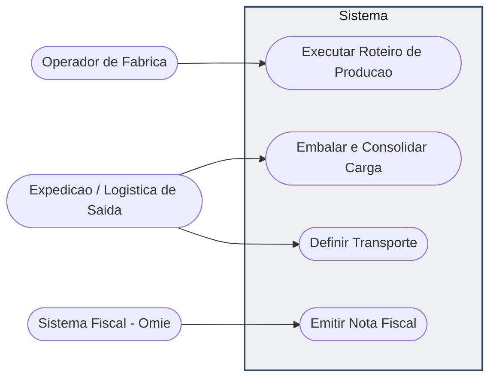
```mermaid
flowchart LR
    Operador(["Operador de Fabrica"])
    Expedicao(["Expedicao / Logistica de Saida"])
    Omie(["Sistema Fiscal - Omie"])
    subgraph SISTEMA[Sistema]
        UC18([Executar Roteiro de Producao])
        UC21([Embalar e Consolidar Carga])
        UC22([Definir Transporte])
        UC23([Emitir Nota Fiscal])
    end
    Operador --> UC18
    Expedicao --> UC21
    Expedicao --> UC22
    Omie --> UC23

    style SISTEMA fill:#eef0f2,stroke:#33475a,stroke-width:2px,color:#181c22
```

**Nota:** mermaid não tem notação nativa de caso de uso (elipses + boneco) — aproximado via flowchart, com o limite do sistema como subgraph. `include`/`extend` marcados como linhas tracejadas rotuladas, seguindo a convenção UML.

## 5. Estados — `ItemParcial`

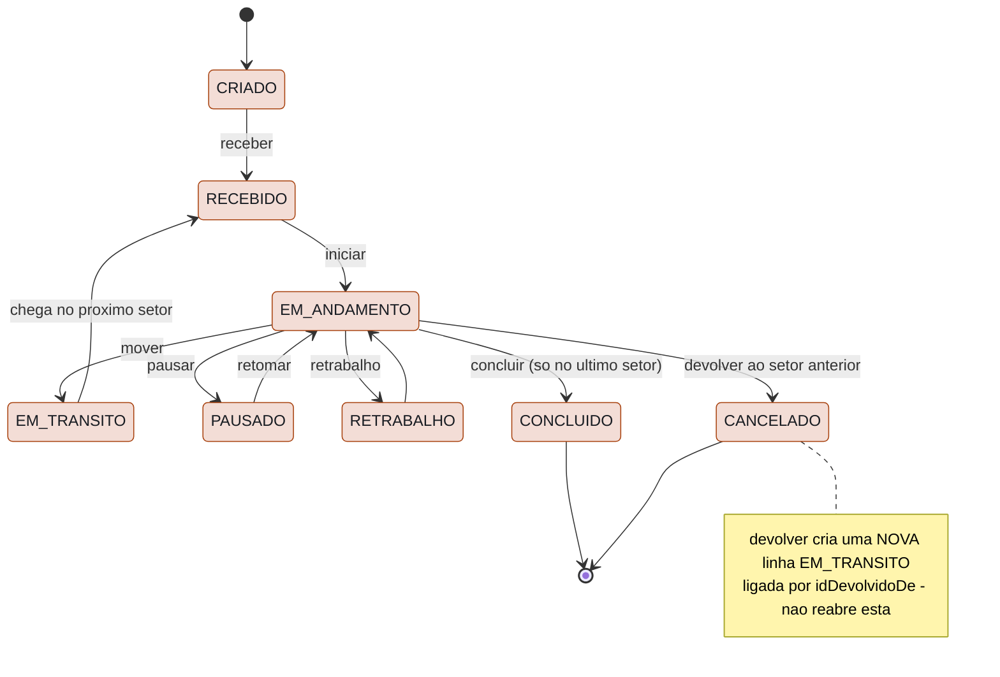
```mermaid
stateDiagram-v2
    [*] --> CRIADO
    CRIADO --> RECEBIDO : receber
    RECEBIDO --> EM_ANDAMENTO : iniciar
    EM_ANDAMENTO --> EM_TRANSITO : mover
    EM_TRANSITO --> RECEBIDO : chega no proximo setor
    EM_ANDAMENTO --> PAUSADO : pausar
    PAUSADO --> EM_ANDAMENTO : retomar
    EM_ANDAMENTO --> RETRABALHO : retrabalho
    RETRABALHO --> EM_ANDAMENTO
    EM_ANDAMENTO --> CONCLUIDO : concluir (so no ultimo setor)
    CONCLUIDO --> [*]
    EM_ANDAMENTO --> CANCELADO : devolver ao setor anterior
    CANCELADO --> [*]

    note right of CANCELADO
        devolver cria uma NOVA linha EM_TRANSITO
        ligada por idDevolvidoDe - nao reabre esta
    end note

    classDef mesStyle fill:#f3ddd6,stroke:#a8420f,color:#181c22
    class CRIADO,RECEBIDO,EM_ANDAMENTO,EM_TRANSITO,PAUSADO,RETRABALHO,CONCLUIDO,CANCELADO mesStyle
```

## 6. Estados — Divergência (`api-pcp`)

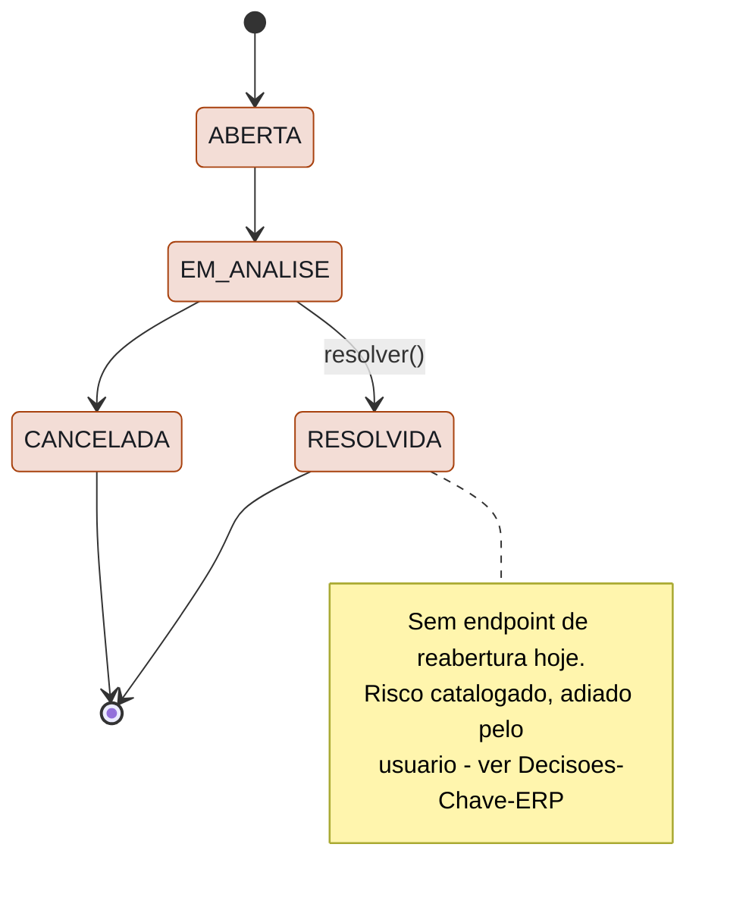
```mermaid
stateDiagram-v2
    [*] --> ABERTA
    ABERTA --> EM_ANALISE
    EM_ANALISE --> RESOLVIDA : resolver()
    EM_ANALISE --> CANCELADA
    RESOLVIDA --> [*]
    CANCELADA --> [*]

    note right of RESOLVIDA
        Sem endpoint de reabertura hoje.
        Risco catalogado, adiado pelo
        usuario - ver Decisoes-Chave-ERP
    end note

    classDef mesStyle fill:#f3ddd6,stroke:#a8420f,color:#181c22
    class ABERTA,EM_ANALISE,RESOLVIDA,CANCELADA mesStyle
```

## 7. Estados — Lote / Qualidade

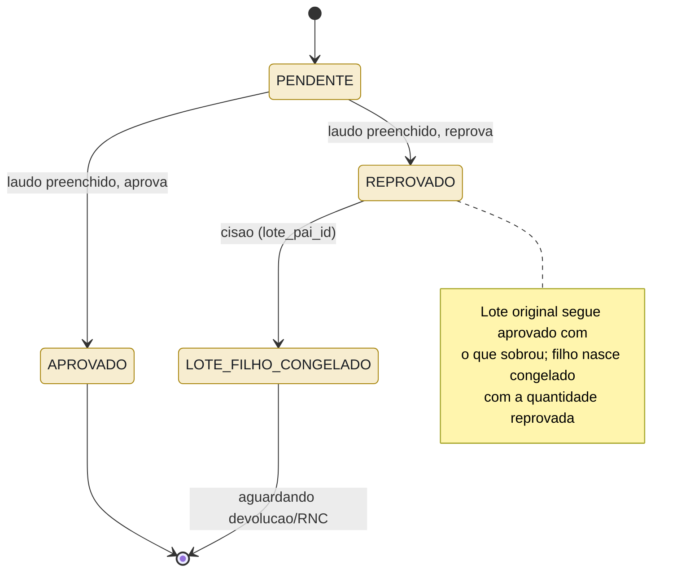
```mermaid
stateDiagram-v2
    [*] --> PENDENTE
    PENDENTE --> APROVADO : laudo preenchido, aprova
    PENDENTE --> REPROVADO : laudo preenchido, reprova
    APROVADO --> [*]
    REPROVADO --> LOTE_FILHO_CONGELADO : cisao (lote_pai_id)
    LOTE_FILHO_CONGELADO --> [*] : aguardando devolucao/RNC

    note right of REPROVADO
        Lote original segue aprovado com
        o que sobrou; filho nasce congelado
        com a quantidade reprovada
    end note

    classDef qualStyle fill:#f7edd0,stroke:#a8860f,color:#181c22
    class PENDENTE,APROVADO,REPROVADO,LOTE_FILHO_CONGELADO qualStyle
```

## 8. Estados — Status do Item no Pedido (visão do vendedor)

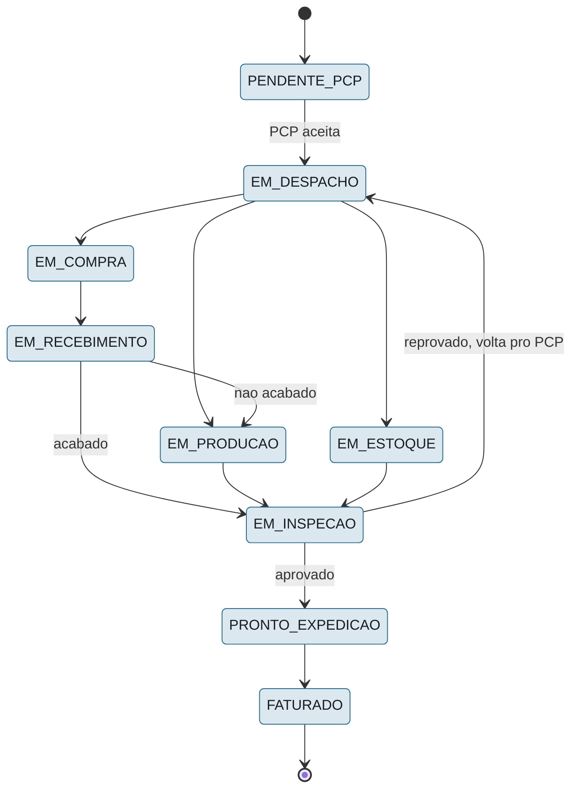
```mermaid
stateDiagram-v2
    [*] --> PENDENTE_PCP
    PENDENTE_PCP --> EM_DESPACHO : PCP aceita
    EM_DESPACHO --> EM_COMPRA
    EM_DESPACHO --> EM_PRODUCAO
    EM_DESPACHO --> EM_ESTOQUE
    EM_COMPRA --> EM_RECEBIMENTO
    EM_RECEBIMENTO --> EM_PRODUCAO : nao acabado
    EM_RECEBIMENTO --> EM_INSPECAO : acabado
    EM_PRODUCAO --> EM_INSPECAO
    EM_ESTOQUE --> EM_INSPECAO
    EM_INSPECAO --> EM_DESPACHO : reprovado, volta pro PCP
    EM_INSPECAO --> PRONTO_EXPEDICAO : aprovado
    PRONTO_EXPEDICAO --> FATURADO
    FATURADO --> [*]

    classDef pcpStyle fill:#dce8ef,stroke:#2f6f8f,color:#181c22
    class PENDENTE_PCP,EM_DESPACHO,EM_COMPRA,EM_PRODUCAO,EM_ESTOQUE,EM_RECEBIMENTO,EM_INSPECAO,PRONTO_EXPEDICAO,FATURADO pcpStyle
```

**Nota:** esse é o status granular que o "casamento av-hub↔MES" precisaria expor pro vendedor — ver [[Decisoes-Chave-ERP]].

## 9. Componentes

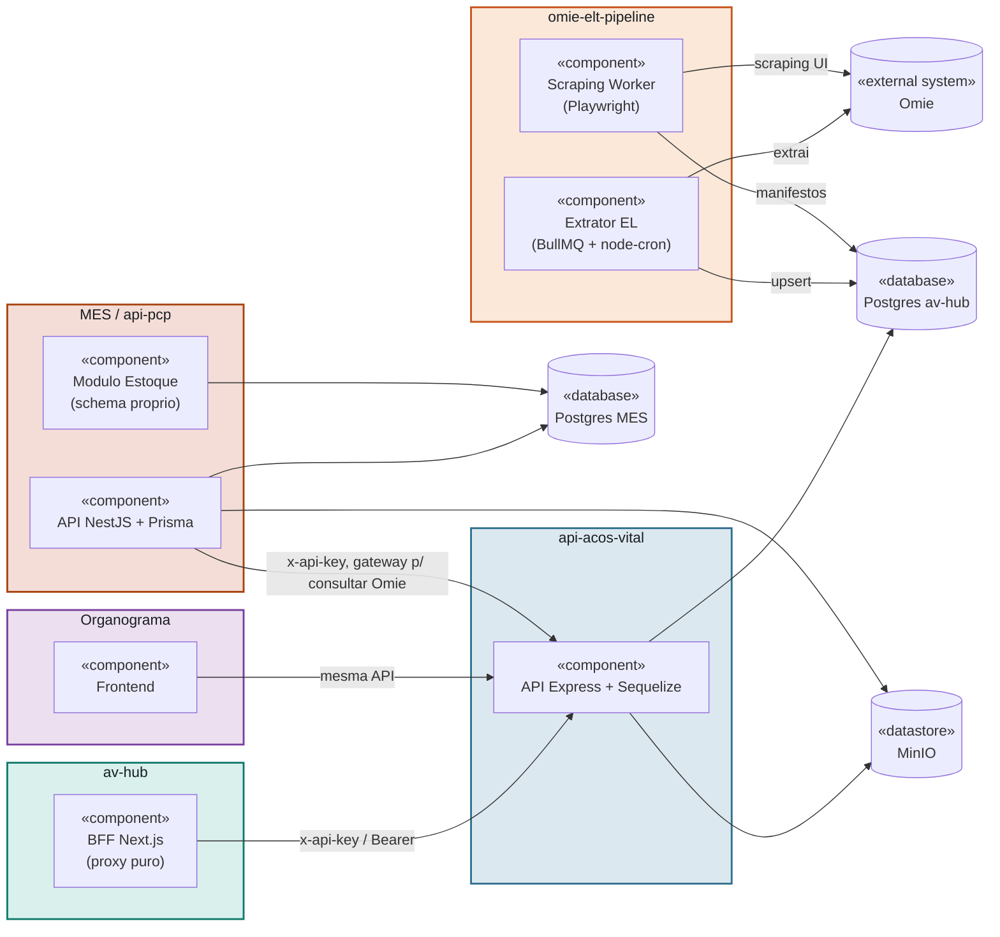
```mermaid
flowchart LR
    subgraph SYS_AVHUB[av-hub]
        BFF["«component»<br/>BFF Next.js<br/>(proxy puro)"]
    end
    subgraph SYS_API[api-acos-vital]
        API["«component»<br/>API Express + Sequelize"]
    end
    subgraph SYS_MES[MES / api-pcp]
        MESAPI["«component»<br/>API NestJS + Prisma"]
        ESTOQUEMOD["«component»<br/>Modulo Estoque<br/>(schema proprio)"]
    end
    subgraph SYS_ORG[Organograma]
        ORGFE["«component»<br/>Frontend"]
    end
    subgraph SYS_ELT[omie-elt-pipeline]
        ELT["«component»<br/>Extrator EL<br/>(BullMQ + node-cron)"]
        SCRAPER["«component»<br/>Scraping Worker<br/>(Playwright)"]
    end
    OMIE[("«external system»<br/>Omie")]
    PGAVHUB[("«database»<br/>Postgres av-hub")]
    PGMES[("«database»<br/>Postgres MES")]
    MINIO[("«datastore»<br/>MinIO")]

    BFF -->|x-api-key / Bearer| API
    ORGFE -->|mesma API| API
    MESAPI -->|x-api-key, gateway p/ consultar Omie| API
    API --> PGAVHUB
    MESAPI --> PGMES
    ESTOQUEMOD --> PGMES
    ELT -->|upsert| PGAVHUB
    SCRAPER -->|manifestos| PGAVHUB
    ELT -->|extrai| OMIE
    SCRAPER -->|scraping UI| OMIE
    API --> MINIO
    MESAPI --> MINIO

    style SYS_AVHUB fill:#d9f0ec,stroke:#0f7a6b,stroke-width:2px,color:#181c22
    style SYS_API fill:#dce8ef,stroke:#2f6f8f,stroke-width:2px,color:#181c22
    style SYS_MES fill:#f3ddd6,stroke:#a8420f,stroke-width:2px,color:#181c22
    style SYS_ORG fill:#ece0f0,stroke:#7a3f9e,stroke-width:2px,color:#181c22
    style SYS_ELT fill:#fbe8d9,stroke:#c9541a,stroke-width:2px,color:#181c22
```

**Nota:** `quality-api` (mencionada no código do av-hub) é sistema não relacionado, omitida aqui — ver [[Perguntas-Pendentes-MES-Estoque]].

## 10. Implantação

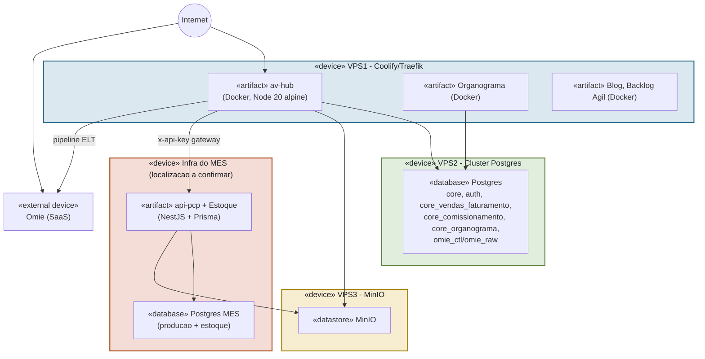
```mermaid
flowchart TB
    subgraph VPS1["«device» VPS1 - Coolify/Traefik"]
        AVHUBC["«artifact» av-hub<br/>(Docker, Node 20 alpine)"]
        ORGC["«artifact» Organograma (Docker)"]
        BLOGC["«artifact» Blog, Backlog Agil (Docker)"]
    end
    subgraph VPS2["«device» VPS2 - Cluster Postgres"]
        PG["«database» Postgres<br/>core, auth, core_vendas_faturamento,<br/>core_comissionamento, core_organograma,<br/>omie_ctl/omie_raw"]
    end
    subgraph VPS3["«device» VPS3 - MinIO"]
        MINIOD["«datastore» MinIO"]
    end
    subgraph VPSMES["«device» Infra do MES<br/>(localizacao a confirmar)"]
        MESAPPD["«artifact» api-pcp + Estoque<br/>(NestJS + Prisma)"]
        PGMESD["«database» Postgres MES<br/>(producao + estoque)"]
    end
    INTERNET(("Internet"))
    OMIED["«external device»<br/>Omie (SaaS)"]

    AVHUBC --> PG
    AVHUBC --> MINIOD
    ORGC --> PG
    MESAPPD --> PGMESD
    MESAPPD --> MINIOD
    AVHUBC -->|x-api-key gateway| MESAPPD
    INTERNET --> AVHUBC
    INTERNET --> OMIED
    AVHUBC -->|pipeline ELT| OMIED

    style VPS1 fill:#dce8ef,stroke:#2f6f8f,stroke-width:2px,color:#181c22
    style VPS2 fill:#e1eede,stroke:#5a7d3a,stroke-width:2px,color:#181c22
    style VPS3 fill:#f7edd0,stroke:#a8860f,stroke-width:2px,color:#181c22
    style VPSMES fill:#f3ddd6,stroke:#a8420f,stroke-width:2px,color:#181c22
```

**Nota:** onde a infra do MES roda de fato (mesma VPS1/2, ou separada) não está confirmado no vault — marcado explicitamente como pendência, não assumido. Ver [[Infraestrutura-Self-Hosted]].

## 11. Pacotes — Dependência entre Schemas Postgres

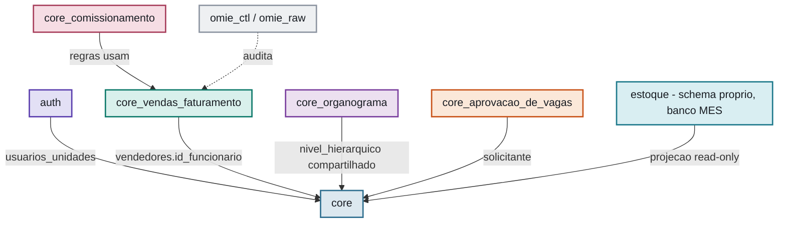
```mermaid
flowchart TB
    subgraph P_CORE[core]
    end
    subgraph P_AUTH[auth]
    end
    subgraph P_VENDAS[core_vendas_faturamento]
    end
    subgraph P_COMISSAO[core_comissionamento]
    end
    subgraph P_VAGAS[core_aprovacao_de_vagas]
    end
    subgraph P_ORG[core_organograma]
    end
    subgraph P_OMIECTL[omie_ctl / omie_raw]
    end
    subgraph P_ESTOQUE[estoque - schema proprio, banco MES]
    end

    P_AUTH -->|usuarios_unidades| P_CORE
    P_VENDAS -->|vendedores.id_funcionario| P_CORE
    P_COMISSAO -->|regras usam| P_VENDAS
    P_ORG -->|nivel_hierarquico compartilhado| P_CORE
    P_VAGAS -->|solicitante| P_CORE
    P_OMIECTL -.audita.-> P_VENDAS
    P_ESTOQUE -->|projecao read-only| P_CORE

    style P_CORE fill:#dce8ef,stroke:#2f6f8f,stroke-width:2px,color:#181c22
    style P_AUTH fill:#e3e0f5,stroke:#5b3fae,stroke-width:2px,color:#181c22
    style P_VENDAS fill:#d9f0ec,stroke:#0f7a6b,stroke-width:2px,color:#181c22
    style P_COMISSAO fill:#f6dde4,stroke:#a83f5c,stroke-width:2px,color:#181c22
    style P_VAGAS fill:#fbe8d9,stroke:#c9541a,stroke-width:2px,color:#181c22
    style P_ORG fill:#ece0f0,stroke:#7a3f9e,stroke-width:2px,color:#181c22
    style P_OMIECTL fill:#eef0f2,stroke:#8d95a1,stroke-width:2px,color:#181c22
    style P_ESTOQUE fill:#d9eef2,stroke:#1f7a8c,stroke-width:2px,color:#181c22
```

## 12. Comunicação — fluxo mestre, visão estrutural

> Mesma informação do [[Fluxo-Detalhado-Pedido-Item|fluxo mestre de sequência]], só que organizada pela **rede de comunicação entre objetos** (quem fala com quem), não pela linha do tempo — foco na estrutura de mensagens, não na ordem cronológica estrita.

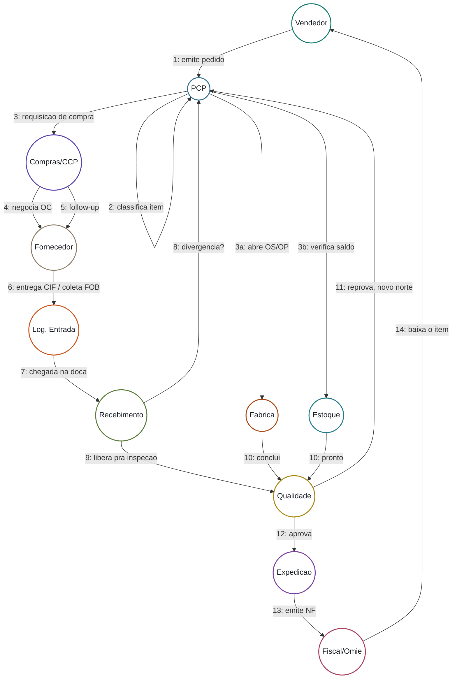
```mermaid
flowchart TD
    Vendedor((Vendedor))
    PCP((PCP))
    Compras((Compras/CCP))
    Fornecedor((Fornecedor))
    LogEnt((Log. Entrada))
    Receb((Recebimento))
    Fabrica((Fabrica))
    Estoque((Estoque))
    Qualidade((Qualidade))
    Expedicao((Expedicao))
    Fiscal((Fiscal/Omie))

    Vendedor -- "1: emite pedido" --> PCP
    PCP -- "2: classifica item" --> PCP
    PCP -- "3: requisicao de compra" --> Compras
    PCP -- "3a: abre OS/OP" --> Fabrica
    PCP -- "3b: verifica saldo" --> Estoque
    Compras -- "4: negocia OC" --> Fornecedor
    Compras -- "5: follow-up" --> Fornecedor
    Fornecedor -- "6: entrega CIF / coleta FOB" --> LogEnt
    LogEnt -- "7: chegada na doca" --> Receb
    Receb -- "8: divergencia?" --> PCP
    Receb -- "9: libera pra inspecao" --> Qualidade
    Fabrica -- "10: conclui" --> Qualidade
    Estoque -- "10: pronto" --> Qualidade
    Qualidade -- "11: reprova, novo norte" --> PCP
    Qualidade -- "12: aprova" --> Expedicao
    Expedicao -- "13: emite NF" --> Fiscal
    Fiscal -- "14: baixa o item" --> Vendedor

    style Vendedor fill:#ffffff,stroke:#0f7a6b,stroke-width:2px,color:#181c22
    style PCP fill:#ffffff,stroke:#2f6f8f,stroke-width:2px,color:#181c22
    style Compras fill:#ffffff,stroke:#5b3fae,stroke-width:2px,color:#181c22
    style Fornecedor fill:#ffffff,stroke:#8a7a63,stroke-width:2px,color:#181c22
    style LogEnt fill:#ffffff,stroke:#c9541a,stroke-width:2px,color:#181c22
    style Receb fill:#ffffff,stroke:#5a7d3a,stroke-width:2px,color:#181c22
    style Fabrica fill:#ffffff,stroke:#a8420f,stroke-width:2px,color:#181c22
    style Estoque fill:#ffffff,stroke:#1f7a8c,stroke-width:2px,color:#181c22
    style Qualidade fill:#ffffff,stroke:#a8860f,stroke-width:2px,color:#181c22
    style Expedicao fill:#ffffff,stroke:#7a3f9e,stroke-width:2px,color:#181c22
    style Fiscal fill:#ffffff,stroke:#a83f5c,stroke-width:2px,color:#181c22
```

## 13. Objetos — instância concreta (item de Revenda com beneficiamento)

> Snapshot de um cenário real: chapa comprada (não acabada), recebida, cortada (beneficiamento via `ItemParcial`), aprovada. Mostra os objetos do diagrama 1 (Estoque) com valores concretos, não só os tipos.

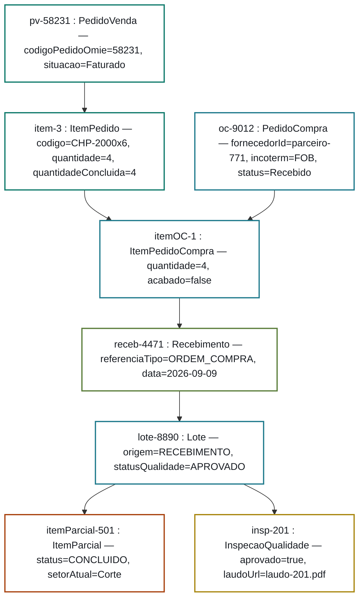
```mermaid
flowchart TD
    PV["pv-58231 : PedidoVenda — codigoPedidoOmie=58231, situacao=Faturado"]
    IP["item-3 : ItemPedido — codigo=CHP-2000x6, quantidade=4, quantidadeConcluida=4"]
    PC["oc-9012 : PedidoCompra — fornecedorId=parceiro-771, incoterm=FOB, status=Recebido"]
    IPC["itemOC-1 : ItemPedidoCompra — quantidade=4, acabado=false"]
    REC["receb-4471 : Recebimento — referenciaTipo=ORDEM_COMPRA, data=2026-09-09"]
    LOTE["lote-8890 : Lote — origem=RECEBIMENTO, statusQualidade=APROVADO"]
    IPARC["itemParcial-501 : ItemParcial — status=CONCLUIDO, setorAtual=Corte"]
    INSP["insp-201 : InspecaoQualidade — aprovado=true, laudoUrl=laudo-201.pdf"]

    PV --> IP
    IP --> IPC
    PC --> IPC
    IPC --> REC
    REC --> LOTE
    LOTE --> IPARC
    LOTE --> INSP

    style PV fill:#ffffff,stroke:#0f7a6b,stroke-width:2px,color:#181c22
    style IP fill:#ffffff,stroke:#0f7a6b,stroke-width:2px,color:#181c22
    style PC fill:#ffffff,stroke:#1f7a8c,stroke-width:2px,color:#181c22
    style IPC fill:#ffffff,stroke:#1f7a8c,stroke-width:2px,color:#181c22
    style REC fill:#ffffff,stroke:#5a7d3a,stroke-width:2px,color:#181c22
    style LOTE fill:#ffffff,stroke:#1f7a8c,stroke-width:2px,color:#181c22
    style IPARC fill:#ffffff,stroke:#a8420f,stroke-width:2px,color:#181c22
    style INSP fill:#ffffff,stroke:#a8860f,stroke-width:2px,color:#181c22
```

**Nota:** repara que `IPC.acabado=false` é o gatilho de todo o resto do cenário — se fosse `true`, `REC` conferiria contra `PV` em vez de `PC`, e não existiria `IPARC` nenhum (ia direto pra `INSP`). Ver [[Fluxo-Recebimento-Completo]].

## 14. Estrutura Composta — `Pedido` como composição

> Mostra `Pedido` como um **todo** composto por `ItemPedido` (partes), cada um composto por `ItemParcial` (partes), com **portas** (`setorAtual`) conectando pro ambiente externo (`Setor`). Diferente do diagrama de classes: aqui o foco é composição física real de uma instância, não o tipo.

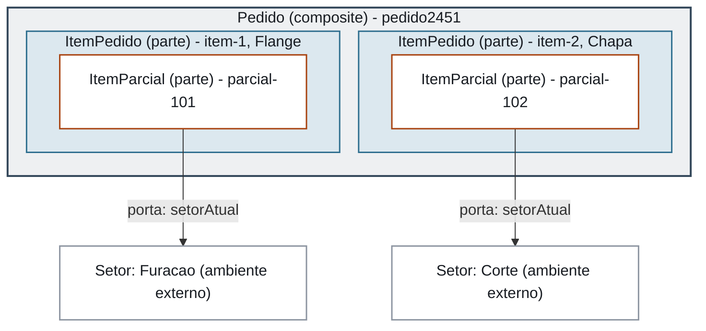
```mermaid
flowchart TD
    subgraph PEDIDO["Pedido (composite) - pedido2451"]
        direction TB
        subgraph ITEM1["ItemPedido (parte) - item-1, Flange"]
            IPARC1["ItemParcial (parte) - parcial-101"]
        end
        subgraph ITEM2["ItemPedido (parte) - item-2, Chapa"]
            IPARC2["ItemParcial (parte) - parcial-102"]
        end
    end

    SETOR_FUR["Setor: Furacao (ambiente externo)"]
    SETOR_CORTE["Setor: Corte (ambiente externo)"]

    IPARC1 -- "porta: setorAtual" --> SETOR_FUR
    IPARC2 -- "porta: setorAtual" --> SETOR_CORTE

    style PEDIDO fill:#eef0f2,stroke:#33475a,stroke-width:2px,color:#181c22
    style ITEM1 fill:#dce8ef,stroke:#2f6f8f,stroke-width:1.5px,color:#181c22
    style ITEM2 fill:#dce8ef,stroke:#2f6f8f,stroke-width:1.5px,color:#181c22
    style IPARC1 fill:#ffffff,stroke:#a8420f,stroke-width:1.5px,color:#181c22
    style IPARC2 fill:#ffffff,stroke:#a8420f,stroke-width:1.5px,color:#181c22
    style SETOR_FUR fill:#ffffff,stroke:#8d95a1,stroke-width:1.5px,color:#181c22
    style SETOR_CORTE fill:#ffffff,stroke:#8d95a1,stroke-width:1.5px,color:#181c22
```

## 15. Visão Geral de Interação — encadeamento dos 6 diagramas de sequência

> Cada retângulo `ref:` é uma **ocorrência de interação** — referencia um dos 6 diagramas de sequência já existentes ([[Fluxo-Compras-Completo]] etc.), sem repetir o conteúdo. Mostra só o fluxo de controle entre eles.

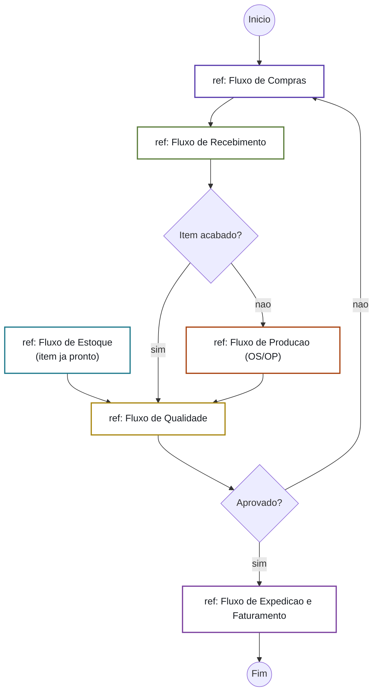
```mermaid
flowchart TD
    START((Inicio)) --> REF1["ref: Fluxo de Compras"]
    REF5["ref: Fluxo de Estoque<br>(item ja pronto)"] --> REF4
    REF1 --> REF2["ref: Fluxo de Recebimento"]
    REF2 --> DEC{Item acabado?}
    DEC -- nao --> REF3["ref: Fluxo de Producao (OS/OP)"]
    DEC -- sim --> REF4["ref: Fluxo de Qualidade"]
    REF3 --> REF4
    REF4 --> DEC2{Aprovado?}
    DEC2 -- nao --> REF1
    DEC2 -- sim --> REF6["ref: Fluxo de Expedicao e Faturamento"]
    REF6 --> END((Fim))

    style REF1 fill:#ffffff,stroke:#5b3fae,stroke-width:2px,color:#181c22
    style REF2 fill:#ffffff,stroke:#5a7d3a,stroke-width:2px,color:#181c22
    style REF3 fill:#ffffff,stroke:#a8420f,stroke-width:2px,color:#181c22
    style REF4 fill:#ffffff,stroke:#a8860f,stroke-width:2px,color:#181c22
    style REF5 fill:#ffffff,stroke:#1f7a8c,stroke-width:2px,color:#181c22
    style REF6 fill:#ffffff,stroke:#7a3f9e,stroke-width:2px,color:#181c22
```

> ⚠️ Único diagrama novo com ` ` num rótulo (dentro de `REF5`) — mantido curto de propósito pra reduzir risco do problema já visto antes (texto colado se o ` ` não virar quebra de linha nesse renderizador). Se aparecer colado, é só remover o ` ` e deixar numa linha só.

## 16. Tempo (Timing) — ciclo de vida do item vs. SLA

> Mermaid não tem notação nativa de diagrama de tempo (bandas de estado por lifeline). Aproximado via **Gantt**, que é o tipo mermaid mais estável — cada barra é o tempo que o item passou naquele estado, com marco (`milestone`) no prazo (`data_previsao`) já documentado no SLA do Portal do Vendedor.

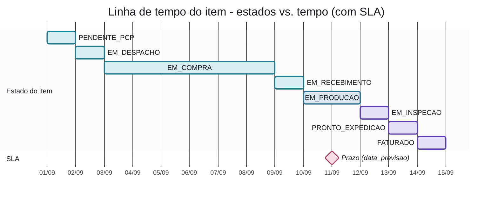
```mermaid
%%{init: {'theme': 'base', 'themeVariables': {
  'titleColor': '#181c22',
  'textColor': '#181c22',
  'taskTextColor': '#181c22',
  'taskTextOutsideColor': '#181c22',
  'taskTextLightColor': '#181c22',
  'taskTextDarkColor': '#181c22',
  'taskTextClickableColor': '#181c22',
  'sectionBkgColor': '#eef0f2',
  'sectionBkgColor2': '#ffffff',
  'altSectionBkgColor': '#ffffff',
  'gridColor': '#c7ccd1',
  'todayLineColor': '#c9541a',
  'doneTaskBkgColor': '#d9eef2',
  'doneTaskBorderColor': '#1f7a8c',
  'activeTaskBkgColor': '#dce8ef',
  'activeTaskBorderColor': '#2f6f8f',
  'taskBkgColor': '#e3e0f5',
  'taskBorderColor': '#5b3fae',
  'critBkgColor': '#f6dde4',
  'critBorderColor': '#a83f5c'
}}}%%
gantt
    title Linha de tempo do item - estados vs. tempo (com SLA)
    dateFormat YYYY-MM-DD
    axisFormat %d/%m
    section Estado do item
    PENDENTE_PCP         :done, s1, 2026-09-01, 1d
    EM_DESPACHO           :done, s2, 2026-09-02, 1d
    EM_COMPRA             :done, s3, 2026-09-03, 6d
    EM_RECEBIMENTO        :done, s4, 2026-09-09, 1d
    EM_PRODUCAO           :active, s5, 2026-09-10, 2d
    EM_INSPECAO           :s6, 2026-09-12, 1d
    PRONTO_EXPEDICAO      :s7, 2026-09-13, 1d
    FATURADO              :s8, 2026-09-14, 1d
    section SLA
    Prazo (data_previsao) :crit, milestone, 2026-09-11, 0d
```

**Nota:** neste exemplo o item **estoura o SLA** — o prazo (`data_previsao`) cai em 11/09, no meio da barra `EM_PRODUCAO`, então a partir daí o item já entraria na régua vermelha/piscando descrita em [[AV-Hub-Portal-Vendedor-Plano]] antes mesmo de chegar na inspeção.

---

# Parte 2 — Diagramas de apoio ao desenvolvimento (16/09)

> Foco explícito: **Estoque, MES/Produção e a integração av-hub↔MES** — RH/Organograma, Mapas, Portal de Qualidade e Comissionamento ficam de fora por decisão do usuário. Não são UML "puro" em todos os casos, mas são os diagramas que mais ajudam a **desenvolver** o que está sendo discutido.

## 17. Modelo de Dados (PK/FK explícitos) — Estoque

> ⚠️ **Trocado de notação (16/09):** tentei `erDiagram` (pé-de-galinha) duas vezes, sem sucesso — esse ambiente não tem mecanismo confiável de estilo direto pra esse tipo de diagrama (o truque `:::estilo` que resolveu os outros 3 diagramas de classe não existe pra notação ER). Em vez de insistir às cegas numa terceira tentativa, troquei pra `classDiagram` com `«PK»`/`«FK»` explícitos nos atributos — mesma informação que um DBA precisa, tecnologia comprovadamente confiável neste ambiente. Mesmas cardinalidades já corrigidas no diagrama de classes 1.

```mermaid
classDiagram
    class MATERIAL:::estoqueStyle {
        +UUID id «PK»
        +string tipo
        +string categoria
        +decimal peso_teorico
        +decimal tolerancia
        +decimal ponto_pedido
    }
    class PEDIDO_COMPRA:::estoqueStyle {
        +UUID id «PK»
        +UUID fornecedor_id «FK»
        +string incoterm
        +string status
    }
    class ITEM_PEDIDO_COMPRA:::estoqueStyle {
        +UUID id «PK»
        +UUID pedido_compra_id «FK»
        +UUID material_id «FK»
        +decimal quantidade
        +boolean acabado
    }
    class RECEBIMENTO:::estoqueStyle {
        +UUID id «PK»
        +UUID pedido_compra_id «FK»
        +string referencia_tipo
        +date data
    }
    class ITEM_RECEBIDO:::estoqueStyle {
        +UUID id «PK»
        +UUID recebimento_id «FK»
        +decimal quantidade_esperada
        +decimal quantidade_recebida
        +boolean divergencia
    }
    class LOTE:::estoqueStyle {
        +UUID id «PK»
        +UUID material_id «FK»
        +UUID lote_pai_id «FK»
        +string origem
        +string status_qualidade
    }
    class INSPECAO_QUALIDADE:::estoqueStyle {
        +UUID id «PK»
        +UUID lote_id «FK»
        +string laudo_url
        +boolean aprovado
    }
    class RNC:::estoqueStyle {
        +UUID id «PK»
        +UUID inspecao_id «FK»
        +string motivo
        +boolean nota_devolucao_pendente
    }
    class DEPOSITO:::estoqueStyle {
        +UUID id «PK»
        +string codigo
        +string nome
    }
    class LOCALIZACAO_ESTOQUE:::estoqueStyle {
        +UUID id «PK»
        +UUID deposito_id «FK»
        +string corredor
        +string prateleira
    }
    class RESERVA_ESTOQUE:::estoqueStyle {
        +UUID id «PK»
        +UUID lote_id «FK»
        +UUID pedido_origem_id
        +string tipo
        +datetime data_expiracao
    }
    class ORDEM_SEPARACAO:::estoqueStyle {
        +UUID id «PK»
        +string status
    }
    class ITEM_SEPARACAO:::estoqueStyle {
        +UUID id «PK»
        +UUID ordem_separacao_id «FK»
        +UUID lote_id «FK»
        +decimal quantidade
    }
    class MATERIAL_ALIAS_OMIE:::estoqueStyle {
        +string codigo_omie
        +UUID material_canonico_id «FK»
    }
    class NOTA_FISCAL_ENTRADA:::estoqueStyle {
        +string chave_acesso
    }
    class PESAGEM:::estoqueStyle {
        +decimal peso_teorico
        +decimal peso_real
    }
    class MOVIMENTO_ESTOQUE:::estoqueStyle {
        +string tipo
        +string motivo
        +decimal quantidade
    }
    class ETIQUETA:::estoqueStyle {
        +string tipo
        +string valor
    }
    class DEVOLUCAO_CLIENTE:::estoqueStyle {
        +string motivo
    }
    class CONTAGEM_CICLICA:::estoqueStyle {
        +date data_contagem
        +boolean divergencia
    }

    MATERIAL "1" --> "0..*" MATERIAL_ALIAS_OMIE : sanea
    MATERIAL "1" --> "0..*" LOTE : origina
    PEDIDO_COMPRA "1" --> "1..*" ITEM_PEDIDO_COMPRA
    ITEM_PEDIDO_COMPRA "0..*" --> "1" MATERIAL
    RECEBIMENTO "1" --> "1..*" ITEM_RECEBIDO
    RECEBIMENTO "1" --> "0..1" NOTA_FISCAL_ENTRADA
    RECEBIMENTO "0..*" --> "0..1" PEDIDO_COMPRA
    RECEBIMENTO "1" --> "1" PESAGEM
    ITEM_RECEBIDO "0..1" --> "1" LOTE : gera
    LOTE "0..1" --> "0..*" LOTE : cisao
    LOTE "1" --> "0..*" INSPECAO_QUALIDADE
    INSPECAO_QUALIDADE "1" --> "0..1" RNC
    LOTE "1" --> "0..*" MOVIMENTO_ESTOQUE
    LOTE "1" --> "0..*" ETIQUETA
    LOTE "0..1" --> "0..*" LOCALIZACAO_ESTOQUE : ocupa
    DEPOSITO "1" --> "0..*" LOCALIZACAO_ESTOQUE
    RESERVA_ESTOQUE "0..*" --> "1" LOTE
    ORDEM_SEPARACAO "1" --> "1..*" ITEM_SEPARACAO
    ITEM_SEPARACAO "0..*" --> "1" LOTE
    DEVOLUCAO_CLIENTE "1" --> "1..*" ITEM_SEPARACAO
    CONTAGEM_CICLICA "1" --> "0..*" MOVIMENTO_ESTOQUE
    CONTAGEM_CICLICA "0..*" --> "1" LOCALIZACAO_ESTOQUE : conta

    classDef estoqueStyle fill:#d9eef2,stroke:#1f7a8c,color:#181c22
    cssClass "MATERIAL,PEDIDO_COMPRA,ITEM_PEDIDO_COMPRA,RECEBIMENTO,ITEM_RECEBIDO,LOTE,INSPECAO_QUALIDADE,RNC,DEPOSITO,LOCALIZACAO_ESTOQUE,RESERVA_ESTOQUE,ORDEM_SEPARACAO,ITEM_SEPARACAO,MATERIAL_ALIAS_OMIE,NOTA_FISCAL_ENTRADA,PESAGEM,MOVIMENTO_ESTOQUE,ETIQUETA,DEVOLUCAO_CLIENTE,CONTAGEM_CICLICA" estoqueStyle
```

## 18. Modelo de Dados (PK/FK explícitos) — MES/Produção

> Mesma troca de notação do diagrama 17 — `classDiagram` com `«PK»`/`«FK»`, não `erDiagram`.

```mermaid
classDiagram
    class FABRICA:::mesStyle {
        +UUID id «PK»
        +string codigo
        +string nome
    }
    class SETOR:::mesStyle {
        +UUID id «PK»
        +string codigo
        +string nome
        +boolean exige_maquina_operador
    }
    class MAQUINA:::mesStyle {
        +UUID id «PK»
        +UUID id_setor «FK»
        +string codigo
    }
    class PEDIDO:::mesStyle {
        +UUID id «PK»
        +UUID id_fabrica «FK»
        +string pedido_venda
        +string ordem_producao
        +string status
        +string sistema
    }
    class ITEM_PEDIDO:::mesStyle {
        +UUID id «PK»
        +UUID id_pedido «FK»
        +UUID id_item_pai «FK»
        +string codigo
        +decimal quantidade
        +decimal quantidade_concluida
        +boolean inativo
    }
    class ROTEIRO_PEDIDO:::mesStyle {
        +UUID id «PK»
        +UUID id_pedido «FK»
        +UUID id_setor «FK»
        +int ordem
    }
    class ROTEIRO_ITEM:::mesStyle {
        +UUID id «PK»
        +UUID id_item_pedido «FK»
        +UUID id_setor «FK»
        +int ordem
    }
    class ITEM_PARCIAL:::mesStyle {
        +UUID id «PK»
        +UUID id_item_pedido «FK»
        +UUID id_parcial_origem «FK»
        +UUID id_devolvido_de «FK»
        +UUID id_setor_atual «FK»
        +decimal quantidade
        +string status
        +boolean retrabalho
    }
    class HISTORICO_ITEM_PARCIAL:::mesStyle {
        +UUID id «PK»
        +UUID id_item_parcial «FK»
        +string status_anterior
        +string status_novo
    }
    class ITEM_PARCIAL_ANEXO:::mesStyle {
        +UUID id «PK»
        +UUID id_item_parcial «FK»
        +string url
    }
    class ITEM_PARCIAL_OBSERVACAO:::mesStyle {
        +UUID id «PK»
        +UUID id_item_parcial «FK»
        +string texto
    }
    class ENTREGA:::mesStyle {
        +UUID id «PK»
        +UUID id_item_pedido «FK»
        +UUID id_item_parcial «FK»
        +decimal quantidade
        +string numero_nf
    }
    class DIVERGENCIA:::mesStyle {
        +UUID id «PK»
        +UUID id_pedido «FK»
        +UUID id_item_pedido «FK»
        +UUID id_item_parcial «FK»
        +string tipo
        +string status
    }

    FABRICA "1" --> "0..*" SETOR : fabrica_setores
    SETOR "1" --> "0..*" MAQUINA
    FABRICA "1" --> "0..*" PEDIDO
    PEDIDO "1" --> "1..*" ITEM_PEDIDO
    ITEM_PEDIDO "0..1" --> "0..*" ITEM_PEDIDO : id_item_pai
    PEDIDO "1" --> "0..*" ROTEIRO_PEDIDO
    ROTEIRO_PEDIDO "0..*" --> "1" SETOR
    ITEM_PEDIDO "1" --> "0..*" ROTEIRO_ITEM
    ROTEIRO_ITEM "0..*" --> "1" SETOR
    ITEM_PEDIDO "1" --> "0..*" ITEM_PARCIAL
    ITEM_PARCIAL "0..1" --> "0..*" ITEM_PARCIAL : split
    ITEM_PARCIAL "0..1" --> "0..1" ITEM_PARCIAL : devolvido_de
    ITEM_PARCIAL "0..*" --> "1" SETOR : setor_atual
    ITEM_PARCIAL "1" --> "0..*" HISTORICO_ITEM_PARCIAL
    ITEM_PARCIAL "1" --> "0..*" ITEM_PARCIAL_ANEXO
    ITEM_PARCIAL "1" --> "0..*" ITEM_PARCIAL_OBSERVACAO
    ITEM_PEDIDO "1" --> "0..*" ENTREGA
    ITEM_PARCIAL "0..1" --> "0..*" ENTREGA
    PEDIDO "1" --> "0..*" DIVERGENCIA
    ITEM_PEDIDO "0..1" --> "0..*" DIVERGENCIA
    ITEM_PARCIAL "0..1" --> "0..*" DIVERGENCIA

    classDef mesStyle fill:#f3ddd6,stroke:#a8420f,color:#181c22
    cssClass "FABRICA,SETOR,MAQUINA,PEDIDO,ITEM_PEDIDO,ROTEIRO_PEDIDO,ROTEIRO_ITEM,ITEM_PARCIAL,HISTORICO_ITEM_PARCIAL,ITEM_PARCIAL_ANEXO,ITEM_PARCIAL_OBSERVACAO,ENTREGA,DIVERGENCIA" mesStyle
```

## 19. Objetos — cenário real do MES (Flange no roteiro)

> Mesmo estilo do diagrama 13, agora do lado da produção — um pedido de Flange com 2 itens, cada um seguindo um roteiro próprio (confirma o achado do diagrama 2: roteiro por item, não só por pedido).

```mermaid
flowchart TD
    PED["pedido2451 : Pedido — ordemProducao=OP-2451, fabrica=Flanges, status=EM_PRODUCAO"]
    IT1["item-1 : ItemPedido — codigo=FLG-150-2, quantidade=10, quantidadeConcluida=6"]
    IT2["item-2 : ItemPedido — codigo=FLG-300-4, quantidade=5, quantidadeConcluida=5"]
    RI1["roteiroItem-1 : RoteiroItem — setor=Corte, ordem=1 (de item-1)"]
    RI2["roteiroItem-2 : RoteiroItem — setor=Furacao, ordem=2 (de item-1)"]
    IP1["itemParcial-501 : ItemParcial — status=EM_ANDAMENTO, setorAtual=Furacao"]
    IP2["itemParcial-502 : ItemParcial — status=CONCLUIDO, setorAtual=Acabamento"]
    HIST["historico-9001 : HistoricoItemParcial — statusAnterior=EM_TRANSITO, statusNovo=EM_ANDAMENTO"]

    PED --> IT1
    PED --> IT2
    IT1 --> RI1
    IT1 --> RI2
    IT1 --> IP1
    IT2 --> IP2
    IP1 --> HIST

    style PED fill:#ffffff,stroke:#33475a,stroke-width:2px,color:#181c22
    style IT1 fill:#ffffff,stroke:#2f6f8f,stroke-width:2px,color:#181c22
    style IT2 fill:#ffffff,stroke:#2f6f8f,stroke-width:2px,color:#181c22
    style RI1 fill:#ffffff,stroke:#5c6570,stroke-width:2px,color:#181c22
    style RI2 fill:#ffffff,stroke:#5c6570,stroke-width:2px,color:#181c22
    style IP1 fill:#ffffff,stroke:#a8420f,stroke-width:2px,color:#181c22
    style IP2 fill:#ffffff,stroke:#a8420f,stroke-width:2px,color:#181c22
    style HIST fill:#ffffff,stroke:#8d95a1,stroke-width:2px,color:#181c22
```

**Nota:** `item-1` está parcialmente concluído (6 de 10) e ainda tem um `ItemParcial` em andamento em Furação; `item-2` já concluiu tudo. Isso é normal — cada item do mesmo pedido avança de forma independente pelo seu próprio roteiro.

## 20. Estados — Reserva de Estoque (proposta, não construído ainda)

> ⚠️ **Isto é proposta de design, não fato confirmado** — preenche a lacuna já identificada em [[Fluxo-Detalhado-Pedido-Item]] e [[Fluxo-Estoque-Completo]]: falta desenhar o mecanismo de expiração/liberação da reserva. Serve como ponto de partida pra discussão, não como decisão fechada.

```mermaid
stateDiagram-v2
    [*] --> CRIADA : PCP marca "tem em estoque"
    CRIADA --> CONFIRMADA : Qualidade aprova o lote
    CRIADA --> EXPIRADA : timeout sem confirmacao
    CONFIRMADA --> CONSUMIDA : item separado/expedido
    CONFIRMADA --> LIBERADA : pedido cancelado
    EXPIRADA --> [*]
    CONSUMIDA --> [*]
    LIBERADA --> [*]

    note right of EXPIRADA
        Mecanismo de timeout ainda
        nao definido - proposta em
        aberto, ver Fluxo-Estoque-Completo
    end note

    classDef estoqueStyle fill:#d9eef2,stroke:#1f7a8c,color:#181c22
    class CRIADA,CONFIRMADA,EXPIRADA,CONSUMIDA,LIBERADA estoqueStyle
```

## 21. Mapa Geral — arquitetura de dados (av-hub × MES)

> As duas bases lado a lado, só com o que é relevante pra Estoque/MES (RH, Organograma, Mapas, Qualidade, Comissão deliberadamente fora). Os **2 pontos de integração** (C1 e C19 do [[Fluxo-Compras-Completo]]) marcados explicitamente — é a única fronteira que ainda precisa de mecanismo técnico definido.

```mermaid
flowchart LR
    subgraph AVHUB["Cluster av-hub (Postgres, 1 banco)"]
        direction TB
        CORE["schema core<br>produtos, parceiros, unidades"]
        VENDAS["schema core_vendas_faturamento<br>pedidos_vendas, notas_fiscais"]
        COMPRAS["schema core_compras<br>produtos_compras (vinculo)"]
        AUTH["schema auth<br>RBAC do av-hub"]
    end

    subgraph MES["Banco do MES (Prisma, schema public hoje)"]
        direction TB
        PROD["Producao<br>pedidos, itens_parciais, roteiros"]
        ESTOQUEDB["schema estoque (a criar)<br>material, lote, recebimento..."]
    end

    OMIE[("Omie (SaaS externo)")]

    OMIE -->|pipeline ELT, polling| VENDAS
    CORE -.projecao read-only.-> ESTOQUEDB
    COMPRAS -.OC decidida aqui.-> ESTOQUEDB
    PROD -->|"C1: requisicao de compra"| COMPRAS
    ESTOQUEDB -->|"C19: status disponivel"| VENDAS

    style AVHUB fill:#e3e0f5,stroke:#5b3fae,stroke-width:2px,color:#181c22
    style MES fill:#f3ddd6,stroke:#a8420f,stroke-width:2px,color:#181c22
    style CORE fill:#ffffff,stroke:#5b3fae,stroke-width:1.5px,color:#181c22
    style VENDAS fill:#ffffff,stroke:#5b3fae,stroke-width:1.5px,color:#181c22
    style COMPRAS fill:#ffffff,stroke:#5b3fae,stroke-width:1.5px,color:#181c22
    style AUTH fill:#ffffff,stroke:#5b3fae,stroke-width:1.5px,color:#181c22
    style PROD fill:#ffffff,stroke:#a8420f,stroke-width:1.5px,color:#181c22
    style ESTOQUEDB fill:#ffffff,stroke:#1f7a8c,stroke-width:1.5px,color:#181c22
```

**Nota:** as duas setas `C1`/`C19` cruzando a fronteira dos bancos são exatamente os 2 pontos que dependem do "casamento av-hub↔MES" ainda não desenhado — ver [[Decisoes-Chave-ERP]]. Todo o resto do diagrama já existe ou já foi decidido.

## 22. Fluxo de Dados — Omie até o Estoque

> Não é UML — é um DFD (Data Flow Diagram) simplificado, mas é o que melhor responde "de onde vem o dado e em que velocidade" pra quem for desenvolver a integração.

```mermaid
flowchart LR
    OMIE[("Omie")]
    ELT["Pipeline ELT (polling, 3min-diario)"]
    PGAVHUB[("Postgres av-hub")]
    GATEWAY["Gateway api-acos-vital (x-api-key)"]
    PGMES[("Postgres MES")]
    ESTMOD["Modulo Estoque (a construir)"]

    OMIE -->|extrai, upsert| ELT
    ELT -->|grava| PGAVHUB
    PGAVHUB -->|le, via API| GATEWAY
    GATEWAY -->|consulta pedido, projecao parceiros/produtos| PGMES
    PGMES --> ESTMOD

    style OMIE fill:#ffffff,stroke:#8a7a63,stroke-width:2px,color:#181c22
    style ELT fill:#ffffff,stroke:#c9541a,stroke-width:2px,color:#181c22
    style PGAVHUB fill:#ffffff,stroke:#5b3fae,stroke-width:2px,color:#181c22
    style GATEWAY fill:#ffffff,stroke:#33475a,stroke-width:2px,color:#181c22
    style PGMES fill:#ffffff,stroke:#a8420f,stroke-width:2px,color:#181c22
    style ESTMOD fill:#ffffff,stroke:#1f7a8c,stroke-width:2px,color:#181c22
```

**Nota:** essa é a velocidade **hoje confirmada** (polling em camadas, sem webhook). Se "status por item em tempo real" (C19 do mapa acima) for levado a sério, esse desenho precisa de um caminho novo — não existe hoje.

## Ver também
- [[Fluxogramas-Completos]] — diagramas de atividade (equivalente UML), com raias por setor.
- [[Fluxo-Compras-Completo]], [[Fluxo-Recebimento-Completo]], [[Fluxo-Qualidade-Completo]], [[Fluxo-Producao-OS-OP-Completo]], [[Fluxo-Expedicao-Faturamento-Completo]], [[Fluxo-Estoque-Completo]] — diagramas de sequência.
- [[Setores-Envolvidos-no-Fluxo]]
- [[Schema-Postgres-Multi-Dominio]]
- [[Estoque-Modelo-Dados]]
- [[App-PCP-Backend-Producao]]
- [[Achado-Duplicacao-RBAC]]
- [[Infraestrutura-Self-Hosted]]
