# Diagramas UML — Modelo Completo

> Status: decidido (verificado em 07/10/2026) — implantação (diagrama 10) e schema `public` do Estoque conforme [[Registro-de-Decisoes-2026-10-07]], itens 4 e 21.

> **Atualizado em 08/10/2026 contra o código** (`api-pcp` `develop` `ca3346b`, `av-hub` `develop` `bd1ae48`, `api-acos-vital` `develop` `0557871`; só leitura de código). Diagramas 9, 10 e 22 corrigidos (integração MES → av-hub já existe: contratos 34 e 35; entrou o serviço `api-comercial`). **Novos:** 23 (Recebimento e integração com o av-hub no `api-pcp`), 24 (Estados do Recebimento) e 25 (Classes do `api-comercial`, schema `core_comercial`). Os diagramas 1, 2, 17 e 18 não foram refeitos linha a linha: ver as lacunas listadas em "Cobertura do código" no fim.

> **Versão publicada:** o artifact [UML Completo](https://claude.ai/artifact/Avx11cnLz1DgAxbdJmDiQy) foi republicado em 08/10/2026 com 31 diagramas (os desta nota, incluindo 9, 10 e 22 corrigidos e os novos 23 a 25, que lá aparecem como abas 27, 28 e 29). Os diagramas 1, 2, 17 e 18 seguem como estavam no artifact e nesta nota.

> Conjunto de diagramas UML (e aproximações fiéis via mermaid, onde a notação nativa não existe) cobrindo o máximo possível do que já foi analisado no vault. **Sequência e Atividades já existem** desde antes deste arquivo — ver 0a/0b abaixo pra preview embutido, e [[Fluxo-Compras-Completo]] + 4 irmãos / [[Fluxogramas-Completos]] pro conjunto completo (6 de cada).
>
> **Diagramas 0a-0b:** Sequência e Atividades — os 2 que ficavam só citados em texto antes, agora com preview real. **Parte 1 (diagramas 1-16):** cobertura completa dos demais tipos UML — 3 de Classes, 1 de Casos de Uso, 4 de Estados, 1 de Componentes, 1 de Implantação, 1 de Pacotes, 1 de Comunicação, 1 de Objetos, 1 de Estrutura Composta, 1 de Visão Geral de Interação, 1 de Tempo. Diagrama de Perfil (Profile) deliberadamente fora do escopo — não se aplica a documentar uma aplicação de negócio como esta.
>
> **Atualizado em 24/09/2026 com o encaixe do Estoque e da Revenda no MES** ([[Encaixe-Estoque-Revenda-no-PCP]]): diagramas 0a, 0b, 1, 2, 4b, 8, 12, 13, 15, 16, 17, 18, 19, 20 e 21 revistos — Revenda como fábrica (`Fabrica.tipo`), Estoque e Compras como setores tipados (`Setor.tipo`), Estoque como etapa 1 de todo roteiro, reserva por lote + `ItemParcial` sem expiração, `MovimentoEstoque` com tipo e referência, e o item comprado aprovado voltando ao Estoque (não direto para a Expedição).
>
> **Atualizado em 01/10/2026 com a arquitetura confirmada em 29/09/2026** ([[Encaixe-Estoque-Revenda-no-PCP]] seção 5) **e conferido no código** do `api-pcp` (`develop`, 29/09): setor Estoque único; **circuito de compra fixo fora do roteiro** (Estoque → Requisições → Compras → Recebimento → Qualidade · Entrada → volta ao mesmo Estoque); inspeção de entrada **por lote** e de saída como **setor `QUALIDADE` no roteiro**; reprovação parcial com a parte aprovada em quarentena (EC-07); todo item, comprado ou fabricado, volta ao Estoque antes da Expedição; `Material` nasce na primeira entrada de estoque (D3 revisada); o pedido só chega ao PCP depois que o vendedor libera (Fluxo 4, [[26-Vendas-Liberacao-Pedido]]). **Baixa do saldo:** decidida no despacho do Estoque (29/09), mas o código ainda baixa quando a Embalagem recebe — os diagramas mostram as duas coisas. Diagramas revistos: 0a, 0b, 1, 2, 4a-4d, 5, 7, 8, 9, 11, 12, 13, 15, 16, 17, 18, 19, 20, 21 e 22.
>
> **Parte 2 (diagramas 17-22):** foco em desenvolvimento — modelo de dados com PK/FK explícitos de Estoque e MES (17/18, originalmente tentados como `erDiagram`, convertidos pra `classDiagram` por limitação de renderização — ver nota no 17), mais um Objetos, um Estados (proposta de Reserva de Estoque), um mapa geral de arquitetura de dados e um Fluxo de Dados. Deliberadamente fora: Mapas, Portal de Qualidade, Comissionamento.

## 0a. Sequência (já existe) — preview: Fluxo de Compras

> **Revisto em 01/10/2026:** circuito de compra fixo, disparado pelo "Solicitar compra" do Estoque; a requisição é lida pelo av-hub (contrato 003); o lote nasce em quarentena no Recebimento e a inspeção de entrada é por lote; a reprovação parcial segue o EC-07. Os 6 `Fluxo-*-Completo.md` ainda estão no desenho de 24/09.
>
> Este é 1 dos 6 diagramas de sequência completos (`Fluxo-*-Completo.md`), embutido aqui de verdade. Os outros 5 (Recebimento, Qualidade, Produção/OS-OP, Expedição/Faturamento, Estoque) seguem o mesmo padrão — não embutidos aqui só por espaço, mas são o mesmo tipo de diagrama, com o mesmo nível de detalhe.

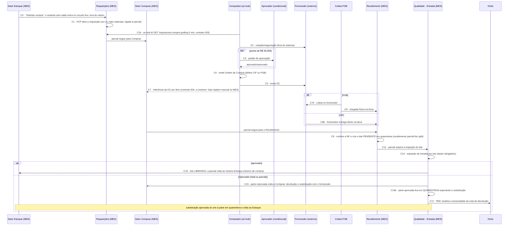
```mermaid
sequenceDiagram
    participant Est as Setor Estoque (MES)
    participant Req as Requisições (MES)
    participant SCom as Setor Compras (MES)
    participant Compras as Comprador (av-hub)
    participant Aprov as Aprovador (condicional)
    participant Forn as Fornecedor (externo)
    participant Coleta as Coleta FOB
    participant Receb as Recebimento (MES)
    participant QE as Qualidade · Entrada (MES)
    participant Omie

    Est->>Req: C0 · "Solicitar compra": o restante sem saldo entra no circuito fixo, fora do roteiro
    Req->>Req: C1 · PCP abre a requisição (um ou mais materiais, ligada à parcial)
    Compras->>Req: C1b · av-hub lê GET /requisicoes-compra (polling 5 min, contrato 003)
    Req->>SCom: parcial segue para Compras
    Compras->>Forn: C2 · cotação/negociação (fora do sistema)
    opt acima de R$ 30.000
        Compras->>Aprov: C3 · pedido de aprovação
        Aprov-->>Compras: aprovado/reprovado
    end
    Compras->>Compras: C4 · emite Ordem de Compra (define CIF ou FOB)
    Compras->>Forn: C5 · envia OC
    Compras-->>SCom: C7 · referência da OC por item (contrato 004, a construir: hoje registro manual no MES)
    alt FOB
        Coleta->>Forn: C7b · coleta no fornecedor
        Coleta->>Receb: C8 · chegada física na doca
    else CIF
        Forn->>Receb: C8b · fornecedor entrega direto na doca
    end
    SCom->>Receb: parcial segue para o Recebimento
    Receb->>Receb: C9 · confere a NF e cria o lote PENDENTE em quarentena (recebimento parcial faz split)
    Receb->>QE: C11 · parcial espera a inspeção do lote
    QE->>QE: C14 · inspeção de entrada por lote (laudo obrigatório)
    alt aprovado
        QE->>Est: C19 · lote LIBERADO, a parcial volta ao mesmo Estoque (retorno de compra)
    else reprovado (total ou parcial)
        QE->>SCom: C15 · parte reprovada volta a Compras: devolução e substituição com o fornecedor
        QE->>QE: C15b · parte aprovada fica em QUARENTENA esperando a substituição
        QE->>Omie: C17 · RNC sinaliza a necessidade da nota de devolução
        Note over QE,Est: substituição aprovada se une à parte em quarentena e volta ao Estoque
    end
```

**Fonte completa (todos os 6):** [[Fluxo-Compras-Completo]], [[Fluxo-Recebimento-Completo]], [[Fluxo-Qualidade-Completo]], [[Fluxo-Producao-OS-OP-Completo]], [[Fluxo-Expedicao-Faturamento-Completo]], [[Fluxo-Estoque-Completo]].

## 0b. Atividades (já existe) — preview: Fluxograma mestre

> **Revisto em 01/10/2026:** o pedido chega travado e o vendedor libera; o Estoque decide atender, solicitar compra ou enviar à produção; a compra volta ao Estoque pela inspeção de entrada; a produção passa pela inspeção de saída e também volta ao Estoque; o despacho do Estoque leva à Expedição ou à produção. Ainda não reflete o [[Fluxogramas-Completos]], que está no desenho de 24/09.
>
> O diagrama de atividades oficial da UML — decisões, `fork`/`join` (ramificações paralelas), raias por setor. Este é o mestre (fim a fim); os outros 5 focados (Compras, Recebimento, Qualidade, Produção, Estoque) estão em [[Fluxogramas-Completos]].
>
> **Corrigido (pente-fino, 17/09/2026):** este preview estava desatualizado em relação ao original — tinha `V2 -->|sim| Q1` (sugerindo que "acompanhamento desde o início" pula a classificação do PCP e vai direto pra Qualidade). Realinhado com [[Fluxogramas-Completos]]: as duas respostas de V2 convergem em P1 (PCP classifica o item) — o acompanhamento da Qualidade desde o início é uma camada em paralelo, nunca um atalho que pula o PCP.

```mermaid
%%{init: {'theme': 'base', 'themeVariables': {'primaryColor': '#ffffff', 'primaryTextColor': '#181c22', 'primaryBorderColor': '#33475a', 'lineColor': '#5c6570', 'fontFamily': 'Source Sans 3, sans-serif', 'fontSize': '14px', 'edgeLabelBackground': '#ffffff', 'textColor': '#181c22'}, 'flowchart': {'nodeSpacing': 45, 'rankSpacing': 60, 'padding': 14}}}%%
flowchart TD
    subgraph SEC_VENDAS[Vendas - av-hub]
        V1[Pedido chega do Omie travado]
        V2["Vendedor marca se a<br/>Qualidade acompanha"]
        V3[Vendedor libera o pedido]
        V1 --> V2
        V2 --> V3
    end

    subgraph SEC_PCP[PCP - MES]
        P1["Carteira de Pedidos<br/>pedidos liberados pelo vendedor<br/>PCP escolhe itens e quantidades<br/>da rodada, pode haver varias"]
        P2["Triagem do Pedido<br/>PCP define o destino de cada item:<br/>fabricar ou revenda<br/>Estoque entra como etapa 1<br/>MES confirma a importacao ao av-hub"]
        P1 --> P2
    end

    subgraph SEC_PCP2[PCP - decisoes e requisicoes]
        P3[Requisicoes: PCP abre a requisicao de compra]
        P6[Decide o novo norte]
    end

    subgraph SEC_ESTOQUE[Estoque - MES, setor unico]
        E1[Saldo disponivel na filial do pedido]
        E2{Saldo cobre o item?}
        E3[Atende pelo saldo: split e reserva]
        E4{O que fazer com o restante?}
        E5[Retorno ao Estoque: compra aprovada ou producao inspecionada]
        E6[Despacho do Estoque: baixa do saldo]
        E1 --> E2
        E2 -->|sim, tudo ou parte| E3
        E2 -->|nao, ou o restante| E4
        E3 --> E6
        E5 --> E6
    end

    subgraph SEC_COMPRAS[Compras - av-hub e setor Compras do MES]
        C1[Cotacao e negociacao]
        C2{Acima de 30 mil reais?}
        C3[Aprovacao da diretoria]
        C4[Emite Ordem de Compra, define CIF ou FOB]
        C5[CCP: follow-up de prazo]
        C1 --> C2
        C2 -->|sim| C3 --> C4
        C2 -->|nao| C4
        C4 --> C5
    end

    subgraph SEC_FORN[Fornecedor - externo]
        FN1[Recebe a OC e entrega: CIF direto ou coleta FOB]
    end

    subgraph SEC_RECEB[Recebimento - MES]
        R1[Confere a NF contra a OC ou o pedido de venda]
        R2[Pesagem]
        R3{Bate com o esperado?}
        R4[Cria lote em quarentena, split se chegou parte]
        R6[Divergencia]
        R1 --> R2 --> R3
        R3 -->|nao| R6
        R3 -->|sim| R4
    end

    subgraph SEC_QUAL[Qualidade - MES]
        Q1[Inspecao de entrada por lote]
        Q2{Aprova o lote?}
        Q3[RNC: parte reprovada volta a Compras]
        Q4[Parte aprovada em quarentena ate a substituicao]
        Q7[Inspecao de saida: setor QUALIDADE no roteiro]
        Q8{Aprova?}
        Q1 --> Q2
        Q2 -->|nao, total ou parcial| Q3 --> Q4
        Q7 --> Q8
    end

    subgraph SEC_PROD[Producao e beneficiamento - MES]
        F1[Setores produtivos do roteiro]
    end

    subgraph SEC_EXP[Expedicao - MES]
        X1[Embalagem e paletizacao]
        X2{Parcial ou integral?}
        X3[Consolida a carga]
        X4[Logistica de saida: transporte]
        X1 --> X2
        X2 -->|integral| X3 --> X4
        X2 -->|parcial| X4
    end

    subgraph SEC_FISCAL[Fiscal - Omie]
        O1[Emite nota fiscal]
        O2[Baixa o item no pedido]
        O1 --> O2
    end

    V3 --> P1
    P2 --> E1
    E4 -->|solicitar compra, sempre na Revenda| P3
    E4 -->|enviar a producao| F1
    P3 --> C1
    C5 --> FN1
    FN1 --> R1
    R6 --> P6
    R4 --> Q1
    Q2 -->|sim| E5
    Q4 -->|substituicao aprovada| E5
    Q3 -->|recompra| C1
    F1 --> Q7
    Q8 -->|sim| E5
    Q8 -->|nao| P6
    P6 -->|retrabalho| F1
    P6 -->|reabre compra| P3
    E6 -->|produto pronto| X1
    E6 -->|materia prima ou beneficiamento| F1
    X4 --> O1

    style SEC_VENDAS fill:#d9f0ec,stroke:#0f7a6b,stroke-width:2px,color:#181c22
    style SEC_PCP fill:#dce8ef,stroke:#2f6f8f,stroke-width:2px,color:#181c22
    style SEC_PCP2 fill:#dce8ef,stroke:#2f6f8f,stroke-width:2px,color:#181c22
    style SEC_COMPRAS fill:#e3e0f5,stroke:#5b3fae,stroke-width:2px,color:#181c22
    style SEC_FORN fill:#ece8e3,stroke:#8a7a63,stroke-width:2px,color:#181c22
    style SEC_RECEB fill:#e1eede,stroke:#5a7d3a,stroke-width:2px,color:#181c22
    style SEC_PROD fill:#f3ddd6,stroke:#a8420f,stroke-width:2px,color:#181c22
    style SEC_ESTOQUE fill:#d9eef2,stroke:#1f7a8c,stroke-width:2px,color:#181c22
    style SEC_QUAL fill:#f7edd0,stroke:#a8860f,stroke-width:2px,color:#181c22
    style SEC_EXP fill:#ece0f0,stroke:#7a3f9e,stroke-width:2px,color:#181c22
    style SEC_FISCAL fill:#f6dde4,stroke:#a83f5c,stroke-width:2px,color:#181c22

    style V1 fill:#ffffff,stroke:#0f7a6b,stroke-width:1.5px,color:#181c22
    style V2 fill:#ffffff,stroke:#0f7a6b,stroke-width:1.5px,color:#181c22
    style V3 fill:#ffffff,stroke:#0f7a6b,stroke-width:1.5px,color:#181c22
    style P1 fill:#ffffff,stroke:#2f6f8f,stroke-width:1.5px,color:#181c22
    style P2 fill:#ffffff,stroke:#2f6f8f,stroke-width:1.5px,color:#181c22
    style P3 fill:#ffffff,stroke:#2f6f8f,stroke-width:1.5px,color:#181c22
    style P6 fill:#ffffff,stroke:#2f6f8f,stroke-width:1.5px,color:#181c22
    style E1 fill:#ffffff,stroke:#1f7a8c,stroke-width:1.5px,color:#181c22
    style E2 fill:#ffffff,stroke:#1f7a8c,stroke-width:1.5px,color:#181c22
    style E3 fill:#ffffff,stroke:#1f7a8c,stroke-width:1.5px,color:#181c22
    style E4 fill:#ffffff,stroke:#1f7a8c,stroke-width:1.5px,color:#181c22
    style E5 fill:#ffffff,stroke:#1f7a8c,stroke-width:1.5px,color:#181c22
    style E6 fill:#ffffff,stroke:#1f7a8c,stroke-width:1.5px,color:#181c22
    style C1 fill:#ffffff,stroke:#5b3fae,stroke-width:1.5px,color:#181c22
    style C2 fill:#ffffff,stroke:#5b3fae,stroke-width:1.5px,color:#181c22
    style C3 fill:#ffffff,stroke:#5b3fae,stroke-width:1.5px,color:#181c22
    style C4 fill:#ffffff,stroke:#5b3fae,stroke-width:1.5px,color:#181c22
    style C5 fill:#ffffff,stroke:#5b3fae,stroke-width:1.5px,color:#181c22
    style FN1 fill:#ffffff,stroke:#8a7a63,stroke-width:1.5px,color:#181c22
    style R1 fill:#ffffff,stroke:#5a7d3a,stroke-width:1.5px,color:#181c22
    style R2 fill:#ffffff,stroke:#5a7d3a,stroke-width:1.5px,color:#181c22
    style R3 fill:#ffffff,stroke:#5a7d3a,stroke-width:1.5px,color:#181c22
    style R4 fill:#ffffff,stroke:#5a7d3a,stroke-width:1.5px,color:#181c22
    style R6 fill:#ffffff,stroke:#5a7d3a,stroke-width:1.5px,color:#181c22
    style Q1 fill:#ffffff,stroke:#a8860f,stroke-width:1.5px,color:#181c22
    style Q2 fill:#ffffff,stroke:#a8860f,stroke-width:1.5px,color:#181c22
    style Q3 fill:#ffffff,stroke:#a8860f,stroke-width:1.5px,color:#181c22
    style Q4 fill:#ffffff,stroke:#a8860f,stroke-width:1.5px,color:#181c22
    style Q7 fill:#ffffff,stroke:#a8860f,stroke-width:1.5px,color:#181c22
    style Q8 fill:#ffffff,stroke:#a8860f,stroke-width:1.5px,color:#181c22
    style F1 fill:#ffffff,stroke:#a8420f,stroke-width:1.5px,color:#181c22
    style X1 fill:#ffffff,stroke:#7a3f9e,stroke-width:1.5px,color:#181c22
    style X2 fill:#ffffff,stroke:#7a3f9e,stroke-width:1.5px,color:#181c22
    style X3 fill:#ffffff,stroke:#7a3f9e,stroke-width:1.5px,color:#181c22
    style X4 fill:#ffffff,stroke:#7a3f9e,stroke-width:1.5px,color:#181c22
    style O1 fill:#ffffff,stroke:#a83f5c,stroke-width:1.5px,color:#181c22
    style O2 fill:#ffffff,stroke:#a83f5c,stroke-width:1.5px,color:#181c22
```

**Fonte completa (todos os 6):** [[Fluxogramas-Completos]] — mestre + 5 focados (Compras, Recebimento, Qualidade, Produção OS/OP, Estoque).

## 1. Classes — Domínio Estoque

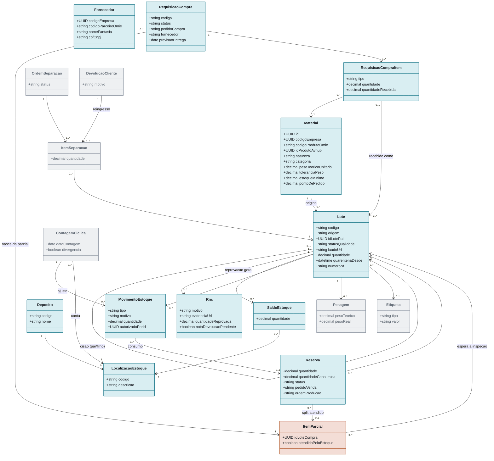
```mermaid
classDiagram
    class Material:::estoqueStyle {
        +UUID id
        +UUID codigoEmpresa
        +string codigoProdutoOmie
        +UUID idProdutoAvhub
        +string natureza
        +string categoria
        +decimal pesoTeoricoUnitario
        +decimal toleranciaPeso
        +decimal estoqueMinimo
        +decimal pontoDePedido
    }
    class Fornecedor:::estoqueStyle {
        +UUID codigoEmpresa
        +string codigoParceiroOmie
        +string nomeFantasia
        +string cpfCnpj
    }
    class RequisicaoCompra:::estoqueStyle {
        +string codigo
        +string status
        +string pedidoCompra
        +string fornecedor
        +date previsaoEntrega
    }
    class RequisicaoCompraItem:::estoqueStyle {
        +string tipo
        +decimal quantidade
        +decimal quantidadeRecebida
    }
    class Lote:::estoqueStyle {
        +string codigo
        +string origem
        +UUID idLotePai
        +string statusQualidade
        +string laudoUrl
        +decimal quantidade
        +datetime quarentenaDesde
        +string numeroNf
    }
    class Rnc:::estoqueStyle {
        +string motivo
        +string evidenciaUrl
        +decimal quantidadeReprovada
        +boolean notaDevolucaoPendente
    }
    class Deposito:::estoqueStyle {
        +string codigo
        +string nome
    }
    class LocalizacaoEstoque:::estoqueStyle {
        +string codigo
        +string descricao
    }
    class SaldoEstoque:::estoqueStyle {
        +decimal quantidade
    }
    class MovimentoEstoque:::estoqueStyle {
        +string tipo
        +string motivo
        +decimal quantidade
        +UUID autorizadoPorId
    }
    class Reserva:::estoqueStyle {
        +decimal quantidade
        +decimal quantidadeConsumida
        +string status
        +string pedidoVenda
        +string ordemProducao
    }
    class ItemParcial:::mesStyle {
        +UUID idLoteCompra
        +boolean atendidoPeloEstoque
    }
    class Pesagem:::futuroStyle {
        +decimal pesoTeorico
        +decimal pesoReal
    }
    class Etiqueta:::futuroStyle {
        +string tipo
        +string valor
    }
    class OrdemSeparacao:::futuroStyle {
        +string status
    }
    class ItemSeparacao:::futuroStyle {
        +decimal quantidade
    }
    class DevolucaoCliente:::futuroStyle {
        +string motivo
    }
    class ContagemCiclica:::futuroStyle {
        +date dataContagem
        +boolean divergencia
    }

    Material "1" --> "0..*" Lote : origina
    RequisicaoCompra "0..*" --> "1" ItemParcial : nasce da parcial
    RequisicaoCompra "1" --> "1..*" RequisicaoCompraItem
    RequisicaoCompraItem "0..*" --> "1" Material
    RequisicaoCompraItem "0..1" --> "0..*" Lote : recebido como
    ItemParcial "0..*" --> "0..1" Lote : espera a inspecao
    Lote "0..1" --> "0..*" Lote : cisao (pai/filho)
    Lote "1" --> "0..*" Rnc : reprovacao gera
    Lote "1" --> "0..*" SaldoEstoque
    SaldoEstoque "0..*" --> "1" LocalizacaoEstoque
    Deposito "1" --> "0..*" LocalizacaoEstoque
    Lote "1" --> "0..*" MovimentoEstoque
    Reserva "0..*" --> "1" Lote
    Reserva "0..*" --> "0..1" ItemParcial : split atendido
    MovimentoEstoque "0..*" --> "0..1" Reserva : consumo
    Lote "1" --> "0..1" Pesagem
    Lote "1" --> "0..*" Etiqueta
    OrdemSeparacao "1" --> "1..*" ItemSeparacao
    ItemSeparacao "0..*" --> "1" Lote
    DevolucaoCliente "1" --> "1..*" ItemSeparacao : reingresso
    ContagemCiclica "1" --> "0..*" MovimentoEstoque : ajuste
    ContagemCiclica "0..*" --> "1" LocalizacaoEstoque : conta

    classDef estoqueStyle fill:#d9eef2,stroke:#1f7a8c,color:#181c22
    classDef mesStyle fill:#f3ddd6,stroke:#a8420f,color:#181c22
    classDef futuroStyle fill:#eef0f2,stroke:#8d95a1,color:#5c6570
    cssClass "Material,Fornecedor,RequisicaoCompra,RequisicaoCompraItem,Lote,Rnc,Deposito,LocalizacaoEstoque,SaldoEstoque,MovimentoEstoque,Reserva" estoqueStyle
    cssClass "ItemParcial" mesStyle
    cssClass "Pesagem,Etiqueta,OrdemSeparacao,ItemSeparacao,DevolucaoCliente,ContagemCiclica" futuroStyle
```

**Nota (revista em 01/10/2026, conferida no Prisma do `api-pcp`):** as tabelas já existem no banco do MES (schema `public`). `Material` **não é mais projeção** do catálogo: nasce na primeira entrada de estoque, buscando o produto no av-hub (`idProdutoAvhub`). `Fornecedor` é projeção de `core.parceiros`, sem ligação direta com o lote (o lote guarda o nome e a NF). `RequisicaoCompra` nasce da parcial (circuito de compra) e cada item recebido vira um lote; a parcial aponta para o lote que espera a inspeção (`idLoteCompra`). `Rnc` liga ao lote reprovado. Saldo é foto por lote × localização (`SaldoEstoque`), e todo movimento passa por `MovimentoEstoque`. Em cinza, o que ainda não existe (pesagem, etiqueta, separação, devolução, contagem). O alias de catálogo saiu (contrato 002 rejeitado, código removido em 29/09). Ver [[Encaixe-Estoque-Revenda-no-PCP]].

## 2. Classes — Domínio MES / Produção

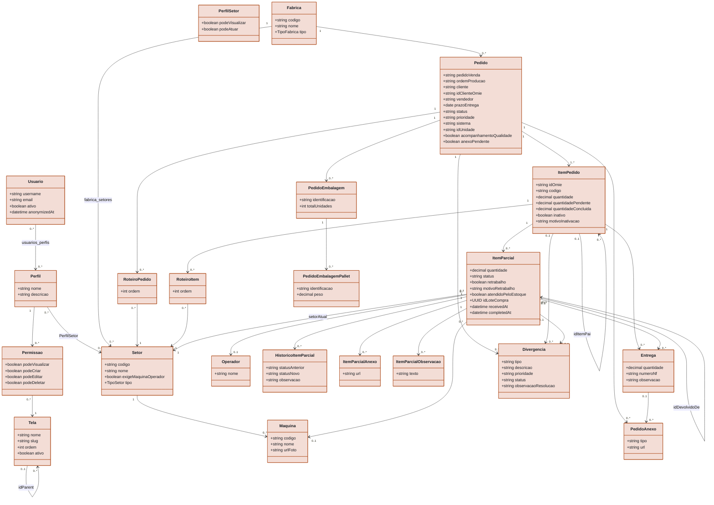
```mermaid
classDiagram
    class Usuario:::mesStyle {
        +string username
        +string email
        +boolean ativo
        +datetime anonymizedAt
    }
    class Perfil:::mesStyle {
        +string nome
        +string descricao
    }
    class Tela:::mesStyle {
        +string nome
        +string slug
        +int ordem
        +boolean ativo
    }
    class Permissao:::mesStyle {
        +boolean podeVisualizar
        +boolean podeCriar
        +boolean podeEditar
        +boolean podeDeletar
    }
    class PerfilSetor:::mesStyle {
        +boolean podeVisualizar
        +boolean podeAtuar
    }
    class Fabrica:::mesStyle {
        +string codigo
        +string nome
        +TipoFabrica tipo
    }
    class Setor:::mesStyle {
        +string codigo
        +string nome
        +boolean exigeMaquinaOperador
        +TipoSetor tipo
    }
    class Maquina:::mesStyle {
        +string codigo
        +string nome
        +string urlFoto
    }
    class Operador:::mesStyle {
        +string nome
    }
    class Pedido:::mesStyle {
        +string pedidoVenda
        +string ordemProducao
        +string cliente
        +string idClienteOmie
        +string vendedor
        +date prazoEntrega
        +string status
        +string prioridade
        +string sistema
        +string idUnidade
        +boolean acompanhamentoQualidade
        +boolean anexoPendente
    }
    class ItemPedido:::mesStyle {
        +string idOmie
        +string codigo
        +decimal quantidade
        +decimal quantidadePendente
        +decimal quantidadeConcluida
        +boolean inativo
        +string motivoInativacao
    }
    class RoteiroPedido:::mesStyle {
        +int ordem
    }
    class RoteiroItem:::mesStyle {
        +int ordem
    }
    class ItemParcial:::mesStyle {
        +decimal quantidade
        +string status
        +boolean retrabalho
        +string motivoRetrabalho
        +boolean atendidoPeloEstoque
        +UUID idLoteCompra
        +datetime receivedAt
        +datetime completedAt
    }
    class HistoricoItemParcial:::mesStyle {
        +string statusAnterior
        +string statusNovo
        +string observacao
    }
    class ItemParcialAnexo:::mesStyle {
        +string url
    }
    class ItemParcialObservacao:::mesStyle {
        +string texto
    }
    class Entrega:::mesStyle {
        +decimal quantidade
        +string numeroNf
        +string observacao
    }
    class PedidoEmbalagem:::mesStyle {
        +string identificacao
        +int totalUnidades
    }
    class PedidoEmbalagemPallet:::mesStyle {
        +string identificacao
        +decimal peso
    }
    class PedidoAnexo:::mesStyle {
        +string tipo
        +string url
    }
    class Divergencia:::mesStyle {
        +string tipo
        +string descricao
        +string prioridade
        +string status
        +string observacaoResolucao
    }

    Usuario "0..*" --> "0..*" Perfil : usuarios_perfis
    Perfil "1" --> "0..*" Permissao
    Permissao "0..*" --> "1" Tela
    Tela "0..1" --> "0..*" Tela : idParent
    Perfil "0..*" --> "0..*" Setor : PerfilSetor
    Fabrica "1" --> "0..*" Setor : fabrica_setores
    Setor "1" --> "0..*" Maquina
    Fabrica "1" --> "0..*" Pedido
    Pedido "1" --> "1..*" ItemPedido
    ItemPedido "0..1" --> "0..*" ItemPedido : idItemPai
    Pedido "1" --> "0..*" RoteiroPedido
    RoteiroPedido "0..*" --> "1" Setor
    ItemPedido "1" --> "0..*" RoteiroItem
    RoteiroItem "0..*" --> "1" Setor
    ItemPedido "1" --> "0..*" ItemParcial
    ItemParcial "0..1" --> "0..*" ItemParcial : idParcialOrigem (split)
    ItemParcial "0..1" --> "0..1" ItemParcial : idDevolvidoDe
    ItemParcial "0..*" --> "1" Setor : setorAtual
    ItemParcial "1" --> "0..*" HistoricoItemParcial
    ItemParcial "1" --> "0..*" ItemParcialAnexo
    ItemParcial "1" --> "0..*" ItemParcialObservacao
    ItemParcial "0..*" --> "0..1" Maquina
    ItemParcial "0..*" --> "0..1" Operador
    ItemPedido "1" --> "0..*" Entrega
    ItemParcial "0..1" --> "0..*" Entrega
    Pedido "1" --> "0..*" PedidoEmbalagem
    PedidoEmbalagem "1" --> "0..*" PedidoEmbalagemPallet
    Pedido "1" --> "0..*" PedidoAnexo
    Entrega "0..1" --> "0..*" PedidoAnexo
    Pedido "1" --> "0..*" Divergencia
    ItemPedido "0..1" --> "0..*" Divergencia
    ItemParcial "0..1" --> "0..*" Divergencia

    classDef mesStyle fill:#f3ddd6,stroke:#a8420f,color:#181c22
    cssClass "Usuario,Perfil,Tela,Permissao,PerfilSetor,Fabrica,Setor,Maquina,Operador,Pedido,ItemPedido,RoteiroPedido,RoteiroItem,ItemParcial,HistoricoItemParcial,ItemParcialAnexo,ItemParcialObservacao,Entrega,PedidoEmbalagem,PedidoEmbalagemPallet,PedidoAnexo,Divergencia" mesStyle
```

**Nota:** modelo real já implementado no `api-pcp` (NestJS+Prisma) — ver [[App-PCP-Backend-Producao]]. `ItemParcial` é o motor de estado real, não `HistoricoItemParcial` (que é só trilha de auditoria).

> **Notas do modelo** (com base no dump real `pcp_prd_db`, schema `public` — confirma que o schema `estoque` ainda não existe; decidido em 07/10/2026: o Estoque fica em `public`, ver [[Registro-de-Decisoes-2026-10-07]]):
> - **Roteiro existe em dois níveis**, não um só: `RoteiroPedido` (por pedido/fábrica) e `RoteiroItem` (por item específico) — cada item pode seguir um roteiro diferente dos outros do mesmo pedido.
> - **`ItemPedido` tem auto-referência** (`idItemPai`) — hierarquia entre itens, não documentada antes.
> - **`Divergencia` tem campo `tipo`** (QUALIDADE/QUANTIDADE/PRAZO/DANO/DOCUMENTACAO/OUTRO), além do `status` — e pode linkar em `ItemPedido` OU `ItemParcial` (granularidade dupla).
> - **`ItemParcialObservacao`** é uma entidade separada de `ItemParcialAnexo`, nunca documentada.
> - **`Usuario.anonymizedAt` existe de verdade aqui** (diferente do av-hub, onde não existe).
> - `PerfilSetor` é tabela de junção com atributos próprios (`podeVisualizar`/`podeAtuar`).
> - **Encaixe (24-29/09/2026, implementado):** `Fabrica.tipo` (`FABRICACAO`/`REVENDA`, "Destino" na tela) e `Setor.tipo` com 7 valores. `REQUISICAO`, `COMPRAS`, `LOGISTICA_ENTRADA` (o setor "Recebimento") e o setor "Qualidade · Entrada" são o **circuito de compra fixo**, fora do roteiro; o backend insere o setor Estoque como etapa 1 de todo roteiro; `QUALIDADE` também é a inspeção de saída dentro do roteiro; `EXPEDICAO` são os dois últimos setores (Embalagem → Logística). `ItemParcial` ganhou `atendidoPeloEstoque` e `idLoteCompra`; `Pedido` ganhou `acompanhamentoQualidade` (vem da liberação do vendedor, contrato 26). `ItemParcial` tem 9 estados (inclui `REPROVADO`). Ver [[Encaixe-Estoque-Revenda-no-PCP]].

## 3. Classes — av-hub Comercial + RBAC

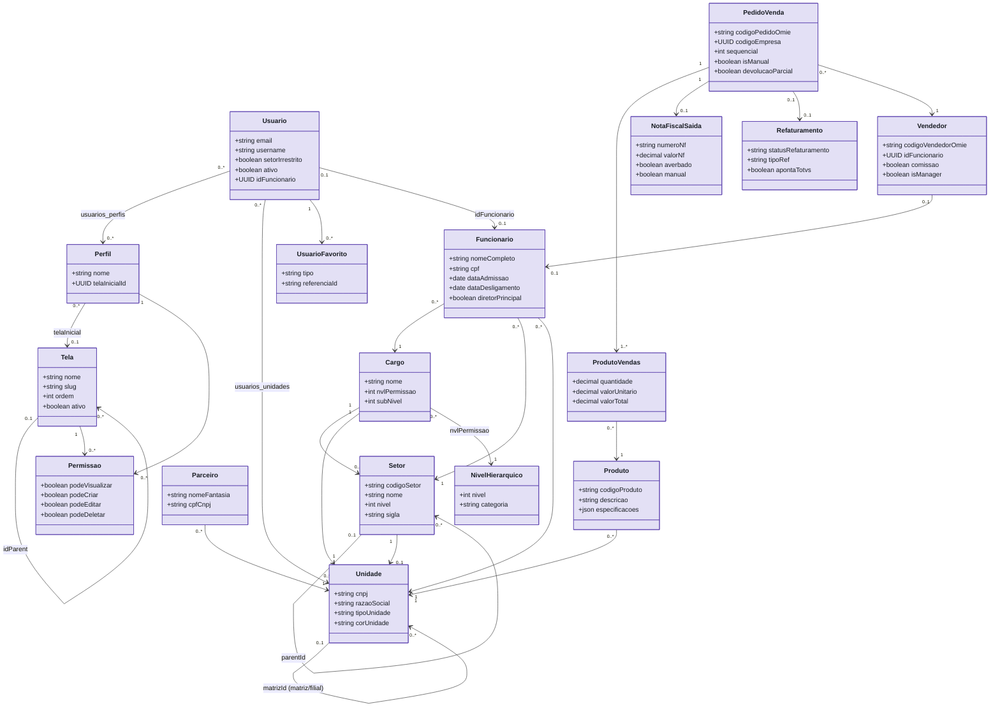
```mermaid
classDiagram
    class Usuario:::avhubStyle {
        +string email
        +string username
        +boolean setorIrrestrito
        +boolean ativo
        +UUID idFuncionario
    }
    class Perfil:::avhubStyle {
        +string nome
        +UUID telaInicialId
    }
    class Tela:::avhubStyle {
        +string nome
        +string slug
        +int ordem
        +boolean ativo
    }
    class Permissao:::avhubStyle {
        +boolean podeVisualizar
        +boolean podeCriar
        +boolean podeEditar
        +boolean podeDeletar
    }
    class UsuarioFavorito:::avhubStyle {
        +string tipo
        +string referenciaId
    }
    class Funcionario:::avhubStyle {
        +string nomeCompleto
        +string cpf
        +date dataAdmissao
        +date dataDesligamento
        +boolean diretorPrincipal
    }
    class Unidade:::avhubStyle {
        +string cnpj
        +string razaoSocial
        +string tipoUnidade
        +string corUnidade
    }
    class Setor:::avhubStyle {
        +string codigoSetor
        +string nome
        +int nivel
        +string sigla
    }
    class Cargo:::avhubStyle {
        +string nome
        +int nvlPermissao
        +int subNivel
    }
    class NivelHierarquico:::avhubStyle {
        +int nivel
        +string categoria
    }
    class Parceiro:::avhubStyle {
        +string nomeFantasia
        +string cpfCnpj
    }
    class Produto:::avhubStyle {
        +string codigoProduto
        +string descricao
        +json especificacoes
    }
    class Vendedor:::avhubStyle {
        +string codigoVendedorOmie
        +UUID idFuncionario
        +boolean comissao
        +boolean isManager
    }
    class PedidoVenda:::avhubStyle {
        +string codigoPedidoOmie
        +UUID codigoEmpresa
        +int sequencial
        +boolean isManual
        +boolean devolucaoParcial
    }
    class ProdutoVendas:::avhubStyle {
        +decimal quantidade
        +decimal valorUnitario
        +decimal valorTotal
    }
    class NotaFiscalSaida:::avhubStyle {
        +string numeroNf
        +decimal valorNf
        +boolean averbado
        +boolean manual
    }
    class Refaturamento:::avhubStyle {
        +string statusRefaturamento
        +string tipoRef
        +boolean apontaTotvs
    }

    Usuario "0..*" --> "0..*" Perfil : usuarios_perfis
    Perfil "0..*" --> "0..1" Tela : telaInicial
    Tela "0..1" --> "0..*" Tela : idParent
    Perfil "1" --> "0..*" Permissao
    Tela "1" --> "0..*" Permissao
    Usuario "0..*" --> "0..*" Unidade : usuarios_unidades
    Usuario "1" --> "0..*" UsuarioFavorito
    Usuario "0..1" --> "0..1" Funcionario : idFuncionario
    Unidade "0..1" --> "0..*" Unidade : matrizId (matriz/filial)
    Setor "0..1" --> "0..*" Setor : parentId
    Setor "1" --> "0..1" Unidade
    Cargo "1" --> "0..1" Setor
    Cargo "1" --> "1" Unidade
    Cargo "0..*" --> "1" NivelHierarquico : nvlPermissao
    Funcionario "0..*" --> "1" Cargo
    Funcionario "0..*" --> "1" Setor
    Funcionario "0..*" --> "1" Unidade
    Parceiro "0..*" --> "1" Unidade
    Produto "0..*" --> "1" Unidade
    Vendedor "0..1" --> "0..1" Funcionario
    PedidoVenda "1" --> "1..*" ProdutoVendas
    PedidoVenda "1" --> "0..1" NotaFiscalSaida
    PedidoVenda "0..1" --> "0..1" Refaturamento
    ProdutoVendas "0..*" --> "1" Produto
    PedidoVenda "0..*" --> "1" Vendedor

    classDef avhubStyle fill:#e3e0f5,stroke:#5b3fae,color:#181c22
    cssClass "Usuario,Perfil,Tela,Permissao,UsuarioFavorito,Funcionario,Unidade,Setor,Cargo,NivelHierarquico,Parceiro,Produto,Vendedor,PedidoVenda,ProdutoVendas,NotaFiscalSaida,Refaturamento" avhubStyle
```

**Nota:** `Vendedor.idFuncionario` é o vínculo em migração (backfill já rodou). RBAC deste diagrama e o do diagrama 2 (MES) são **duas implementações independentes** — ver [[Achado-Duplicacao-RBAC]].

> **Notas do modelo:**
> - `Funcionario` não tem coluna `reportaAId` — não existe de verdade na tabela.
> - **`Setor` tem hierarquia própria** (`parentId`/`nivel`, auto-referência).
> - **`Unidade` tem hierarquia matriz/filial** (`matrizId`, auto-referência).
> - **FK real cruzando schema**: `Cargo.nvlPermissao` tem uma constraint de FK real (`fk_cargos_nivel_hierarquico`) para uma tabela de outro schema — não é só "dicionário compartilhado", é FK de banco.
> - **`UsuarioFavorito`** (`auth.usuarios_favoritos`) — já citado em [[AV-Hub-Bugs-Catalogo]] como rota existente, com estrutura confirmada (`tipo`: cliente/pedido).
> - **Risco de engenharia**: `auth.usuarios.id_funcionario` é `ON DELETE CASCADE` — apagar um `Funcionario` apaga o `Usuario` vinculado junto, silenciosamente. Vale confirmar se é intencional (ex.: desligamento sempre remove acesso) ou um risco de perda de histórico de auditoria não avaliado.

## 4. Casos de Uso

> Dividido em 5 diagramas menores — uma versão única com 12 atores × 23 casos de uso viraria uma faixa ilegível, não importa a direção escolhida. Cada grupo abaixo é pequeno o bastante pro mermaid organizar sozinho, ator ao lado dos seus casos de uso.

### 4a. Vendas

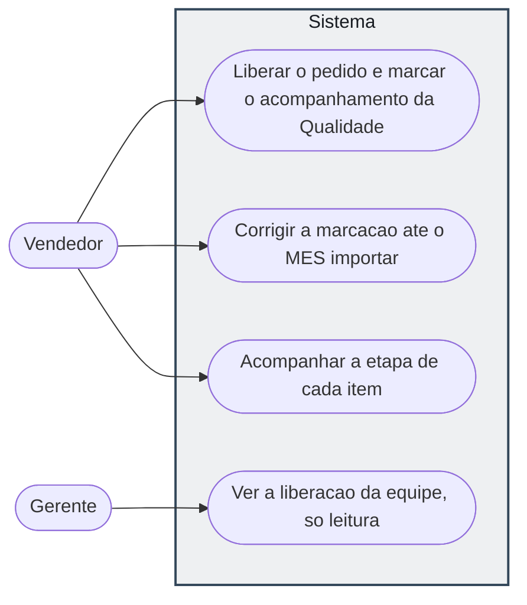
```mermaid
flowchart LR
    Vendedor(["Vendedor"])
    Gerente(["Gerente"])
    subgraph SISTEMA[Sistema]
        UC1([Liberar o pedido e marcar o acompanhamento da Qualidade])
        UC2([Corrigir a marcacao ate o MES importar])
        UC3([Acompanhar a etapa de cada item])
        UC4([Ver a liberacao da equipe, so leitura])
    end
    Vendedor --> UC1
    Vendedor --> UC2
    Vendedor --> UC3
    Gerente --> UC4

    style SISTEMA fill:#eef0f2,stroke:#33475a,stroke-width:2px,color:#181c22
```

### 4b. PCP

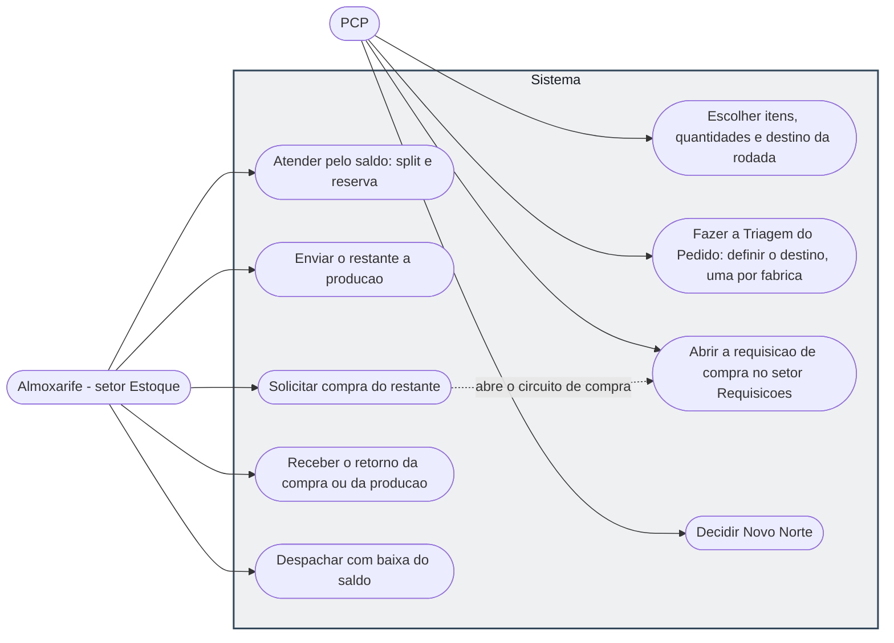
```mermaid
flowchart LR
    PCP(["PCP"])
    ALM(["Almoxarife - setor Estoque"])
    subgraph SISTEMA[Sistema]
        UC4([Escolher itens, quantidades e destino da rodada])
        UC5([Fazer a Triagem do Pedido: definir o destino, uma por fabrica])
        UC10([Abrir a requisicao de compra no setor Requisicoes])
        UC8([Decidir Novo Norte])
        UC6([Atender pelo saldo: split e reserva])
        UC7([Enviar o restante a producao])
        UC11([Solicitar compra do restante])
        UC9([Receber o retorno da compra ou da producao])
        UC12([Despachar com baixa do saldo])
    end
    PCP --> UC4
    PCP --> UC5
    PCP --> UC10
    PCP --> UC8
    ALM --> UC6
    ALM --> UC7
    ALM --> UC11
    ALM --> UC9
    ALM --> UC12
    UC11 -.->|abre o circuito de compra| UC10

    style SISTEMA fill:#eef0f2,stroke:#33475a,stroke-width:2px,color:#181c22
```

### 4c. Compras

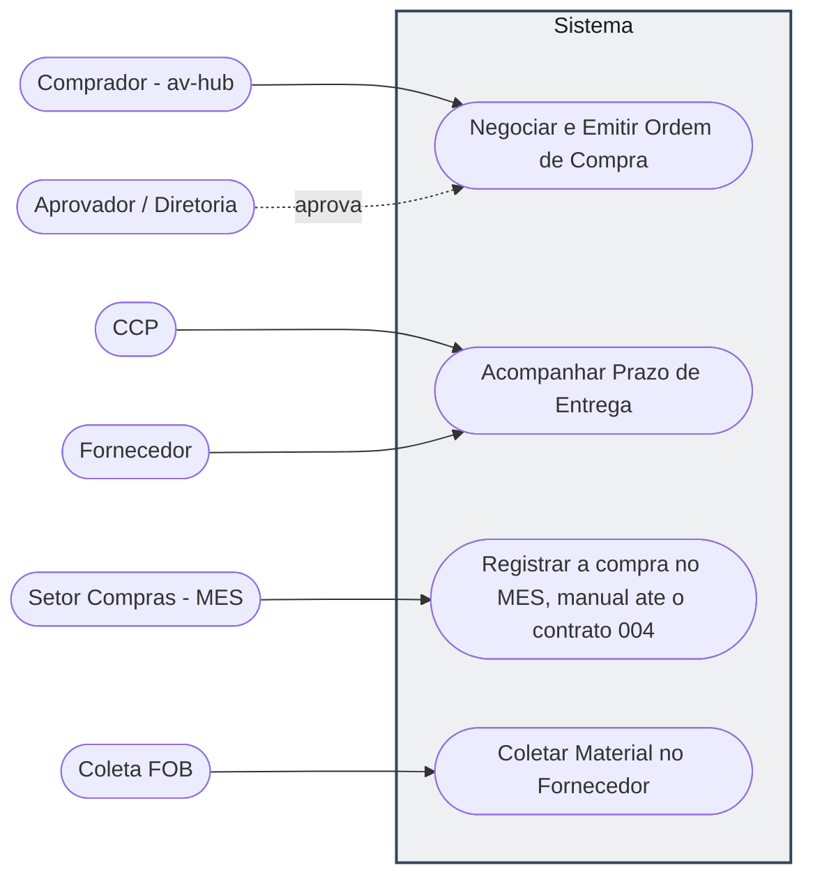
```mermaid
flowchart LR
    Comprador(["Comprador - av-hub"])
    Diretoria(["Aprovador / Diretoria"])
    CCP(["CCP"])
    SComp(["Setor Compras - MES"])
    Fornecedor(["Fornecedor"])
    Coleta(["Coleta FOB"])
    subgraph SISTEMA[Sistema]
        UC9([Negociar e Emitir Ordem de Compra])
        UC10([Acompanhar Prazo de Entrega])
        UC13([Registrar a compra no MES, manual ate o contrato 004])
        UC11([Coletar Material no Fornecedor])
    end
    Comprador --> UC9
    Diretoria -.aprova.-> UC9
    CCP --> UC10
    Fornecedor --> UC10
    SComp --> UC13
    Coleta --> UC11

    style SISTEMA fill:#eef0f2,stroke:#33475a,stroke-width:2px,color:#181c22
```

### 4d. Recebimento & Qualidade

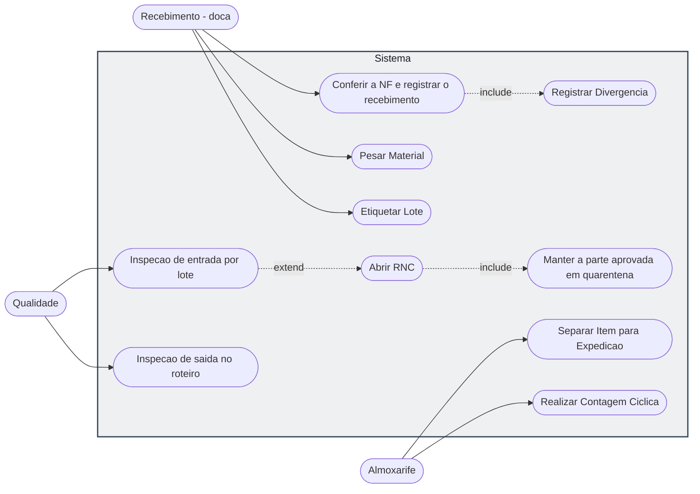
```mermaid
flowchart LR
    Receb(["Recebimento - doca"])
    Qualidade(["Qualidade"])
    Almoxarife(["Almoxarife"])
    subgraph SISTEMA[Sistema]
        UC12([Conferir a NF e registrar o recebimento])
        UC13([Registrar Divergencia])
        UC14([Pesar Material])
        UC15([Etiquetar Lote])
        UC16([Inspecao de entrada por lote])
        UC17([Abrir RNC])
        UC18([Manter a parte aprovada em quarentena])
        UC21([Inspecao de saida no roteiro])
        UC19([Separar Item para Expedicao])
        UC20([Realizar Contagem Ciclica])
    end
    Receb --> UC12
    Receb --> UC14
    Receb --> UC15
    Qualidade --> UC16
    Qualidade --> UC21
    Almoxarife --> UC19
    Almoxarife --> UC20
    UC12 -.include.-> UC13
    UC16 -.extend.-> UC17
    UC17 -.include.-> UC18

    style SISTEMA fill:#eef0f2,stroke:#33475a,stroke-width:2px,color:#181c22
```

### 4e. Produção, Expedição & Fiscal

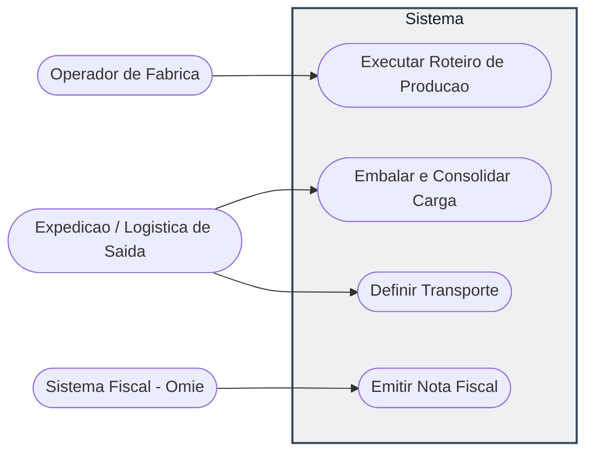
```mermaid
flowchart LR
    Operador(["Operador de Fabrica"])
    Expedicao(["Expedicao / Logistica de Saida"])
    Omie(["Sistema Fiscal - Omie"])
    subgraph SISTEMA[Sistema]
        UC18([Executar Roteiro de Producao])
        UC21([Embalar e Consolidar Carga])
        UC22([Definir Transporte])
        UC23([Emitir Nota Fiscal])
    end
    Operador --> UC18
    Expedicao --> UC21
    Expedicao --> UC22
    Omie --> UC23

    style SISTEMA fill:#eef0f2,stroke:#33475a,stroke-width:2px,color:#181c22
```

**Nota:** mermaid não tem notação nativa de caso de uso (elipses + boneco) — aproximado via flowchart, com o limite do sistema como subgraph. `include`/`extend` marcados como linhas tracejadas rotuladas, seguindo a convenção UML.

## 5. Estados — `ItemParcial`

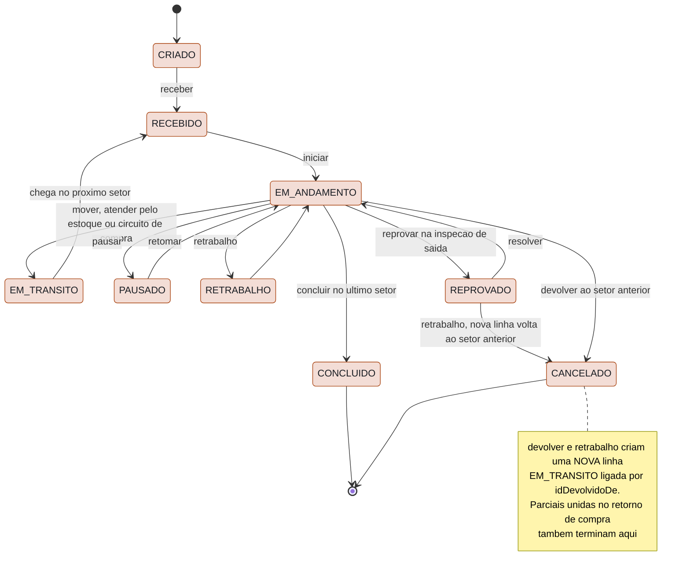
```mermaid
stateDiagram-v2
    [*] --> CRIADO
    CRIADO --> RECEBIDO : receber
    RECEBIDO --> EM_ANDAMENTO : iniciar
    EM_ANDAMENTO --> EM_TRANSITO : mover, atender pelo estoque ou circuito de compra
    EM_TRANSITO --> RECEBIDO : chega no proximo setor
    EM_ANDAMENTO --> PAUSADO : pausar
    PAUSADO --> EM_ANDAMENTO : retomar
    EM_ANDAMENTO --> RETRABALHO : retrabalho
    RETRABALHO --> EM_ANDAMENTO
    EM_ANDAMENTO --> REPROVADO : reprovar na inspecao de saida
    REPROVADO --> EM_ANDAMENTO : resolver
    REPROVADO --> CANCELADO : retrabalho, nova linha volta ao setor anterior
    EM_ANDAMENTO --> CONCLUIDO : concluir no ultimo setor
    CONCLUIDO --> [*]
    EM_ANDAMENTO --> CANCELADO : devolver ao setor anterior
    CANCELADO --> [*]

    note right of CANCELADO
        devolver e retrabalho criam uma NOVA linha
        EM_TRANSITO ligada por idDevolvidoDe.
        Parciais unidas no retorno de compra
        tambem terminam aqui
    end note

    classDef mesStyle fill:#f3ddd6,stroke:#a8420f,color:#181c22
    class CRIADO,RECEBIDO,EM_ANDAMENTO,EM_TRANSITO,PAUSADO,RETRABALHO,REPROVADO,CONCLUIDO,CANCELADO mesStyle
```

## 6. Estados — Divergência (`api-pcp`)

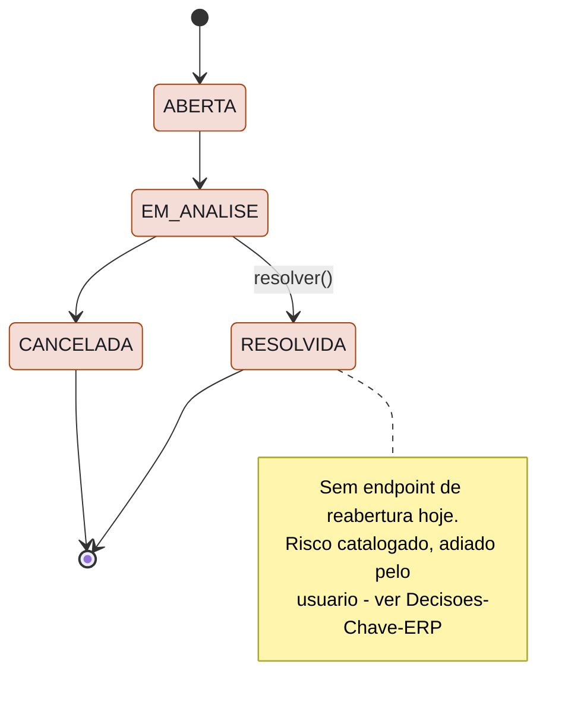
```mermaid
stateDiagram-v2
    [*] --> ABERTA
    ABERTA --> EM_ANALISE
    EM_ANALISE --> RESOLVIDA : resolver()
    EM_ANALISE --> CANCELADA
    RESOLVIDA --> [*]
    CANCELADA --> [*]

    note right of RESOLVIDA
        Sem endpoint de reabertura hoje.
        Risco catalogado, adiado pelo
        usuario - ver Decisoes-Chave-ERP
    end note

    classDef mesStyle fill:#f3ddd6,stroke:#a8420f,color:#181c22
    class ABERTA,EM_ANALISE,RESOLVIDA,CANCELADA mesStyle
```

## 7. Estados — Lote / Qualidade

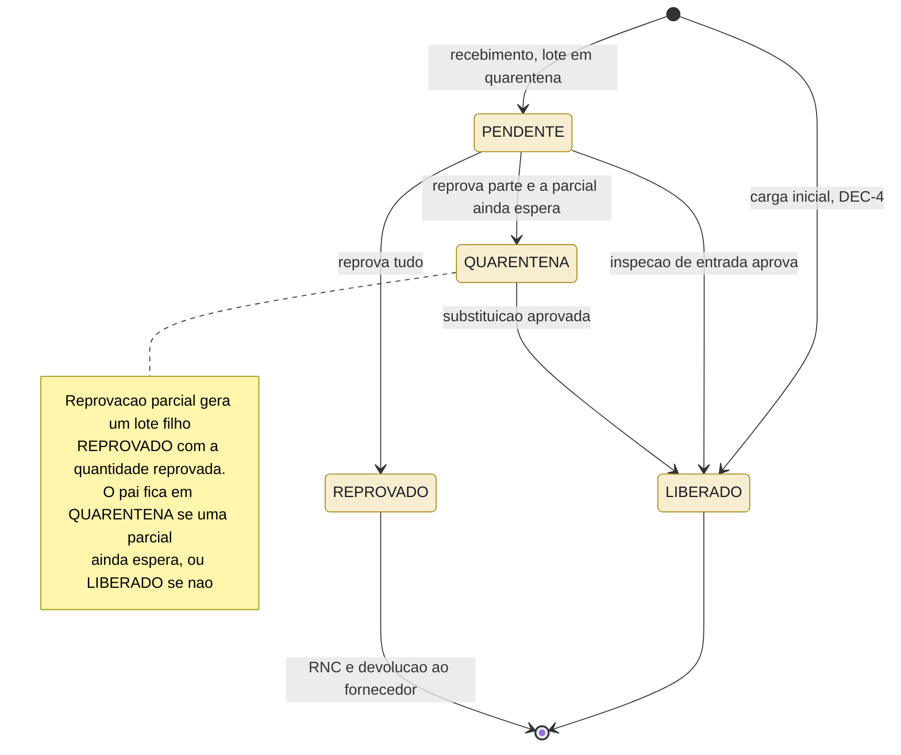
```mermaid
stateDiagram-v2
    [*] --> PENDENTE : recebimento, lote em quarentena
    [*] --> LIBERADO : carga inicial, DEC-4
    PENDENTE --> LIBERADO : inspecao de entrada aprova
    PENDENTE --> REPROVADO : reprova tudo
    PENDENTE --> QUARENTENA : reprova parte e a parcial ainda espera
    QUARENTENA --> LIBERADO : substituicao aprovada
    LIBERADO --> [*]
    REPROVADO --> [*] : RNC e devolucao ao fornecedor

    note right of QUARENTENA
        Reprovacao parcial gera um lote filho
        REPROVADO com a quantidade reprovada.
        O pai fica em QUARENTENA se uma parcial
        ainda espera, ou LIBERADO se nao
    end note

    classDef qualStyle fill:#f7edd0,stroke:#a8860f,color:#181c22
    class PENDENTE,LIBERADO,REPROVADO,QUARENTENA qualStyle
```

## 8. Estados — Status do Item no Pedido (visão do vendedor)

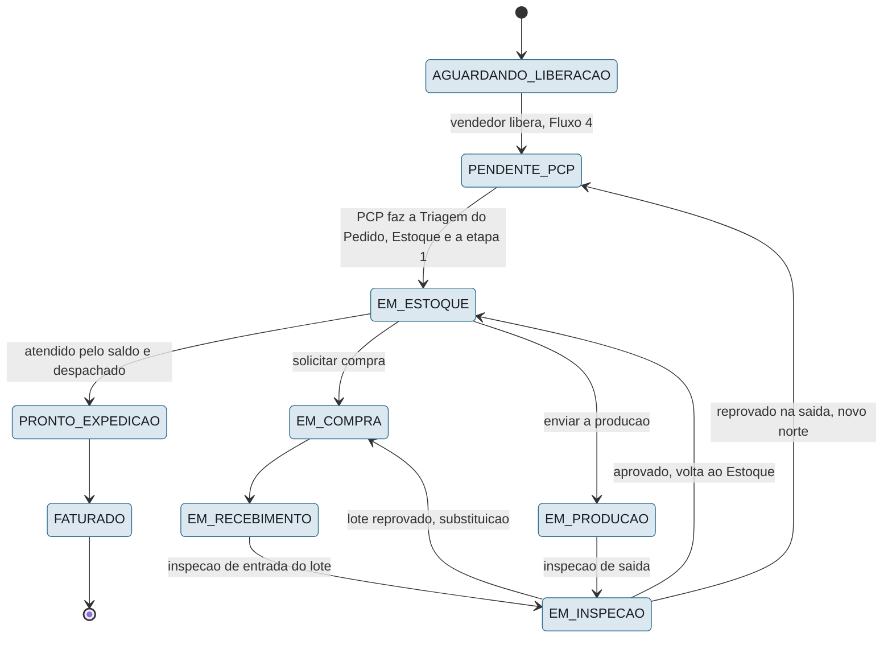
```mermaid
stateDiagram-v2
    [*] --> AGUARDANDO_LIBERACAO
    AGUARDANDO_LIBERACAO --> PENDENTE_PCP : vendedor libera, Fluxo 4
    PENDENTE_PCP --> EM_ESTOQUE : PCP faz a Triagem do Pedido, Estoque e a etapa 1
    EM_ESTOQUE --> PRONTO_EXPEDICAO : atendido pelo saldo e despachado
    EM_ESTOQUE --> EM_COMPRA : solicitar compra
    EM_ESTOQUE --> EM_PRODUCAO : enviar a producao
    EM_COMPRA --> EM_RECEBIMENTO
    EM_RECEBIMENTO --> EM_INSPECAO : inspecao de entrada do lote
    EM_PRODUCAO --> EM_INSPECAO : inspecao de saida
    EM_INSPECAO --> EM_ESTOQUE : aprovado, volta ao Estoque
    EM_INSPECAO --> EM_COMPRA : lote reprovado, substituicao
    EM_INSPECAO --> PENDENTE_PCP : reprovado na saida, novo norte
    PRONTO_EXPEDICAO --> FATURADO
    FATURADO --> [*]

    classDef pcpStyle fill:#dce8ef,stroke:#2f6f8f,color:#181c22
    class AGUARDANDO_LIBERACAO,PENDENTE_PCP,EM_COMPRA,EM_PRODUCAO,EM_ESTOQUE,EM_RECEBIMENTO,EM_INSPECAO,PRONTO_EXPEDICAO,FATURADO pcpStyle
```

**Revisto em 01/10/2026:** entra `AGUARDANDO_LIBERACAO` (o pedido só chega ao PCP depois que o vendedor libera — pedidos anteriores à data de corte nascem direto em `PENDENTE_PCP`); a compra sai do Estoque por "Solicitar compra" e volta a `EM_ESTOQUE` depois da inspeção de entrada; a produção passa pela inspeção de saída e também volta a `EM_ESTOQUE`. O que o MES entrega hoje por item está em [[005-Status-Item-Integracao-MES]] (11 etapas).

**Nota:** esse é o status granular que o "casamento av-hub↔MES" precisaria expor pro vendedor — ver [[Decisoes-Chave-ERP]]. **Revisto em 24/09/2026:** `EM_DESPACHO` saiu (o PCP gera a OP e o item já nasce no setor Estoque), e o item comprado aprovado volta a `EM_ESTOQUE` antes de `PRONTO_EXPEDICAO`. São 8 estados; o fluxo real tem cerca de 20 etapas, e a tabela que traduz uma coisa na outra (`etapa_fluxo.estado_macro`) está proposta em [[Campos-e-API-para-Rastreabilidade]].

## 9. Componentes

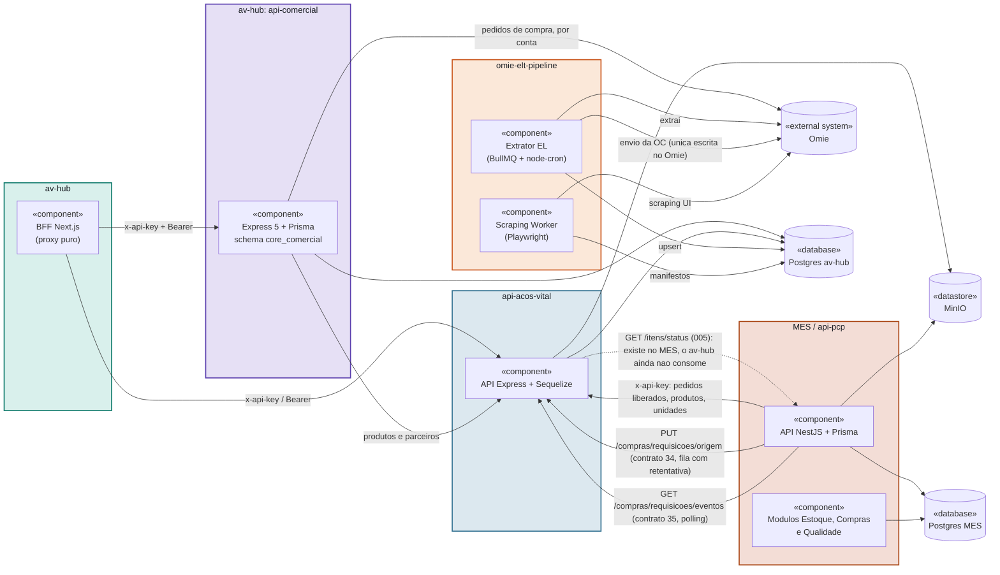
```mermaid
flowchart LR
    subgraph SYS_AVHUB[av-hub]
        BFF["«component»<br/>BFF Next.js<br/>(proxy puro)"]
    end
    subgraph SYS_API[api-acos-vital]
        API["«component»<br/>API Express + Sequelize"]
    end
    subgraph SYS_MES[MES / api-pcp]
        MESAPI["«component»<br/>API NestJS + Prisma"]
        ESTOQUEMOD["«component»<br/>Modulos Estoque, Compras<br/>e Qualidade"]
    end
    subgraph SYS_COM[av-hub: api-comercial]
        COMAPI["«component»<br/>Express 5 + Prisma<br/>schema core_comercial"]
    end
    subgraph SYS_ELT[omie-elt-pipeline]
        ELT["«component»<br/>Extrator EL<br/>(BullMQ + node-cron)"]
        SCRAPER["«component»<br/>Scraping Worker<br/>(Playwright)"]
    end
    OMIE[("«external system»<br/>Omie")]
    PGAVHUB[("«database»<br/>Postgres av-hub")]
    PGMES[("«database»<br/>Postgres MES")]
    MINIO[("«datastore»<br/>MinIO")]

    BFF -->|x-api-key / Bearer| API
    MESAPI -->|"x-api-key: pedidos liberados, produtos, unidades"| API
    MESAPI -->|"PUT /compras/requisicoes/origem (contrato 34, fila com retentativa)"| API
    MESAPI -->|"GET /compras/requisicoes/eventos (contrato 35, polling)"| API
    API -.->|"GET /itens/status (005): existe no MES, o av-hub ainda nao consome"| MESAPI
    BFF -->|"x-api-key + Bearer"| COMAPI
    COMAPI -->|"produtos e parceiros"| API
    COMAPI --> PGAVHUB
    COMAPI -->|"pedidos de compra, por conta"| OMIE
    API --> PGAVHUB
    MESAPI --> PGMES
    ESTOQUEMOD --> PGMES
    ELT -->|upsert| PGAVHUB
    SCRAPER -->|manifestos| PGAVHUB
    ELT -->|extrai| OMIE
    ELT -->|"envio da OC (unica escrita no Omie)"| OMIE
    SCRAPER -->|scraping UI| OMIE
    API --> MINIO
    MESAPI --> MINIO

    style SYS_AVHUB fill:#d9f0ec,stroke:#0f7a6b,stroke-width:2px,color:#181c22
    style SYS_API fill:#dce8ef,stroke:#2f6f8f,stroke-width:2px,color:#181c22
    style SYS_MES fill:#f3ddd6,stroke:#a8420f,stroke-width:2px,color:#181c22
    style SYS_COM fill:#e6e0f5,stroke:#5b3fae,stroke-width:2px,color:#181c22
    style SYS_ELT fill:#fbe8d9,stroke:#c9541a,stroke-width:2px,color:#181c22
```

**Nota (08/10/2026):** o `api-comercial` ainda **não tem ambiente de produção decidido** (só na `develop`, ver [[AV-Hub-Comercial-Suprimentos]]); a chave do MES só abre o `PUT` do contrato 34 (leituras: L6 aberta, [[Chaves-de-Integracao-AvHub-MES-Pipeline]]).

**Nota:** `quality-api` (mencionada no código do av-hub) é sistema não relacionado, omitida aqui — ver [[Perguntas-Pendentes-MES-Estoque]].

## 10. Implantação

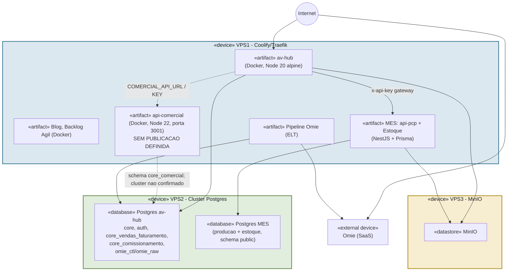
```mermaid
flowchart TB
    subgraph VPS1["«device» VPS1 - Coolify/Traefik"]
        AVHUBC["«artifact» av-hub<br/>(Docker, Node 20 alpine)"]
        BLOGC["«artifact» Blog, Backlog Agil (Docker)"]
        MESAPPD["«artifact» MES: api-pcp + Estoque<br/>(NestJS + Prisma)"]
        PIPED["«artifact» Pipeline Omie (ELT)"]
        COMD["«artifact» api-comercial (Docker, Node 22, porta 3001)<br/>SEM PUBLICACAO DEFINIDA"]
    end
    subgraph VPS2["«device» VPS2 - Cluster Postgres"]
        PG["«database» Postgres av-hub<br/>core, auth, core_vendas_faturamento,<br/>core_comissionamento,<br/>omie_ctl/omie_raw"]
        PGMESD["«database» Postgres MES<br/>(producao + estoque, schema public)"]
    end
    subgraph VPS3["«device» VPS3 - MinIO"]
        MINIOD["«datastore» MinIO"]
    end
    INTERNET(("Internet"))
    OMIED["«external device»<br/>Omie (SaaS)"]

    AVHUBC --> PG
    AVHUBC --> MINIOD
    AVHUBC -.->|"COMERCIAL_API_URL / KEY"| COMD
    COMD -.->|"schema core_comercial; cluster nao confirmado"| PG
    MESAPPD --> PGMESD
    MESAPPD --> MINIOD
    AVHUBC -->|x-api-key gateway| MESAPPD
    INTERNET --> AVHUBC
    INTERNET --> OMIED
    PIPED --> OMIED
    PIPED --> PG

    style VPS1 fill:#dce8ef,stroke:#2f6f8f,stroke-width:2px,color:#181c22
    style VPS2 fill:#e1eede,stroke:#5a7d3a,stroke-width:2px,color:#181c22
    style VPS3 fill:#f7edd0,stroke:#a8860f,stroke-width:2px,color:#181c22
```

**Nota (07/10/2026):** MES e pipeline rodam na VPS1; o banco do MES fica na VPS2 (✅ Nathan). Ver [[Infraestrutura-Self-Hosted]] e [[Registro-de-Decisoes-2026-10-07]].

## 11. Pacotes — Dependência entre Schemas Postgres

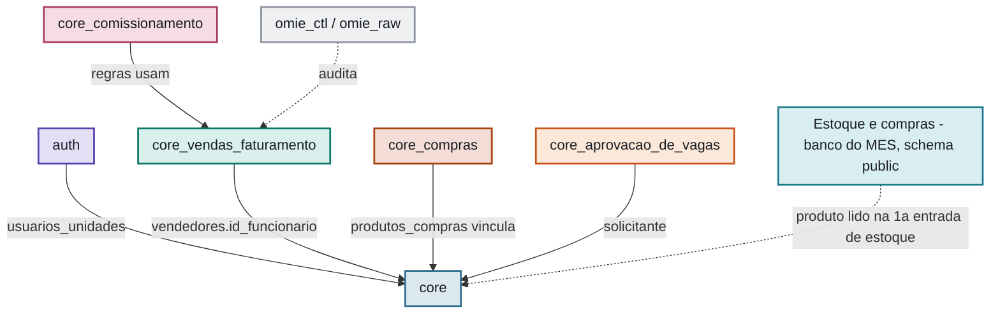
```mermaid
flowchart TB
    subgraph P_CORE[core]
    end
    subgraph P_AUTH[auth]
    end
    subgraph P_VENDAS[core_vendas_faturamento]
    end
    subgraph P_COMPRAS[core_compras]
    end
    subgraph P_COMISSAO[core_comissionamento]
    end
    subgraph P_VAGAS[core_aprovacao_de_vagas]
    end
    subgraph P_OMIECTL[omie_ctl / omie_raw]
    end
    subgraph P_ESTOQUE[Estoque e compras - banco do MES, schema public]
    end

    P_AUTH -->|usuarios_unidades| P_CORE
    P_VENDAS -->|vendedores.id_funcionario| P_CORE
    P_COMPRAS -->|produtos_compras vincula| P_CORE
    P_COMISSAO -->|regras usam| P_VENDAS
    P_VAGAS -->|solicitante| P_CORE
    P_OMIECTL -.audita.-> P_VENDAS
    P_ESTOQUE -.->|produto lido na 1a entrada de estoque| P_CORE

    style P_CORE fill:#dce8ef,stroke:#2f6f8f,stroke-width:2px,color:#181c22
    style P_AUTH fill:#e3e0f5,stroke:#5b3fae,stroke-width:2px,color:#181c22
    style P_VENDAS fill:#d9f0ec,stroke:#0f7a6b,stroke-width:2px,color:#181c22
    style P_COMPRAS fill:#f3ddd6,stroke:#a8420f,stroke-width:2px,color:#181c22
    style P_COMISSAO fill:#f6dde4,stroke:#a83f5c,stroke-width:2px,color:#181c22
    style P_VAGAS fill:#fbe8d9,stroke:#c9541a,stroke-width:2px,color:#181c22
    style P_OMIECTL fill:#eef0f2,stroke:#8d95a1,stroke-width:2px,color:#181c22
    style P_ESTOQUE fill:#d9eef2,stroke:#1f7a8c,stroke-width:2px,color:#181c22
```

## 12. Comunicação — fluxo mestre, visão estrutural

> **Revisto em 01/10/2026** com o circuito de compra fixo e as duas inspeções (entrada e saída).
>
> Mesma informação do [[Fluxo-Detalhado-Pedido-Item|fluxo mestre de sequência]], só que organizada pela **rede de comunicação entre objetos** (quem fala com quem), não pela linha do tempo — foco na estrutura de mensagens, não na ordem cronológica estrita.

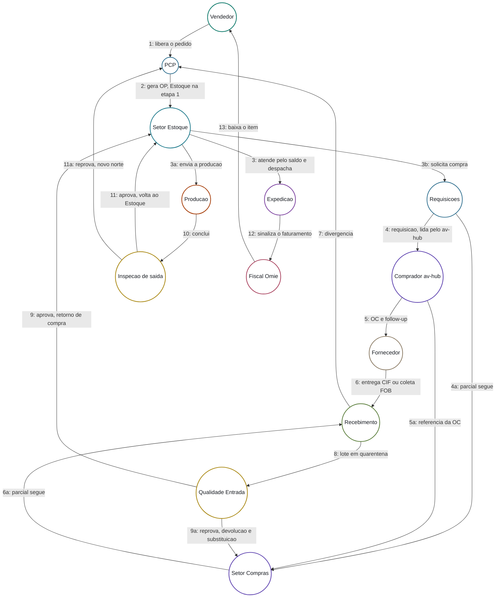
```mermaid
flowchart TD
    Vendedor((Vendedor))
    PCP((PCP))
    Estoque((Setor Estoque))
    Req((Requisicoes))
    SCompras((Setor Compras))
    Compras((Comprador av-hub))
    Fornecedor((Fornecedor))
    Receb((Recebimento))
    QualE((Qualidade Entrada))
    Fabrica((Producao))
    QualS((Inspecao de saida))
    Expedicao((Expedicao))
    Fiscal((Fiscal Omie))

    Vendedor -- "1: libera o pedido" --> PCP
    PCP -- "2: gera OP, Estoque na etapa 1" --> Estoque
    Estoque -- "3: atende pelo saldo e despacha" --> Expedicao
    Estoque -- "3a: envia a producao" --> Fabrica
    Estoque -- "3b: solicita compra" --> Req
    Req -- "4: requisicao, lida pelo av-hub" --> Compras
    Req -- "4a: parcial segue" --> SCompras
    Compras -- "5: OC e follow-up" --> Fornecedor
    Compras -- "5a: referencia da OC" --> SCompras
    Fornecedor -- "6: entrega CIF ou coleta FOB" --> Receb
    SCompras -- "6a: parcial segue" --> Receb
    Receb -- "7: divergencia" --> PCP
    Receb -- "8: lote em quarentena" --> QualE
    QualE -- "9: aprova, retorno de compra" --> Estoque
    QualE -- "9a: reprova, devolucao e substituicao" --> SCompras
    Fabrica -- "10: conclui" --> QualS
    QualS -- "11: aprova, volta ao Estoque" --> Estoque
    QualS -- "11a: reprova, novo norte" --> PCP
    Expedicao -- "12: sinaliza o faturamento" --> Fiscal
    Fiscal -- "13: baixa o item" --> Vendedor

    style Vendedor fill:#ffffff,stroke:#0f7a6b,stroke-width:2px,color:#181c22
    style PCP fill:#ffffff,stroke:#2f6f8f,stroke-width:2px,color:#181c22
    style Req fill:#ffffff,stroke:#2f6f8f,stroke-width:2px,color:#181c22
    style Estoque fill:#ffffff,stroke:#1f7a8c,stroke-width:2px,color:#181c22
    style SCompras fill:#ffffff,stroke:#5b3fae,stroke-width:2px,color:#181c22
    style Compras fill:#ffffff,stroke:#5b3fae,stroke-width:2px,color:#181c22
    style Fornecedor fill:#ffffff,stroke:#8a7a63,stroke-width:2px,color:#181c22
    style Receb fill:#ffffff,stroke:#5a7d3a,stroke-width:2px,color:#181c22
    style QualE fill:#ffffff,stroke:#a8860f,stroke-width:2px,color:#181c22
    style QualS fill:#ffffff,stroke:#a8860f,stroke-width:2px,color:#181c22
    style Fabrica fill:#ffffff,stroke:#a8420f,stroke-width:2px,color:#181c22
    style Expedicao fill:#ffffff,stroke:#7a3f9e,stroke-width:2px,color:#181c22
    style Fiscal fill:#ffffff,stroke:#a83f5c,stroke-width:2px,color:#181c22
```

## 13. Objetos — instância concreta (item de Revenda comprado)

> Snapshot de um cenário real: chapa de revenda sem saldo, comprada pelo circuito fixo, recebida, aprovada na inspeção de entrada, de volta ao Estoque e atendida para a Expedição. Mostra os objetos do diagrama 1 (Estoque) com valores concretos, não só os tipos.

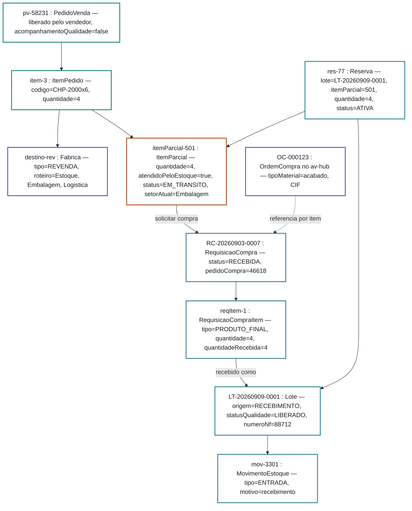
```mermaid
flowchart TD
    PV["pv-58231 : PedidoVenda — liberado pelo vendedor, acompanhamentoQualidade=false"]
    IP["item-3 : ItemPedido — codigo=CHP-2000x6, quantidade=4"]
    FAB["destino-rev : Fabrica — tipo=REVENDA, roteiro=Estoque, Embalagem, Logistica"]
    IPARC["itemParcial-501 : ItemParcial — quantidade=4, atendidoPeloEstoque=true, status=EM_TRANSITO, setorAtual=Embalagem"]
    REQ["RC-20260903-0007 : RequisicaoCompra — status=RECEBIDA, pedidoCompra=46618"]
    RQI["reqItem-1 : RequisicaoCompraItem — tipo=PRODUTO_FINAL, quantidade=4, quantidadeRecebida=4"]
    OC["OC-000123 : OrdemCompra no av-hub — tipoMaterial=acabado, CIF"]
    LOTE["LT-20260909-0001 : Lote — origem=RECEBIMENTO, statusQualidade=LIBERADO, numeroNf=88712"]
    MOV["mov-3301 : MovimentoEstoque — tipo=ENTRADA, motivo=recebimento"]
    RES["res-77 : Reserva — lote=LT-20260909-0001, itemParcial=501, quantidade=4, status=ATIVA"]

    PV --> IP
    IP --> FAB
    IP --> IPARC
    IPARC -->|solicitar compra| REQ
    REQ --> RQI
    OC -.->|referencia por item| REQ
    RQI -->|recebido como| LOTE
    LOTE --> MOV
    RES --> LOTE
    RES --> IPARC

    style PV fill:#ffffff,stroke:#0f7a6b,stroke-width:2px,color:#181c22
    style IP fill:#ffffff,stroke:#0f7a6b,stroke-width:2px,color:#181c22
    style FAB fill:#ffffff,stroke:#5b3fae,stroke-width:2px,color:#181c22
    style OC fill:#ffffff,stroke:#5b3fae,stroke-width:2px,color:#181c22
    style REQ fill:#ffffff,stroke:#2f6f8f,stroke-width:2px,color:#181c22
    style RQI fill:#ffffff,stroke:#2f6f8f,stroke-width:2px,color:#181c22
    style LOTE fill:#ffffff,stroke:#1f7a8c,stroke-width:2px,color:#181c22
    style MOV fill:#ffffff,stroke:#1f7a8c,stroke-width:2px,color:#181c22
    style RES fill:#ffffff,stroke:#1f7a8c,stroke-width:2px,color:#181c22
    style IPARC fill:#ffffff,stroke:#a8420f,stroke-width:2px,color:#181c22
```

**Nota (revista em 01/10/2026):** a parcial chegou ao Estoque sem saldo e foi para o circuito de compra (`REQ`), que **não aparece no roteiro** do destino Revenda. O comprador fechou a OC no av-hub; o número do pedido e o fornecedor ficam registrados na requisição (registro manual até o contrato 004 existir). O item recebido virou o lote `LOTE` em quarentena; aprovado na inspeção de entrada, voltou ao mesmo Estoque, onde o almoxarife atendeu a parcial pelo saldo (`RES`, `ATIVA`) e ela seguiu em trânsito para a Embalagem. A baixa (`RES` → `CONSUMIDA`, `SAIDA` do lote) acontece hoje quando a Embalagem recebe; pela decisão de 29/09, passa para o despacho do Estoque. Ver [[Encaixe-Estoque-Revenda-no-PCP]].

## 14. Estrutura Composta — `Pedido` como composição

> Mostra `Pedido` como um **todo** composto por `ItemPedido` (partes), cada um composto por `ItemParcial` (partes), com **portas** (`setorAtual`) conectando pro ambiente externo (`Setor`). Diferente do diagrama de classes: aqui o foco é composição física real de uma instância, não o tipo.

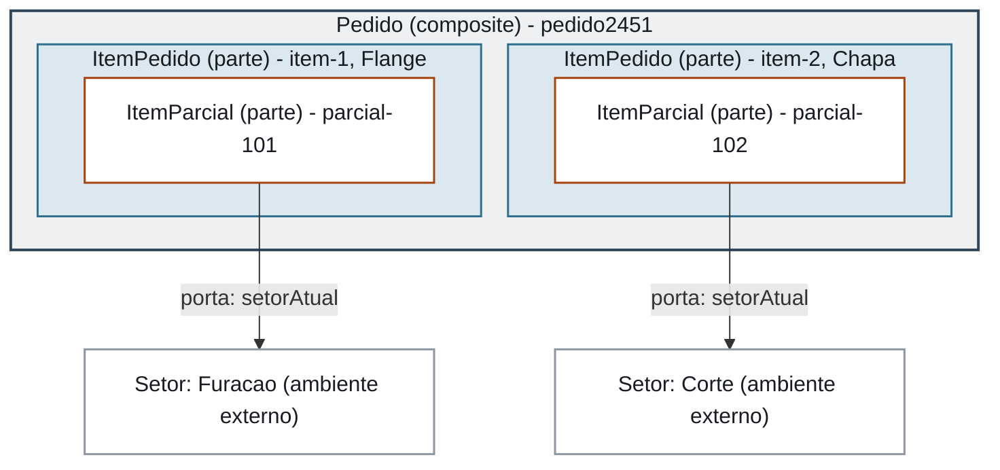
```mermaid
flowchart TD
    subgraph PEDIDO["Pedido (composite) - pedido2451"]
        direction TB
        subgraph ITEM1["ItemPedido (parte) - item-1, Flange"]
            IPARC1["ItemParcial (parte) - parcial-101"]
        end
        subgraph ITEM2["ItemPedido (parte) - item-2, Chapa"]
            IPARC2["ItemParcial (parte) - parcial-102"]
        end
    end

    SETOR_FUR["Setor: Furacao (ambiente externo)"]
    SETOR_CORTE["Setor: Corte (ambiente externo)"]

    IPARC1 -- "porta: setorAtual" --> SETOR_FUR
    IPARC2 -- "porta: setorAtual" --> SETOR_CORTE

    style PEDIDO fill:#eef0f2,stroke:#33475a,stroke-width:2px,color:#181c22
    style ITEM1 fill:#dce8ef,stroke:#2f6f8f,stroke-width:1.5px,color:#181c22
    style ITEM2 fill:#dce8ef,stroke:#2f6f8f,stroke-width:1.5px,color:#181c22
    style IPARC1 fill:#ffffff,stroke:#a8420f,stroke-width:1.5px,color:#181c22
    style IPARC2 fill:#ffffff,stroke:#a8420f,stroke-width:1.5px,color:#181c22
    style SETOR_FUR fill:#ffffff,stroke:#8d95a1,stroke-width:1.5px,color:#181c22
    style SETOR_CORTE fill:#ffffff,stroke:#8d95a1,stroke-width:1.5px,color:#181c22
```

## 15. Visão Geral de Interação — encadeamento dos 6 diagramas de sequência

> Cada retângulo `ref:` é uma **ocorrência de interação** — referencia um dos 6 diagramas de sequência já existentes ([[Fluxo-Compras-Completo]] etc.), sem repetir o conteúdo. Mostra só o fluxo de controle entre eles.

```mermaid
flowchart TD
    START((Inicio)) --> REF0["ref: Liberacao do pedido pelo vendedor"]
    REF0 --> REF5["ref: Fluxo de Estoque, etapa 1"]
    REF5 --> DEC0{Saldo cobre o item?}
    DEC0 -->|sim| REF7
    DEC0 -->|restante| DECF{Comprar ou produzir?}
    DECF -->|solicitar compra| REF1["ref: Fluxo de Compras, circuito fixo"]
    DECF -->|enviar a producao| REF3["ref: Fluxo de Producao OS e OP"]
    REF1 --> REF2["ref: Fluxo de Recebimento"]
    REF2 --> REF4["ref: Fluxo de Qualidade, inspecao de entrada"]
    REF4 --> DEC2{Lote aprovado?}
    DEC2 -->|nao, substituicao| REF1
    DEC2 -->|sim| REF7["ref: Fluxo de Estoque, retorno e despacho"]
    REF3 --> REF8["ref: Fluxo de Qualidade, inspecao de saida"]
    REF8 --> DEC3{Aprovado?}
    DEC3 -->|sim| REF7
    DEC3 -->|nao| PCPN["PCP decide o novo norte"]
    PCPN --> REF3
    REF7 -->|produto pronto| REF6["ref: Fluxo de Expedicao e Faturamento"]
    REF7 -->|materia prima ou beneficiamento| REF3
    REF6 --> END((Fim))

    style REF0 fill:#ffffff,stroke:#0f7a6b,stroke-width:2px,color:#181c22
    style REF1 fill:#ffffff,stroke:#5b3fae,stroke-width:2px,color:#181c22
    style REF2 fill:#ffffff,stroke:#5a7d3a,stroke-width:2px,color:#181c22
    style REF3 fill:#ffffff,stroke:#a8420f,stroke-width:2px,color:#181c22
    style REF4 fill:#ffffff,stroke:#a8860f,stroke-width:2px,color:#181c22
    style REF8 fill:#ffffff,stroke:#a8860f,stroke-width:2px,color:#181c22
    style REF5 fill:#ffffff,stroke:#1f7a8c,stroke-width:2px,color:#181c22
    style REF7 fill:#ffffff,stroke:#1f7a8c,stroke-width:2px,color:#181c22
    style REF6 fill:#ffffff,stroke:#7a3f9e,stroke-width:2px,color:#181c22
    style PCPN fill:#ffffff,stroke:#2f6f8f,stroke-width:2px,color:#181c22
```

> Revisto em 01/10/2026: começa na liberação do pedido pelo vendedor; do Estoque (etapa 1) o restante vai para o circuito de compra ou para a produção; os dois voltam ao Estoque (inspeção de entrada ou de saída) antes do despacho. Sem ` ` nos rótulos.

## 16. Tempo (Timing) — ciclo de vida do item vs. SLA

> Mermaid não tem notação nativa de diagrama de tempo (bandas de estado por lifeline). Aproximado via **Gantt**, que é o tipo mermaid mais estável — cada barra é o tempo que o item passou naquele estado, com marco (`milestone`) no prazo (`data_previsao`) já documentado no SLA do Portal do Vendedor.

```mermaid
%%{init: {'theme': 'base', 'themeVariables': {
  'titleColor': '#181c22',
  'textColor': '#181c22',
  'taskTextColor': '#181c22',
  'taskTextOutsideColor': '#181c22',
  'taskTextLightColor': '#181c22',
  'taskTextDarkColor': '#181c22',
  'taskTextClickableColor': '#181c22',
  'sectionBkgColor': '#eef0f2',
  'sectionBkgColor2': '#ffffff',
  'altSectionBkgColor': '#ffffff',
  'gridColor': '#c7ccd1',
  'todayLineColor': '#c9541a',
  'doneTaskBkgColor': '#d9eef2',
  'doneTaskBorderColor': '#1f7a8c',
  'activeTaskBkgColor': '#dce8ef',
  'activeTaskBorderColor': '#2f6f8f',
  'taskBkgColor': '#e3e0f5',
  'taskBorderColor': '#5b3fae',
  'critBkgColor': '#f6dde4',
  'critBorderColor': '#a83f5c'
}}}%%
gantt
    title Linha de tempo do item - estados vs. tempo (com SLA)
    dateFormat YYYY-MM-DD
    axisFormat %d/%m
    section Estado do item
    AGUARDANDO_LIBERACAO  :done, s0, 2026-09-01, 1d
    ESTOQUE_ETAPA_1       :done, s1, 2026-09-02, 1d
    REQUISICAO            :done, s2, 2026-09-03, 1d
    EM_COMPRA             :done, s3, 2026-09-04, 5d
    EM_RECEBIMENTO        :done, s4, 2026-09-09, 1d
    INSPECAO_ENTRADA      :done, s5, 2026-09-10, 1d
    RETORNO_ESTOQUE       :active, s6, 2026-09-11, 1d
    EM_PRODUCAO_CORTE     :s7, 2026-09-12, 2d
    INSPECAO_SAIDA        :s8, 2026-09-14, 1d
    ENTRADA_ESTOQUE       :s9, 2026-09-15, 1d
    EXPEDICAO             :s10, 2026-09-16, 1d
    FATURADO              :s11, 2026-09-17, 1d
    section SLA
    Prazo (data_previsao) :crit, milestone, 2026-09-11, 0d
```

**Nota (revista em 01/10/2026):** item de Revenda com beneficiamento (corte), no desenho de 29/09 — espera a liberação do vendedor, passa pelo Estoque na etapa 1 (saldo zero), segue o circuito de compra (requisição, compra, recebimento, inspeção de entrada), volta ao Estoque, vai ao corte, passa pela inspeção de saída, volta ao Estoque e só então segue para a Expedição. Neste exemplo o item **estoura o SLA** — o prazo (`data_previsao`) cai em 11/09, no dia em que ele volta ao Estoque, antes do corte. A partir daí entraria na régua vermelha descrita em [[AV-Hub-Portal-Vendedor-Plano]].

**Versão com dados reais:** este exemplo é estático. O modelo que o alimentaria (log de eventos, SLA por etapa, projeção de estouro) está em [[Rastreabilidade-e-SLA-de-Eventos]]; os estados desta visão são o `estado_macro` de cada etapa do fluxo.

---

# Parte 2 — Diagramas de apoio ao desenvolvimento

> Foco explícito: **Estoque, MES/Produção e a integração av-hub↔MES** — Mapas, Portal de Qualidade e Comissionamento ficam de fora por decisão do usuário. Não são UML "puro" em todos os casos, mas são os diagramas que mais ajudam a **desenvolver** o que está sendo discutido.

## 17. Modelo de Dados (PK/FK explícitos) — Estoque

> **Nota de notação:** representado como `classDiagram` com `«PK»`/`«FK»` explícitos nos atributos, em vez de `erDiagram` (pé-de-galinha) — este ambiente não tem mecanismo confiável de estilo direto pra notação ER (o truque `:::estilo` que resolve os diagramas de classe não existe pra ER). Mesma informação que um DBA precisa, tecnologia comprovadamente confiável neste ambiente. Mesmas cardinalidades do diagrama de classes 1. **Revisto em 01/10/2026 com os nomes das tabelas e colunas do Prisma do `api-pcp`** (`materiais`, `lotes`, `saldos_estoque`, `reservas_estoque`, `requisicoes_compra`…); em cinza, o que ainda não existe. `DEPOSITO` ainda não tem `codigo_empresa` no banco (L-09 pendente).

```mermaid
classDiagram
    class MATERIAL:::estoqueStyle {
        +UUID id «PK»
        +UUID codigo_empresa
        +string codigo_produto_omie
        +UUID id_produto_avhub
        +string natureza
        +string categoria
        +decimal peso_teorico_unitario
        +decimal tolerancia_peso
        +decimal ponto_de_pedido
    }
    class FORNECEDOR:::estoqueStyle {
        +UUID id «PK»
        +UUID codigo_empresa
        +string codigo_parceiro_omie
        +string nome_fantasia
        +string cpf_cnpj
    }
    class REQUISICAO_COMPRA:::estoqueStyle {
        +UUID id «PK»
        +string codigo
        +UUID id_item_parcial «FK»
        +UUID id_item_pedido «FK»
        +UUID id_pedido
        +string pedido_venda
        +string status
        +string pedido_compra
        +date previsao_entrega
    }
    class REQUISICAO_COMPRA_ITEM:::estoqueStyle {
        +UUID id «PK»
        +UUID id_requisicao «FK»
        +UUID id_material «FK»
        +string tipo
        +decimal quantidade
        +decimal quantidade_recebida
    }
    class LOTE:::estoqueStyle {
        +UUID id «PK»
        +string codigo
        +UUID id_material «FK»
        +UUID id_lote_pai «FK»
        +UUID id_requisicao_item «FK»
        +string origem
        +string status_qualidade
        +string laudo_url
        +decimal quantidade
        +datetime quarentena_desde
        +string numero_nf
    }
    class RNC:::estoqueStyle {
        +UUID id «PK»
        +UUID id_lote «FK»
        +string motivo
        +string evidencia_url
        +decimal quantidade_reprovada
        +boolean nota_devolucao_pendente
    }
    class DEPOSITO:::estoqueStyle {
        +UUID id «PK»
        +string codigo
        +string nome
    }
    class LOCALIZACAO_ESTOQUE:::estoqueStyle {
        +UUID id «PK»
        +UUID id_deposito «FK»
        +string codigo
        +string descricao
    }
    class SALDO_ESTOQUE:::estoqueStyle {
        +UUID id «PK»
        +UUID id_lote «FK»
        +UUID id_localizacao «FK»
        +UUID id_deposito «FK»
        +decimal quantidade
    }
    class MOVIMENTO_ESTOQUE:::estoqueStyle {
        +UUID id «PK»
        +UUID id_lote «FK»
        +UUID id_reserva «FK»
        +UUID id_localizacao_origem «FK»
        +UUID id_localizacao_destino «FK»
        +string tipo
        +string motivo
        +decimal quantidade
        +UUID autorizado_por_id «FK»
    }
    class RESERVA_ESTOQUE:::estoqueStyle {
        +UUID id «PK»
        +UUID id_lote «FK»
        +UUID id_item_parcial «FK»
        +decimal quantidade
        +decimal quantidade_consumida
        +string status
    }
    class ITEM_PARCIAL:::mesStyle {
        +UUID id «PK»
        +UUID id_lote_compra «FK»
    }
    class PESAGEM:::futuroStyle {
        +decimal peso_teorico
        +decimal peso_real
    }
    class ETIQUETA:::futuroStyle {
        +string tipo
        +string valor
    }
    class ORDEM_SEPARACAO:::futuroStyle {
        +UUID id «PK»
        +string status
    }
    class ITEM_SEPARACAO:::futuroStyle {
        +UUID id «PK»
        +UUID ordem_separacao_id «FK»
        +UUID lote_id «FK»
        +decimal quantidade
    }
    class DEVOLUCAO_CLIENTE:::futuroStyle {
        +string motivo
    }
    class CONTAGEM_CICLICA:::futuroStyle {
        +date data_contagem
        +boolean divergencia
    }

    MATERIAL "1" --> "0..*" LOTE : origina
    REQUISICAO_COMPRA "0..*" --> "1" ITEM_PARCIAL
    REQUISICAO_COMPRA "1" --> "1..*" REQUISICAO_COMPRA_ITEM
    REQUISICAO_COMPRA_ITEM "0..*" --> "1" MATERIAL
    REQUISICAO_COMPRA_ITEM "0..1" --> "0..*" LOTE
    ITEM_PARCIAL "0..*" --> "0..1" LOTE : id_lote_compra
    LOTE "0..1" --> "0..*" LOTE : cisao
    LOTE "1" --> "0..*" RNC
    LOTE "1" --> "0..*" SALDO_ESTOQUE
    SALDO_ESTOQUE "0..*" --> "1" LOCALIZACAO_ESTOQUE
    DEPOSITO "1" --> "0..*" LOCALIZACAO_ESTOQUE
    LOTE "1" --> "0..*" MOVIMENTO_ESTOQUE
    RESERVA_ESTOQUE "0..*" --> "1" LOTE
    RESERVA_ESTOQUE "0..*" --> "0..1" ITEM_PARCIAL
    MOVIMENTO_ESTOQUE "0..*" --> "0..1" RESERVA_ESTOQUE
    LOTE "1" --> "0..1" PESAGEM
    LOTE "1" --> "0..*" ETIQUETA
    ORDEM_SEPARACAO "1" --> "1..*" ITEM_SEPARACAO
    ITEM_SEPARACAO "0..*" --> "1" LOTE
    DEVOLUCAO_CLIENTE "1" --> "1..*" ITEM_SEPARACAO
    CONTAGEM_CICLICA "1" --> "0..*" MOVIMENTO_ESTOQUE
    CONTAGEM_CICLICA "0..*" --> "1" LOCALIZACAO_ESTOQUE : conta

    classDef estoqueStyle fill:#d9eef2,stroke:#1f7a8c,color:#181c22
    classDef mesStyle fill:#f3ddd6,stroke:#a8420f,color:#181c22
    classDef futuroStyle fill:#eef0f2,stroke:#8d95a1,color:#5c6570
    cssClass "MATERIAL,FORNECEDOR,REQUISICAO_COMPRA,REQUISICAO_COMPRA_ITEM,LOTE,RNC,DEPOSITO,LOCALIZACAO_ESTOQUE,SALDO_ESTOQUE,MOVIMENTO_ESTOQUE,RESERVA_ESTOQUE" estoqueStyle
    cssClass "ITEM_PARCIAL" mesStyle
    cssClass "PESAGEM,ETIQUETA,ORDEM_SEPARACAO,ITEM_SEPARACAO,DEVOLUCAO_CLIENTE,CONTAGEM_CICLICA" futuroStyle
```

## 18. Modelo de Dados (PK/FK explícitos) — MES/Produção

> Mesma troca de notação do diagrama 17 — `classDiagram` com `«PK»`/`«FK»`, não `erDiagram`. **Revisto em 01/10/2026** com as colunas novas do Prisma: os 7 tipos de setor, `id_unidade` e `acompanhamento_qualidade` no pedido, `id_lote_compra` e `atendido_pelo_estoque` na parcial.

```mermaid
classDiagram
    class FABRICA:::mesStyle {
        +UUID id «PK»
        +string codigo
        +string nome
        +string tipo
    }
    class SETOR:::mesStyle {
        +UUID id «PK»
        +string codigo
        +string nome
        +boolean exige_maquina_operador
        +string tipo «PRODUTIVO ESTOQUE COMPRAS EXPEDICAO REQUISICAO LOGISTICA_ENTRADA QUALIDADE»
    }
    class MAQUINA:::mesStyle {
        +UUID id «PK»
        +UUID id_setor «FK»
        +string codigo
    }
    class PEDIDO:::mesStyle {
        +UUID id «PK»
        +UUID id_fabrica «FK»
        +string pedido_venda
        +string ordem_producao
        +string status
        +string sistema
        +string id_unidade
        +boolean acompanhamento_qualidade
    }
    class ITEM_PEDIDO:::mesStyle {
        +UUID id «PK»
        +UUID id_pedido «FK»
        +UUID id_item_pai «FK»
        +string codigo
        +decimal quantidade
        +decimal quantidade_concluida
        +boolean inativo
    }
    class ROTEIRO_PEDIDO:::mesStyle {
        +UUID id «PK»
        +UUID id_pedido «FK»
        +UUID id_setor «FK»
        +int ordem
    }
    class ROTEIRO_ITEM:::mesStyle {
        +UUID id «PK»
        +UUID id_item_pedido «FK»
        +UUID id_setor «FK»
        +int ordem
    }
    class ITEM_PARCIAL:::mesStyle {
        +UUID id «PK»
        +UUID id_item_pedido «FK»
        +UUID id_parcial_origem «FK»
        +UUID id_devolvido_de «FK»
        +UUID id_setor_atual «FK»
        +UUID id_setor_origem «FK»
        +UUID id_lote_compra «FK»
        +int quantidade
        +string status
        +boolean retrabalho
        +boolean atendido_pelo_estoque
    }
    class HISTORICO_ITEM_PARCIAL:::mesStyle {
        +UUID id «PK»
        +UUID id_item_parcial «FK»
        +string status_anterior
        +string status_novo
    }
    class ITEM_PARCIAL_ANEXO:::mesStyle {
        +UUID id «PK»
        +UUID id_item_parcial «FK»
        +string url
    }
    class ITEM_PARCIAL_OBSERVACAO:::mesStyle {
        +UUID id «PK»
        +UUID id_item_parcial «FK»
        +string texto
    }
    class ENTREGA:::mesStyle {
        +UUID id «PK»
        +UUID id_item_pedido «FK»
        +UUID id_item_parcial «FK»
        +decimal quantidade
        +string numero_nf
    }
    class DIVERGENCIA:::mesStyle {
        +UUID id «PK»
        +UUID id_pedido «FK»
        +UUID id_item_pedido «FK»
        +UUID id_item_parcial «FK»
        +string tipo
        +string status
    }

    FABRICA "1" --> "0..*" SETOR : fabrica_setores
    SETOR "1" --> "0..*" MAQUINA
    FABRICA "1" --> "0..*" PEDIDO
    PEDIDO "1" --> "1..*" ITEM_PEDIDO
    ITEM_PEDIDO "0..1" --> "0..*" ITEM_PEDIDO : id_item_pai
    PEDIDO "1" --> "0..*" ROTEIRO_PEDIDO
    ROTEIRO_PEDIDO "0..*" --> "1" SETOR
    ITEM_PEDIDO "1" --> "0..*" ROTEIRO_ITEM
    ROTEIRO_ITEM "0..*" --> "1" SETOR
    ITEM_PEDIDO "1" --> "0..*" ITEM_PARCIAL
    ITEM_PARCIAL "0..1" --> "0..*" ITEM_PARCIAL : split
    ITEM_PARCIAL "0..1" --> "0..1" ITEM_PARCIAL : devolvido_de
    ITEM_PARCIAL "0..*" --> "1" SETOR : setor_atual
    ITEM_PARCIAL "1" --> "0..*" HISTORICO_ITEM_PARCIAL
    ITEM_PARCIAL "1" --> "0..*" ITEM_PARCIAL_ANEXO
    ITEM_PARCIAL "1" --> "0..*" ITEM_PARCIAL_OBSERVACAO
    ITEM_PEDIDO "1" --> "0..*" ENTREGA
    ITEM_PARCIAL "0..1" --> "0..*" ENTREGA
    PEDIDO "1" --> "0..*" DIVERGENCIA
    ITEM_PEDIDO "0..1" --> "0..*" DIVERGENCIA
    ITEM_PARCIAL "0..1" --> "0..*" DIVERGENCIA

    classDef mesStyle fill:#f3ddd6,stroke:#a8420f,color:#181c22
    cssClass "FABRICA,SETOR,MAQUINA,PEDIDO,ITEM_PEDIDO,ROTEIRO_PEDIDO,ROTEIRO_ITEM,ITEM_PARCIAL,HISTORICO_ITEM_PARCIAL,ITEM_PARCIAL_ANEXO,ITEM_PARCIAL_OBSERVACAO,ENTREGA,DIVERGENCIA" mesStyle
```

## 19. Objetos — cenário real do MES (Flange no roteiro)

> Mesmo estilo do diagrama 13, agora do lado da produção — um pedido de Flange com 2 itens, cada um seguindo um roteiro próprio (confirma o achado do diagrama 2: roteiro por item, não só por pedido).

```mermaid
flowchart TD
    PED["pedido2451 : Pedido — ordemProducao=OP-2451, destino=Flanges tipo FABRICACAO, status=EM_PRODUCAO"]
    IT1["item-1 : ItemPedido — codigo=FLG-150-2, quantidade=10, quantidadeConcluida=0"]
    IT2["item-2 : ItemPedido — codigo=FLG-300-4, quantidade=5, quantidadeConcluida=5"]
    RI0["roteiroItem-0 : RoteiroItem — setor=Estoque tipo ESTOQUE, ordem=0, fixo, inserido pelo backend"]
    RI1["roteiroItem-1 : RoteiroItem — setor=Corte, ordem=1"]
    RI2["roteiroItem-2 : RoteiroItem — setor=Furacao, ordem=2"]
    RI3["roteiroItem-3 : RoteiroItem — setor=Inspecao de saida tipo QUALIDADE, ordem=3"]
    RI4["roteiroItem-4 : RoteiroItem — setor=Estoque, ordem=4, retorno adicionado na montagem"]
    RI5["roteiroItem-5 : RoteiroItem — setores=Embalagem e Logistica tipo EXPEDICAO, ordem=5 e 6"]
    IP0["itemParcial-500 : ItemParcial — split de 6, atendidoPeloEstoque=true, status=EM_TRANSITO, setorAtual=Embalagem"]
    RES["reserva-31 : Reserva — lote=LT-20260901-0003, itemParcial=500, quantidade=6, status=ATIVA"]
    IP1["itemParcial-501 : ItemParcial — split de 4, status=EM_ANDAMENTO, setorAtual=Furacao"]
    IP2["itemParcial-502 : ItemParcial — status=CONCLUIDO, setorAtual=Logistica"]
    HIST["historico-9001 : HistoricoItemParcial — statusAnterior=EM_TRANSITO, statusNovo=RECEBIDO"]

    PED --> IT1
    PED --> IT2
    IT1 --> RI0
    IT1 --> RI1
    IT1 --> RI2
    IT1 --> RI3
    IT1 --> RI4
    IT1 --> RI5
    IT1 --> IP0
    IT1 --> IP1
    IP0 --> RES
    IT2 --> IP2
    IP1 --> HIST

    style PED fill:#ffffff,stroke:#33475a,stroke-width:2px,color:#181c22
    style IT1 fill:#ffffff,stroke:#2f6f8f,stroke-width:2px,color:#181c22
    style IT2 fill:#ffffff,stroke:#2f6f8f,stroke-width:2px,color:#181c22
    style RI0 fill:#ffffff,stroke:#1f7a8c,stroke-width:2px,color:#181c22
    style RI4 fill:#ffffff,stroke:#1f7a8c,stroke-width:2px,color:#181c22
    style IP0 fill:#ffffff,stroke:#1f7a8c,stroke-width:2px,color:#181c22
    style RES fill:#ffffff,stroke:#1f7a8c,stroke-width:2px,color:#181c22
    style RI1 fill:#ffffff,stroke:#5c6570,stroke-width:2px,color:#181c22
    style RI2 fill:#ffffff,stroke:#5c6570,stroke-width:2px,color:#181c22
    style RI3 fill:#ffffff,stroke:#a8860f,stroke-width:2px,color:#181c22
    style RI5 fill:#ffffff,stroke:#7a3f9e,stroke-width:2px,color:#181c22
    style IP1 fill:#ffffff,stroke:#a8420f,stroke-width:2px,color:#181c22
    style IP2 fill:#ffffff,stroke:#a8420f,stroke-width:2px,color:#181c22
    style HIST fill:#ffffff,stroke:#8d95a1,stroke-width:2px,color:#181c22
```

**Nota (revista em 01/10/2026):** no setor Estoque (etapa 1, inserida pelo backend) 6 unidades de `item-1` foram atendidas pelo saldo — o split `IP0` segue em trânsito para a Embalagem com a reserva `RES` ativa, sem passar pela produção — e as outras 4 seguem em Furação (`IP1`). Depois da produção, as 4 passam pela inspeção de saída (setor tipo `QUALIDADE`), voltam ao Estoque (2º setor Estoque, adicionado na montagem do roteiro) e só então vão para a Expedição. `item-2` já concluiu tudo. Cada item do mesmo pedido avança de forma independente pelo seu próprio roteiro.

## 20. Estados — Reserva de Estoque (implementada em 28/09/2026, papel revisto em 29/09)

> **Revisto em 01/10/2026 (conferido no código):** a reserva existe no `api-pcp` (`reservas_estoque`) e pode ser consumida em partes (`quantidade_consumida`); desfazer o recebimento na Embalagem estorna o consumo. **Decisão de 29/09 ainda sem código:** a baixa passa para o despacho do Estoque e a reserva fica só para "separar sem despachar".
>
> ✅ **Decidido em 24/09/2026** ([[Encaixe-Estoque-Revenda-no-PCP]]): a proposta anterior (`CRIADA → CONFIRMADA`, com `EXPIRADA` por timeout) foi substituída. A reserva nasce `ATIVA` no setor Estoque, sempre sobre lote já liberado — na etapa 1 ou na volta do item comprado aprovado —, aponta para lote + `ItemParcial` e **não expira**: só vira `LIBERADA` por cancelamento explícito do pedido/OP.

```mermaid
stateDiagram-v2
    [*] --> ATIVA : setor Estoque atende o split, so sobre lote LIBERADO
    ATIVA --> CONSUMIDA : saida fisica, hoje quando a Embalagem recebe
    CONSUMIDA --> ATIVA : estorno, desfazer o recebimento
    ATIVA --> LIBERADA : pedido ou OP cancelado, ou liberacao manual com motivo
    CONSUMIDA --> [*]
    LIBERADA --> [*]

    note right of ATIVA
        Sem expiracao. Aponta para lote e ItemParcial.
        Decidido em 29/09: a baixa passa para o
        despacho do Estoque e a reserva fica so
        para separar sem despachar
    end note

    classDef estoqueStyle fill:#d9eef2,stroke:#1f7a8c,color:#181c22
    class ATIVA,CONSUMIDA,LIBERADA estoqueStyle
```

## 21. Mapa Geral — arquitetura de dados (av-hub × MES)

> As duas bases lado a lado, só com o que é relevante pra Estoque/MES (Mapas, Qualidade, Comissão deliberadamente fora). **Revisto em 01/10/2026:** os 4 fluxos da integração — 1 (requisição, o av-hub lê `GET /requisicoes-compra`), 2 (referência da OC, rota ainda não existe), 3 (status por item, `GET /itens/status`) e 4 (pedidos liberados, o MES lê `GET /pedidos_liberados`). Estoque e Compras já são tabelas do banco do MES; a compra fica ligada ao lote pela requisição.

```mermaid
flowchart LR
    subgraph AVHUB[Cluster av-hub - Postgres, 1 banco]
        direction TB
        CORE[schema core - produtos, parceiros, unidades]
        VENDAS[schema core_vendas_faturamento - pedidos, liberacao do pedido, requisicoes e ordens de compra]
        AUTH[schema auth - RBAC e chaves de servico]
    end

    subgraph MES[Banco do MES - Prisma, schema public]
        direction TB
        PROD[Producao - pedidos, itens_parciais, roteiros]
        ESTOQUEDB[Estoque - materiais, lotes, saldos, reservas, movimentos, RNC]
        COMPRASMES[Compras - requisicoes_compra e itens]
    end

    OMIE[("Omie - SaaS externo")]

    OMIE -->|pipeline ELT, polling| VENDAS
    VENDAS -->|"Fluxo 4: pedidos liberados, o MES le"| PROD
    CORE -.->|"produto lido na 1a entrada de estoque"| ESTOQUEDB
    COMPRASMES -->|"Fluxo 1: requisicao, o av-hub le"| VENDAS
    VENDAS -.->|"Fluxo 2: referencia da OC, a construir"| COMPRASMES
    PROD -->|"Fluxo 3: status por item, o av-hub le"| VENDAS
    PROD <-->|"setor Estoque: reserva por ItemParcial"| ESTOQUEDB
    COMPRASMES <-->|"circuito de compra: lote da requisicao"| ESTOQUEDB

    style AVHUB fill:#e3e0f5,stroke:#5b3fae,stroke-width:2px,color:#181c22
    style MES fill:#f3ddd6,stroke:#a8420f,stroke-width:2px,color:#181c22
    style CORE fill:#ffffff,stroke:#5b3fae,stroke-width:1.5px,color:#181c22
    style VENDAS fill:#ffffff,stroke:#5b3fae,stroke-width:1.5px,color:#181c22
    style AUTH fill:#ffffff,stroke:#5b3fae,stroke-width:1.5px,color:#181c22
    style PROD fill:#ffffff,stroke:#a8420f,stroke-width:1.5px,color:#181c22
    style ESTOQUEDB fill:#ffffff,stroke:#1f7a8c,stroke-width:1.5px,color:#181c22
    style COMPRASMES fill:#ffffff,stroke:#2f6f8f,stroke-width:1.5px,color:#181c22
```

**Nota:** as setas que cruzam a fronteira dos bancos são o "casamento av-hub↔MES" — polling REST na DEC-2, contratos [[003-Requisicao-Compra-Integracao-MES]], [[004-Referencia-OC-Integracao-MES]], [[005-Status-Item-Integracao-MES]] e [[26-Vendas-Liberacao-Pedido]]. Em 01/10/2026: o Fluxo 4 roda dos dois lados; as rotas dos Fluxos 1 e 3 existem no MES, mas o job do av-hub que as lê ainda não; a rota do Fluxo 2 não existe.

## 22. Fluxo de Dados — Omie até o Estoque

> Não é UML — é um DFD (Data Flow Diagram) simplificado, mas é o que melhor responde "de onde vem o dado e em que velocidade" pra quem for desenvolver a integração.

```mermaid
flowchart LR
    OMIE[("Omie")]
    ELT["Pipeline ELT, polling de 3 min a diario"]
    PGAVHUB[("Postgres av-hub")]
    GATEWAY["api-acos-vital, x-api-key"]
    MESAPI["api-pcp, modulos de Producao, Estoque e Compras"]
    PGMES[("Postgres MES")]

    OMIE -->|extrai, upsert| ELT
    ELT -->|grava| PGAVHUB
    PGAVHUB -->|le, via API| GATEWAY
    GATEWAY -->|"pedidos liberados, itens, produto na 1a entrada"| MESAPI
    MESAPI -->|grava| PGMES
    MESAPI -->|"PUT requisicao de compra (c.34); GET eventos da requisicao (c.35)"| GATEWAY
    GATEWAY -.->|"status por item (005): rota existe, av-hub nao consome"| MESAPI

    style OMIE fill:#ffffff,stroke:#8a7a63,stroke-width:2px,color:#181c22
    style ELT fill:#ffffff,stroke:#c9541a,stroke-width:2px,color:#181c22
    style PGAVHUB fill:#ffffff,stroke:#5b3fae,stroke-width:2px,color:#181c22
    style GATEWAY fill:#ffffff,stroke:#33475a,stroke-width:2px,color:#181c22
    style MESAPI fill:#ffffff,stroke:#1f7a8c,stroke-width:2px,color:#181c22
    style PGMES fill:#ffffff,stroke:#a8420f,stroke-width:2px,color:#181c22
```

**Nota (revista em 01/10/2026):** essa é a velocidade **hoje confirmada** (polling em camadas, sem webhook). O MES não copia o catálogo: lê o produto do av-hub só na primeira entrada de estoque, e a Carteira lê só os pedidos liberados. **(corrigido em 08/10)** A volta já existe em parte: o MES **empurra** a requisição com `PUT` (contrato 34, fila com retentativa) e **lê** os eventos da requisição por polling (contrato 35); a rota `/itens/status` (005) existe no MES, mas o av-hub não tem quem a consuma, e a `/ordens-compra/referencia` (004) não existe nos dois lados. Tempo real continua fora do desenho.

## 23. Classes — Recebimento e integração com o av-hub (`api-pcp`, conferido em 08/10/2026)

> Lido de `prisma/models/compras.prisma` e `integracao.prisma` (`develop` `ca3346b`). `Recebimento`, `RecebimentoItem` e `RecebimentoDivergencia` **não estavam** nos diagramas de classes 1 e 17.

```mermaid
classDiagram
    class RequisicaoCompra {
        +uuid id
        +string codigo
        +StatusRequisicaoCompra status
        +string pedidoVenda
        +string ordemProducao
        +date prazoNecessidade
        +string pedidoCompra
        +string fornecedor
        +date previsaoEntrega
        +string motivoCancelamento
    }
    class RequisicaoCompraItem {
        +TipoItemRequisicao tipo
        +decimal quantidade
        +decimal quantidadeRecebida
        +uuid avhubIdRequisicao
        +string avhubNumero
        +string avhubStatus
    }
    class Recebimento {
        +uuid id
        +string codigo
        +StatusRecebimento status
        +string numeroNf
        +string chaveAcessoNf
        +string fornecedor
        +string laudoUrl
        +datetime conferidoEm
        +datetime recontadoEm
        +datetime decididoEm
        +string motivoDecisao
    }
    class RecebimentoItem {
        +decimal quantidadePendente
        +decimal quantidadeNf
        +decimal quantidadeContada
        +decimal quantidadeRecontada
        +decimal pesoTeorico
        +decimal pesoReal
        +decimal pesoRecontado
        +decimal toleranciaPeso
        +uuid idLocalizacao
        +uuid idLote
    }
    class RecebimentoDivergencia {
        +TipoDivergenciaRecebimento tipo
        +string descricao
        +string evidenciaUrl
        +string etapa
    }
    class IntegracaoAvhubEnvio {
        +TipoEnvioAvhub tipo
        +uuid idOrigem
        +json corpo
        +StatusEnvioAvhub status
        +int tentativas
        +datetime proximaTentativaEm
        +int httpStatus
        +string ultimoErro
    }
    class RequisicaoCompraEventoAvhub {
        +uuid id
        +uuid idOrigem
        +uuid idRequisicaoAvhub
        +string tipo
        +string statusRequisicao
        +uuid idOrdemCompra
        +string numeroPedidoOmie
        +json dados
        +string acao
    }
    class IntegracaoAvhubCursor {
        +string chave
        +string alteradoDesde
        +uuid aposId
    }
    class ItemParcial
    class Lote
    class Material
    RequisicaoCompra "1" --> "*" RequisicaoCompraItem
    RequisicaoCompra "1" --> "*" Recebimento
    RequisicaoCompra "*" --> "1" ItemParcial
    RequisicaoCompraItem "*" --> "1" Material
    RequisicaoCompraItem "1" --> "*" Lote
    Recebimento "1" --> "*" RecebimentoItem
    Recebimento "1" --> "*" RecebimentoDivergencia
    Recebimento "*" --> "1" ItemParcial
    RecebimentoItem "*" --> "1" RequisicaoCompraItem
    RequisicaoCompra ..> IntegracaoAvhubEnvio : "PUT contrato 34 (idOrigem)"
    RequisicaoCompra ..> RequisicaoCompraEventoAvhub : "eventos contrato 35 (idOrigem)"
    RequisicaoCompraEventoAvhub ..> IntegracaoAvhubCursor : "cursor requisicoes-eventos"
```

**Enums:** `StatusRequisicaoCompra` (ABERTA, EM_COMPRA, RECEBIDA_PARCIAL, RECEBIDA, CANCELADA); `TipoItemRequisicao` (PRODUTO_FINAL, MATERIA_PRIMA); `TipoDivergenciaRecebimento` (QUANTIDADE, DESCRICAO, PESO, AVARIA); `StatusEnvioAvhub` (PENDENTE, ENVIADO, RECUSADO, FALHOU); `TipoEnvioAvhub` (REQUISICAO_COMPRA). `idLocalizacao` e `idLote` em `RecebimentoItem` são **sem FK** no schema (o lote só nasce quando o recebimento é CONCLUIDO ou ACEITO).

## 24. Estados — Recebimento (`api-pcp`, conferido em 08/10/2026)

```mermaid
stateDiagram-v2
    [*] --> CONCLUIDO : conferencia sem divergencia (lote nasce em quarentena)
    [*] --> AGUARDANDO_RECONTAGEM : conferencia divergiu (nada entra)
    AGUARDANDO_RECONTAGEM --> CONCLUIDO : recontagem sem divergencia (outra pessoa)
    AGUARDANDO_RECONTAGEM --> AGUARDANDO_DECISAO : recontagem ainda diverge
    AGUARDANDO_DECISAO --> ACEITO : PCP aceita (entra o valor recontado, motivo obrigatorio)
    AGUARDANDO_DECISAO --> REABERTO : PCP reabre (nada entra, a parcial volta a Compras, motivo obrigatorio)
    CONCLUIDO --> [*]
    ACEITO --> [*]
    REABERTO --> [*]
```

Fonte: `compras/recebimento.service.ts` (`conferir`, `recontar`, `decidir`). Detalhe de regras em [[App-PCP-Recebimento-Conferencia]].

## 25. Classes — `api-comercial` (schema `core_comercial`, conferido em 08/10/2026)

> Lido de `av-hub/api-comercial/prisma/models/*.prisma` (`develop` `bd1ae48`). Diagrama 3 cobre só o Hub/RBAC; o módulo Comercial & Suprimentos **não estava** em nenhum diagrama. Nem todos os campos são mostrados. Detalhe em [[AV-Hub-Comercial-Suprimentos]].

```mermaid
classDiagram
    class EmpresaEmissora
    class PerfilComercial {
        +CargoComercial cargo
        +Unidade[] unidades
        +CodigoEmpresa[] empresas
    }
    class Cliente
    class ClienteContato
    class Proposta {
        +StatusProposta status
        +Moeda moeda
        +TipoVenda tipoVenda
    }
    class PropostaItem
    class PropostaEvento {
        +TipoEventoProposta tipo
    }
    class PropostaVersao
    class SolicitacaoCusto {
        +StatusSolicitacao status
    }
    class CategoriaSuprimento
    class Produto
    class Fornecedor
    class ApelidoFornecedor
    class FornecedorCategoria
    class Certificado {
        +TipoCertificado tipo
    }
    class Oferta {
        +FonteOferta fonte
        +StatusOferta status
    }
    class ParametroCusto
    class TabelaCustoTelha
    class OrdemCompra
    class ItemOrdemCompra
    class ProdutoContaOmie
    class FornecedorContaOmie
    class SincronizacaoOmie
    class ChaveIdempotencia
    class TravaTarefa
    class Notificacao
    EmpresaEmissora "1" --> "*" Proposta
    Cliente "1" --> "*" Proposta
    Cliente "1" --> "*" ClienteContato
    Proposta "1" --> "*" PropostaItem
    Proposta "1" --> "*" PropostaEvento
    Proposta "1" --> "*" PropostaVersao
    CategoriaSuprimento "1" --> "*" Produto
    Produto "1" --> "*" Oferta
    Fornecedor "1" --> "*" Oferta
    Fornecedor "1" --> "*" ApelidoFornecedor
    Fornecedor "1" --> "*" Certificado
    Fornecedor "1" --> "*" FornecedorCategoria
    CategoriaSuprimento "1" --> "*" FornecedorCategoria
    Fornecedor "1" --> "*" OrdemCompra
    OrdemCompra "1" --> "*" ItemOrdemCompra
    Produto "1" --> "*" ItemOrdemCompra
    ItemOrdemCompra "0..1" --> "*" Oferta : origem da oferta
    Produto "1" --> "*" ProdutoContaOmie
    Fornecedor "1" --> "*" FornecedorContaOmie
```

**Enums principais:** `StatusProposta` (ABERTA, PARCIAL, FECHADA, PERDIDA); `CargoComercial` (VENDEDOR, AUXILIAR_VENDAS, SUPERVISOR_COMERCIAL, GERENTE_COMERCIAL, GERENTE_GERAL, DIRETOR_COMERCIAL); `StatusSolicitacao` (ABERTA, RESPONDIDA, SEM_FORNECEDOR, CANCELADA); `StatusOferta` (VIGENTE, VENCIDA, INVALIDADA, HISTORICA); `FonteOferta` (MANUAL, MAPA_COTACAO, PEDIDO_OMIE, MIGRACAO); `TipoEventoProposta` inclui PDF_GERADO e EMAIL_ENVIADO. Empresas emissoras AV, AU e HRM; unidades MOGI, UBERABA e ARUJA.

## Cobertura do código (lacunas conhecidas em 08/10/2026)

Itens do código que os diagramas 1, 2, 17 e 18 ainda **não** mostram: `FabricaSetor` (tabela de ligação Fábrica × Setor), `PedidoExcluido`, `AuditoriaLogin` e `AuditoriaAcesso` (no `api-pcp`). Os enums de `estoque.prisma` (`NaturezaMaterial`, `OrigemLote`, `StatusQualidadeLote`, `TipoMovimentoEstoque`, `StatusReserva`) não foram comparados valor a valor. As classes marcadas como futuras nos diagramas (Pesagem, Etiqueta, OrdemSeparacao, ItemSeparacao, DevolucaoCliente, ContagemCiclica) continuam sem modelo no schema.

## Ver também
- [[AV-Hub-Comercial-Suprimentos]] — o módulo do diagrama 25.
- [[Encaixe-Estoque-Revenda-no-PCP]] — o encaixe que revisou estes diagramas em 24/09 e 01/10/2026.
- [[26-Vendas-Liberacao-Pedido]], [[003-Requisicao-Compra-Integracao-MES]], [[004-Referencia-OC-Integracao-MES]], [[005-Status-Item-Integracao-MES]] — os 4 fluxos da integração.
- [[Fluxogramas-Completos]] — diagramas de atividade (equivalente UML), com raias por setor.
- [[Fluxo-Compras-Completo]], [[Fluxo-Recebimento-Completo]], [[Fluxo-Qualidade-Completo]], [[Fluxo-Producao-OS-OP-Completo]], [[Fluxo-Expedicao-Faturamento-Completo]], [[Fluxo-Estoque-Completo]] — diagramas de sequência.
- [[Setores-Envolvidos-no-Fluxo]]
- [[Schema-Postgres-Multi-Dominio]]
- [[Estoque-Modelo-Dados]]
- [[App-PCP-Backend-Producao]]
- [[Achado-Duplicacao-RBAC]]
- [[Infraestrutura-Self-Hosted]]
