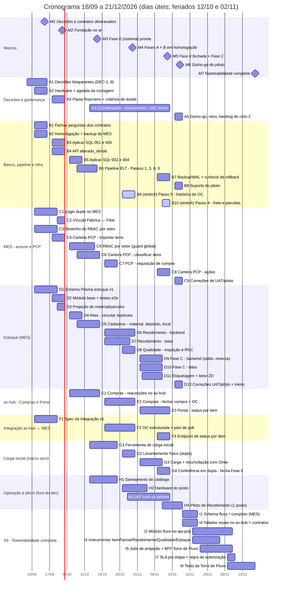

# Cronograma de Desenvolvimento — 3 meses (18/09 a 21/12/2026)

> **Atualizado em 21/09/2026**: estendido de 2 para 3 meses a pedido do Nathan, especificamente para caber a rastreabilidade **completa** (todas as rotas, não só Recebimento/Qualidade/Compras — ver R-07/R-14 em [[Perguntas-em-Aberto-Consolidadas]]). O plano original (S1 a FC, 18/09-18/11, 42 dias úteis) **não muda uma linha** — só ganha uma **S5 nova** (19/11 a 18/12) depois do piloto, com os 23 dias úteis extras do 3º mês. Ver seção 3 para a conta de capacidade e seção 5 (S5) para o detalhe.
>
> Plano original fechado em **42 dias úteis** (61 corridos, feriados 12/10 e 02/11), montado em cima do que o vault já decidiu: as fases 0/A/B/C de [[Estoque-Roadmap]], o roteiro de extração do Omie, os contratos da seção de contratos e o fluxo dos 6 fluxogramas de [[Fluxogramas-Completos]].
>
> **Leia antes de aprovar:** (1) as premissas de capacidade abaixo são deste plano — o vault não registra alocação real, ajuste se for outra; (2) **ainda não cabe tudo mesmo com 3 meses** — Fase D, Expedição/Faturamento e o resto seguem fora (seção 2), a extensão cobriu especificamente a rastreabilidade completa, não o roadmap inteiro; (3) o caminho crítico continua sendo as decisões de **25/09** (seção 7).

## 1. Marcos

| Marco | Data | O que precisa estar pronto |
|---|---|---|
| **M1** — Decisões e contratos destravados | 25/09 | DEC-1 a DEC-9 respondidas (ou default adotado por escrito); perguntas dos contratos 001/002/004/005 fechadas; compra do hardware aprovada; levantamento físico agendado. |
| **M2** — Fundação no ar | 02/10 | Contratos 001/005 aplicados; alterado_desde no ar; schema do Estoque migrado em homologação; login duplo e vínculo Fábrica↔Filial prontos; spec de integração aprovada. |
| **M3** — Fase 0 (sistema) pronta | 16/10 | Alias, cadastros, RBAC por setor, Carteira do PCP (classificação) e caixa de requisições do av-hub prontos; saneamento e ferramenta de carga em andamento. |
| **M4** — Fases A + B em homologação | 30/10 | Requisição → OC estruturada → referência no MES → recebimento com pesagem, quarentena, inspeção e RNC funcionando em homologação; levantamento físico executado. |
| **M5** — Fase 0 fechada + Fase C | 13/11 | Marco zero carregado e conferido em dupla; saldo/movimento/reserva em homologação; status por item no Portal do Vendedor; UAT concluída. |
| **M6** — Go/no-go do piloto | 18/11 | Piloto de recebimento avaliado; decisão de seguir, ajustar ou parar; backlog do ciclo 2 priorizado. **Não muda** com a extensão — a rastreabilidade completa não bloqueia o piloto. |
| **M7** — Rastreabilidade completa (todas as rotas) | 18/12 | Log de eventos (`fluxo.evento`) e `item_acompanhado` cobrindo Compras, Recebimento, Qualidade, Produção e Estoque; Torre de Fluxo (mapa, trilha, tempo por etapa, ranking de gargalos) em homologação. **Novo (21/09).** |

## 2. O que entra e o que não entra

**Entra** = tem dono, data e critério de pronto no cronograma (o ID entre parênteses aponta a tarefa). **Não entra** = fica fora dos 60 dias, com o motivo quando há um. Ao todo: 36 itens entram (2 só se sobrar folga) e 33 ficam de fora, em 9 áreas.

Em uma frase: entra do catálogo saneado até o recebimento com qualidade, saldo e reserva, com PCP e Compras ligados por polling; não entra separação/expedição, faturamento operacional, devolução, contagem cíclica, RFID nem financeiro.

### Catálogo, cadastros e marco zero — Fase 0

**Entra**

- Vincular duplicata do catálogo do Omie ao material canônico, sem tocar no Omie (endpoint + tela), e revisão humana por Compras/PCP (D4, H1)
- Cadastro de material com campos extras (peso teórico, tolerância, mínimo/máximo, ponto de pedido), depósito/warehouse e localização (D5)
- Ferramenta de carga inicial (dry-run) e folhas de contagem por localização (G1)
- Levantamento físico em dupla conferência, carga e reconciliação com o saldo do Omie (G2, G3)
- Fechamento da Fase 0 (marco zero) em 13/11 (G4)

**Não entra**

- Cadastro próprio de fornecedor — o Estoque reaproveita core.parceiros por projeção
- Inspeção de qualidade sobre a carga inicial — nasce liberada, com dupla conferência (default da DEC-4)
- Consumo de estoque pelo PCP/Comercial antes de 13/11 — a reserva só liga depois do marco zero

### Compras — Fase A

**Entra**

- Requisição de compra saindo do PCP no MES (material, quantidade, prazo, filial) (C7)
- Caixa de entrada das requisições no av-hub (E1)
- Fechar a compra no av-hub: fornecedor, preço, acabado/não acabado, CIF/FOB e aprovação condicional por valor (parâmetro) (E2)
- Ordem de Compra com dados estruturados, sem PDF, e previsão de chegada registrada pelo CCP (E2)
- Referência mínima da OC (itens, quantidade, flag) chegando ao MES para o recebimento (F2)

**Não entra**

- Cotação e comparação entre fornecedores — segue fora do sistema
- Estado "em trânsito" verificável — o fornecedor não acessa o sistema; fica só a previsão de chegada
- Criar Pedido de Venda/OC nativamente no av-hub com push para o Omie — visão de futuro
- Módulo Orçamento — conceito ainda não definido

### Recebimento e Qualidade — Fase B

**Entra**

- Recebimento em duas etapas: conferência quantitativa (Almoxarife) e qualitativa (Qualidade) (D6, D7)
- Pesagem com peso teórico × real e tolerância, digitada à mão (D6, D7)
- Divergência sempre com saída — nenhum estado sem caminho (D6)
- Lote nasce em quarentena; aprovação, reprovação, RNC e cisão de lote (D6, D8)
- Etiqueta com código de barras/QR e leitor 2D no posto de recebimento (D11)
- Piloto assistido em 1 posto, de 11/11 a 18/11 (H4)

**Não entra**

- Integração automática com a balança — v1 usa digitação manual (DEC-5)
- Inspeção de processo, marcada pelo vendedor desde o início do pedido
- Fechamento automático da RNC pela nota de devolução do Omie — a Qualidade fecha à mão
- RFID (Fase E) e marcação direta a laser
- Piloto em outros postos ou filiais

### Estoque — Fase C

**Entra**

- Saldo por warehouse, localização e lote (D9, D10)
- Movimentação com motivo obrigatório e ajuste de saldo (D9, D10)
- Reserva de estoque PCP × Comercial — liga só depois do marco zero (D9, D10)

**Não entra**

- Separação e expedição (ordem e item de separação) — Fase D
- Devolução de cliente, com reentrada física — Fase D
- Contagem cíclica — Fase D
- Ponto de pedido com alerta e sugestão automática de compra — Fase D
- Telas de Gestão (dashboards, auditoria, relatórios) — ~4 das ~21 telas do PRD

### PCP e produção — Fase 0 e C

**Entra**

- Carteira do PCP: importar os itens do pedido de venda e classificar cada item (natureza × disponibilidade) (C4, C6)
- Ações a partir da classificação: reservar, abrir OS/OP, gerar requisição (C8)
- Vínculo Fábrica ↔ Unidade/Filial (codigo_empresa) (C2)

**Não entra**

- Cadastro de novas linhas de fabricação (fábrica e roteiro de Grades de Piso etc.)
- BOM/roteiro rico com tempo padrão (Passo 12)
- Frontend do board/dashboard de produção do MES — backlog do Robert fora deste plano
- Reabertura de Divergência no api-pcp — adiada por decisão anterior

### Integração av-hub ↔ MES — Casamento

**Entra**

- Contrato v1 de integração, com autenticação entre serviços (F1)
- 3 fluxos por polling: requisição (MES → av-hub), referência da OC (av-hub → MES) e status por item (MES → av-hub) (F2, F3)
- Etapa de cada item no Portal do Vendedor (E3)
- Projeção read-only de material e parceiro + filtro alterado_desde nas APIs do av-hub (D3, B4)
- **Novo (S5, 21/09):** rastreabilidade completa — log de eventos (`fluxo.evento`) e `item_acompanhado` cobrindo **todas as rotas** (Compras, Recebimento, Qualidade, Produção, Estoque), Torre de Fluxo (mapa por setor, trilha do item, tempo por etapa, ranking de gargalos) (I1-I7)

**Não entra**

- Tempo real, webhook ou barramento de eventos — só polling
- Status por item de Expedição/Faturamento — esse módulo em si não é construído neste ciclo (Fase D), não é escolha de rastreabilidade
- ~~Detecção de produto excluído no polling — lacuna aceita por ora (DEC-7)~~ ✅ resolvido em 21/09: `?incluir_deletados=true` implementado em `/produtos` e `/parceiros`

### Acesso e segurança — MES

**Entra**

- Login duplo no MES: usuário/senha (chão de fábrica) e e-mail/Azure AD (escritório) (C1)
- RBAC por instância de setor (Almoxarife, Qualidade e Gestor de Estoque com escopo por warehouse/setor) (C3, C5)

**Não entra**

- RBAC compartilhado entre av-hub e MES — são duas implementações independentes, por decisão
- Comprador e Aprovador no MES — continuam só no av-hub

### Omie — extração e contratos — Antes do desligamento

**Entra**

- Contratos SQL 001 (parceiros fiscais), 002 (saldo de estoque), 004 (pedidos de compra) e 005 (locais de estoque) aplicados (B3, B5)
- Pipeline: dados fiscais do parceiro, lead_time do produto, locais de estoque e confirmação das etapas de faturamento (Passos 1, 3, 6, 9) (B6)
- Saldo do Omie habilitado (Passo 2) para reconciliar a carga inicial (G3)
- Histórico de pedidos de compra (Passo 5) — só se sobrar folga (B9) *(stretch)*
- Frete e parcelas do pedido de venda (Passo 4) — só se sobrar folga (B10) *(stretch)*

**Não entra**

- Remessa de produtos (Passo 7) — confirmar antes se a Aços Vital usa
- Valor da devolução parcial (Passo 8, contrato 006) — o Omie não expõe; captura nativa no ciclo 2
- Tabela de preços (Passo 14) e sugestão de compra (Passo 13)
- Módulo financeiro (Passo 15) — só a decisão DEC-11, sem código

### Homologação e piloto — Fechamento

**Entra**

- UAT com Almoxarife, Qualidade, PCP e Compras, de 28/10 a 13/11 (H3)
- Treinamento do posto de recebimento e runbook de rollback do piloto (A4, B7, D12)
- Go/no-go em 18/11, com backlog do ciclo 2 priorizado (A5)

**Não entra**

- Go-live geral em todos os postos e filiais — só depois do go/no-go
- Desligamento do Omie — fora deste ciclo
- Comissionamento e simulador de comissão — seguem como experimento

### Cobertura dos 6 fluxogramas ao fim dos 2 meses

| Fluxograma | Cobertura | O que entra |
|---|---|---|
| 1. Mestre (pedido → faturamento) | Parcial | Do pedido até o estoque e o status por item; Expedição/Faturamento e Fiscal ficam no ciclo 2. |
| 2. Compras | Quase completo | Requisição (PCP) → OC estruturada (av-hub, aprovação condicional, CIF/FOB) → referência no MES. CCP entra só como previsão de chegada (não há estado 'em trânsito' verificável). |
| 3. Recebimento | Completo | Conferência dupla, pesagem, divergência, quarentena, etiqueta e roteamento. |
| 4. Qualidade | Parcial | Inspeção final, aprovação/reprovação, RNC e cisão de lote; sem inspeção de processo e sem fechamento automático da RNC. |
| 5. Produção (OS/OP) | Parcial | O motor de execução já existe; entra o despacho a partir da Carteira do PCP. |
| 6. Estoque | Parcial | Saldo, localização, movimento, reserva e carga inicial; sem contagem cíclica, ponto de pedido e separação (Fase D). |

**Recomendação:** manter esse corte. Incluir a Fase D dentro dos 2 meses exigiria ~1 dev a mais ou cortar itens da seção 9 que protegem a rastreabilidade (quarentena, dupla conferência) — não recomendo trocar isso por velocidade.

## 3. Capacidade e premissas

Base original: **42 dias úteis** (S1-FC, 18/09-18/11) × fator de foco por pessoa. O vault não traz esses números — são premissa deste plano; cada ±10 p.p. de foco em um dev muda ~4 pd.

| Pessoa | Papel | Foco | Capacidade (pd) | Planejado (pd) | Stretch (pd) |
|---|---|---|---|---|---|
| Nathan | Coordenação/PO + av-hub full stack | 40% | 16,8 | 15,8 | 0,0 |
| Gustavo | Banco de dados, API e pipeline (DBA) | 60% | 25,2 | 21,2 | 2,9 |
| Robert | Fullstack sênior - MES/PCP | 75% | 31,5 | 29,2 | 0,0 |
| Pablo | Fullstack - MES/Estoque | 75% | 31,5 | 29,2 | 0,0 |
| **Total (S1-FC)** | | | **105,0** | **95,5** | **2,9** |

Reserva de **9,5 pd (9%)** em S1-FC, fora os itens *stretch*. É folga curta — não mexida por essa extensão, porque as decisões da seção 7 e a ordem de corte da seção 9 já contam com ela exatamente assim.

### 3.1 Extensão de 3 meses (21/09/2026) — capacidade da S5

Do dia 22/09 (execução real) a 21/12/2026: **63 dias úteis** (13 semanas exatas, feriados 12/10 e 02/11; 15/11 cai num domingo, não conta) — **23 dias úteis a mais** do que os 40 dias úteis restantes do plano original de 2 meses. Isso é o "3º mês" pedido, tratado como capacidade nova, isolada do plano S1-FC:

| Pessoa | Foco | Capacidade extra (pd) | Planejado em S5 (pd) | Reserva (pd) |
|---|---|---|---|---|
| Nathan | 40% | 9,2 | 11,0 | **-1,8** ⚠️ |
| Gustavo | 60% | 13,8 | 2,0 | 11,8 |
| Robert | 75% | 17,25 | 12,0 | 5,25 |
| Pablo | 75% | 17,25 | 2,0 | 15,25 |
| **Total** | | **57,5** | **27,0** | **30,5** |

**Sobra bastante reserva (30,5 pd) — de propósito**, depois de uma folga de só 9% no plano original. Duas opções para essa sobra: manter como buffer de verdade (recomendado, dado que é a primeira vez que o time constrói um log de eventos deste tipo) ou puxar algo da Fase D pra dentro do ciclo — decisão sua, não assumida aqui.

**⚠️ Nathan estoura a própria capacidade extra** (11,0 pd de trabalho contra 9,2 pd disponíveis a 40% foco). Três jeitos de resolver, à escolha: (a) elevar o foco do Nathan pra ~48% só durante a S5; (b) esticar a janela da S5 só para as entregas do Nathan (I5/I6) em ~1 semana; (c) mover parte da I6 (telas da Torre de Fluxo) para o Robert ou o Pablo, que sobram 5-15 pd de folga. Ver seção 5, S5.

Carga por sprint (planejado ÷ capacidade, em pessoa-dia):

| Sprint | Janela | Dias úteis | Nathan | Gustavo | Robert | Pablo |
|---|---|---|---|---|---|---|
| **S1** — Destravar e fundação | 18/09 a 02/10 | 11 | 4,1 ÷ 4,4 | 5,5 ÷ 6,6 | 7,5 ÷ 8,2 | 7,5 ÷ 8,2 |
| **S2** — Fase 0 (sistema) + núcleo do Estoque | 05/10 a 16/10 | 9 | 3,3 ÷ 3,6 | 4,8 ÷ 5,4 | 6,0 ÷ 6,8 | 6,5 ÷ 6,8 |
| **S3** — Fases A + B + levantamento físico | 19/10 a 30/10 | 10 | 3,7 ÷ 4,0 | 4,6 ÷ 6,0 | 7,0 ÷ 7,5 | 7,0 ÷ 7,5 |
| **S4** — Fase C + integração + marco zero | 02/11 a 13/11 | 9 | 3,6 ÷ 3,6 | 4,5 ÷ 5,4 | 6,5 ÷ 6,8 | 6,0 ÷ 6,8 |
| **FC** — Fechamento: homologação e go/no-go | 16/11 a 18/11 | 3 | 1,2 ÷ 1,2 | 1,8 ÷ 1,8 | 2,2 ÷ 2,2 | 2,2 ÷ 2,2 |

## 4. Gantt

## 5. Plano por sprint

Legenda de responsável: **Nathan** (N), **Gustavo** (G), **Robert** (R), **Pablo** (P), **Operação/negócio** (O, sem pd de dev). Itens *stretch* marcados.

### S1 — Destravar e fundação (18/09 a 02/10)

| ID | Entrega | Resp. | pd | Janela | Depende de | Pronto quando |
|---|---|---|---|---|---|---|
| A1 | Workshop de decisões bloqueantes (DEC-1 a DEC-9) + registro no vault | Nathan | 1,5 | 18/09–25/09 | - | DEC-1..9 respondidas ou com default adotado por escrito |
| A2 | Hardware do posto: aprovar compra e agendar o levantamento físico com a operação | Nathan | 0,5 | 21/09–25/09 | DEC-8 | Pedido de compra emitido; janela de 26-30/10 reservada com a operação |
| B1 | Fechar as perguntas abertas dos contratos (SQL 001/002/004/005, API 001/002) | Gustavo | 1 | 21/09–25/09 | DEC-7 | Contratos sem pergunta aberta, prontos para aplicar |
| B2 | Ambiente de homologação do MES/Estoque + backup/WAL do banco do MES | Gustavo | 1,5 | 21/09–25/09 | - | Banco de homologação no ar; backup do banco do MES confirmado |
| C1 | Login duplo no MES (usuário/senha + e-mail/Azure AD) | Robert | 3 | 21/09–29/09 | - | Chão de fábrica entra por usuário/senha; escritório por e-mail corporativo |
| C3 | Desenho do RBAC por instância de setor + revisão do schema do Estoque | Robert | 1,5 | 21/09–29/09 | - | Modelo de permissão por setor aprovado; schema D1 revisado |
| D1 | Schema Prisma estoque v1 + migrations (material, alias, depósito, localização, lote, movimento) | Pablo | 4 | 21/09–29/09 | DEC-4, DEC-7 | Migrations aplicadas em homologação |
| F1 | Spec do contrato de integração v1: requisição, referência da OC e status por item + autenticação entre serviços | Nathan | 1,5 | 21/09–29/09 | DEC-2 | Spec aprovada por Robert e Gustavo; polling, idempotência e dono de cada coluna definidos |
| A3 | Pauta do módulo financeiro (Passo 15) + critérios de aceite por fase | Nathan | 0,6 | 28/09–02/10 | - | Critérios de aceite de Fase 0/A/B/C no vault; pauta financeira enviada a quem decide o roadmap |
| B3 | Aplicar contratos SQL 001 (parceiros fiscais) e 005 (locais de estoque) | Gustavo | 1,5 | 28/09–02/10 | B1 | Colunas/tabelas criadas; contratos marcados como aplicada |
| B4 | API alterado_desde em /produtos e /parceiros (contrato API 001) | Gustavo | 1,5 | 28/09–02/10 | B1 | Filtro incremental no ar em api-acos-vital |
| C4 | PCP Carteira (backend): importar itens do pedido pelo gateway | Robert | 1,5 | 28/09–02/10 | - | Itens do pedido de venda disponíveis no MES por número do pedido |
| D2 | Módulo base do Estoque: guards, seeds e harness de testes e2e | Pablo | 2 | 28/09–02/10 | D1 | Módulo sobe no MES com testes e2e rodando |
| C2 | Vínculo Fábrica ↔ Unidade/Filial (codigo_empresa) | Robert | 1,5 | 30/09–02/10 | DEC-1 | Toda fábrica com filial; pedido cruzável por unidade |
| D3 | Projeção read-only de material e parceiro (full sync; incremental após B4) | Pablo | 1,5 | 30/09–02/10 | B4 | core.produtos e core.parceiros projetados no Estoque |

### S2 — Fase 0 (sistema) + núcleo do Estoque (05/10 a 16/10)

| ID | Entrega | Resp. | pd | Janela | Depende de | Pronto quando |
|---|---|---|---|---|---|---|
| B5 | Aplicar contratos SQL 002 (estoque_saldo) e 004 (pedidos_compras) | Gustavo | 2 | 05/10–09/10 | B1, DEC-7 | Tabelas criadas; contratos marcados como aplicada |
| C5 | RBAC por instância de setor (guard global + PerfilSetor) | Robert | 3 | 05/10–14/10 | C3 | Almoxarife, Qualidade e Gestor de Estoque com escopo por warehouse/setor |
| D4 | Alias (contrato API 002): endpoint + tela para vincular duplicata ao material canônico | Pablo | 2,5 | 05/10–09/10 | D3 | Comprador/PCP conseguem resolver duplicata sem tocar no Omie |
| E1 | Compras v1: modelagem + caixa de entrada de requisições vindas do MES | Nathan | 3 | 05/10–16/10 | F1, DEC-2 | Comprador vê as requisições do PCP no av-hub |
| B6 | Pipeline ELT: Passos 1, 3, 6 e 9 (parceiros fiscais, lead_time, locais, etapas) | Gustavo | 1,5 | 08/10–15/10 | B3, B5 | Parceiros com dados fiscais e locais de estoque sincronizando; etapas confirmadas em produção |
| C6 | PCP Carteira: classificação natureza × disponibilidade (backend + tela) | Robert | 3 | 08/10–16/10 | C4 | PCP classifica cada item (Revenda/Fabricação × pronto/MP/sem estoque) |
| D5 | Cadastros: material (campos extras), depósito/warehouse e localização - API + telas | Pablo | 4 | 08/10–16/10 | D4, C5, DEC-6 | Material com peso teórico, tolerância, mín/máx e ponto de pedido; localizações cadastradas |
| A4 | Coordenar saneamento do catálogo, UAT e treinamento dos setores | Nathan | 1,5 | 13/10–13/11 | D4, H1 | Roteiro de UAT por setor; treinamento do posto de recebimento |
| G1 | Ferramenta de carga inicial: import → lotes CARGA_INICIAL, dry-run e folhas de contagem | Gustavo | 2,9 | 13/10–23/10 | D5, DEC-4 | Dry-run com dados de teste; folhas de contagem por localização |
| H1 | Saneamento do catálogo: revisão humana das duplicatas (Compras/PCP) | Operação/negócio | - | 13/10–23/10 | D4 | Duplicatas resolvidas; pendentes ficam em fila e não entram na contagem |

### S3 — Fases A + B + levantamento físico (19/10 a 30/10)

| ID | Entrega | Resp. | pd | Janela | Depende de | Pronto quando |
|---|---|---|---|---|---|---|
| C7 | PCP: requisição de compra (endpoint + tela; payload C1 do fluxo) | Robert | 2,5 | 19/10–23/10 | C6, F1 | Requisição sai do MES com material, quantidade, prazo e filial |
| D6 | Recebimento (backend): conferência dupla, divergência com saída, pesagem, quarentena, RNC e cisão de lote | Robert | 4,5 | 19/10–30/10 | D5, F2, DEC-5 | Nenhum estado sem saída; lote nasce em quarentena |
| D7 | Recebimento (frontend): fila, conferência quantitativa, pesagem, divergência | Pablo | 4 | 19/10–28/10 | D5 | Almoxarife executa o recebimento ponta a ponta em homologação |
| E2 | Compras: fechar compra (fornecedor, preço, aprovação condicional, acabado/não acabado, CIF/FOB, previsão de chegada) + OC estruturada | Nathan | 3 | 19/10–30/10 | E1, DEC-3 | OC com dados estruturados, sem PDF; CCP registra previsão de chegada |
| F2 | API de OC estruturada + jobs de poll (requisições → av-hub; referência da OC → MES) | Gustavo | 3 | 19/10–30/10 | F1, E1 | Requisição e OC trafegam entre os dois sistemas em homologação |
| B9 | (stretch) Passo 5 - histórico de pedidos de compra do Omie | Gustavo | 2 | 26/10–30/10 | B5 | Só se houver folga; primeiro corte se apertar |
| D8 | Qualidade (frontend): fila de inspeção, laudo, aprova/reprova, RNC e cisão | Pablo | 3 | 26/10–30/10 | D6 | Qualidade inspeciona, aprova ou reprova; lote reprovado é cindido |
| G2 | Levantamento físico do estoque em dupla conferência | Operação/negócio | - | 26/10–30/10 | G1, H1, A2 | Contagem completa por warehouse, assinada por duas pessoas |
| H2 | Entrega e instalação do hardware do posto (impressora + leitor 2D) | Operação/negócio | - | 26/10–04/11 | A2, DEC-8 | Posto de recebimento equipado |
| H3 | UAT com os setores (Almoxarife, Qualidade, PCP, Compras) | Operação/negócio | - | 28/10–13/11 | D7, D8, E2 | Roteiros de UAT executados e bugs triados |

### S4 — Fase C + integração + marco zero (02/11 a 13/11)

| ID | Entrega | Resp. | pd | Janela | Depende de | Pronto quando |
|---|---|---|---|---|---|---|
| D10 | Fase C (frontend): saldo, movimentos, ajuste com motivo e reserva | Pablo | 3 | 02/11–10/11 | D9 | Gestor de estoque consulta e ajusta saldo |
| D9 | Fase C (backend): saldo, movimento com motivo obrigatório, reserva PCP × Comercial | Robert | 3,5 | 02/11–10/11 | D6 | Saldo por warehouse/localização/lote; reserva liberada só após o marco zero |
| E3 | Portal do Vendedor: status por item (poll + etapa na tela) | Nathan | 3 | 02/11–13/11 | F3 | Vendedor vê a etapa de cada item do pedido |
| G3 | Carga: importar, reconciliar com o saldo do Omie (Passo 2) e listar divergências | Gustavo | 3 | 02/11–10/11 | G2, B5 | Divergências contagem × Omie explicadas ou aprovadas |
| D11 | Etiquetagem código de barras/QR + leitor 2D no recebimento e na movimentação | Pablo | 3 | 03/11–10/11 | H2, DEC-8 | Etiqueta impressa e lida no posto de recebimento |
| B7 | Backup/WAL do MES em produção + runbook de rollback do piloto | Gustavo | 1,5 | 09/11–13/11 | B2 | Runbook testado; restauração simulada |
| C8 | PCP Carteira: ações (reservar / abrir OS-OP / gerar requisição) | Robert | 1 | 09/11–13/11 | C7, D9 | Ação por item a partir da classificação |
| F3 | Endpoint de status por item no MES (/itens/status?alterado_desde=) | Robert | 2 | 09/11–13/11 | F1, D9 | av-hub consegue ler o estado de cada item por polling |
| G4 | Conferência da carga em dupla e fechamento da Fase 0 | Operação/negócio | - | 09/11–13/11 | G3 | Marco zero aprovado; consumo liberado para PCP/Comercial |
| B10 | (stretch) Passo 4 - frete e parcelas do pedido de venda | Gustavo | 0,9 | 11/11–13/11 | B3 | Só se houver folga; primeiro corte se apertar |
| H4 | Piloto assistido de Recebimento (1 posto, material real, em paralelo ao processo manual) | Operação/negócio | - | 11/11–18/11 | D6, D7, D8, H2 | Recebimentos reais registrados no sistema em modo sombra |

### FC — Fechamento: homologação e go/no-go (16/11 a 18/11)

| ID | Entrega | Resp. | pd | Janela | Depende de | Pronto quando |
|---|---|---|---|---|---|---|
| A5 | Go/no-go, retro e backlog do próximo ciclo + documentação no vault | Nathan | 1,2 | 16/11–18/11 | H4 | Decisão go/no-go registrada; backlog do ciclo 2 (Fase D...) priorizado |
| B8 | Suporte do piloto, monitoramento e correções | Gustavo | 1,8 | 16/11–18/11 | H4 | Sem incidente aberto sem dono |
| C9 | Correções de UAT e do piloto | Robert | 2,25 | 16/11–18/11 | H3, H4 | Bugs críticos do piloto fechados |
| D12 | Correções de UAT e do piloto + treinamento no posto | Pablo | 2,25 | 16/11–18/11 | H3, H4 | Bugs críticos do piloto fechados; posto treinado |

### S5 — Rastreabilidade completa: todas as rotas (19/11 a 18/12) — **nova, 21/09/2026**

Não depende do go/no-go de M6 ter dado certo — roda em paralelo/depois, sobre o sistema que S1-S4 já entregou. Detalhe técnico completo em [[Rastreabilidade-e-SLA-de-Eventos]] e [[Campos-e-API-para-Rastreabilidade]].

| ID | Entrega | Resp. | pd | Janela | Depende de | Pronto quando |
|---|---|---|---|---|---|---|
| I1 | Schema `fluxo.*` completo no MES: 7 tabelas Prisma (`evento`, `item_acompanhado`, `etapa_fluxo`, `setor_fluxo`, `sla_etapa`, `regra_autorizacao`, `calendario_util`) + migrations | Pablo | 2 | 19/11–25/11 | D1 (já entregue) | Migrations aplicadas em homologação |
| I4 | Tabelas novas no av-hub (`requisicao_compra`+item, `ordem_compra`+item, `pedido_acompanhamento`, `core_fluxo.evento`, `item_estado_projetado`, `feed_cursor`) — contrato SQL + aplicação | Gustavo | 2 | 19/11–25/11 | - | Tabelas criadas; contrato marcado como aplicada |
| I2 | Módulo `fluxo` no `api-pcp`: feed (`/eventos`), status, trilha, tempo por etapa, mapa por setor, ações (`assumir`/`passar`/`autorizar`), catálogos | Robert | 7 | 23/11–09/12 | I1 | Todos os endpoints da seção 5.1 de [[Campos-e-API-para-Rastreabilidade]] no ar em homologação |
| I3 | Instrumentar `ItemParcial` (Produção) e os módulos de Recebimento/Qualidade/Estoque (já entregues em S1-S4) para também escrever em `fluxo.evento` | Robert | 4 | 23/11–04/12 | I1, D6-D10 (já entregues) | Toda transição relevante gera evento, sem duplicar o que `HistoricoItemParcial` já faz |
| I7 | SLA por etapa configurável (`fluxo.sla_etapa`) + regra de autorização (`fluxo.regra_autorizacao`) | Robert | 1 | 07/12–10/12 | I2 | Metas de tempo por etapa editáveis; ações de DEC-3 exigem `autorizado_por` |
| I5 | Jobs de projeção do feed (`core_fluxo.item_estado_projetado`) + endpoints BFF (`GET /api/fluxo/torre`, `/itens/{id}`) | Nathan | 4 | 26/11–09/12 | I4, I2 | av-hub projeta o estado de cada item a partir do feed do MES |
| I6 | Telas da Torre de Fluxo: mapa por setor, trilha do item, tempo por etapa (fila×execução+projeção), ranking de gargalos | Nathan | 7 | 07/12–18/12 | I5 | As 4 telas do protótipo rodando com dado real, em homologação |

**Nunca cortar aqui:** nada — se a S5 estourar, a resposta é estender a janela (já é capacidade extra, não tira de outro lugar), não cortar rastreabilidade parcialmente, porque o pedido explícito foi 100%.

## 6. Trilhas que atravessam os sprints

- **Fase 0 (arrumar a casa):** decisões e contratos (S1) → alias e cadastros (S2, D4/D5) → saneamento humano (13-23/10, H1) → contagem física em dupla (26-30/10, G2) → carga e conferência (S4, G3/G4) → **marco zero em 13/11**. Nenhum consumo por PCP/Comercial antes disso ([[Estoque-Riscos]]).
- **Fase A + B (compra → doca):** requisição do PCP (C7) → OC estruturada no av-hub (E1/E2) → referência no MES (F2) → recebimento com pesagem, quarentena, inspeção e RNC (D6-D8). Ver [[Fluxo-Compras-Completo]], [[Fluxo-Recebimento-Completo]], [[Fluxo-Qualidade-Completo]].
- **Fase C (saldo):** backend e telas em S4 (D9/D10); a **reserva só liga depois do marco zero**. Ver [[Fluxo-Estoque-Completo]].
- **Casamento av-hub ↔ MES:** resolvido em 21/09 como DEC-2 (polling REST + `x-api-key`, 3 fluxos) — spec em S1 (F1), fluxos de requisição e OC em S3 (F2), status por item em S4 (F3/E3) — sempre por polling, sem tempo real.
- **Rastreabilidade completa (todas as rotas):** R-07/R-14 respondidas em 21/09 como "todas as rotas", não o mínimo. Como isso excedia a folga de 9% do plano de 2 meses, o prazo foi estendido pra 3 meses especificamente por causa disso — vira a **S5** (19/11-18/12), com capacidade própria (seção 3.1), sem tirar nada de S1-FC. Campos e endpoints completos em [[Campos-e-API-para-Rastreabilidade]] e [[Rastreabilidade-e-SLA-de-Eventos]].

## 7. Decisões bloqueantes

Cada uma tem um *default* escrito: se ninguém decidir até a data, o default vale e a decisão vira registro no vault. Nenhuma dessas decisões é nova — são as perguntas já abertas em [[Perguntas-Pendentes-MES-Estoque]], [[Estoque-Perguntas-Abertas]] e nos contratos da seção de contratos, datadas.

| # | Decisão | Quem | Até | Default se não decidir | Bloqueia |
|---|---|---|---|---|---|
| DEC-1 | Vínculo Fábrica ↔ Filial (codigo_empresa): 1 fábrica = 1 filial fixa, ou vínculo por pedido? | Nathan + Robert | 25/09 | 1 fábrica = 1 filial fixa | C2 |
| DEC-2 | Integração av-hub ↔ MES v1: polling REST bidirecional (1-5 min) com autenticação entre serviços por x-api-key; 3 fluxos (requisição, referência da OC, status por item) | Nathan + Robert + Gustavo | 29/09 | Polling REST, sem webhook nem tempo real | F1, F2, F3, E1 |
| DEC-3 | ~~Aprovação condicional de compra: acima de qual valor X e quem aprova?~~ ✅ **DECIDIDA em 21/09** — acima de R$ 30.000, o diretor aprova | Nathan + Diretoria | 25/09 | ~~Valor limite vira parâmetro, desligado no v1~~ (não se aplica) | E2 (destravada) |
| DEC-4 | Lote de carga inicial nasce liberado ou passa pela inspeção de qualidade? | Nathan + Qualidade | 25/09 | Nasce liberado, com dupla conferência | D1, G1, G3 |
| DEC-5 | ~~Balança: digitação manual no v1 ou integração automática?~~ ✅ **DECIDIDA em 21/09** — manual | Nathan + Operação | 25/09 | ~~Digitação manual~~ (confirmado) | D6, D7 (destravadas) |
| DEC-6 | Tolerância de peso por categoria de material | Nathan + Qualidade | 25/09 | 5% padrão, ajustável por material | D5 |
| DEC-7 | ~~Contratos SQL: saldo (002); id de item de compra (004); FK de locais (005); exclusão no polling (API 001)~~ ✅ **DECIDIDA em 21/09** — foto atual; id = `(id_pedido_compra, ordem)`; sem FK (por ora); `incluir_deletados=true` resolve a exclusão | Gustavo | 25/09 | ~~Foto atual; id = pedido + sequência do item; sem FK; aceitar a lacuna de exclusão~~ (não se aplica, decidido) | B3, B5, D1, D3 (destravados) |
| DEC-8 | Compra do hardware do posto de recebimento (impressora industrial + leitor 2D, ~R$ 5-7 mil) | Nathan + Diretoria | 25/09 | Sem hardware: etiqueta em impressora comum (Code128) no piloto | H2, D11 |
| DEC-9 | ~~Prazo de retenção de auditoria (5 anos é palpite) - validar com contabilidade/fiscal~~ ✅ **DECIDIDA em 21/09** — fica 5 anos | Nathan | 09/10 | ~~5 anos, sem expurgo automático~~ (confirmado) | Não bloqueia a construção |
| DEC-10 | ~~Devolução de cliente: decisão no av-hub ou nasce no Estoque?~~ ✅ **DECIDIDA em 21/09** — ciclo completo nasce no Estoque, inclusive captura nativa do valor da devolução parcial | Nathan | 13/11 | ~~-~~ (decidido) | Fase D (ciclo 2, destravada) |
| DEC-11 | ~~Módulo financeiro nativo (Passo 15): quem decide e quando~~ ✅ **DECIDIDA em 21/09** — adiado, só no futuro, sem data | Nathan → diretoria | 13/11 | ~~-~~ (confirmado: fora do roadmap atual) | Desligamento do Omie (fora do ciclo) |

## 8. Riscos e gatilhos

| Risco | Prob. | Impacto | Mitigação | Gatilho de alarme |
|---|---|---|---|---|
| Decisões atrasam além de 25/09 | Alta | Alto | Cada decisão tem default escrito; se DEC-1/2/7 não saírem até 29/09, o default vale e vira registro no vault. | Contratos e schema (B3, B5, D1) sem data de início em 29/09 |
| Levantamento físico depende da operação (não é trabalho de dev) | Média | Alto | Agendar já em 21/09; contar por warehouse em ondas; dupla conferência obrigatória. | Operação sem equipe dedicada em 19/10 → M5 desliza; o piloto de recebimento segue |
| Integração av-hub ↔ MES v1 é o maior item em aberto e ainda não foi desenhada | Alta | Alto | Spec F1 na primeira semana; só 3 fluxos por polling; nada de tempo real. | Spec F1 sem aprovação em 02/10 |
| Robert e Pablo também sustentam o MES em produção | Alta | Alto | Foco fixado em 75%; demanda nova do MES vai para o backlog do ciclo 2. | Mais de 1 dia/semana de suporte não planejado |
| Hardware do posto atrasa | Média | Médio | Pedir até 25/09 (DEC-8); fallback: Code128 em impressora comum. | Sem entrega confirmada em 26/10 |
| Saneamento do catálogo não termina antes da contagem | Média | Médio | Só material canônico confirmado entra na contagem; pendentes ficam em fila. | Mais de 20% dos candidatos sem revisão em 23/10 |
| Sem QA dedicado: bug vaza para o piloto | Média | Médio | UAT com os setores de 28/10 a 13/11; piloto em 1 posto, em modo sombra; rollback no runbook B7. | Bug crítico aberto em 11/11 |
| Banco do MES sem backup equivalente ao do av-hub | Média | Alto | B2 confirma o backup na primeira semana; B7 testa a restauração. | Backup não confirmado em 25/09 |
| **(S5) Nathan estoura a capacidade extra do 3º mês** — 11 pd planejados contra 9,2 pd disponíveis a 40% foco | Alta | Baixo | Elevar foco pra ~48% só na S5, esticar a janela do Nathan em ~1 semana, ou mover parte da I6 (telas) pro Robert/Pablo (que sobram 5-15 pd). Decisão pendente, ver seção 3.1. | I6 sem dono definido até 07/12 |
| **(S5) Primeira vez que o time constrói um log de eventos append-only** — sem precedente interno pra estimar bem | Média | Médio | 30,5 pd de reserva na S5 (bem mais folgada que os 9% de S1-FC) funcionam como buffer para esse risco de estimativa. | Menos de 15 pd de reserva restante a meio da S5 (~04/12) |

Dependências fora do time de dev (têm dono e data no gantt): saneamento do catálogo por Compras/PCP (13-23/10), levantamento físico pela operação (26-30/10), compra e instalação do hardware (até 04/11), UAT com Almoxarife, Qualidade, PCP e Compras (28/10-13/11).

## 9. Ordem de corte (para manter a data fixa)

Se algo estourar, o escopo cede — a data não. Cortar nesta ordem:

- 1. Stretch: B9 (Passo 5, histórico de pedidos de compra) e B10 (Passo 4, frete/parcelas) - saem primeiro.
- 2. C8 - ações da Carteira (reservar / abrir OS-OP / gerar requisição): o PCP faz a ação fora do sistema.
- 3. F3 + E3 - status por item só para Fabricação e Recebimento (as demais etapas ficam pro ciclo 2).
- 4. D11 - etiqueta simples em Code128 em vez de QR com layout rico.
- 5. D9/D10 - reserva de estoque sai; Fase C entrega só saldo e movimento.

**Nunca cortar:** Quarentena, inspeção e RNC (D6-D8), dupla conferência da carga (G4), RBAC por setor (C5) e as datas das decisões DEC-1 a DEC-9.

## 10. Piloto e depois de 18/11

O piloto de recebimento (H4) roda de 11/11 a 18/11 em **1 posto**, com material real, **em paralelo ao processo manual** — recebimento não consome estoque, então não depende do marco zero. Em 18/11 (A5) sai o go/no-go: seguir para mais postos, ajustar ou parar. O ciclo 2 começa em 19/11 com Fase D, Expedição/Faturamento e o restante da seção 2; esse ciclo ainda não foi estimado.

## Ver também
- [[Estoque-Roadmap]] — as fases 0/A/B/C/D/E que este plano datou.
- [[Equipe-Projeto]]
- [[Decisoes-Chave-ERP]]
- [[MES-Arquitetura-Decisoes]]
- [[Fluxogramas-Completos]]
- [[Rastreabilidade-e-SLA-de-Eventos]] e [[Campos-e-API-para-Rastreabilidade]] — proposta de rastreabilidade com impacto em D1, F1 e F3.
- Ver também: [[Roteiro-de-Implementacao]] e [[Indice-Contratos]].
