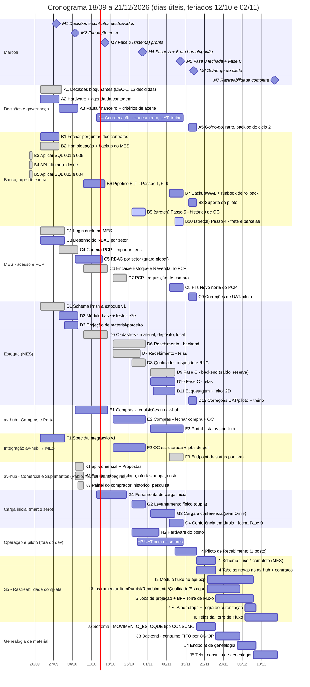

> Status: decidido (Nathan, 07/10) | no código (develop; conferido 07/10) | em produção (MES só em teste; mes-test)

# Cronograma de Desenvolvimento — 3 meses (18/09 a 21/12/2026)

> **Regra de datas (única, 07/10/2026):** a execução vai de **22/09 a 21/12** (**63 dias úteis**). O plano **S1–FC termina em 18/11**; **S5 e M7 terminam em 18/12**; **21/12 é só o fim da conta de capacidade** (o 63º dia útil), não uma entrega. Qualquer "2 meses" ou "60 dias" nesta nota é histórico e foi superado por esta regra. O arquivo **mantém o nome `Cronograma-2-Meses` por ser histórico** (não foi renomeado, para não quebrar links).
>
> **Decisões desta rodada:** ver [[Registro-de-Decisoes-2026-10-07]] (✅ decidido / 🟡 proposta adotada / 🔴 pendente). Os registros 32 e 33 (Pablo no Comercial & Suprimentos; MES com o Robert) mudam a alocação: ver seção 3.2.

> **Atualizado em 21/09/2026**: estendido de 2 para 3 meses a pedido do Nathan, especificamente para caber a rastreabilidade **completa** (todas as rotas, não só Recebimento/Qualidade/Compras — ver R-07/R-14 em [[Perguntas-em-Aberto-Consolidadas]]). O plano original (S1 a FC, 18/09-18/11, 42 dias úteis) **não muda uma linha** — só ganha uma **S5 nova** (19/11 a 18/12) depois do piloto, com os 23 dias úteis extras do 3º mês. Ver seção 3 para a conta de capacidade e seção 5 (S5) para o detalhe.
>
> Plano original fechado em **42 dias úteis** (61 corridos, feriados 12/10 e 02/11), montado em cima do que o vault já decidiu: as fases 0/A/B/C de [[Estoque-Roadmap]], o roteiro de extração do Omie, os contratos da seção de contratos e o fluxo dos 6 fluxogramas de [[Fluxogramas-Completos]].
>
> **Leia antes de aprovar:** (1) as premissas de capacidade abaixo são deste plano — o vault não registra alocação real, ajuste se for outra; (2) **ainda não cabe tudo mesmo com 3 meses** — Fase D, Expedição/Faturamento e o resto seguem fora (seção 2), a extensão cobriu especificamente a rastreabilidade completa, não o roadmap inteiro; (3) ~~o caminho crítico continua sendo as decisões de **25/09** (seção 7)~~ *(histórico: DEC-1 a DEC-12 estão decididas; ver seção 7 e [[Registro-de-Decisoes-2026-10-07]])*.
>
> **Encaixe do Estoque e da Revenda no MES (24/09/2026)** — ver [[Encaixe-Estoque-Revenda-no-PCP]]. Muda o conteúdo (não a janela) de **C6** (vira a implementação de `Fabrica.tipo`/`Setor.tipo`, fábrica Revenda, setor Estoque obrigatório como etapa 1 e a ação de atendimento pelo estoque), **C7** (requisição disparada pela entrada do parcial no setor Compras), **C8** (encolhe: sobra a fila "Novo norte"), **D6** (o recebimento libera o parcial parado no setor Compras), **D8** (a aprovação move o item comprado para o setor Estoque, não para a Expedição — regra do Nathan) e **D9** (reserva por lote + `ItemParcial`, sem expiração; `MovimentoEstoque` com tipo; entrada do item comprado). As telas D8/D10 do Pablo já existem em `develop` sobre mock e esperam esse backend.
>
> **Reajustado em 22/09/2026 (N-07):** a execução começou de fato hoje, não em 18/09 como o plano original previa. **S1 foi replanejada** (22/09-05/10, tarefas e marcos M1/M2 deslocados ~1-2 dias úteis) — ver seções 1, 3 e 5. **Do S2 em diante o resto do plano ainda não foi recalculado** e pode estar alguns dias úteis otimista; recalcular quando a folga real de S1 for conhecida, em vez de propagar um ajuste estimado por 50+ tarefas agora.
>
> **Atualização de 28/09/2026 (Robert)** — ver [[Encaixe-Estoque-Revenda-no-PCP]] para o detalhe completo. **C6 e D9 estão concluídas** (implementadas e testadas — confirmado direto no código do `api-pcp`/`app-pcp`, branch `develop`). Três mudanças de conteúdo (não de janela, por ora): (1) **D3 revisada** — Material deixa de ser projeção em massa do av-hub, nasce só na primeira entrada de estoque; (2) **a parte atendida pelo estoque não conclui mais no setor Estoque** — vai em trânsito pra um novo setor **Expedição** (Embalagem → Logística), e a baixa de saldo só acontece lá; vale também pro item comprado (D8) e pro produto fabricado; (3) **C7/D6 reorganizadas** para incluir o novo setor **"Requisições de compras"** (matéria-prima e revenda) e o recebimento parcial com split — ainda não implementado. **C8** ganha o respeito ao `RoteiroItem` na busca da Expedição.
>
> **⚠️ Mesmo dia (28/09), à tarde: item 3 acima já foi revisado de novo, antes de virar código.** Nova proposta do Robert (módulos Estoque/Compras/Logística/Qualidade — ver [[Encaixe-Estoque-Revenda-no-PCP]] callout da tarde) tira o circuito de compra do roteiro do PCP (vira desvio fixo disparado pelo Estoque), remove o setor "Estoque·Entrada" (volta a ser um único Estoque) e move a baixa do saldo do recebimento na Embalagem para o **despacho do Estoque**. C7/D6/C8 acima ainda descrevem a versão da manhã.
>
> **Atualização de 29/09/2026 — a proposta da tarde de 28/09 vira arquitetura confirmada (Nathan, EC-05/EC-08), ainda sem código.** C7/D6 precisam ser reescopadas pra cobrir os novos setores (`REQUISICAO`, `LOGISTICA_ENTRADA`, `QUALIDADE`) e os menus por módulo (Compras, Logística, Qualidade — Movimentações vira só `PRODUTIVO`), em vez do desenho de 28/09 de manhã que ainda aparece nas linhas C7/D6/D8 abaixo. D8 ganha a inspeção de saída como setor tipo `QUALIDADE` no roteiro (obrigatória em todo roteiro de fabricação) e o fluxo de reprovação total/parcial no recebimento (quarentena da parte boa + realinhamento com Compras). Nenhuma janela nova foi criada ainda no cronograma — avaliar no planejamento da próxima sprint. Ver [[Encaixe-Estoque-Revenda-no-PCP]] seção 5 (linhas de 29/09) e seção 7.

> **(atualizado em 07/10) Os avisos acima, de 21/09 a 29/09, são histórico.** As decisões de 25/09 (DEC-1 a DEC-12) já estão decididas, B3 a B5 já estavam aplicados e as descrições de C7, D6, D8 e C8 de 28/09 (manhã) foram **superadas por entrega em 07/10 e pela arquitetura de 29/09**. Vale a tabela da seção 5 e o [[Registro-de-Decisoes-2026-10-07]].

> **Atualização de 07/10/2026 — estado real das tarefas (pente fino contra o código).** Os prefixos "conferido 07/10" nas linhas da seção 5 vêm de leitura do código das `develop` do `api-pcp` (`ca3346b`) e do `app-pcp` (`a802a3e`); ~~não houve conferência de homologação~~ **(superado: o `mes-test.acosvital.com.br` está no ar com a `develop`, ✅ #1 do Registro)**; produção segue sem conferência pelo código e **a `main` do MES parou em 28/08** (merge `develop` → `main` antes do piloto, ✅ #22). Resumo: D1, D5, D6, D7, D8, D9, D10 e C6/C7 entregues no código; D2, D3, D11, C5, C8 e G1 parciais; **C3 (RBAC por setor e filial) não iniciada**; D4 cortada (código removido em 29/09); a **etapa 1 da transferência entre filiais** (saldo por filial) concluída em 07/10 (`861c050`), etapas 2–4 inexistentes. Na integração, o 003 foi substituído pelo 34 e a F2 mudou de forma (ver a linha da F2). O ritmo observado deixa S2/S3 à frente do plano; ~~os marcos M2–M4 só mudam com homologação (não confirmada)~~ **superado: homologação disponível no mes-test; M2 cumprido, M3–M5 ver seção 1.** Detalhe em [[Onde-Estamos]].

## 1. Marcos

| Marco | Data | O que precisa estar pronto |
|---|---|---|
| **M1** — Decisões e contratos destravados | ~~25/09~~ **28/09** (reajustado 22/09 — N-07) | DEC-1 a DEC-9 respondidas (ou default adotado por escrito); perguntas dos contratos 001/002/004/005 fechadas; compra do hardware aprovada; levantamento físico agendado. ✅ **Cumprido:** DEC-1 a DEC-12 decididas (seção 7). |
| ✅ **M2** — Fundação no ar (**cumprido**) | ~~02/10~~ **05/10** (reajustado 22/09 — N-07) | ✅ Contratos 001/002/004/005 e `alterado_desde` já aplicados em produção desde antes do início do plano (confirmado 21-22/09). ~~Falta só: schema do Estoque migrado em homologação~~ **cumprido:** `https://mes-test.acosvital.com.br/` está no ar com a `develop` e o `PUT` do contrato 34 funcionou no teste (✅ #1 e #2 do Registro); login duplo (C1) pronto; vínculo Fábrica↔Filial removido (C2); spec F1: ver a linha F1. |
| **M3** — Fase 0 (sistema) pronta | 16/10 | Alias, cadastros, RBAC por setor, Carteira do PCP (classificação) e caixa de requisições do av-hub prontos; saneamento e ferramenta de carga em andamento. |
| **M4** — Fases A + B em homologação | 30/10 | Requisição → OC estruturada → referência no MES → recebimento com pesagem, quarentena, inspeção e RNC funcionando em homologação; levantamento físico executado. |
| **M5** — Fase 0 fechada + Fase C | 13/11 | Marco zero carregado e conferido em dupla; saldo/movimento/reserva em homologação; status por item no Portal do Vendedor; UAT concluída. |
| **M6** — Go/no-go do piloto | 18/11 | Piloto de recebimento avaliado; decisão de seguir, ajustar ou parar; backlog do ciclo 2 priorizado. **Não muda** com a extensão — a rastreabilidade completa não bloqueia o piloto. |
| **M7** — Rastreabilidade completa (todas as rotas) | 18/12 | Log de eventos (`fluxo.evento`) e `item_acompanhado` cobrindo Compras, Recebimento, Qualidade, Produção e Estoque; Torre de Fluxo (mapa, trilha, tempo por etapa, ranking de gargalos) em homologação. **Novo (21/09).** |

> **(atualizado em 07/10) Marcos.** M1 28/09 e M2 cumpridos. **M3 16/10 mantém.** **M4 30/10 só antecipa se a homologação estiver estável até 16/10** (a homologação já está disponível no mes-test). **M5 13/11, M6 18/11 e M7 18/12 mantêm** (🟡 Nathan valida, #36 do Registro). Regra de datas no topo da nota.

### Retrato de 07/10 (sem recalcular as datas das fases futuras)

| Situação | Itens |
|---|---|
| **Entregues antes da janela do plano** | C6 (25/09), D5 (23/09), C7 (29/09), D8 (24–28/09), D9 (28/09), D6 e D7 (07/10), F3 (29/09) |
| **Atrasados ou parciais** | C3 não iniciada; C5 sem guard global; D2 sem e2e; D3 pela metade; G1 só um lote por vez; D11 sem leitor 2D; C8 parcial; F2 redesenhada (contrato 34) |
| **Fora do que o plano previa** | D4 cortada; C2 removida (06/10); etapa 1 da transferência entre filiais concluída em 07/10 |

Fonte: leitura do código das `develop` em 07/10 (ver o callout acima e [[Onde-Estamos]]). As janelas das fases futuras ficam como estavam.

### Reconferência de 08/10 (código dos cinco repositórios, só leitura)

- **MES (`api-pcp` `ca3346b`, `app-pcp` `2ea3183`):** nenhuma tarefa mudou de estado desde 07/10. A única mudança é o novo layout da página de lotes do Estoque (`app-pcp` #35), que não altera D7 nem D10. O Recebimento com conferência, recontagem e decisão do PCP (D6/D7) continua só na `develop`; a `main` do MES segue parada em 28/08, então o merge `develop` → `main` antes do piloto continua pendente (data e responsável 🔴 Robert).
- **Integração (F1–F3):** o `PUT` do contrato 34 e a leitura de eventos do contrato 35 estão no `api-pcp`; `/itens/status` (005) existe no MES e o av-hub não a consome; `/ordens-compra/referencia` (004) não existe em nenhum lado. **F2 segue parcial** (falta a referência da OC).
- **Acesso e segurança (C5):** continua parcial: `UsuariosController` e `SetoresController` sem guard na maioria das rotas.
- **API:** `PERMISSOES_ROTA_MODO` virou `exigir` por padrão em 07/10 (`0557871`), o que obriga `USUARIO_TOKEN_SEGREDO` na subida: entra como **cuidado de deploy** da `api-acos-vital` (item do Gustavo). A decisão 8 diz "fixo, sem `.env`"; o código ainda aceita a variável.

### Comercial & Suprimentos (Pablo) — fora do plano original, entregue na `develop` até 07/10

Este módulo **não está** nas sprints S1–S5 (a capacidade do Pablo no plano é 0 desde 07/10, seção 3.2). Estado conferido no código:

| ID | Entrega | Estado no código (08/10) |
|---|---|---|
| K1 | `api-comercial` (Express 5 + Prisma, schema `core_comercial`) e Propostas (CRUD, fechar/perder/reabrir, duplicar, versões, PDF, planilha de itens, lote, câmbio USD/EUR, e-mail) | ✅ na `develop` (`bd1ae48`); na `main` só a fatia de Propostas/Painel/Dashboard, sem o serviço |
| K2 | Suprimentos: catálogo, fornecedores (categorias, certificados, apelidos), ofertas, mapa de cotação e histórico de importações, solicitações de custo, tabela-telha | ✅ na `develop` |
| K3 | Painel do Comprador (ranking, certificados vencendo, itens sem preço), histórico de compras, pesquisa de materiais, produtos pendentes com "Ligar ao Omie", exportar fornecedores | ✅ na `develop` |
| K4 | E2E Playwright do Comercial e CI | ✅ na `develop` (07/10) |
| K5 | **Publicar o `api-comercial`**, cadastrar as telas em `auth.telas`, claim `perfis` no token, reescrever os contratos 07 e 38 (item 39 do Registro) | 🔴 pendente, sem data e sem dono definidos; ver [[AV-Hub-Comercial-Suprimentos]] seção 7 |

Não há estimativa de pd do Pablo para K1–K5 no vault; **não recalculei a capacidade** (a decisão #32 deixa o Pablo fora do MES, mas o plano não dimensiona o Comercial & Suprimentos).

## 2. O que entra e o que não entra

**Entra** = tem dono, data e critério de pronto no cronograma (o ID entre parênteses aponta a tarefa). **Não entra** = fica fora do plano de 3 meses (22/09 a 21/12, 63 dias úteis), com o motivo quando há um. Ao todo: 36 itens entram (2 só se sobrar folga) e 33 ficam de fora, em 9 áreas.

Em uma frase: entra do catálogo saneado até o recebimento com qualidade, saldo e reserva, com PCP e Compras ligados por polling; não entra separação/expedição, faturamento operacional, devolução, contagem cíclica, RFID nem financeiro.

### Catálogo, cadastros e marco zero — Fase 0

**Entra**

- Cadastro de material com campos extras (peso teórico, tolerância, mínimo/máximo, ponto de pedido), depósito/warehouse e localização (D5)
- Ferramenta de carga inicial (dry-run) e folhas de contagem por localização (G1)
- Levantamento físico em dupla conferência (contador + conferente) e carga (G2, G3). ~~Reconciliação com o saldo do Omie~~ **cancelada (✅ 07/10, #28):** o Omie é ignorado, o MES é a referência do saldo físico
- Fechamento da Fase 0 (marco zero) em 13/11 (G4)

**Não entra**

- Cadastro próprio de fornecedor — o Estoque reaproveita core.parceiros por projeção
- Inspeção de qualidade sobre a carga inicial — nasce liberada, com dupla conferência (default da DEC-4)
- Consumo de estoque pelo PCP/Comercial antes de 13/11 — a reserva só liga depois do marco zero
- **Cancelado em 21/09/2026:** vínculo de duplicata do catálogo (alias) e saneamento humano formal de duplicatas (D4, H1, contrato API 002) — decisão do Nathan: "não quero mais tratar isso aqui, se eles quiserem eles tratam lá no Omie". Duplicata de catálogo deixa de ser problema deste sistema.

### Compras — Fase A

**Entra**

- Requisição de compra saindo do PCP no MES (material, quantidade, prazo, filial) (C7)
- Caixa de entrada das requisições no av-hub (E1)
- Fechar a compra no av-hub: fornecedor, preço, acabado/não acabado, CIF/FOB e aprovação condicional por valor (parâmetro) (E2)
- Ordem de Compra com dados estruturados, sem PDF, e previsão de chegada registrada pelo CCP (E2)
- Referência mínima da OC (itens, quantidade, flag) chegando ao MES para o recebimento (F2)

**Não entra**

- Cotação e comparação entre fornecedores — segue fora do sistema
- Estado "em trânsito" verificável — o fornecedor não acessa o sistema; fica só a previsão de chegada
- Criar Pedido de Venda/OC nativamente no av-hub com push para o Omie — visão de futuro
- Módulo Orçamento — conceito ainda não definido

### Recebimento e Qualidade — Fase B

**Entra**

- Recebimento em duas etapas: conferência quantitativa (Almoxarife) e qualitativa (Qualidade) (D6, D7)
- Pesagem com peso teórico × real e tolerância, digitada à mão (D6, D7)
- Divergência sempre com saída — nenhum estado sem caminho (D6)
- Lote nasce em quarentena; aprovação, reprovação, RNC e cisão de lote (D6, D8)
- Etiqueta com código de barras/QR e leitor 2D no posto de recebimento (D11)
- Piloto assistido em 1 posto, de 11/11 a 18/11 (H4)

**Não entra**

- Integração automática com a balança — v1 usa digitação manual (DEC-5)
- Inspeção de processo, marcada pelo vendedor desde o início do pedido
- Fechamento automático da RNC pela nota de devolução do Omie — a Qualidade fecha à mão
- RFID (Fase E) e marcação direta a laser
- Piloto em outros postos ou filiais

### Estoque — Fase C

**Entra**

- Saldo por warehouse, localização e lote (D9, D10)
- Movimentação com motivo obrigatório e ajuste de saldo (D9, D10)
- Reserva de estoque PCP × Comercial — liga só depois do marco zero (D9, D10). Modelo decidido em 24/09/2026: reserva por lote + `ItemParcial`, sem expiração, criada pelo setor Estoque (etapa 1 e entrada do item comprado)

**Não entra**

- Separação e expedição (ordem e item de separação) — Fase D
- Devolução de cliente, com reentrada física — Fase D
- Contagem cíclica — Fase D
- Ponto de pedido com alerta e sugestão automática de compra — Fase D
- Telas de Gestão (dashboards, auditoria, relatórios) — ~4 das ~21 telas do PRD

### PCP e produção — Fase 0 e C

**Entra**

- Carteira do PCP: importar os itens do pedido de venda (C4) — **já em `develop` desde 23/09** — e, desde 24/09/2026, escolher a **fábrica** de cada item por rodada, com a Revenda como fábrica, tipos em Fábrica/Setor e o setor Estoque como etapa 1 de todo roteiro (C6)
- ~~Ações a partir da classificação: reservar, abrir OS/OP, gerar requisição (C8)~~ — reservar virou ação do setor Estoque (C6), abrir OP é a própria tela Ordem de Produção e gerar requisição virou a entrada no setor Compras (C7); a C8 fica só com a fila "Novo norte"
- ~~Vínculo Fábrica ↔ Unidade/Filial (codigo_empresa) (C2)~~ — **removida em 06/10/2026** (Robert propôs, Nathan aprovou): a filial vem do pedido (DEC-1); o vínculo com a filial passa para o depósito (decisão 1 de [[Proposta-Transferencia-Estoque-Filiais]]). Os 1,5 pd vão para a etapa 1 da transferência (saldo por filial)

**Não entra**

- Cadastro de novas linhas de fabricação (fábrica e roteiro de Grades de Piso etc.)
- BOM/roteiro rico com tempo padrão (Passo 12)
- Frontend do board/dashboard de produção do MES — backlog do Robert fora deste plano
- Reabertura de Divergência no api-pcp — adiada por decisão anterior

### Integração av-hub ↔ MES — Casamento

**Entra**

- Contrato v1 de integração, com autenticação entre serviços (F1)
- 3 fluxos por polling: requisição (MES → av-hub), referência da OC (av-hub → MES) e status por item (MES → av-hub) (F2, F3)
- Etapa de cada item no Portal do Vendedor (E3)
- Projeção read-only de material e parceiro + filtro alterado_desde nas APIs do av-hub (D3, B4)
- **Novo (S5, 21/09):** rastreabilidade completa — log de eventos (`fluxo.evento`) e `item_acompanhado` cobrindo **todas as rotas** (Compras, Recebimento, Qualidade, Produção, Estoque), Torre de Fluxo (mapa por setor, trilha do item, tempo por etapa, ranking de gargalos) (I1-I7)

**Não entra**

- Tempo real, webhook ou barramento de eventos — só polling
- Status por item de Expedição/Faturamento — esse módulo em si não é construído neste ciclo (Fase D), não é escolha de rastreabilidade
- ~~Detecção de produto excluído no polling — lacuna aceita por ora (DEC-7)~~ ✅ resolvido em 21/09: `?incluir_deletados=true` implementado em `/produtos` e `/parceiros`

### Acesso e segurança — MES

**Entra**

- Login duplo no MES: usuário/senha (chão de fábrica) e e-mail/Azure AD (escritório) (C1)
- RBAC por instância de setor (Almoxarife, Qualidade e Gestor de Estoque com escopo por warehouse/setor) (C3, C5)

**Não entra**

- RBAC compartilhado entre av-hub e MES — são duas implementações independentes, por decisão
- Comprador e Aprovador no MES — continuam só no av-hub

### Omie — extração e contratos — Antes do desligamento

**Entra**

- Contratos SQL 001 (parceiros fiscais), 002 (saldo de estoque), 004 (pedidos de compra) e 005 (locais de estoque) aplicados (B3, B5)
- Pipeline: dados fiscais do parceiro, locais de estoque e confirmação das etapas de faturamento (Passos 1, 6, 9) (B6). ~~lead_time do produto (Passo 3)~~ **sai do pipeline (✅ 07/10, #29)**
- ~~Saldo do Omie habilitado (Passo 2) para reconciliar a carga inicial (G3)~~ **Não será feito (✅ 07/10, #28):** o Omie recebe dados só manualmente e o estoque do Omie é ignorado
- Histórico de pedidos de compra (Passo 5) — só se sobrar folga (B9) *(stretch)*
- Frete e parcelas do pedido de venda (Passo 4) — só se sobrar folga (B10) *(stretch)*
- Remessa de produtos (Passo 7) — **confirmado em 22/09/2026 (N-05): a Aços Vital usa** (galvanização externa da Grade de Piso) — sem task/pd alocado ainda neste plano, precisa ser dimensionado e encaixado (provável S2 do ciclo 2 ou folga desta S1-S4) — **✅ 07/10 (#27): fica no Ciclo 2, que começa em 04/01/2027**

**Não entra**

- Valor da devolução parcial (Passo 8, contrato 006) — o Omie não expõe; captura nativa no ciclo 2
- Tabela de preços (Passo 14) e sugestão de compra (Passo 13)
- Módulo financeiro (Passo 15) — só a decisão DEC-11, sem código

### Homologação e piloto — Fechamento

**Entra**

- UAT com Almoxarife, Qualidade, PCP e Compras, de 28/10 a 13/11 (H3)
- Treinamento do posto de recebimento e runbook de rollback do piloto (A4, B7, D12)
- Go/no-go em 18/11, com backlog do ciclo 2 priorizado (A5)

**Não entra**

- Go-live geral em todos os postos e filiais — só depois do go/no-go
- Desligamento do Omie — fora deste ciclo
- Comissionamento e simulador de comissão — seguem como experimento

### Cobertura dos 6 fluxogramas ao fim dos 3 meses (22/09 a 21/12)

| Fluxograma | Cobertura | O que entra |
|---|---|---|
| 1. Mestre (pedido → faturamento) | Parcial | Do pedido até o estoque e o status por item; Expedição/Faturamento e Fiscal ficam no ciclo 2. |
| 2. Compras | Quase completo | Requisição (PCP) → OC estruturada (av-hub, aprovação condicional, CIF/FOB) → referência no MES. CCP entra só como previsão de chegada (não há estado 'em trânsito' verificável). |
| 3. Recebimento | Completo | Conferência dupla, pesagem, divergência, quarentena, etiqueta e roteamento. |
| 4. Qualidade | Parcial | Inspeção final, aprovação/reprovação, RNC e cisão de lote; sem inspeção de processo e sem fechamento automático da RNC. |
| 5. Produção (OS/OP) | Parcial | O motor de execução já existe; entra o despacho a partir da Carteira do PCP. |
| 6. Estoque | Parcial | Saldo, localização, movimento, reserva e carga inicial; sem contagem cíclica, ponto de pedido e separação (Fase D). |

**Recomendação:** manter esse corte. Incluir a Fase D dentro do plano de 3 meses exigiria ~1 dev a mais ou cortar itens da seção 9 que protegem a rastreabilidade (quarentena, dupla conferência) — não recomendo trocar isso por velocidade.

## 3. Capacidade e premissas

Base original: **42 dias úteis** (S1-FC, 18/09-18/11) × fator de foco por pessoa. O vault não traz esses números — são premissa deste plano; cada ±10 p.p. de foco em um dev muda ~4 pd.

| Pessoa | Papel | Foco | Capacidade (pd) | Planejado (pd) | Stretch (pd) |
|---|---|---|---|---|---|
| Nathan | Coordenação/PO + av-hub full stack | 40% | 16,8 | 15,8 | 0,0 |
| Gustavo | Banco de dados, API e pipeline (DBA) | 60% | 25,2 | 16,2 | 2,9 |
| Robert | Fullstack sênior - MES/PCP | 75% | 31,5 | 29,2 | 0,0 |
| Pablo | ~~Fullstack - MES/Estoque~~ **Comercial & Suprimentos (✅ 07/10, #32)** | 75% | 31,5 | 26,7 | 0,0 |
| **Total (S1-FC)** | | | **105,0** | **88,0** | **2,9** |

> **(atualizado em 07/10)** A tabela acima é a de 21/09. Com o MES inteiro no Robert, a carga de G1, D11 e D12 muda de dono: ver a seção 3.2.

Reserva de **17,0 pd (~16,2%)** em S1-FC, fora os itens *stretch* — subiu de 9,5 pd porque D4 (Alias, 2,5 pd) foi **cancelada em 21/09/2026** (junto com H1, que já não contava pd de dev; decisão do Nathan: duplicata de catálogo não é mais tratada por este sistema — "se eles quiserem, tratam lá no Omie") e mais **5,0 pd do Gustavo liberados em 22/09/2026**: B3, B4 e B5 (contratos SQL 001/002/004/005 e o filtro `alterado_desde`) já estão aplicados em produção — confirmado por dois dumps (21/09 e 22/09), não é mais trabalho a fazer. Ver [[Auditoria-Dump-Producao-2026-09-21]] e [[Auditoria-Dump-Producao-2026-09-22]]. Decisão de realocar essa folga (puxar algo de S2 pra S1, por exemplo) fica com o Nathan/Gustavo — não assumida aqui.

### 3.1 Extensão de 3 meses (21/09/2026) — capacidade da S5

Do dia 22/09 (execução real) a 21/12/2026: **63 dias úteis** (13 semanas exatas, feriados 12/10 e 02/11; 15/11 cai num domingo, não conta) — **23 dias úteis a mais** do que os 40 dias úteis restantes do plano original (S1–FC, 22/09 a 18/11). A janela da S5 (19/11 a 18/12) tem 22 dias úteis; o 23º é 21/12, que só fecha a conta. Isso é o "3º mês" pedido, tratado como capacidade nova, isolada do plano S1-FC:

| Pessoa | Foco | Capacidade extra (pd) | Planejado em S5 (pd) | Reserva (pd) |
|---|---|---|---|---|
| Nathan | 40% | 9,2 | 11,0 | **-1,8** ⚠️ |
| Gustavo | 60% | 13,8 | 4,0 | 9,8 |
| Robert | 75% | 17,25 | 15,5 | 1,75 |
| Pablo | 75% | 17,25 | ~~5,0~~ **6,0** (I1 2 + J2 1 + J5 3) | ~~12,25~~ **11,25** |
| **Total** | | **57,5** | ~~35,5~~ **36,5** | ~~22,0~~ **21,0** |

> **(atualizado em 07/10)** A tabela de 21/09 somava 22,0 porque contava 5,0 pd para o Pablo; as próprias linhas I1 (2), J2 (1) e J5 (3) somam 6,0. A reserva correta daquela tabela é **21,0 pd**. Depois da saída do Pablo do MES, a S5 fica como na seção 3.2 (**3,75 pd**).

Inclui o bloco **J — Genealogia de material** (R-12, resolve L-11), encaixado na S5 em 21/09/2026: ~~+8,5 pd (Gustavo +2, Robert +3,5, Pablo +3)~~ **+9,5 pd (Gustavo +2, Robert +3,5, Pablo +4: J2 1 + J5 3; conta corrigida em 07/10)** — J3 ganhou +0,5 pd pra cobrir a opção de escolha manual de lote, além do FIFO automático, DEC-12. Reserva da S5 **caiu de 30,5 pd para 22,0 pd** na versão de 21/09 e, com a conta do Pablo corrigida, para **21,0 pd**. ~~Robert é quem mais aperta (1,75 pd de reserva só dele)~~ **Superado em 07/10:** com o MES inteiro no Robert ele estoura (seção 3.2).

~~**Sobra bastante reserva (30,5 pd) — de propósito**, depois de uma folga de só 9% no plano original. Duas opções para essa sobra: manter como buffer ou puxar algo da Fase D pra dentro do ciclo.~~ **Superado em 07/10:** a reserva da S5 caiu de 30,5 para 21,0 pd (conta corrigida) e, com o Pablo fora do MES, para **3,75 pd** (seção 3.2). Não há sobra para puxar Fase D; a Fase D está no Ciclo 2 (seção 10).

**⚠️ Nathan estoura a própria capacidade extra** (11,0 pd de trabalho contra 9,2 pd disponíveis a 40% foco). Três jeitos de resolver, à escolha: (a) elevar o foco do Nathan pra ~48% só durante a S5; (b) esticar a janela da S5 só para as entregas do Nathan (I5/I6) em ~1 semana; (c) ~~mover parte da I6 (telas da Torre de Fluxo) para o Robert ou o Pablo, que sobram 5-15 pd de folga~~ **(superada em 07/10: o Pablo saiu do MES e o Robert estourou, seção 3.2)**. Ver seção 5, S5.

> **(atualizado em 07/10) 🟡 Proposta adotada (Nathan valida, #35 do Registro):** levar a **tela de ranking de gargalos (T.6)** da I6 ao **Ciclo 2**. A I6 cai de 7 para 5 pd e o Nathan fica com **9,0 pd contra 9,2** (4 da I5 + 5 da I6), sem receber horas de ninguém, já que o Pablo está no Comercial. Sem essa proposta, o déficit continua em 1,8 pd (11,0 contra 9,2).

Carga por sprint (planejado ÷ capacidade, em pessoa-dia):

| Sprint | Janela | Dias úteis | Nathan | Gustavo | Robert | Pablo |
|---|---|---|---|---|---|---|
| **S1** — Destravar e fundação | ~~18/09~~ **22/09** a ~~02/10~~ **05/10** (reajustado — N-07) | 11 | 4,1 ÷ 4,4 | 2,5 ÷ 6,6 | 7,5 ÷ 8,2 | 7,5 ÷ 8,2 |
| **S2** — Fase 0 (sistema) + núcleo do Estoque | 05/10 a 16/10 | 9 | 3,3 ÷ 3,6 | 2,8 ÷ 5,4 | 6,0 ÷ 6,8 | 4,0 ÷ 6,8 |
| **S3** — Fases A + B + levantamento físico | 19/10 a 30/10 | 10 | 3,7 ÷ 4,0 | 4,6 ÷ 6,0 | 7,0 ÷ 7,5 | 7,0 ÷ 7,5 |
| **S4** — Fase C + integração + marco zero | 02/11 a 13/11 | 9 | 3,6 ÷ 3,6 | 4,5 ÷ 5,4 | 6,5 ÷ 6,8 | 6,0 ÷ 6,8 |
| **FC** — Fechamento: homologação e go/no-go | 16/11 a 18/11 | 3 | 1,2 ÷ 1,2 | 1,8 ÷ 1,8 | 2,2 ÷ 2,2 | 2,2 ÷ 2,2 |

### 3.2 Reatribuição do MES ao Robert e capacidade recalculada (07/10)

> **(atualizado em 07/10) Decisões ✅ #32 e #33 de [[Registro-de-Decisoes-2026-10-07]]:** o Pablo atua no **Comercial & Suprimentos**; o **MES fica com o Robert**. O Robert assume **G1** (carga em lote; a tabela dava ao Gustavo e a decisão original ao Pablo), a **baixa no despacho do Estoque** (sem ID nem pd na nota; **não dimensionada**), **D11** (leitor 2D e posto de recebimento), **I1**, **J2** e **J5**. Por coerência, também passei ao Robert a **D12** (correções de UAT e treinamento, que era do Pablo no MES), ainda que o Registro não a cite; o resíduo de D2 (e2e) e D3 (metade) também fica sem dono explícito, sem pd.

**S1–FC (original, 42 dias úteis) com a carga movida**

| Pessoa | Planejado antes | Sai | Entra | Planejado agora | Capacidade | Saldo |
|---|---|---|---|---|---|---|
| Nathan | 15,8 | - | - | 15,8 | 16,8 | +1,0 |
| Gustavo | 16,2 | G1 −2,9 | - | 13,3 | 25,2 | +11,9 |
| **Robert** | 29,2 | - | G1 2,9 + D11 3,0 + D12 2,25 | **37,35** | 31,5 | **−5,85 ⚠️ estoura** |
| Pablo | 26,7 | D11 −3,0, D12 −2,25 | - | 21,45 (só o já entregue/histórico) | fora do MES | - |

Soma das linhas 87,9 (arredondamento herdado da tabela original, que diz 88,0). A baixa no despacho do Estoque **não está contada**: o estouro real é maior que 5,85. Por sprint, com o que dá para calcular: **S4** do Robert passa de 6,5 ÷ 6,8 para **9,5 ÷ 6,8** (D11 3,0 em 03/11–10/11) e **FC** de 2,2 ÷ 2,2 para **4,45 ÷ 2,2** (D12 2,25). Os 2,9 pd da G1 (13/10–23/10) cruzam S2 e S3 e não foram repartidos; as demais sprints do Robert têm só 2,3 pd de folga somadas, que não compensam. A tabela de carga por sprint acima **não foi recalculada**.

**S5 (19/11 a 21/12, 23 dias úteis)**

| Pessoa | Capacidade extra (pd) | Planejado (pd) | Reserva (pd) |
|---|---|---|---|
| Nathan | 9,2 | 11,0 | **−1,8 ⚠️** (🟡 −1,8 vira +0,2 se a T.6 for ao Ciclo 2) |
| Gustavo | 13,8 | 4,0 (I4 2 + J4 2) | 9,8 |
| **Robert** | 17,25 | **21,5** (I2 7 + I3 4 + I7 1 + J3 3,5 + I1 2 + J2 1 + J5 3) | **−4,25 ⚠️ estoura** |
| Pablo | 0 (Comercial & Suprimentos) | 0 | - |
| **Total** | **40,25** | **36,5** | **3,75** |

**Consolidado do Robert (S1–FC + S5):** capacidade 31,5 + 17,25 = 48,75 pd; planejado 37,35 + 21,5 = 58,85 pd; **déficit de 10,1 pd, sem contar a baixa no despacho do Estoque**.

> **(atualizado em 07/10) 🟡 Recomendação pela "ordem de corte" da seção 9 (não decidida; Nathan valida):** os cortes 2 (C8, 1,0 pd, é do Robert) e 4 (D11 em Code128, sem leitor 2D, alívio de até 3,0 pd, sem número firmado) são os que o aliviam. O corte 1 (B9/B10) é do Gustavo e não ajuda o Robert; no corte 3, a F3 já foi entregue e a E3 é do Nathan; no corte 5, a D9 já foi entregue. **Alívio máximo na S1–FC: ~4,0 pd contra um estouro de 5,85 pd.** A ordem de corte **não tem item da S5**, e a regra da S5 ("estender a janela, não cortar") já está escrita. Ver a decisão 🔴 que sobra, na seção 9.

## 4. Gantt

```mermaid
gantt
    title Cronograma 18/09 a 21/12/2026 (dias úteis, feriados 12/10 e 02/11)
    dateFormat YYYY-MM-DD
    axisFormat %d/%m
    section Marcos
    M1 Decisões e contratos destravados :milestone, m1, 2026-09-28, 0d
    M2 Fundação no ar :milestone, m2, 2026-10-05, 0d
    M3 Fase 0 (sistema) pronta :milestone, m3, 2026-10-16, 0d
    M4 Fases A + B em homologação :milestone, m4, 2026-10-30, 0d
    M5 Fase 0 fechada + Fase C :milestone, m5, 2026-11-13, 0d
    M6 Go/no-go do piloto :milestone, m6, 2026-11-18, 0d
    M7 Rastreabilidade completa :milestone, m7, 2026-12-18, 0d
    section Decisões e governança
    A1 Decisões bloqueantes (DEC-1..12 decididas) :done, a1, 2026-09-22, 2026-09-30
    A2 Hardware + agenda da contagem :a2, 2026-09-22, 2026-09-29
    A3 Pauta financeiro + critérios de aceite :a3, 2026-09-29, 2026-10-06
    A4 Coordenação - saneamento, UAT, treino :a4, 2026-10-13, 2026-11-14
    A5 Go/no-go, retro, backlog do ciclo 2 :a5, 2026-11-16, 2026-11-19
    section Banco, pipeline e infra
    B1 Fechar perguntas dos contratos :b1, 2026-09-22, 2026-09-29
    B2 Homologação + backup do MES :done, b2, 2026-09-22, 2026-09-29
    B3 Aplicar SQL 001 e 005 :done, b3, 2026-09-18, 2026-09-19
    B4 API alterado_desde :done, b4, 2026-09-18, 2026-09-19
    B5 Aplicar SQL 002 e 004 :done, b5, 2026-09-18, 2026-09-19
    B6 Pipeline ELT - Passos 1, 6, 9 :b6, 2026-10-08, 2026-10-16
    B7 Backup/WAL + runbook de rollback :b7, 2026-11-09, 2026-11-14
    B8 Suporte do piloto :b8, 2026-11-16, 2026-11-19
    B9 (stretch) Passo 5 - histórico de OC :active, b9, 2026-10-26, 2026-10-31
    B10 (stretch) Passo 4 - frete e parcelas :active, b10, 2026-11-11, 2026-11-14
    section MES - acesso e PCP
    C1 Login duplo no MES :done, c1, 2026-09-22, 2026-10-01
    C3 Desenho do RBAC por setor :c3, 2026-09-22, 2026-10-01
    C4 Carteira PCP - importar itens :done, c4, 2026-09-29, 2026-10-06
    C5 RBAC por setor (guard global) :c5, 2026-10-05, 2026-10-15
    C6 Encaixe Estoque e Revenda no PCP :done, c6, 2026-10-08, 2026-10-17
    C7 PCP - requisição de compra :done, c7, 2026-10-19, 2026-10-24
    C8 Fila Novo norte do PCP :c8, 2026-11-09, 2026-11-14
    C9 Correções de UAT/piloto :c9, 2026-11-16, 2026-11-19
    section Estoque (MES)
    D1 Schema Prisma estoque v1 :done, d1, 2026-09-22, 2026-10-01
    D2 Módulo base + testes e2e :d2, 2026-09-29, 2026-10-06
    D3 Projeção de material/parceiro :d3, 2026-10-01, 2026-10-06
    D5 Cadastros - material, depósito, local :done, d5, 2026-10-08, 2026-10-17
    D6 Recebimento - backend :done, d6, 2026-10-19, 2026-10-31
    D7 Recebimento - telas :done, d7, 2026-10-19, 2026-10-29
    D8 Qualidade - inspeção e RNC :done, d8, 2026-10-26, 2026-10-31
    D9 Fase C - backend (saldo, reserva) :done, d9, 2026-11-02, 2026-11-11
    D10 Fase C - telas :d10, 2026-11-02, 2026-11-11
    D11 Etiquetagem + leitor 2D :d11, 2026-11-03, 2026-11-11
    D12 Correções UAT/piloto + treino :d12, 2026-11-16, 2026-11-19
    section av-hub - Compras e Portal
    E1 Compras - requisições no av-hub :e1, 2026-10-05, 2026-10-17
    E2 Compras - fechar compra + OC :e2, 2026-10-19, 2026-10-31
    E3 Portal - status por item :e3, 2026-11-02, 2026-11-14
    section Integração av-hub ↔ MES
    F1 Spec da integração v1 :f1, 2026-09-22, 2026-10-01
    F2 OC estruturada + jobs de poll :f2, 2026-10-19, 2026-10-31
    F3 Endpoint de status por item :done, f3, 2026-11-09, 2026-11-14
    section av-hub - Comercial e Suprimentos (Pablo, fora do plano original)
    K1 api-comercial + Propostas :done, k1, 2026-10-05, 2026-10-08
    K2 Suprimentos - catalogo, ofertas, mapa, custo :done, k2, 2026-10-05, 2026-10-08
    K3 Painel do comprador, historico, pesquisa :done, k3, 2026-10-06, 2026-10-08
    section Carga inicial (marco zero)
    G1 Ferramenta de carga inicial :g1, 2026-10-13, 2026-10-24
    G2 Levantamento físico (dupla) :g2, 2026-10-26, 2026-10-31
    G3 Carga e conferência (sem Omie) :g3, 2026-11-02, 2026-11-11
    G4 Conferência em dupla - fecha Fase 0 :g4, 2026-11-09, 2026-11-14
    section Operação e piloto (fora do dev)
    H2 Hardware do posto :h2, 2026-10-26, 2026-11-05
    H3 UAT com os setores :h3, 2026-10-28, 2026-11-14
    H4 Piloto de Recebimento (1 posto) :h4, 2026-11-11, 2026-11-19
    section S5 - Rastreabilidade completa
    I1 Schema fluxo.* completo (MES) :i1, 2026-11-19, 2026-11-26
    I4 Tabelas novas no av-hub + contratos :i4, 2026-11-19, 2026-11-26
    I2 Módulo fluxo no api-pcp :i2, 2026-11-23, 2026-12-10
    I3 Instrumentar ItemParcial/Recebimento/Qualidade/Estoque :i3, 2026-11-23, 2026-12-05
    I5 Jobs de projeção + BFF Torre de Fluxo :i5, 2026-11-26, 2026-12-10
    I7 SLA por etapa + regra de autorização :i7, 2026-12-07, 2026-12-11
    I6 Telas da Torre de Fluxo :i6, 2026-12-07, 2026-12-19
    section Genealogia de material
    J2 Schema - MOVIMENTO_ESTOQUE tipo CONSUMO :j2, 2026-11-19, 2026-11-26
    J3 Backend - consumo FIFO por OS-OP :j3, 2026-11-26, 2026-12-05
    J4 Endpoint de genealogia :j4, 2026-12-04, 2026-12-11
    J5 Tela - consulta de genealogia :j5, 2026-12-10, 2026-12-19
```

> **(atualizado em 07/10) Como ler o Gantt.** A data final de cada barra é **exclusiva**, ou seja, o dia seguinte ao último dia da tabela (C3 termina em 30/09 na tabela e em 01/10 no Gantt; C5 14/10 e 15/10; G1 23/10 e 24/10; D9/D10 10/11 e 11/11; H2 04/11 e 05/11). Essas diferenças que parecem erro são a mesma data. **Corrigido de verdade:** as barras da S5 e do bloco J usavam a data final inclusiva e perdiam o último dia; foram alinhadas à mesma convenção. C2 não aparece no Gantt (removida em 06/10). As barras `done` marcam o que já está no código (conferido em 07/10), não o que está em produção. Os marcos M1 e M2 estão cumpridos.

## 5. Plano por sprint

Legenda de responsável: **Nathan** (N), **Gustavo** (G), **Robert** (R), **Pablo** (P), **Operação/negócio** (O, sem pd de dev). Itens *stretch* marcados.

### S1 — Destravar e fundação (~~18/09 a 02/10~~ **22/09 a 05/10**, reajustado 22/09/2026 — N-07)

| ID | Entrega | Resp. | pd | Janela | Depende de | Pronto quando |
|---|---|---|---|---|---|---|
| A1 | ✅ **Cumprido** — Workshop de decisões bloqueantes (DEC-1 a DEC-9; hoje DEC-1 a DEC-12) + registro no vault | Nathan | 1,5 | 22/09–29/09 | - | DEC-1..9 respondidas ou com default adotado por escrito |
| A2 | Hardware do posto: aprovar compra e agendar o levantamento físico com a operação | Nathan | 0,5 | 22/09–28/09 | DEC-8 | Pedido de compra emitido; janela de 26-30/10 reservada com a operação |
| B1 | Fechar as perguntas abertas dos contratos (SQL 001/002/004/005, API 001/002) | Gustavo | 1 | 22/09–28/09 | DEC-7 | Contratos sem pergunta aberta, prontos para aplicar |
| B2 | Ambiente de homologação do MES/Estoque + backup/WAL do banco do MES | Gustavo | 1,5 | 22/09–28/09 | - | Banco de homologação no ar; backup do banco do MES confirmado |
| C1 | ✅ **Concluída em 22/09/2026** (informado pelo Robert em 30/09) — Login duplo no MES (usuário/senha + e-mail/Azure AD) | Robert | 3 | 22/09–30/09 | - | Chão de fábrica entra por usuário/senha; escritório por e-mail corporativo |
| C3 | ⚠️ **Conferido 07/10: parte nova (filial no `PerfilSetor`) não iniciada.** ⚠️ **Atrasada** (Robert começa em 30/09/2026) — Desenho do RBAC por instância de setor + revisão do schema do Estoque. **Com a C2 removida (06/10), fica aqui o requisito da DEC-1: permissão por setor E por filial** (`PerfilSetor` com dimensão de filial) | Robert | 1,5 | 22/09–30/09 | - | Modelo de permissão por setor e filial aprovado; schema D1 revisado |
| D1 | ✅ **Entregue no código (22/09, `f8186cf`, `develop`)** — schema em `public`, sem schema próprio (✅ decidido em 07/10, #21 do Registro; fecha CC-06). Schema Prisma estoque v1 + migrations (material, alias, depósito, localização, lote, movimento) | Pablo | 4 | 22/09–30/09 | DEC-4, DEC-7 | Migrations aplicadas em homologação |
| F1 | Spec do contrato de integração v1: requisição, referência da OC e status por item + autenticação entre serviços | Nathan | 1,5 | 22/09–30/09 | DEC-2 | Spec aprovada por Robert e Gustavo; polling, idempotência e dono de cada coluna definidos |
| A3 | Pauta do módulo financeiro (Passo 15) + critérios de aceite por fase | Nathan | 0,6 | 29/09–05/10 | - | Critérios de aceite de Fase 0/A/B/C no vault; pauta financeira enviada a quem decide o roadmap |
| B3 | ✅ **Já aplicado (confirmado 21-22/09)** — ~~Aplicar~~ contratos SQL 001 (parceiros fiscais) e 005 (locais de estoque) | Gustavo | ~~1,5~~ 0 | — | B1 | Colunas/tabelas já existem em produção (`core.parceiros_dados_bancarios`/`_endereco_entrega`, `core.locais_estoque`) — nada a fazer. Ver [[Auditoria-Dump-Producao-2026-09-21]]. |
| B4 | ✅ **Já aplicado (confirmado 21/09)** — ~~API~~ `alterado_desde` em /produtos e /parceiros (contrato API 001) | Gustavo | ~~1,5~~ 0 | — | B1 | Filtro incremental já está no ar em `api-acos-vital` (`src/routes/produtos.js:185-234`, `parceiros.js`) — nada a fazer. Ver [[Auditoria-Dump-Producao-2026-09-21]]. |
| C4 | ✅ **Concluída** (confirmado pelo Robert em 30/09/2026; inclui o L4 do [[26-Vendas-Liberacao-Pedido]]) — PCP Carteira (backend): importar itens do pedido pelo gateway | Robert | 1,5 | 29/09–05/10 | - | Itens do pedido de venda disponíveis no MES por número do pedido |
| D2 | ⚠️ **Parcial (conferido 07/10)**: módulo em `develop` (`28f5ca4`); **harness e2e não existe**. Módulo base do Estoque: guards, seeds e harness de testes e2e | Pablo | 2 | 29/09–05/10 | D1 | Módulo sobe no MES com testes e2e rodando |
| ~~C2~~ | ~~Vínculo Fábrica ↔ Unidade/Filial (codigo_empresa)~~ **Removida em 06/10/2026** — o critério ("pedido cruzável por unidade") já é atendido: o pedido guarda a filial (`idUnidade`, do av-hub) e tudo lê dela; o material já é separado por filial. O vínculo com a filial passa para o depósito. Os 1,5 pd cobrem a etapa 1 da transferência | Robert | ~~1,5~~ | — | DEC-1 | — |
| D3 | ⚠️ **Metade (conferido 07/10)**: material por snapshot do av-hub (PR #44); `Fornecedor` sem população. ~~Projeção read-only de material e parceiro (full sync; incremental após B4)~~ **REVISADA em 25/09/2026**: não é mais projeção/full sync de `core.produtos` (duplicaria ~88 mil produtos sem necessidade). `Material` nasce/atualiza no PCP só na **primeira entrada de estoque**, buscando o produto direto no av-hub por código/descrição. `core.parceiros` (fornecedor) segue como projeção, sem mudança. | Pablo | 1,5 | 01/10–05/10 | B4 | Tela Saldo busca produto no av-hub e cria/atualiza o Material daquele produto; core.parceiros projetado no Estoque |

### S2 — Fase 0 (sistema) + núcleo do Estoque (05/10 a 16/10)

| ID | Entrega | Resp. | pd | Janela | Depende de | Pronto quando |
|---|---|---|---|---|---|---|
| B5 | ✅ **Já aplicado (confirmado 21-22/09)** — ~~Aplicar~~ contratos SQL 002 (estoque_saldo) e 004 (pedidos_compras) | Gustavo | ~~2~~ 0 | — | B1, DEC-7 | `core.estoque_saldo` e `core_vendas_faturamento.pedidos_compras`/`_itens` já existem em produção; risco do `numero_item_omie` também resolvido (`ordem` é a identidade, índice único `uq_pedidos_compras_itens_ordem` aplicado) — nada a fazer. Ver [[Auditoria-Dump-Producao-2026-09-21]] e [[004-Pedidos-Compras]]. |
| C5 | ⚠️ **Parcial (conferido 07/10)**: `@RequirePermission` por controller (~20), sem guard global; usuários e setores sem guard. RBAC por instância de setor (guard global + PerfilSetor) | Robert | 3 | 05/10–14/10 | C3 | Almoxarife, Qualidade e Gestor de Estoque com escopo por warehouse/setor |
| E1 | ✅ **Adiantado (22/09/2026)** — Compras v1: modelagem + caixa de entrada de requisições vindas do MES | Nathan | 3 | 05/10–16/10 | F1, DEC-2 | Comprador vê as requisições do PCP no av-hub. Backend implementado e testado (contrato SQL [[008-Requisicoes-Compra]], branch local `feat/compras-requisicoes-e1` em `api-acos-vital`) — ainda não deployado em produção. Ver [[AV-Hub-Views-Compras-Investigacao]] e [[Decisoes-Chave-ERP]]. |
| B6 | Pipeline ELT: ~~Passos 1, 3, 6 e 9 (parceiros fiscais, lead_time, locais, etapas)~~ **continua só com os locais (Passo 6)** e os Passos 1 e 9; **`lead_time` (Passo 3) sai do pipeline** (✅ 07/10, #29). `core.etapas_faturamento` já está populada em produção (#5) | Gustavo | 1,5 | 08/10–15/10 | B3, B5 | Parceiros com dados fiscais e locais de estoque sincronizando; etapas confirmadas em produção |
| C6 | ✅ **Concluída — implementada e testada em 25/09/2026.** ~~PCP Carteira: classificação natureza × disponibilidade (backend + tela)~~ **Encaixe Estoque/Revenda:** enums `Fabrica.tipo`/`Setor.tipo` + seed (fábrica Revenda "Destino", setores Estoque/Compras/Expedição); backend força o setor Estoque como etapa 1 e remove Emissão de Ordens; Nova Ordem envia item de revenda à fábrica Revenda; tela do setor Estoque com "atender X do estoque" (split + reserva `ATIVA`, **revisado: não conclui mais ali, segue em trânsito pra Expedição**) e "enviar restante" | Robert | 3 | 08/10–16/10 | C4 | Item de revenda vira OP da fábrica Revenda; todo parcial nasce no setor Estoque; o split atendido segue reservado até a Expedição confirmar. Ver [[Encaixe-Estoque-Revenda-no-PCP]] |
| D5 | ✅ **Entregue no código (23/09, `e14ecb2`, `develop`)** — Cadastros: material (campos extras), depósito/warehouse e localização - API + telas | Pablo | 4 | 08/10–16/10 | D3, C5, DEC-6 | Material com peso teórico, tolerância, mín/máx e ponto de pedido; localizações cadastradas |
| A4 | Coordenar UAT e treinamento dos setores | Nathan | 1,5 | 13/10–13/11 | - | Roteiro de UAT por setor; treinamento do posto de recebimento |
| G1 | ⚠️ **Parcial (conferido 07/10)**: só `POST /estoque/lotes/carga-inicial`, um lote por vez. Ferramenta de carga inicial: import → lotes CARGA_INICIAL, dry-run e folhas de contagem | ~~Gustavo~~ **Robert** (✅ 07/10, #33) | 2,9 | 13/10–23/10 | D5, DEC-4 | Dry-run com dados de teste; folhas de contagem por localização |

### S3 — Fases A + B + levantamento físico (19/10 a 30/10)

| ID | Entrega | Resp. | pd | Janela | Depende de | Pronto quando |
|---|---|---|---|---|---|---|
| C7 | ⚠️ *Descrição de 28/09 abaixo: superada por entrega em 07/10 e arquitetura de 29/09.* ✅ **Entregue no código (29/09 `b8dc158`; cancelamento e envio ao av-hub 02/10 `e7ce2c9`, `develop`)** — PCP: requisição de compra (endpoint + tela; payload C1 do fluxo). **Desde 24/09/2026: disparada pela entrada do parcial no setor Compras** do roteiro da Revenda, vinculada ao `ItemParcial`. **Reorganizada em 28/09/2026**: passa a incluir o novo setor **"Requisições de compras"** (fila própria do PCP, antes de Compras) para revenda **e** matéria-prima de fabricação — é ali que a requisição amarra a matéria-prima ao item/parcial de origem; `RequisicaoCompra`/`RequisicaoCompraItem` no Prisma | Robert | 2,5 | 19/10–23/10 | C6, F1 | Requisição sai do MES com material, quantidade, prazo, filial e `id_item_parcial`, sem ação manual; visível para Compras |
| D6 | ⚠️ *Descrição de 28/09 abaixo: superada por entrega em 07/10 e arquitetura de 29/09.* ✅ **Entregue no código (07/10, `861c050`, `develop`)** — conferência contra a NF, recontagem por outra pessoa e decisão do PCP, ver [[App-PCP-Recebimento-Conferencia]]. Recebimento (backend): conferência dupla, divergência com saída, pesagem, quarentena, RNC e cisão de lote. **Desde 24/09/2026:** a conferência libera o parcial parado no setor Compras e o move para o próximo setor do roteiro. **Reorganizada em 28/09/2026**: recebimento parcial permitido (split — o que chegou avança, o restante aguarda em Compras); sobra do lote mínimo do fornecedor fica livre no estoque, registrando de qual requisição veio; setor Compras ganha a ação "Registrar pedido de compra / recebimento" | Robert | 4,5 | 19/10–30/10 | D5, F2, DEC-5 | Nenhum estado sem saída; lote nasce em quarentena; recebimento parcial não trava o restante |
| D7 | ✅ **Entregue no código (07/10, `f2c01f1`, `develop`)** — dentro da fila do setor Recebimento. Recebimento (frontend): fila, conferência quantitativa, pesagem, divergência | Pablo | 4 | 19/10–28/10 | D5 | Almoxarife executa o recebimento ponta a ponta em homologação |
| E2 | ✅ **Adiantado (22/09/2026)** — Compras: fechar compra (fornecedor, preço, aprovação condicional, acabado/não acabado, CIF/FOB, previsão de chegada) + OC estruturada | Nathan | 3 | 19/10–30/10 | E1, DEC-3 | OC com dados estruturados, sem PDF; CCP registra previsão de chegada. Backend implementado e testado (contrato SQL [[007-Ordens-Compra-Estruturada]], mesma branch local) — régua de R$30.000 confirmada em BRL e moeda estrangeira; sincronização com o Omie (`IncluirPedCompra`) e parcelas reais (catálogo de condição de pagamento) ficam pendentes. Ainda não deployado. |
| F2 | ⚠️ **Redesenhada (conferido 07/10)**: o 003 virou o [[34-Requisicoes-MES-Empurra-para-o-Hub]] (o MES empurra; sem job de poll) e o 35 está ligado no MES; resta a rota 004 e o consumidor do 005. API de OC estruturada + jobs de poll (requisições → av-hub; referência da OC → MES) | Gustavo | 3 | 19/10–30/10 | F1, E1 | Requisição e OC trafegam entre os dois sistemas em homologação |
| B9 | (stretch) Passo 5 - histórico de pedidos de compra do Omie | Gustavo | 2 | 26/10–30/10 | B5 | Só se houver folga; primeiro corte se apertar |
| D8 | ⚠️ *Descrição de 28/09 abaixo: superada por entrega em 07/10 e arquitetura de 29/09.* ✅ **Backend e front reais em `develop` (24–28/09)**. Qualidade (frontend): fila de inspeção, laudo, aprova/reprova, RNC e cisão. **Tela já em `develop` sobre mock (23/09).** **Regra de 24/09/2026, revisada 25/09/2026:** item comprado aprovado vai para o setor Estoque·Entrada (entrada + reserva `ATIVA`) e **segue depois para a Expedição** — não fica concluído no Estoque. Em aberto (28/09): se a inspeção é por lote (entidade) e/ou pela parcial quando há lote comprado | Pablo | 3 | 26/10–30/10 | D6 | Qualidade inspeciona, aprova ou reprova; lote reprovado é cindido; aprovado comprado chega ao setor Estoque em trânsito pra Expedição |
| G2 | Levantamento físico do estoque em dupla conferência | Operação/negócio | - | 26/10–30/10 | G1, A2 | Contagem completa por warehouse, assinada por duas pessoas |
| H2 | Entrega e instalação do hardware do posto (impressora + leitor 2D) | Operação/negócio | - | 26/10–04/11 | A2, DEC-8 | Posto de recebimento equipado |
| H3 | UAT com os setores (Almoxarife, Qualidade, PCP, Compras) | Operação/negócio | - | 28/10–13/11 | D7, D8, E2 | Roteiros de UAT executados e bugs triados |

### S4 — Fase C + integração + marco zero (02/11 a 13/11)

| ID | Entrega | Resp. | pd | Janela | Depende de | Pronto quando |
|---|---|---|---|---|---|---|
| D10 | ✅ **Real em `develop`** (saldo, reserva e movimentação em API real; parte do `painel-estoque` e o `mapa-deposito` ainda com mock). Fase C (frontend): saldo, movimentos, ajuste com motivo e reserva. **Telas já em `develop` sobre mock (23/09); viram consulta e trocam o mock pelo backend real (D9)** | Pablo | 3 | 02/11–10/11 | D9 | Gestor de estoque consulta e ajusta saldo |
| D9 | ✅ **Concluída — implementada e testada em 28/09/2026.** Fase C (backend): saldo, movimento com motivo obrigatório, reserva PCP × Comercial. **Modelo de 24/09/2026, revisado 25/09/2026:** tabela `Reserva` (lote + `ItemParcial` + quantidade + snapshot + `ATIVA`/`CONSUMIDA`/`LIBERADA`, sem expiração — **`CONSUMIDA` só na Embalagem, não na saída do Estoque**); `MovimentoEstoque` com tipo `ENTRADA`/`SAIDA`/`TRANSFERENCIA`/`AJUSTE`, destino e referência; saldo disponível = lote liberado − reservas ativas; lote com código legível `LT-AAAAMMDD-NNNN`; ajuste não pode deixar saldo abaixo do reservado | Robert | 3,5 | 02/11–10/11 | D6 | Saldo por warehouse/localização/lote; reserva liberada só após o marco zero; item comprado aprovado entra no saldo reservado, em trânsito pra Expedição |
| E3 | Portal do Vendedor: status por item (poll + etapa na tela) | Nathan | 3 | 02/11–13/11 | F3 | Vendedor vê a etapa de cada item do pedido |
| G3 | Carga: importar e listar divergências da contagem em dupla (contador + conferente; divergência vai a uma terceira contagem, ✅ #25). ~~Reconciliar com o saldo do Omie (Passo 2)~~ **não será feito** (✅ 07/10, #28) | Gustavo | 3 | 02/11–10/11 | G2, B5 | Divergências da contagem explicadas ou resolvidas pela terceira contagem; o MES é a referência do saldo |
| D11 | ⚠️ **Parcial (conferido 07/10)**: etiqueta PDF Code128 (`2e2c18e`); sem leitor 2D nem posto. Etiquetagem código de barras/QR + leitor 2D no recebimento e na movimentação | ~~Pablo~~ **Robert** (✅ 07/10, #33) | 3 | 03/11–10/11 | H2, DEC-8 | Etiqueta impressa e lida no posto de recebimento |
| B7 | Backup/WAL do MES em produção + runbook de rollback do piloto | Gustavo | 1,5 | 09/11–13/11 | B2 | Runbook testado; restauração simulada |
| C8 | ⚠️ *Descrição de 28/09 abaixo: superada por entrega em 07/10 e arquitetura de 29/09.* ⚠️ **Parcial (conferido 07/10)**: só a tela `/decisoes-pcp`; `RoteiroItem` não é lido pelo mover/Expedição. ~~PCP Carteira: ações (reservar / abrir OS-OP / gerar requisição)~~ **Encolhe em 24/09/2026:** reservar virou ação do setor Estoque (C6), abrir OP é a tela Ordem de Produção (já existe), gerar requisição virou a entrada no setor Compras/Requisições (C7). Sobra a **fila "Novo norte"** (divergência, reprovação, comprado não acabado sem beneficiamento no roteiro). **Adição de 28/09/2026:** mover e a busca da etapa de Expedição passam a respeitar o `RoteiroItem` quando o item tiver roteiro próprio | Robert | 1 | 09/11–13/11 | C7, D9 | PCP decide o novo norte de todo parcial que voltou, sem estado sem saída; itens com roteiro próprio (`RoteiroItem`) são respeitados na busca da Expedição |
| F3 | ✅ **Adiantado (29/09/2026)**: a rota já existe no `api-pcp` (`901f9bb`), com diferenças em relação ao contrato ([[005-Status-Item-Integracao-MES]]); o av-hub ainda não lê — Endpoint de status por item no MES (/itens/status?alterado_desde=) | Robert | 2 | 09/11–13/11 | F1, D9 | av-hub consegue ler o estado de cada item por polling |
| G4 | Conferência da carga em dupla e fechamento da Fase 0 | Operação/negócio | - | 09/11–13/11 | G3 | Marco zero aprovado; consumo liberado para PCP/Comercial |
| B10 | (stretch) Passo 4 - frete e parcelas do pedido de venda | Gustavo | 0,9 | 11/11–13/11 | B3 | Só se houver folga; primeiro corte se apertar |
| H4 | Piloto assistido de Recebimento (1 posto, material real, em paralelo ao processo manual) | Operação/negócio | - | 11/11–18/11 | D6, D7, D8, H2 | Recebimentos reais registrados no sistema em modo sombra |

### FC — Fechamento: homologação e go/no-go (16/11 a 18/11)

| ID | Entrega | Resp. | pd | Janela | Depende de | Pronto quando |
|---|---|---|---|---|---|---|
| A5 | Go/no-go, retro e backlog do próximo ciclo + documentação no vault | Nathan | 1,2 | 16/11–18/11 | H4 | Decisão go/no-go registrada; backlog do ciclo 2 (Fase D...) priorizado |
| B8 | Suporte do piloto, monitoramento e correções | Gustavo | 1,8 | 16/11–18/11 | H4 | Sem incidente aberto sem dono |
| C9 | Correções de UAT e do piloto | Robert | 2,25 | 16/11–18/11 | H3, H4 | Bugs críticos do piloto fechados |
| D12 | Correções de UAT e do piloto + treinamento no posto | ~~Pablo~~ **Robert** (assumido por coerência com #32/#33; Nathan confirma) | 2,25 | 16/11–18/11 | H3, H4 | Bugs críticos do piloto fechados; posto treinado |

### S5 — Rastreabilidade completa: todas as rotas (19/11 a 18/12) — **nova, 21/09/2026**

> **(atualizado em 07/10)** I1, J2 e J5 passam do Pablo para o **Robert** (✅ #32 e #33). Com isso o Robert fica com 21,5 pd contra 17,25 de capacidade na S5 e **estoura** (seção 3.2).

Não depende do go/no-go de M6 ter dado certo — roda em paralelo/depois, sobre o sistema que S1-S4 já entregou. Detalhe técnico completo em [[Rastreabilidade-e-SLA-de-Eventos]] e [[Campos-e-API-para-Rastreabilidade]].

| ID | Entrega | Resp. | pd | Janela | Depende de | Pronto quando |
|---|---|---|---|---|---|---|
| I1 | Schema `fluxo.*` completo no MES: 7 tabelas Prisma (`evento`, `item_acompanhado`, `etapa_fluxo`, `setor_fluxo`, `sla_etapa`, `regra_autorizacao`, `calendario_util`) + migrations | ~~Pablo~~ **Robert** | 2 | 19/11–25/11 | D1 (já entregue) | Migrations aplicadas em homologação |
| I4 | Tabelas novas no av-hub (`requisicao_compra`+item, `ordem_compra`+item, `pedido_acompanhamento`, `core_fluxo.evento`, `item_estado_projetado`, `feed_cursor`) — contrato SQL + aplicação | Gustavo | 2 | 19/11–25/11 | - | Tabelas criadas; contrato marcado como aplicada |
| I2 | Módulo `fluxo` no `api-pcp`: feed (`/eventos`), status, trilha, tempo por etapa, mapa por setor, ações (`assumir`/`passar`/`autorizar`), catálogos | Robert | 7 | 23/11–09/12 | I1 | Todos os endpoints da seção 5.1 de [[Campos-e-API-para-Rastreabilidade]] no ar em homologação |
| I3 | Instrumentar `ItemParcial` (Produção) e os módulos de Recebimento/Qualidade/Estoque (já entregues em S1-S4) para também escrever em `fluxo.evento` | Robert | 4 | 23/11–04/12 | I1, D6-D10 (já entregues) | Toda transição relevante gera evento, sem duplicar o que `HistoricoItemParcial` já faz |
| I7 | SLA por etapa configurável (`fluxo.sla_etapa`) + regra de autorização (`fluxo.regra_autorizacao`) | Robert | 1 | 07/12–10/12 | I2 | Metas de tempo por etapa editáveis; ações de DEC-3 exigem `autorizado_por` |
| I5 | Jobs de projeção do feed (`core_fluxo.item_estado_projetado`) + endpoints BFF (`GET /api/fluxo/torre`, `/itens/{id}`) | Nathan | 4 | 26/11–09/12 | I4, I2 | av-hub projeta o estado de cada item a partir do feed do MES |
| I6 | Telas da Torre de Fluxo: mapa por setor, trilha do item, tempo por etapa (fila×execução+projeção), ranking de gargalos | Nathan | 7 | 07/12–18/12 | I5 | As 4 telas do protótipo rodando com dado real, em homologação |

**Bloco J — Genealogia de material (resolve L-11/R-12) — encaixado em 21/09/2026**

Nathan confirmou que a genealogia lote de matéria-prima → item entregue é necessária. Depende de Fase C (D9, saldo/movimento de estoque, já entregue em S4) e de I3 (instrumentação de eventos, mesma S5).

| ID | Entrega | Resp. | pd | Janela | Depende de | Pronto quando |
|---|---|---|---|---|---|---|
| J2 | Schema: estender `MOVIMENTO_ESTOQUE` com tipo `CONSUMO`, vínculo a `lote` + `ItemParcial` | ~~Pablo~~ **Robert** | 1 | 19/11–25/11 | D9 | Migration aplicada em homologação |
| J3 | Backend: consumo de matéria-prima no início/conclusão da OS/OP — aplica FIFO por `data_posicao` como padrão, com endpoint pra escolher o lote manualmente (override), trata consumo parcial entre lotes | Robert | 3,5 | 26/11–04/12 | J2, I3, DEC-12 | Toda OS/OP concluída baixa saldo do(s) lote(s) certo(s); operador consegue escolher lote manualmente quando quiser |
| J4 | Endpoint de genealogia: lote → itens entregues, e item entregue → lote(s) de origem | Gustavo | 2 | 04/12–10/12 | J3 | `GET` retorna a cadeia completa em homologação |
| J5 | Tela: consulta de genealogia por lote ou por item/pedido | ~~Pablo~~ **Robert** | 3 | 10/12–18/12 | J4 | Qualidade/Compras conseguem consultar a origem de um item entregue |

**Nunca cortar aqui:** nada (regra de 21/09; ver a ressalva da seção 9 sobre o estouro do Robert) — se a S5 estourar, a resposta é estender a janela (já é capacidade extra, não tira de outro lugar), não cortar rastreabilidade nem genealogia pela metade, porque os dois pedidos foram explícitos (100% do pedido; "eu preciso disso").

## 6. Trilhas que atravessam os sprints

- **Fase 0 (arrumar a casa):** decisões e contratos (S1) → cadastros (S2, D5) → contagem física em dupla (26-30/10, G2) → carga e conferência (S4, G3/G4) → **marco zero em 13/11**. Nenhum consumo por PCP/Comercial antes disso ([[Estoque-Riscos]]). Alias e saneamento de duplicata do catálogo (D4/H1) **cancelados em 21/09** — quem quiser resolver duplicata, resolve direto no Omie, fora deste sistema.
- **Fase A + B (compra → doca):** requisição do PCP (C7) → OC estruturada no av-hub (E1/E2) → referência no MES (F2) → recebimento com pesagem, quarentena, inspeção e RNC (D6-D8). Ver [[Fluxo-Compras-Completo]], [[Fluxo-Recebimento-Completo]], [[Fluxo-Qualidade-Completo]].
- **Fase C (saldo):** backend e telas em S4 (D9/D10); a **reserva só liga depois do marco zero**. Ver [[Fluxo-Estoque-Completo]].
- **Casamento av-hub ↔ MES:** resolvido em 21/09 como DEC-2 (polling REST + `x-api-key`, 3 fluxos) — spec em S1 (F1), fluxos de requisição e OC em S3 (F2), status por item em S4 (F3/E3) — sempre por polling, sem tempo real.
- **Rastreabilidade completa (todas as rotas):** R-07/R-14 respondidas em 21/09 como "todas as rotas", não o mínimo. Como isso excedia a folga de 9% do plano original (S1–FC), o prazo foi estendido pra 3 meses especificamente por causa disso — vira a **S5** (19/11-18/12), com capacidade própria (seção 3.1), sem tirar nada de S1-FC. Campos e endpoints completos em [[Campos-e-API-para-Rastreabilidade]] e [[Rastreabilidade-e-SLA-de-Eventos]].

## 7. Decisões bloqueantes

> **(atualizado em 07/10) Histórico:** DEC-1 a DEC-12 estão todas decididas; as datas "Até 25/09" e os defaults abaixo são do plano original. As decisões novas desta rodada estão em [[Registro-de-Decisoes-2026-10-07]].

Cada uma tem um *default* escrito: se ninguém decidir até a data, o default vale e a decisão vira registro no vault. Nenhuma dessas decisões é nova — são as perguntas já abertas em [[Perguntas-Pendentes-MES-Estoque]], [[Estoque-Perguntas-Abertas]] e nos contratos da seção de contratos, datadas.

| # | Decisão | Quem | Até | Default se não decidir | Bloqueia |
|---|---|---|---|---|---|
| DEC-1 | Vínculo Fábrica ↔ Filial (codigo_empresa): 1 fábrica = 1 filial fixa, ou vínculo por pedido? | Nathan + Robert | 25/09 | ✅ **Decidido 21/09: por pedido** — a filial vem do pedido, nunca da fábrica (o default "1 fábrica = 1 filial fixa" não vale). Reafirmado em 06/10 com a remoção da C2 | ~~C2~~ C3 |
| DEC-2 | Integração av-hub ↔ MES v1: polling REST bidirecional (1-5 min) com autenticação entre serviços por x-api-key; 3 fluxos (requisição, referência da OC, status por item) | Nathan + Robert + Gustavo | 29/09 | Polling REST, sem webhook nem tempo real | F1, F2, F3, E1 |
| DEC-3 | ~~Aprovação condicional de compra: acima de qual valor X e quem aprova?~~ ✅ **DECIDIDA em 21/09** — acima de R$ 30.000, o diretor aprova | Nathan + Diretoria | 25/09 | ~~Valor limite vira parâmetro, desligado no v1~~ (não se aplica) | E2 (destravada) |
| DEC-4 | ~~Lote de carga inicial nasce liberado ou passa pela inspeção de qualidade?~~ ✅ **DECIDIDA em 22/09** — nasce liberado, com dupla conferência | Nathan + Qualidade | 25/09 | ~~Nasce liberado, com dupla conferência~~ (confirmado) | D1, G1, G3 (destravadas) |
| DEC-5 | ~~Balança: digitação manual no v1 ou integração automática?~~ ✅ **DECIDIDA em 21/09** — manual | Nathan + Operação | 25/09 | ~~Digitação manual~~ (confirmado) | D6, D7 (destravadas) |
| DEC-6 | ~~Tolerância de peso por categoria de material~~ ✅ **DECIDIDA em 22/09** — 5% padrão único, sem ajuste por categoria | Nathan + Qualidade | 25/09 | ~~5% padrão, ajustável por material~~ (confirmado só o padrão) | D5 (destravada) |
| DEC-7 | ~~Contratos SQL: saldo (002); id de item de compra (004); FK de locais (005); exclusão no polling (API 001)~~ ✅ **DECIDIDA em 21/09** — foto atual; id = `(id_pedido_compra, ordem)`; sem FK (por ora); `incluir_deletados=true` resolve a exclusão | Gustavo | 25/09 | ~~Foto atual; id = pedido + sequência do item; sem FK; aceitar a lacuna de exclusão~~ (não se aplica, decidido) | B3, B5, D1, D3 (destravados) |
| DEC-8 | ~~Compra do hardware do posto de recebimento (impressora industrial + leitor 2D, ~R$ 5-7 mil)~~ ✅ **DECIDIDA em 22/09** — será comprado (impressora industrial + leitor 2D) | Nathan + Diretoria | 25/09 | ~~Sem hardware: etiqueta em impressora comum (Code128) no piloto~~ (não se aplica, decidido: compra o hardware) | H2, D11 (destravadas) |
| DEC-9 | ~~Prazo de retenção de auditoria (5 anos é palpite) - validar com contabilidade/fiscal~~ ✅ **DECIDIDA em 21/09** — fica 5 anos | Nathan | 09/10 | ~~5 anos, sem expurgo automático~~ (confirmado) | Não bloqueia a construção |
| DEC-10 | ~~Devolução de cliente: decisão no av-hub ou nasce no Estoque?~~ ✅ **DECIDIDA em 21/09** — ciclo completo nasce no Estoque, inclusive captura nativa do valor da devolução parcial | Nathan | 13/11 | ~~-~~ (decidido) | Fase D (ciclo 2, destravada) |
| DEC-11 | ~~Módulo financeiro nativo (Passo 15): quem decide e quando~~ ✅ **DECIDIDA em 21/09** — adiado, só no futuro, sem data | Nathan → diretoria | 13/11 | ~~-~~ (confirmado: fora do roadmap atual) | Desligamento do Omie (fora do ciclo) |
| DEC-12 | ~~Estratégia de alocação de lote no consumo de matéria-prima pela OS/OP~~ ✅ **DECIDIDA em 21/09** — FIFO por `data_posicao` como padrão automático, com opção de escolha manual (override) | Robert + Pablo | 20/11 | ~~FIFO por `data_posicao`~~ (confirmado, mais opção manual) | J3 (destravada) |

## 8. Riscos e gatilhos

| Risco | Prob. | Impacto | Mitigação | Gatilho de alarme |
|---|---|---|---|---|
| ~~Decisões atrasam além de 25/09~~ *(histórico: DEC-1..12 decididas)* | Alta | Alto | Cada decisão tem default escrito; se DEC-1/2/7 não saírem até 29/09, o default vale e vira registro no vault. | Schema do Estoque (D1) sem data de início em 29/09 — B3/B4/B5 (Gustavo) já não dependem mais disso, contratos já aplicados em produção |
| Levantamento físico depende da operação (não é trabalho de dev) | Média | Alto | Agendar já em 21/09; contar por warehouse em ondas; dupla conferência obrigatória. | Operação sem equipe dedicada em 19/10 → M5 desliza; o piloto de recebimento segue |
| Integração av-hub ↔ MES v1 é o maior item em aberto e ainda não foi desenhada | Alta | Alto | Spec F1 na primeira semana; só 3 fluxos por polling; nada de tempo real. | Spec F1 sem aprovação em 02/10 |
| Robert (sozinho no MES desde 07/10, pois o Pablo está no Comercial & Suprimentos) também sustenta o MES em produção | Alta | Alto | Foco fixado em 75%; demanda nova do MES vai para o backlog do ciclo 2. | Mais de 1 dia/semana de suporte não planejado |
| Hardware do posto atrasa | Média | Médio | Pedir até 25/09 (DEC-8); fallback: Code128 em impressora comum. | Sem entrega confirmada em 26/10 |
| Saneamento do catálogo não termina antes da contagem | Média | Médio | Só material canônico confirmado entra na contagem; pendentes ficam em fila. | Mais de 20% dos candidatos sem revisão em 23/10 |
| Sem QA dedicado: bug vaza para o piloto | Média | Médio | UAT com os setores de 28/10 a 13/11; piloto em 1 posto, em modo sombra; rollback no runbook B7. | Bug crítico aberto em 11/11 |
| Banco do MES sem backup equivalente ao do av-hub | Média | Alto | B2 confirma o backup na primeira semana; B7 testa a restauração. | Backup não confirmado em 25/09 |
| **(S5) Nathan estoura a capacidade extra do 3º mês** — 11 pd planejados contra 9,2 pd disponíveis a 40% foco | Alta | Baixo | Elevar foco pra ~48% só na S5, esticar a janela do Nathan em ~1 semana, ~~ou mover parte da I6 (telas) pro Robert/Pablo~~ (superado: o Robert estoura e o Pablo saiu do MES). 🟡 Proposta de 07/10: levar a tela de ranking de gargalos (T.6) ao Ciclo 2, ficando ~9,0 contra 9,2; o Nathan valida. Ver seções 3.1 e 3.2. | I6 sem dono definido até 07/12 |
| **(S5) Primeira vez que o time constrói um log de eventos append-only** — sem precedente interno pra estimar bem | Média | Médio | ~~30,5 pd de reserva na S5~~ **a reserva caiu para 21,0 pd (conta corrigida) e, com o MES no Robert, para 3,75 pd (seção 3.2): já não funciona como buffer.** | ~~Menos de 15 pd de reserva restante a meio da S5 (~04/12)~~ **gatilho já disparado em 07/10** (3,75 pd) |
| **(S1–FC e S5) O Robert absorve todo o MES e estoura** — −5,85 pd na S1–FC e −4,25 pd na S5 (−10,1 pd no total, sem contar a baixa no despacho do Estoque) | Alta | Alto | 🟡 Ordem de corte da seção 9 (C8 e D11 simplificada) alivia no máximo ~4,0 pd na S1–FC; o resto precisa de decisão do Nathan (seção 9). | Sem decisão do Nathan até 16/10 (M3) |

Dependências fora do time de dev (têm dono e data no gantt): saneamento do catálogo por Compras/PCP (13-23/10), levantamento físico pela operação (26-30/10), compra e instalação do hardware (até 04/11), UAT com Almoxarife, Qualidade, PCP e Compras (28/10-13/11).

## 9. Ordem de corte (para manter a data fixa)

Se algo estourar, o escopo cede — a data não. Cortar nesta ordem:

- 1. Stretch: B9 (Passo 5, histórico de pedidos de compra) e B10 (Passo 4, frete/parcelas) - saem primeiro.
- 2. C8 - fila "Novo norte" (desde 24/09/2026 é o que sobrou da C8): o PCP decide fora do sistema.
- 3. F3 + E3 - status por item só para Fabricação e Recebimento (as demais etapas ficam pro ciclo 2).
- 4. D11 - etiqueta simples em Code128 em vez de QR com layout rico.
- 5. D9/D10 - reserva de estoque sai; Fase C entrega só saldo e movimento.

**Nunca cortar:** Quarentena, inspeção e RNC (D6-D8), dupla conferência da carga (G4), RBAC por setor (C5) e as datas das decisões DEC-1 a DEC-9.

> **(atualizado em 07/10) 🟡 Ordem de corte aplicada ao estouro do Robert (recomendação, não decidida; Nathan valida).** Ver as contas na seção 3.2. **Aplicar já os cortes 2 (C8, 1,0 pd) e 4 (D11 em Code128, até 3,0 pd).** Os cortes 1, 3 e 5 não rendem para o Robert (B9/B10 são do Gustavo; F3 e D9 já foram entregues; E3 é do Nathan). Alívio máximo ~4,0 pd contra −5,85 pd na S1–FC, e **nenhum corte alcança a S5 (−4,25 pd)**.
>
> 🔴 **Decisão que sobra com o Nathan:** como cobrir o resto, por exemplo estender a janela da S5 para as entregas do Robert (regra já escrita), levar a J5 (tela de genealogia, 3 pd) ao Ciclo 2, ou devolver ao Gustavo parte do backend (ele tem 11,9 pd de folga na S1–FC e 9,8 na S5). Nenhuma foi adotada.

## 10. Piloto e depois de 18/11

O piloto de recebimento (H4) roda de 11/11 a 18/11 em **1 posto**, com material real, **em paralelo ao processo manual** — recebimento não consome estoque, então não depende do marco zero. Em 18/11 (A5) sai o go/no-go: seguir para mais postos, ajustar ou parar. ~~O ciclo 2 começa em 19/11 com Fase D, Expedição/Faturamento e o restante da seção 2; esse ciclo ainda não foi estimado.~~ **Superado (✅ 07/10, #27 do Registro): o Ciclo 2 começa em 04/01/2027.** Entram a **Fase D**, a **Expedição/Faturamento**, a **remessa de produtos**, o **EC-02** (sobras e perdas de matéria-prima), o **L-10** (sobras de chapa, perda no corte, unidade) e a **transferência entre filiais, etapas 2 a 4**. A devolução com `valor_devolucao` nativo também é do Ciclo 2 (DEC-10; 🟡 #31). Se o Nathan validar a proposta da seção 3.1, a tela de ranking de gargalos (T.6) entra junto. O Ciclo 2 **ainda não foi estimado**; o backlog sai do go/no-go de 18/11 (A5).

## Ver também
- [[Estoque-Roadmap]] — as fases 0/A/B/C/D/E que este plano datou.
- [[Equipe-Projeto]]
- [[Decisoes-Chave-ERP]]
- [[MES-Arquitetura-Decisoes]]
- [[Fluxogramas-Completos]]
- [[Rastreabilidade-e-SLA-de-Eventos]] e [[Campos-e-API-para-Rastreabilidade]] — proposta de rastreabilidade com impacto em D1, F1 e F3.
- [[Integracao-AvHub-MES-Especificacao-F1]] — rascunho da spec F1 (requisição, referência da OC, status por item), aguardando aprovação de Robert e Gustavo.
- Ver também: [[Roteiro-de-Implementacao]] e [[Indice-Contratos]].
