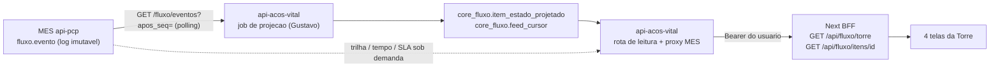

# Contrato 46 — Torre de Fluxo: feed do MES, jobs de projeção e telas (I5 e I6)

> **(atualizado em 09/10/2026)** Primeira versão, escrita sobre a leitura do vault e do código de 09/10 (`api-acos-vital` `develop`, front `00 - HUB`). **Nada da Torre existe em código** em nenhum dos três lados (ver seção 1). Tudo marcado 🟡 é inferência minha; tudo marcado 🔴 precisa de decisão de alguém com nome na seção 12. Produção não verificada.

**Status:** `proposta` (S5, 19/11 a 18/12/2026). Decidido: rastreabilidade em "todas as rotas" e a Torre com 4 telas (21/09, [[Rastreabilidade-e-SLA-de-Eventos]]), polling REST sem webhook (DEC-2), retenção de 5 anos (DEC-9), SLA em horas corridas com pausa. **Não decidido:** onde roda o job (seção 5), o `{id}` do item (seção 3), o corte do ranking de gargalos (🟡 #35 do [[Registro-de-Decisoes-2026-10-07]]).

**Destinatários:**
- **Robert (MES, `api-pcp`)**: I1 (schema `fluxo.*`), I2 (feed e demais rotas), I3 (instrumentação), I7 (SLA e regra de autorização). Seção 3 é o que o hub precisa dele.
- **Gustavo (DBA e `api-acos-vital`)**: I4 (tabelas `core_fluxo.*`) e, se aceitar a recomendação da seção 5, o job de projeção e a rota de leitura no hub.
- **Nathan (av-hub, front/BFF)**: I5 (BFF) e I6 (as telas), tipos e dados de teste (seção 8).

Este contrato **não** altera o `GET /itens/status` (005) nem a tela 1.2 ([[006-Status-por-Item-Leitura-no-Hub]]): eles continuam como estão. O [[Campos-e-API-para-Rastreabilidade]] já diz que o feed geral "substitui, na prática" o F3; quando a Torre estiver no ar, decidir se a 1.2 migra para ele (🔴 pergunta 11), sem pressa.

## 1. Estado real hoje (09/10/2026)

| Lado | O que existe | O que não existe |
|---|---|---|
| **MES** (`api-pcp`, conferido em 07/10, [[Campos-e-API-para-Rastreabilidade]]) | `HistoricoItemParcial` (trilha de transição do `ItemParcial`, `idUsuario` pode ser nulo); `GET /itens/status` (005, foto atual da parcial, 11 etapas, sem ator nem autorizador) | Nenhum `fluxo.*` no Prisma: sem `evento`, `item_acompanhado`, `etapa_fluxo`, `setor_fluxo`, `sla_etapa`, `regra_autorizacao`, `calendario_util`; nenhuma rota `/fluxo/*` |
| **Hub** (`api-acos-vital`) | Precedente de job e rota: `itens_pedido_status.job.js` e `.route.js` (contratos 005/006, tabela e cursor por unidade) | Nenhuma tabela `core_fluxo.*`; nenhum job de feed; nenhuma rota de Torre |
| **Front** (`00 - HUB`, grep por `torre`, `/api/fluxo`, `core_fluxo` em `.ts/.tsx/.md/.sql/.json`) | O padrão de tela nova (seção 9): BFF `app/api/pedidos-venda/[fonte]/.../etapas/route.ts`, `lib/domain/etapas-item.ts`, `components/Pedidos/EtapaDosItens.tsx`, `requirePermission`, `headersDaApi()` com Bearer | **Nenhum arquivo da Torre.** As ocorrências de "fluxo" no front são de fluxo de caixa, fluxo de compras e comissão, nada a ver |
| **Protótipo** | A "Torre de Fluxo" em artifact do claude.ai, **com dados fictícios**; as metas de tempo dele (quarentena 24 h, inspeção 6 h, conferência 4 h) são chute de demonstração e não viram meta ([[Rastreabilidade-e-SLA-de-Eventos]]) | Dado real |

Portanto, hoje **não há feed, não há tabela e não há tela**. O front pode avançar com tipos e dados de teste (seção 8); o dado real depende de I1+I2 (Robert) e I4 (Gustavo).

## 2. Datas, donos e dependências (cronograma de 07/10)

| ID | Entrega | Dono | pd | Janela (tabela) | Depende de |
|---|---|---|---|---|---|
| I1 | Schema `fluxo.*` (7 tabelas Prisma) | Robert | 2 | 19/11 a 25/11 | D1 (entregue) |
| I4 | Tabelas novas no av-hub, incluindo `core_fluxo.evento`, `item_estado_projetado`, `feed_cursor` | Gustavo | 2 | 19/11 a 25/11 | nada |
| I2 | Módulo `fluxo` no `api-pcp`: `/eventos`, status, trilha, tempo, mapa por setor, ações, catálogos | Robert | 7 | 23/11 a 09/12 | I1 |
| I3 | Instrumentar `ItemParcial`, Recebimento, Qualidade, Estoque para escrever em `fluxo.evento` | Robert | 4 | 23/11 a 04/12 | I1, D6 a D10 |
| I7 | SLA por etapa e regra de autorização | Robert | 1 | 07/12 a 10/12 | I2 |
| **I5** | **Jobs de projeção + BFF `GET /api/fluxo/torre` e `/itens/{id}`** | **Nathan (BFF); job: ver seção 5** | 4 | 26/11 a 09/12 | I4, I2 |
| **I6** | **As telas da Torre** | **Nathan** | 7 (5 se o ranking sair, 🟡 #35) | 07/12 a 18/12 | I5 |

Pontos que o cronograma não resolve:

- **O job de projeção e a rota de leitura no hub não têm dono na tabela.** A I5 está no nome do Nathan, mas o Nathan não escreve API, e o precedente (`itens_pedido_status.job.js`) roda dentro da `api-acos-vital`. Recomendação e divisão na seção 5. Se for para o Gustavo, é trabalho **além** dos 4,0 pd dele na S5 (I4 2 + J4 2), mas a reserva dele é de 9,8 pd ([[Cronograma-2-Meses]], seção 3.2). 🟡 Estimativa minha: 3 pd para job + rota (ordem de grandeza ±30%, o Gustavo valida). Isso alivia a I5 do Nathan, que ficaria com BFF, tipos e contrato.
- **O Robert estoura na S5** (21,5 pd contra 17,25 de capacidade, seção 3.2 do cronograma). I2 e I3 são o caminho crítico da Torre: se a janela deles deslizar, I5 e I6 deslizam junto, porque dependem do feed real. A regra escrita é "estender a janela, não cortar". A estratégia da seção 8 existe exatamente para o front não depender disso.
- **Nathan: 9,0 pd contra 9,2** só se a tela de ranking de gargalos sair para o Ciclo 2 (🟡 #35, ainda não validada). Sem isso, 11,0 contra 9,2.
- **Datas de Gantt são exclusivas** (I5 termina em 09/12 na tabela e 10/12 no Gantt; I6 em 18/12 e 19/12). Mesma data.

## 3. O que o hub precisa do MES (Robert)

Fonte: [[Campos-e-API-para-Rastreabilidade]] seções 3.1, 5.1 e 5.3. Os nomes de rota e de campo abaixo são os **dessa proposta de 21/09**; o Robert pode renomear, desde que o contrato final seja publicado antes de 23/11. 🟡 = detalhe que eu inferi e que o texto da fonte não fecha.

### 3.1 O feed: `GET /fluxo/eventos?apos_seq=&limite=`

| Item | Contrato |
|---|---|
| Rota | `GET /fluxo/eventos`, sob `/v1` (5.3 da fonte). Módulo `fluxo` do `api-pcp`, tarefa I2 |
| Autenticação | `x-api-key` entre serviços. O **ator humano vai no corpo do evento**, não no cabeçalho (5.3). 🟡 Chave: a mesma `MES_API_KEY` do job do 005 (o MES já a aceita do hub para `/itens/status`); se o Robert preferir uma chave por rota, a pendência L6 de [[Chaves-de-Integracao-AvHub-MES-Pipeline]] cobre |
| Cursor | **`seq`** monotônico (bigserial), nunca data. `alterado_desde` fica só como conveniência (decisão 6 da seção 2 da fonte). Primeira leitura: `apos_seq=0` |
| Paginação | `apos_seq` + `limite`. 🟡 `limite` máximo 1000, como no 005 (o 005 usa `limit=1000`); página com menos linhas que o `limite` = fim. O nome do parâmetro (`limite` na fonte, `limit` no 005) o Robert fixa |
| Ordem | Crescente por `seq` |
| Filtro | 🟡 `codigo_empresa` opcional, para o hub poder ler por unidade. `codigo_empresa` viaja em todo evento (DEC-1: a filial vem do pedido, nunca da fábrica) |
| Polling | 🟡 1 a 2 min, a mesma faixa do 005 (DEC-2 fixou 1 a 5 min). Fixo no código do job |
| Imutabilidade | `fluxo.evento` é append-only, **sem UPDATE e sem DELETE** (3.1 da fonte) |
| `incluir_deletados` | 🟡 **Não se aplica.** Como o log nunca apaga, não há linha "deletada" para trazer. Cancelamento e reabertura são **eventos** (`tipo`), não exclusão. É diferente do 005, onde `mes_deleted_at` existe. O Robert confirma |

**Envelope do evento** (campos de `fluxo.evento` listados na seção 3.1 da fonte e no quadro "Envelope" de [[Rastreabilidade-e-SLA-de-Eventos]]):

| Campo | Significado |
|---|---|
| `seq` | Cursor. Único por fonte |
| `id` | uuid gerado na origem; base da idempotência |
| `origem` | `av-hub` ou `mes` |
| `codigo_empresa`, `numero_pedido`, `codigo_item_omie` | Chave de correlação. Opcionais conforme o caso: `id_lote`, `id_oc`, `id_item_parcial` |
| `tipo` | Transição, autorização, passagem, anexo, cancelamento etc. (lista fechada: 🔴 pergunta 2) |
| `etapa_de`, `etapa_para` | Do vocabulário comum, ainda **provisório** ([[Revisao-dos-Estados-e-Status]]) |
| `setor_fluxo` | Setor onde o evento ocorreu |
| `ator_id`, `ator_nome`, `ator_setor` | **Quem fez**, com snapshot de nome e setor no momento do fato. Pode ser "sistema" (ator nulo): `HistoricoItemParcial.idUsuario` já aceita nulo |
| `autorizado_por_id`, `autorizado_por_nome` | Só quando a ação exige aprovação. **Sempre diferente do ator** |
| `passou_para_id`, `passou_para_fila` | Pessoa ou fila de destino, quando há passagem |
| `id_responsavel_depois` | Pessoa, ou fila do setor quando ninguém assumiu |
| `motivo`, `anexo_ref` | Obrigatórios em reprovação, divergência, ajuste e cancelamento |
| `ocorrido_em` | Hora do fato, relógio da origem. **Manda no SLA** |
| `registrado_em` | Só para auditar atraso de integração |

Os quatro campos que o pedido destaca (**ator, autorizado_por, passou_para, responsavel_depois**) são exatamente os acima. O nome do campo `responsavel_depois` na fonte é `id_responsavel_depois` na tabela e "`responsavel_depois`" no quadro do envelope: o Robert fixa um nome só (🟡).

**Resposta (envelope da página)** 🟡 inferido, a fonte não define o invólucro:

```json
{
  "eventos": [ { "seq": 1204, "id": "uuid", "origem": "mes", "...": "..." } ],
  "proximo_seq": 1204
}
```

Se o Robert preferir devolver um array puro (como o 005), o job aceita também (o precedente aceita array ou `{ data: [...] }`). O job não deve depender do invólucro: depende de `seq` em cada linha.

**Idempotência (duas camadas):**
1. O `id` do evento é gerado na origem; reler o mesmo `seq` não duplica nada. O hub aplica o evento só se ele for **mais novo que o último aplicado àquele item** (comparação por `seq`), então reler uma janela é inofensivo.
2. 🟡 **Sobreposição de leitura.** `seq` de `bigserial` pode ser confirmado fora de ordem entre transações: o evento 11 pode ficar visível antes do 10. Cursor puro por `seq` perderia o 10. Duas saídas, a escolher com o Robert: (a) o feed só devolve `seq` até o menor ainda em transação aberta; ou (b) o job relê uma janela fixa de `seq` anteriores a cada rodada (seguro por causa da idempotência acima). O tamanho da janela vai **fixo no código**.

### 3.2 O que mais o hub precisa (rotas de leitura do módulo `fluxo`, tarefa I2)

Da seção 5.1 da fonte. Quais delas o hub chama e quais dependem de decisão (seção 4.3):

| Rota do MES | Alimenta | Observação |
|---|---|---|
| `GET /fluxo/eventos?apos_seq=&limite=` | Job de projeção (`item_estado_projetado`) | Seção 3.1 |
| `GET /fluxo/itens/status?apos_seq=` | 🟡 Reconciliação do job (estado atual por item) | Opcional; serve para auditar a projeção, não para a tela |
| `GET /fluxo/itens/{id}/trilha` | T.4 trilha | Do mais novo para o mais antigo. Sob demanda (seção 4.3) |
| `GET /fluxo/itens/{id}/tempo` | T.5 tempo por etapa | Fila × execução, meta e projeção de estouro |
| `GET /fluxo/setores` | T.3 mapa (opcional) | Contagem por setor e etapa, com filtros fora do prazo, em risco, sem dono. Se a projeção do hub cobrir, o hub não precisa chamar |
| `GET /fluxo/etapas` e `/fluxo/setores/catalogo` | Rótulos de etapa e de setor | Hoje o rótulo é uma tabela no código do front (`etapas-item.ts`); com o catálogo ele passa a vir do MES |
| `GET /fluxo/sla-etapas` | T.5 e ranking | Meta por etapa (I7) |
| `POST .../assumir`, `.../passar`, `.../autorizar` | **Não é da Torre** | Ações são do MES (telas do chão de fábrica); a Torre é **só leitura** (seção 7) |

**O `{id}` da rota de item é uma pergunta aberta (🔴 pergunta 1).** A fonte usa `/fluxo/itens/{id}/trilha` sem dizer qual id. As candidatas são o `id` de `fluxo.item_acompanhado` ou a chave composta `(codigo_empresa, numero_pedido, codigo_item_omie)`. 🟡 Recomendação: o `id` do `item_acompanhado`, **carregado na projeção do hub**, porque um id só cabe numa URL do BFF (`/api/fluxo/itens/{id}`) sem montar chave composta.

### 3.3 Instrumentação (I3), o que a Torre pressupõe

- Toda transição relevante gera evento **na mesma transação** (recomendação de 4.1 da fonte), sem duplicar o que `HistoricoItemParcial` já faz.
- **O ator nulo ("sistema")** precisa ter uma forma explícita no envelope, não ausência silenciosa.
- **Eventos do av-hub (Comercial e Compras) não têm tarefa.** `core_fluxo.evento` existe em I4, mas a I3 é só do MES. Sem alguém instrumentando o lado do hub (emissão do pedido, liberação pelo vendedor, fechamento de compra, aprovação), a Torre **enxerga só do PCP para frente**. 🔴 pergunta 3.

## 4. Tabelas `core_fluxo.*` no hub: interface, sem DDL

**O DDL real vem do DBA (Gustavo, I4).** Este contrato descreve o que o job e a leitura **precisam**; não inventa tipos nem colunas. As tabelas e as colunas **com fonte** estão em [[Campos-e-API-para-Rastreabilidade]], seção 3.2.

### 4.1 `core_fluxo.item_estado_projetado` (estado atual por item)

- **Colunas com fonte (3.2 da fonte):** `codigo_empresa`, `numero_pedido`, `codigo_item_omie`, `etapa_fluxo`, `estado_macro`, `atualizado_em`. Padrão das tabelas do hub: `id` uuidv7 e colunas de auditoria (`created_at/by`, `updated_at/by`, `deleted_at/by`).
- **Chave:** a do item, `(codigo_empresa, numero_pedido, codigo_item_omie)`, 🟡 igual à de correlação. Uma linha por item (**estado atual**, não histórico): o histórico mora no log do MES.
- **O que a Torre precisa e a fonte não lista para esta tabela** (🟡 o DBA e o Robert decidem se vão na projeção ou se ficam só no MES; nomes **não definidos aqui**):
  - o `id` do item no MES, para o `{id}` da URL (seção 3.2);
  - responsável atual, ou a fila do setor quando ninguém assumiu (o MES guarda isso em `item_acompanhado`: `id_responsavel_atual`, `fila_setor_fluxo`);
  - quando o item entrou na etapa atual (`item_acompanhado.entrou_etapa_em`) e o prazo do pedido (`prazo_pedido`);
  - o setor do fluxo (`setor_fluxo`);
  - o `seq` do último evento aplicado, para o job ignorar evento velho (seção 3.1, idempotência);
  - nome e setor do responsável atual como **snapshot** (LGPD, seção 11).
- **Quem escreve:** só o job de projeção (seção 5). Nenhuma tela escreve.
- **Quem lê:** a rota de leitura do hub (seção 5.3), para o BFF.

### 4.2 `core_fluxo.feed_cursor`

- **Com fonte (3.2):** `fonte`, `ultimo_seq`, `atualizado_em`. É o equivalente do `itens_pedido_status_cursor` do precedente.
- **Diferença para o precedente:** o 005 guarda o cursor **por unidade** porque filtra por `updated_at` dentro da unidade. O `seq` do feed é **global** do MES (bigserial). Cursor por `fonte` (como a fonte descreve) basta; cursor por unidade só se o feed filtrar por `codigo_empresa` e o Robert garantir `seq` consistente dentro do filtro. 🔴 pergunta 4 (Gustavo e Robert).
- **`atualizado_em` = última leitura bem-sucedida**, mesmo sem evento novo, igual ao `lido_em` do 006: é o que o BFF usa para avisar que o job parou (seção 6.3).

### 4.3 `core_fluxo.evento` (eventos do próprio hub)

Existe em I4 para Comercial e Compras, dono av-hub ("cada sistema é dono dos próprios eventos"). **A Torre não copia o log do MES para cá** (decisão da fonte: "nenhuma tabela é copiada"), por duas razões: volume (R-08, abaixo) e porque trilha e tempo por etapa precisam do log inteiro, que o MES já tem.

Consequência de desenho 🟡 (a confirmar, 🔴 pergunta 5):

| Tela | Origem |
|---|---|
| T.3 mapa, lista de itens | **Projeção do hub** (`item_estado_projetado`): rápida, sem chamar o MES |
| T.4 trilha, T.5 tempo por etapa, T.5b ranking | **Sob demanda no MES** (`/trilha`, `/tempo`, `/sla-etapas`), **chamadas pela API do hub**, que junta com os eventos do próprio `core_fluxo.evento` (é o "BFF que junta os dois feeds" da seção 5.2 da fonte). A chave do MES **fica no servidor da API**, nunca no Next |

O ranking pode sair de agregação da própria projeção (tempo parado por setor); se precisar de tempo em fila × execução, vem do MES. Decidir com o Robert o que o MES já entrega agregado, para o hub não recalcular.

### 4.4 Volume (R-08)

R-08 ("volume esperado de eventos por dia") continua **sem resposta** ([[Perguntas-em-Aberto-Consolidadas]]). Efeitos neste contrato: o tamanho de página e a janela de sobreposição do job (fixos no código) dependem dele; a projeção do hub é pequena (uma linha por item vivo), o problema de volume é do **MES** (partição e retenção de `fluxo.evento`). 🟡 Se o Robert publicar uma estimativa antes de 23/11, o job usa; até lá, o precedente (1000 por página, no máximo 50 páginas por rodada) é o ponto de partida.

## 5. 🔴 DECISÃO: onde roda o job de projeção

**Contexto.** O Nathan não escreve API. O precedente (`itens_pedido_status.job.js`, contratos 005/006) roda **dentro do processo da `api-acos-vital`**, iniciado em `app.js` depois do `listen` (`iniciarJobStatusItensMes()`), por decisão do Gustavo em 08/10/2026. O Next/BFF não é lugar de job: tem de ficar sem estado e pode subir em várias instâncias.

**Recomendação 🟡 (mesma do precedente): no processo da `api-acos-vital`, Gustavo opera.** Motivos:

1. **Já existe o molde pronto** (cursor, trava, paginação, log de alerta). É copiar a forma, não inventar.
2. **A chave do MES já está lá** (`MES_API_URL`, `MES_API_KEY` do job do 005) e **não deve ir para o Next**.
3. **O banco é o dele**: a gravação em transação, o `pg_try_advisory_xact_lock` por fonte e a função de banco que aplica o evento são trabalho de DBA.
4. **Uma instância lê, as outras pulam** (trava), exatamente o que se quer com várias réplicas da API.
5. **Worker próprio** só se o Gustavo preferir (a pipeline já usa worker próprio, [[006-Status-por-Item-Leitura-no-Hub]] pergunta 3). Aceitável; não muda o resto deste contrato.

**Quem faz o quê:**

| Peça | Dono | O que entrega |
|---|---|---|
| Tabelas `core_fluxo.*` | **Gustavo** (I4) | DDL, índices, contrato SQL marcado `aplicada` |
| Função de banco que aplica um lote de eventos à projeção (valida, ignora velho, avança o cursor) | **Gustavo** | No padrão de `fn_itens_pedido_status_gravar`; a regra mora no banco |
| Job que lê o feed (`GET /fluxo/eventos`) e grava | **Gustavo** | `src/schemas/core_fluxo/...job.js`, iniciado no `app.js` |
| Rota de leitura no hub (`GET /fluxo/...`, seção 5.3) com escopo e `auth.rotas_telas` | **Gustavo** | Rota + linhas em `auth.rotas_telas` + linhas em `auth.telas` |
| Proxy do hub para `/trilha`, `/tempo`, `/sla-etapas` do MES | **Gustavo** | Chave do MES fica na API |
| Contrato do feed e do envelope | **Robert** | Seção 3, publicado antes de 23/11 |
| BFF Next (`/api/fluxo/torre`, `/api/fluxo/itens/{id}`), tipos, interface de fonte, fixtures, telas | **Nathan** | Seções 6, 8 e 9 |
| Este contrato, os testes de aceite e a ordem de subida | **Nathan** | Seções 10 e 11 |

**Regras de implementação do job (copiar o molde, com uma exceção).**

- Cópia fiel: setTimeout encadeado (a rodada seguinte só começa quando a anterior termina), primeira rodada em até 5 s, timeout de 30 s, uma transação por página, `pg_try_advisory_xact_lock` por fonte, falha de rede/timeout/5xx/401 desfaz a transação e **não avança o cursor**, **3** respostas 401/403 seguidas viram `ALERTA` no log, "página cheia sem avançar" vira `ALERTA`, migration/objeto ausente para a rodada com mensagem clara.
- **REGRA DO NATHAN: nenhuma regra em variável de ambiente.** O precedente lê `MES_STATUS_INTERVALO_SEG` e `MES_STATUS_CORTE_INICIAL_DIAS` do ambiente (o código ainda aceita variável, e a decisão 8 do Registro diz "fixo, sem `.env`"). O job da Torre **não copia essa parte**: intervalo, tamanho de página, máximo de páginas, janela de sobreposição, limite de 10 minutos, número de falhas para alertar e o nome da trava ficam **constantes no código**. Sem chave de ligar/desligar. Se mudar, muda por commit.
- 🟡 **O que continua em ambiente**: só o **endereço e o segredo** do MES (`MES_API_URL`, `MES_API_KEY`, as mesmas do job do 005), porque são credencial e endereço, não regra. É a única exceção, e o Nathan confirma que isso não fere a regra (🔴 pergunta 6). Sem as duas, o job não sobe e avisa no log, como o precedente.
- **Corte inicial:** o feed é por `seq`, não por data. A primeira leitura começa em `apos_seq=0`, ou seja, **reprocessa o histórico inteiro do MES**. Como a Torre nasce em dez/2026 (o log só existe a partir de I3), o histórico é curto. Se o Robert quiser ocultar o período anterior à instrumentação, é filtro dele. 🟡

### 5.1 Fluxo (resumo)



### 5.2 O que o job faz em cada rodada

1. Lê `feed_cursor` da fonte. Sem linha: `apos_seq` = 0.
2. Pede a página ao MES (`limite`, fixo no código). Falhou: log, **cursor não anda**, tenta na próxima rodada.
3. Numa transação, com a trava da fonte: aplica cada evento à projeção **só se for mais novo que o último aplicado àquele item**; grava; avança o cursor para o maior `seq` aplicado (menos a janela de sobreposição, 3.1).
4. Página cheia: lê de novo a partir do novo cursor. Menos que o limite: acabou a rodada.
5. Evento com envelope inválido (falta `seq`, `id`, chave do item): **não grava**, vai para o log com o motivo e o `seq`, e o job segue. Nunca trava a fila por um evento ruim.

### 5.3 A rota de leitura no hub (resumida; o contrato fino é do Gustavo)

Segue o desenho da `GET /itens_pedido_status`: valida parâmetros (400), lê a projeção, devolve `lido_em` do cursor, aplica escopo. Nomes finais 🟡 do Gustavo.

- **Lista/mapa:** itens da projeção filtrados por unidade, setor, etapa, "fora do prazo", "sem dono".
- **Item:** a linha da projeção + trilha e tempo do MES via proxy.
- **Escopo e permissão:** com Bearer, a API aplica permissão por rota (`auth.rotas_telas`, modo `exigir` fixo desde 08/10): **rota sem linha no mapa dá 403 `ROTA_SEM_PERMISSAO_MAPEADA` para todo usuário com token.** As linhas em `auth.rotas_telas` e em `auth.telas` entram na mesma migration. Isso é item de subida (seção 11).

## 6. BFF do Next: `GET /api/fluxo/torre` e `GET /api/fluxo/itens/{id}`

Tarefa I5, Nathan. Padrão da rota irmã `app/api/pedidos-venda/[fonte]/[codigoEmpresa]/[pedidoVenda]/etapas/route.ts`.

### 6.1 Autenticação e permissão (igual à rota irmã)

1. `requirePermission('<slug>', 'pode_visualizar')` como primeira linha da rota (seção 7.1). Falta de permissão: `403 { error: 'Acesso negado' }`.
2. Cabeçalhos para a API: **`headersDaApi()`**, que manda `x-api-key` **e**, se a sessão tem `backendToken`, `Authorization: Bearer <token do usuário>`. Já está ativo nos helpers do BFF (`lib/api/escopoUnidade.ts`). **Sem Bearer a API trata a chamada como serviço**, sem escopo e sem permissão por tela: o BFF da Torre **nunca** pode mandar só a chave (é o ponto 10 da auditoria de 08/10 que ainda vale para outros BFFs, [[Mapa-Rotas-BFF-API-para-Bearer]]).
3. Escopo de unidade: 🟡 `comEscopoUnidade(url)` (acrescenta `id_usuario_sessao`; com Bearer a API sobrescreve pelo id do token). Usuário vinculado a uma unidade (`auth.usuarios_unidades`) só vê itens dela.
4. Parâmetros do navegador passam por `parametrosSeguros(...)` e por **lista fechada** de filtros (como `FILTROS` em `lib/api/pedidosVenda.ts`): o que não está na lista é descartado.

### 6.2 `GET /api/fluxo/torre`

Alimenta T.3 (mapa), T.5 (tempo por etapa) e T.5b (ranking). 🟡 Parâmetros (nomes do front, a API devolve conforme o contrato do Gustavo):

| Parâmetro | Regra |
|---|---|
| `codigo_empresa` | uuid da unidade; opcional (sem ele, todas as do escopo do usuário) |
| `setor` | `setor_fluxo`; opcional |
| `etapa` | `etapa_fluxo`; opcional |
| `situacao` | `no_prazo`, `fora_do_prazo`, `sem_dono`; opcional. **`em_risco` só existe quando houver meta de etapa** (seção 7.4) |
| `q` | texto livre (número do pedido, código do produto); opcional |
| `page`, `limit` | paginação da lista de itens (o mapa não pagina) |

**Resposta (200)** 🟡 proposta de tipo para o front (os nomes dos campos de domínio são os da fonte; o invólucro é meu):

```json
{
  "disponivel": true,
  "lido_em": "2026-12-09T14:10:00Z",
  "setores": [
    {
      "setor_fluxo": "qualidade",
      "total": 14,
      "fora_do_prazo": 3,
      "sem_dono": 5,
      "etapas": [ { "etapa_fluxo": "qualidade.inspecao", "total": 9 } ]
    }
  ],
  "itens": [
    {
      "id": "uuid",
      "codigo_empresa": "uuid",
      "numero_pedido": "25970",
      "codigo_item_omie": "12345678",
      "etapa_fluxo": "qualidade.inspecao",
      "estado_macro": "…",
      "setor_fluxo": "qualidade",
      "responsavel": { "tipo": "pessoa|fila", "nome": "…" },
      "entrou_etapa_em": "…",
      "prazo_pedido": "2026-12-20",
      "fora_do_prazo": false
    }
  ],
  "total_itens": 120
}
```

- `disponivel: false` quando a API do hub responde 404 (rota ainda não publicada), com `setores: []` e `itens: []`: a tela explica, não mostra erro. É o padrão da rota irmã `etapas`.
- `lido_em` = `atualizado_em` do cursor. A tela avisa se passar de **10 minutos** (constante no código, como `ETAPA_ATRASO_MINUTOS`).
- Resposta **sem nenhum campo de nome de pessoa** nesta rota além do responsável atual, e este só para quem tem a permissão da seção 7 (🟡).

### 6.3 `GET /api/fluxo/itens/{id}`

Alimenta T.4 (trilha) e o painel do item no T.5. `{id}`: ver 🔴 pergunta 1.

**Resposta (200)** 🟡:

```json
{
  "disponivel": true,
  "lido_em": "…",
  "item": { "...": "linha da projeção" },
  "trilha": [
    {
      "seq": 1204, "id": "uuid", "origem": "mes", "tipo": "…",
      "etapa_de": "…", "etapa_para": "…", "setor_fluxo": "…",
      "ator": { "id": "…", "nome": "…", "setor": "…" },
      "autorizado_por": { "id": "…", "nome": "…" },
      "passou_para": { "id": "…", "fila": "…" },
      "responsavel_depois": "…",
      "motivo": "…", "anexo_ref": "…",
      "ocorrido_em": "…"
    }
  ],
  "tempo": [
    { "etapa_fluxo": "…", "fila_horas": 0, "execucao_horas": 0, "meta_horas": null }
  ],
  "mes_indisponivel": false
}
```

- Trilha **do mais novo para o mais antigo** (fonte). Eventos do MES e do `core_fluxo.evento` do hub juntos pela API, ordenados por `ocorrido_em`.
- `mes_indisponivel: true` quando o proxy não alcançou o MES: a tela mostra o item da projeção e diz que a trilha não está disponível agora. **Não é erro 500.**
- `item` inexistente ou fora do escopo: **404** (não 403), para não revelar existência, como a rota irmã faz com pedido fora do escopo.
- Erros comuns: `400` parâmetro inválido, `403` sem permissão, `404`, `500` "Erro interno" com `console.error`.

## 7. As 4 telas

### 7.0 Numeração: reconciliação das duas fontes

Os dois documentos divergem e a divergência está registrada (#35 do [[Registro-de-Decisoes-2026-10-07]]):

| Fonte | O que diz |
|---|---|
| [[Fluxograma-Telas-por-Bloco]] (inventário de telas, "Transversais") | **T.3** mapa por setor; **T.4** trilha do item; **T.5** tempo por etapa **e** ranking de gargalos (uma linha só: "SLA por etapa; ranking de gargalos"); **T.6** Auditoria (log imutável `fluxo.evento`, retenção 5 anos) |
| [[Cronograma-2-Meses]] (I6, S5 e o parágrafo da seção 3.1) | "Mapa por setor, trilha do item, tempo por etapa (fila×execução+projeção), ranking de gargalos" = **4 telas do protótipo**; a seção 3.1 chama o ranking de **T.6** |

**Numeração correta (🟡 reconciliada por mim; o inventário é a fonte dos números, o cronograma é a fonte do escopo da I6):**

| Número | Tela | Está na I6? |
|---|---|---|
| **T.3** | Mapa por setor | Sim |
| **T.4** | Trilha do item | Sim |
| **T.5** | Tempo por etapa (fila × execução, meta, projeção) | Sim |
| **T.5b** | Ranking de gargalos (hoje parte da linha T.5 do inventário; este contrato a separa para poder cortá-la) | Sim (é a que o #35 propõe levar ao Ciclo 2) |
| **T.6** | **Auditoria** (log imutável) | **Não.** A I6 lista só as 4 telas do protótipo, que não incluem Auditoria. O cronograma, ao chamar o ranking de "T.6", usou o número errado |

Consequências: (a) a proposta do #35 ("levar o ranking ao Ciclo 2") corta **T.5b**, não T.6; (b) **a Auditoria (T.6) está no inventário, mas sem pd e sem tarefa na S5**; (c) o texto do cronograma e o do Registro deveriam ser corrigidos (🔴 pergunta 7, fora do alcance deste arquivo). Neste contrato, "as 4 telas" = T.3, T.4, T.5 e T.5b.

### 7.1 Permissão e slugs 🟡

O padrão do front: cada tela é uma linha de `auth.telas` com `slug`, e a verificação usa `requirePermission(slug, 'pode_visualizar')` no BFF e `hasPermission(menu, slug, acao)` no menu. As telas do menu entram também em `iconMap.tsx` e `groupMap.ts` (`components/Layout/AppLayout/Menu/MenuItem/`). Sugestão de slugs (🟡, nome e grupo do menu a decidir, 🔴 pergunta 8):

| Slug sugerido | Telas | Quem deveria ter |
|---|---|---|
| `torre-fluxo` | T.3 mapa, T.5 tempo, T.5b ranking | Gestão, PCP, Qualidade, Compras (agregado, sem nome de pessoa nas telas além do responsável atual) |
| `torre-fluxo-trilha` | T.4 trilha | Perfil mais restrito: a trilha mostra **nomes de pessoas** (ator, autorizador) |
| `torre-fluxo-auditoria` | T.6 (se entrar) | Auditoria |

**O vendedor não vê a Torre.** Decisão de 21/09: o vendedor vê só o macro dos próprios pedidos, na tela 1.2 (etapa dos itens), sem trilha completa e sem acesso externo. A Torre é visão interna.

### 7.2 Estados comuns às 4 telas

- **Carregando:** esqueleto (padrão `EtapaDosItens`).
- **Vazio:** "Nenhum item acompanhado ainda." (a projeção está vazia: antes do primeiro evento ou filtro sem resultado; a mensagem diz qual dos dois).
- **Indisponível (`disponivel: false`):** "A Torre de Fluxo ainda não está disponível neste ambiente."
- **Dado velho:** faixa de aviso se `lido_em` passar de 10 minutos ("o job parou ou o MES está fora").
- **Erro:** "Não foi possível carregar a Torre de Fluxo." (sem detalhe técnico na tela).
- **Etapa/setor desconhecido:** mostra o código cru em tom neutro; nunca quebra. O vocabulário de etapa é provisório.

### 7.3 T.3 Mapa por setor

- **Pergunta:** "Onde estão acumulando itens agora, e quais estão em fila sem dono?"
- **Campos:** por setor, total de itens; dentro do setor, contagem por etapa (`etapa_fluxo`); selo de "fora do prazo" e de "sem dono"; clique no setor/etapa abre a lista de itens; clique no item abre T.4.
- **Filtros:** unidade (`codigo_empresa`), setor, etapa, situação (no prazo, fora do prazo, sem dono). `em_risco` fica **desligado** enquanto não houver meta por etapa (7.4).
- **Origem:** projeção do hub (`/api/fluxo/torre`).
- **Vazio/erro:** 7.2. Setor com zero itens aparece com zero (não some).
- **Permissão:** `torre-fluxo` 🟡.

### 7.4 T.5 Tempo por etapa

- **Pergunta:** "Quanto tempo cada item passa em cada etapa, esperando na fila e em execução, contra a meta?"
- **Campos:** por etapa: tempo em **fila** (do item chegar até alguém assumir) e em **execução** (com uma pessoa), separados; meta da etapa; prazo do pedido (`data_previsao`). Horas **corridas**, com **pausa** interrompendo a contagem (decisão de 21/09, bate com `PAUSADO`/`RETOMAR` do `ItemParcial`).
- **Meta:** nasce do **tempo médio histórico**, não é digitada por setor. Sem histórico, **"sem meta ainda"**. 🟡 A **projeção de estouro** (fim previsto = restante da etapa atual + soma das metas seguintes) fica **desligada no v1** até haver amostra mínima: é a inclinação do Nathan de 21/09 ("pode ser", **não decisão fechada**). A tela precisa nascer com a projeção atrás de uma constante no código; o piso de amostras para religar está em aberto (🔴 pergunta 9).
- **Filtros:** unidade, setor, etapa, período.
- **Origem:** MES sob demanda (`/tempo`, `/sla-etapas`) via API do hub (4.3).
- **Vazio/erro:** 7.2; "sem meta ainda" não é erro.
- **Permissão:** `torre-fluxo` 🟡.

### 7.5 T.5b Ranking de gargalos (candidata ao Ciclo 2, 🟡 #35)

- **Pergunta:** "Qual setor/etapa mais segura os itens?"
- **Campos:** setores ordenados por tempo total parado e por contagem de itens sem dono; separa tempo **sem dono** (o principal indicador de gargalo) de tempo com pessoa.
- **Filtros:** unidade, período.
- **Origem:** agregação da projeção (itens parados e desde quando) + MES para tempo fila × execução (4.3).
- **Observação:** sem histórico o ranking mostra só contagem e idade atual, não média. Se o #35 for validado, **esta tela sai da I6** (I6 = 5 pd) e fica no backlog do Ciclo 2.
- **Permissão:** `torre-fluxo` 🟡.

### 7.6 T.4 Trilha do item

- **Pergunta:** "Quem fez o quê com este item, quem autorizou, para quem passou e com quem está agora?"
- **Campos:** linha do tempo do mais novo para o mais antigo: `ocorrido_em`, `tipo`, `etapa_de` para `etapa_para`, setor, **ator**, **autorizado por**, **passou para**, **responsável depois** (pessoa ou "fila do setor X"), `motivo`, `anexo_ref`. Cabeçalho do item: pedido, produto, etapa atual, com quem está, há quanto tempo.
- **Filtros:** nenhum obrigatório; 🟡 filtro por tipo de evento. Acesso pelo clique no mapa, pela busca por pedido ou por link `/torre-fluxo/item/{id}`.
- **Origem:** `/api/fluxo/itens/{id}` (projeção + MES + eventos do hub).
- **Casos de borda que a tela precisa tratar (R-13):**
  - ação que **exige** `autorizado_por` e chegou **sem**: a linha aparece com selo **"autorização não registrada"**, não escondida. É sinal de falha do MES (I7), não da tela. Lista de ações que exigem: **provisória** (compra acima do limite, reprovação com destino do lote, ajuste de saldo, cancelamento, reabertura), a confirmar pelo Nathan (R-13);
  - `autorizado_por` **igual** ao `ator`: selo de inconsistência (a regra é "sempre diferente");
  - ator nulo: "Sistema".
- **Vazio/erro:** item sem eventos: "Nenhum evento registrado para este item." Trilha indisponível por falha do MES: 7.2 + `mes_indisponivel`.
- **Permissão:** `torre-fluxo-trilha` 🟡 (mostra nomes).

## 8. Front sem ficar parado: tipos, fixtures e interface de fonte

O dado real depende de I1+I2 (Robert) e I4 (Gustavo), que só começam em 19/11 e 23/11. O front **não precisa esperar** para a maior parte do trabalho. Padrão do código: `GAMBIARRA(vault <caminho>): ...` marca cada ponto provisório, com a referência do contrato que o resolve.

### 8.1 O que dá para fazer antes de 23/11

| # | O quê | Arquivo sugerido (🟡 segue a convenção do front) | Depende de |
|---|---|---|---|
| 1 | **Tipos TypeScript do contrato**: `EventoFluxo`, `ItemEstadoProjetado`, `TorreResposta`, `ItemTorreResposta`, `SetorMapa`, `TempoEtapa`, mais o dicionário de rótulos de etapa/setor com fallback "código cru" | `lib/domain/fluxo-torre.ts` (modelo: `lib/domain/etapas-item.ts`) | Seção 3 e 6 deste contrato; nada externo |
| 2 | **Interface de fonte**: `FonteTorre { listar(filtros); item(id) }` | `lib/fluxo/fonteTorre.ts` | 1 |
| 3 | **Fonte de teste (fixtures)**: implementa a interface com dados tipados, incluindo os casos de borda (fila sem dono, fora do prazo, ator nulo, autorização ausente, ator = autorizador, etapa desconhecida, MES indisponível, lista vazia) | `lib/fluxo/fixtures/` | 1, 2 |
| 4 | **Fonte HTTP**: implementa a mesma interface chamando o BFF; começa com `disponivel: false` | `services/fluxo.ts` (modelo: `services/pedidosVenda.ts`) | 2 |
| 5 | **As 4 telas** sobre a interface, com os estados vazio/erro/indisponível/dado velho | `app/(protected)/torre-fluxo/...`, `components/Fluxo/...` | 1 a 3 |
| 6 | **O BFF** `/api/fluxo/torre` e `/itens/[id]` com `requirePermission`, `parametrosSeguros`, filtros em lista fechada, `disponivel:false` em 404 | `app/api/fluxo/...` | 1, 4 |
| 7 | **Entradas do menu**: `iconMap.tsx`, `groupMap.ts` | `components/Layout/AppLayout/Menu/MenuItem/` | Slugs (🔴 8) |
| 8 | **Testes** de rótulo, de filtro e dos casos de borda sobre as fixtures | junto aos arquivos | 3 |
| 9 | Aproveitar o **protótipo** (artifact) só como referência visual; **não copiar os números** dele | n/a | n/a |

Entre os itens 1 e 8 cabe a maior parte da I6 (tela sobre dado de teste) e a parte do Nathan na I5 (BFF e tipos). O que sobra para depois de 23/11 é **trocar a fonte** (de fixture para HTTP), ajustar nomes de campo ao contrato final do Robert e testar com dado real.

### 8.2 Como trocar a fixture pelo feed real sem variável de ambiente

- A fonte é escolhida **por constante no código** (a REGRA DO NATHAN proíbe regra em `.env`). O commit que liga o feed real troca a constante e remove a fixture do caminho de produção.
- Fixtures **nunca** servem em produção: se `disponivel` for `false`, a tela diz "indisponível", **não mostra dado de teste**. Fixture só roda em desenvolvimento e nos testes. 🟡 Um item de teste garante que o build de produção não importa o módulo de fixtures.
- Qualquer divergência entre o tipo do front e o envelope final do Robert vira **um** arquivo a ajustar: `lib/domain/fluxo-torre.ts` e o mapeamento na fonte HTTP.
- 🟡 Um **contrato de teste compartilhado** (a mesma suíte roda contra a fixture e contra a fonte HTTP, com a resposta de homologação gravada) detecta quebra no dia em que o MES publicar.

### 8.3 O que **não** dá para fazer antes

Ligar o job, validar `seq` e janela de sobreposição, medir volume (R-08), conferir `lido_em` com a projeção real, definir o `{id}` do item e criar `auth.telas` e `auth.rotas_telas` no banco. Esses ficam para depois do I1/I2/I4.

## 9. Como a tela nova se encaixa no front (conferido no código, 09/10/2026)

Mapa do que já existe para copiar:

| Peça do front | Arquivo | O que replicar |
|---|---|---|
| BFF por rota | `app/api/pedidos-venda/[fonte]/[codigoEmpresa]/[pedidoVenda]/etapas/route.ts` | `requirePermission` primeiro, `parametrosSeguros`, `apiFetch` com `headers: await headersApi()` e `cache: 'no-store'`, `disponivel:false` em 404, `catch` com `console.error` e 500 genérico |
| Tipos e rótulos | `lib/domain/etapas-item.ts` | Interface + tabela de rótulos + fallback "código cru" + constante de atraso (`ETAPA_ATRASO_MINUTOS = 10`) |
| Componente | `components/Pedidos/EtapaDosItens.tsx` | `chave` de pedido para descartar resposta antiga, esqueleto, mensagem por estado, aviso de `lido_em` velho |
| Serviço | `services/pedidosVenda.ts` | Função cliente que chama o BFF |
| Permissão | `lib/api/requirePermission.ts` | Lê `/me/permissoes` ao vivo (cache de 5 s); se a tela ainda não existe em `auth.telas`, **cai no menu do JWT** em vez de negar |
| Cabeçalhos | `lib/api/escopoUnidade.ts` (`headersDaApi`) | `x-api-key` + `Bearer` do usuário quando há `backendToken` |
| Menu | `components/Layout/AppLayout/Menu/MenuItem/iconMap.tsx` e `groupMap.ts` | Uma linha por slug em cada |
| Páginas | `app/(protected)/pedidos-equipe/page.tsx` | Página fina que monta o componente |

Duas observações do código que afetam este contrato:

- A rota `etapas` existente já usa `headersApi()`, que resolve para `headersDaApi()` (Bearer ativo). O vault (006, "Consumo no front", 09/10) ainda diz "só `x-api-key`": **o código atual já manda o Bearer**; a nota do vault está atrasada neste ponto.
- Uma tela só aparece no menu se existir em `auth.telas` e o perfil tiver `pode_visualizar`. Subir o front antes do banco deixa a rota negada para quem não tem o slug (ver ordem de subida).

## 10. Testes de aceite

**MES (Robert):**
1. `GET /fluxo/eventos?apos_seq=0&limite=N` devolve eventos por `seq` crescente, sem repetir `seq`, com todos os campos do envelope.
2. `apos_seq` = último `seq` devolve lista vazia (não erro).
3. Evento de ação que exige autorização sem `autorizado_por`, ou com autorizador igual ao ator: o MES **recusa** (I7). Dois eventos com o mesmo `id` não duplicam.
4. Evento de transição de `ItemParcial`, Recebimento, Qualidade e Estoque aparece no feed na mesma ordem das transações.

**Hub, job e projeção (Gustavo):**
5. Sem `MES_API_URL` ou `MES_API_KEY`: o job não sobe e avisa no log.
6. MES com 401/403 três vezes seguidas: `ALERTA` no log; cursor não anda.
7. Falha de rede, timeout ou 5xx: transação desfeita, cursor não anda, página relida na rodada seguinte.
8. Segunda instância da API: **pula** a fonte enquanto a primeira lê.
9. Releitura de uma janela já aplicada: **nenhuma linha duplicada** e a projeção não volta atrás (evento mais velho não sobrescreve estado mais novo).
10. Evento com envelope inválido: não grava, log com `seq` e motivo, o job segue.
11. Página cheia sem o cursor avançar: `ALERTA`, o job para sem pular linhas.
12. Banco sem as tabelas/função: a rodada para com mensagem clara; nenhuma exceção sem tratamento.
13. Reconstrução: zerar o cursor e reprocessar reproduz a mesma projeção (a projeção é derivável do log).

**Rota de leitura e BFF (Gustavo + Nathan):**
14. Sem permissão: 403. Sem Bearer: o BFF **não existe** nesse modo (todo caminho manda `headersDaApi()`).
15. Usuário vinculado a uma unidade: não vê item de outra (404 no item, lista só da unidade dele).
16. Rota sem linha em `auth.rotas_telas`: 403 `ROTA_SEM_PERMISSAO_MAPEADA` (esperado **antes** da migration; some **depois**).
17. `lido_em` com mais de 10 minutos: a tela mostra o aviso.
18. Parâmetro fora da lista fechada: descartado; `codigo_empresa` inválido: 400.
19. MES fora do ar: `/api/fluxo/itens/{id}` responde 200 com `mes_indisponivel: true`, não 500.
20. Rota 404 do hub: `disponivel: false`, tela explica.

**Telas (Nathan):**
21. Mapa: contagem por setor e etapa **confere** com a lista de itens do mesmo filtro.
22. Trilha: ordem do mais novo para o mais antigo; selo de "autorização não registrada" e de "autorizador = ator"; ator nulo como "Sistema".
23. Tempo: fila e execução separadas; sem histórico mostra "sem meta ainda" e **não** mostra projeção de estouro.
24. Vazio, erro, indisponível e dado velho aparecem em cada tela.
25. O build de produção **não** inclui as fixtures.
26. Vendedor sem o slug da Torre: não vê o item no menu e leva 403 no BFF.

## 11. Ordem de subida, rollback e riscos

### 11.1 Ordem de subida

1. **Robert:** I1 em homologação; contrato do feed (seção 3) publicado **antes de 23/11**.
2. **Gustavo:** I4 (tabelas `core_fluxo.*`, contrato SQL marcado `aplicada`), **linhas em `auth.telas` e em `auth.rotas_telas`** (depois, não antes, das rotas existirem), função de banco.
3. **Robert:** I2 e I3 no ar em homologação, com eventos reais.
4. **Gustavo:** job de projeção + rota de leitura na `api-acos-vital`, em teste (`api-test`) contra o MES de homologação.
5. **Nathan:** troca a fonte de fixture para HTTP, testa ponta a ponta (seção 10).
6. **Só então** o merge das telas na `main` do av-hub, com o slug já existente em `auth.telas`.

Regra de ouro: **API e banco antes do front.** Front sem a rota mapeada dá 403 para todo mundo; o job sem tabela só registra no log.

### 11.2 Rollback

- **Front:** reverter o PR das telas; o menu perde a entrada. Nada de dado muda.
- **Job:** como não há chave de ligar/desligar (decisão de 07/10), desligar é **retirar a chamada de `iniciarJob…()` do `app.js` e republicar**. Alternativa sem commit: tirar `MES_API_KEY` do ambiente (o job não sobe e avisa). 🟡 O Gustavo escolhe a rota de emergência.
- **Dados:** a projeção é **derivável** (13 acima). Em caso de dado errado: `TRUNCATE` da projeção, zerar o cursor e reprocessar. O log do MES não é tocado (imutável).
- **Tabelas:** manter; remover só com decisão explícita (DEC-9: retenção de 5 anos vale para o log do MES, não para a projeção).

### 11.3 Riscos

| Risco | Efeito | Mitigação |
|---|---|---|
| **R-08 volume de eventos sem estimativa** | Tamanho de página, janela de sobreposição e partição do log ficam no chute | Pedir estimativa ao Robert até 23/11; começar com os números do precedente; o MES é quem sofre, não a projeção |
| **R-13 ações que exigem `autorizado_por`** | Lista é provisória (5 ações); a Torre pode mostrar "sem autorização" onde a ação nem exigia | A regra mora no MES (I7, `fluxo.regra_autorizacao`); a Torre só **mostra** o que o evento traz, com selo, e **nunca** valida |
| **LGPD do snapshot do ator** | `ator_nome`/`ator_setor` ficam gravados no evento; anonimizar o funcionário não pode quebrar a trilha, e o av-hub **não tem** o `anonymizedAt` do MES. O Nathan esclareceu em 21/09 que o MES guarda só nome de funcionário, sem dado sensível, o que reduz o peso | Decisão pendente: política de anonimização × direito ao esquecimento no log (🔴 pergunta 10). Enquanto isso, **o hub não duplica o snapshot na projeção além do necessário** (só o responsável atual) e restringe `torre-fluxo-trilha` |
| Robert estoura a S5 (21,5 contra 17,25 pd) | I2/I3 atrasam e a Torre fica sem dado | Regra escrita: estender a janela; o front não bloqueia por causa da seção 8 |
| `seq` fora de ordem entre transações | Evento perdido pelo cursor | Seção 3.1 (a) ou (b) |
| Vocabulário de etapa muda ([[Revisao-dos-Estados-e-Status]]) | Mapa mostra "etapa desconhecida" | Rótulo genérico + catálogo vindo do MES (`/fluxo/etapas`) |
| Sem eventos do lado do hub (Comercial/Compras) | Torre só enxerga do PCP em diante | 🔴 pergunta 3 |
| Meta de SLA sem histórico | Mapa com "sem meta ainda" por semanas | Aceito; é a decisão de 21/09, não defeito |
| Projeção atrasada/job parado | Nathan decide olhando dado velho | `lido_em` com aviso de 10 min, alerta no log após 3 falhas de chave |

## 12. Perguntas em aberto

| # | Pergunta | Dono | Prazo sugerido |
|---|---|---|---|
| 1 | 🔴 Qual é o `{id}` de `/fluxo/itens/{id}`: o `id` de `item_acompanhado` ou chave composta? E ele vai na projeção do hub? | Robert + Gustavo | Antes de 19/11 (I1/I4) |
| 2 | 🔴 Lista fechada de `tipo` de evento e nome final do campo do responsável depois (`id_responsavel_depois` × `responsavel_depois`) | Robert | Antes de 23/11 |
| 3 | 🔴 Quem instrumenta os eventos do **lado do hub** (emissão, liberação pelo vendedor, fechamento de compra, aprovação)? Sem isso a Torre começa no PCP | Nathan (decisão) + Gustavo | Antes de 19/11 |
| 4 | 🔴 O `seq` é global? Cursor por `fonte` (3.2 da fonte) ou por unidade? Como o feed trata `seq` fora de ordem entre transações (3.1 a ou b)? | Robert + Gustavo | Antes de 23/11 |
| 5 | 🔴 Trilha e tempo **sob demanda no MES** via API do hub (recomendado) ou o hub guarda os eventos do MES (cabe no volume, R-08)? | Nathan + Robert + Gustavo | Antes de 26/11 |
| 6 | 🔴 `MES_API_URL` e `MES_API_KEY` continuam em ambiente (credencial, não regra) e o resto fixo no código? | Nathan | Antes de 26/11 |
| 7 | 🔴 Corrigir a numeração (ranking é T.5b, Auditoria T.6) no cronograma e no Registro; a **Auditoria (T.6)** entra na S5 (quem, quantos pd) ou vai ao Ciclo 2? | Nathan | Antes de 19/11 |
| 8 | 🔴 Slugs finais, nome do grupo no menu e quem recebe cada permissão (`torre-fluxo`, `torre-fluxo-trilha`) | Nathan | Antes de 07/12 (I6) |
| 9 | 🔴 Piso mínimo de amostras para religar a projeção de estouro (leaning do Nathan de 21/09 de deixá-la desligada no v1: formalizar) | Nathan | Antes de 07/12 |
| 10 | 🔴 Política de anonimização (LGPD) do snapshot do ator no log, em especial no hub | Nathan (+ jurídico/contabilidade) | Antes do go-live da Torre |
| 11 | 🔴 O `GET /itens/status` (005) e a tela 1.2 migram para o feed geral, ou continuam em paralelo? | Nathan + Robert | Depois da Torre estável |
| 12 | 🔴 Validar a divisão da seção 5: Gustavo faz job, função de banco, rota e proxy (🟡 ~3 pd, fora dos 4,0 pd dele na S5) | Gustavo | Antes de 19/11 |
| 13 | 🔴 Tirar o ranking (T.5b) da I6 e ir ao Ciclo 2 (#35, ainda 🟡) | Nathan | Antes de 07/12 |
| 14 | 🔴 R-08: estimativa de eventos por dia | Todos (Robert primeiro) | Antes de 23/11 |
| 15 | 🔴 R-13: confirmar a lista de ações que exigem `autorizado_por` | Nathan | Antes de I7 (07/12) |

## Ver também
- [[Rastreabilidade-e-SLA-de-Eventos]]
- [[Campos-e-API-para-Rastreabilidade]]
- [[Fluxograma-Telas-por-Bloco]]
- [[Fluxo-Sistema-no-Meio]]
- [[Integracao-AvHub-MES-Especificacao-F1]]
- [[005-Status-Item-Integracao-MES]]
- [[006-Status-por-Item-Leitura-no-Hub]]
- [[Cronograma-2-Meses]]
- [[Registro-de-Decisoes-2026-10-07]]
- [[Mapa-Rotas-BFF-API-para-Bearer]]
- [[Perguntas-em-Aberto-Consolidadas]]
- [[Indice-Logica-Fora-do-Backend]]
